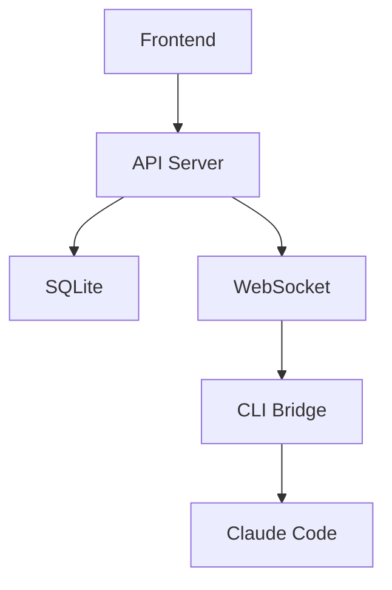

> **이 스킬은 project-agent가 실행합니다.**

## 디스패치

> **필수 선행**: 이 스킬을 실행하기 전에 `.claude/skills/_shared/execution-contract.md`(실행 계약)를 읽는다.
> 아래는 그 계약의 이 스킬용 요약이다. **상세 규칙과 금지 사항은 계약 문서가 기준이며, 충돌 시 계약이 우선한다.**

### 0단계: 재개 확인 (계약 §0)

가장 먼저 `.orchestrator/status/analyze.json`을 읽는다.

- 없으면 생성하고 `current_step: 1`로 시작한다
- 있으면 `completed_steps`의 **다음 단계부터** 재개한다
- **`completed_steps`에 없는 단계를 수행했다고 가정하지 않는다**
- 각 단계 종료 시 즉시 갱신한다 (몰아서 기록 금지)

### 사전 점검 — 3단 검증 (계약 §1)

**L1 — 존재**

```bash
ls docs/requirements/ docs/plans/ 2>/dev/null
git branch --show-current
```

**L2 — 내용**

```bash
# 빈 껍데기 차단
for f in docs/requirements/pln-00*.md docs/plans/pln-00*.md; do [ -s "$f" ] || echo "EMPTY: $f"; done
# 요구사항 코드가 실제로 채번되어 있는가 (0이면 형식만 갖춘 문서다)
grep -cE '\b(FR|NFR|UIR|DAT|INT)-[0-9]{3}\b' docs/requirements/pln-001-requirements.md
# Notion 원본 링크 누락 탐지 (계약 §3 위반)
grep -L 'Notion' docs/requirements/*.md docs/plans/*.md
```

**L3 — 정합**

```bash
find docs/requirements docs/plans -name 'pln-*.md' | wc -l   # 실제 (기대: 5)
```

**판정**: L1 실패 → plan 스킬 회귀 제안(진행 차단) · L2 실패 → 해당 문서 회귀(진행 차단) · L3 편차 → 대표 보고(차단 없음)

`ls`가 성공했다는 이유만으로 통과 처리하지 않는다.

### 범위 변경 트리거 확인 (계약 §5)

승인 반영으로 요구사항이 추가된 직후라면 트리거를 확인한다. Must 개수 ±20% 또는 복잡도 L 2배 이상이면 **plan 스킬 회귀**를 제안한다.

### 위임

사전 점검 통과 시, project-agent를 생성한다:
- subagent_type: `project-agent`
- 전달: 스킬 `analyze`, 경로 `.claude/skills/analyze/SKILL.md`
- **함께 전달**: `.claude/skills/_shared/execution-contract.md` 경로와 "이 계약을 먼저 읽고 실행하라"는 지시

### 완료 후

project-agent 완료 시, **아래 검증을 통과하기 전에는 결과를 전달하지 않는다.**

**1. 결정 전파 잔여 확인 (계약 §2)**

승인·결정을 반영한 경우, 옛 표기가 남아 있지 않은지 전수 검색한다.

```bash
grep -rn "<바뀐 옛 표기>" docs/    # 출력이 비어야 통과
```

**"변경 예정" · "반영 대기" · "개정 대상" 상태로 종료하지 않는다.** 이 상태는 다음 세션에서 잊힌다.

**2. 이중 기록 검증 (계약 §3)**

```bash
find docs -name '*.md' ! -name 'CLAUDE.md' -exec grep -L 'Notion' {} +   # 출력이 비어야 통과
```

- Git `docs/` + Notion `02. 프로젝트 / ClaudeManager / 02. 분석` 양쪽에 존재
- 각 문서 헤더에 `> **원본**: [Notion {코드}](url) · Git 동기화 {날짜}`
- `docs/00-progress.md` 동기화 표 + Notion `00. 진행 상황` 갱신

**3. 보고 전 산출물 검증 (계약 §4)**

```bash
for f in <보고서 ## 산출물 칸의 경로 전건>; do
  [ -f "$f" ] && echo "OK   $f" || echo "MISSING $f"
done
```

`MISSING`이 하나라도 있으면 **보고를 중단하고** 누락을 채운다. 채울 수 없으면 산출물 칸에서 지우고 `## 미해결 사항`으로 옮긴다.

**4. 상태 파일 최종 갱신 (계약 §0)**

`.orchestrator/status/analyze.json`에 `completed_steps` 전건과 `artifacts`(code / git / notion 3필드)를 기록한다.

**5. 결과 전달 및 전환**

1. 결과를 대표에게 전달
2. 다음 스킬 전환 정보에 따라:
   - 자동 → 해당 스킬 즉시 실행
   - 승인 필수 → 대표에게 실행 여부 확인

---

## 입력 (이전 스킬에서 받는 바통)

- PLN-001 요구사항 정의서 (Story Map + 수용 기준)
- PLN-002 Phase 계획서 (Walking Skeleton + 접근법)
- PLN-003 우선순위 목록 (MoSCoW)
- PLN-004 용어 사전
- PLN-005 프로젝트 코드 체계

## 출력 (다음 스킬에 넘기는 바통)

- ANL-001 분석 보고서 (스토리별 실현 가능성 + 복잡도)
- ANL-002 의존관계 맵 (컴포넌트 다이어그램 + 빌드 순서)
- ANL-003 리스크 목록 (리스크 매트릭스: 가능성 × 영향도)
- ANL-004 기술 스택 결정서 (ADR 형식, 평가 매트릭스 포함)

## 필요 권한

- 도구: Read, Write, Bash (코드 분석용), Grep, Glob, AskUserQuestion, WebSearch
- Sub-Agent: 없음

---

## 절차

### 1단계: 컨텍스트 수집

PLN 산출물과 프로젝트 현황을 읽는다:

- PLN-001의 Story Map, 수용 기준(Given-When-Then), 문제 검증 결과
- PLN-002의 Walking Skeleton, 선택한 접근법
- PLN-003의 MoSCoW 분류
- 기존 소스코드 (`src/`), 테스트 (`tests/`), 설정 파일 분석
- `.orchestrator/learnings.jsonl` — 이전 학습 기록

### 2단계: 스토리별 실현 가능성 분석

PLN-001의 모든 Must/Should 스토리에 대해 기술적 실현 가능성을 평가한다.

**스토리별 분석표**:

```
### [요구사항 코드] 스토리 제목

- **실현 가능성**: ✅ 가능 | ⚠️ 조건부 가능 | ❌ 불가
- **복잡도**: S | M | L | XL (T-shirt sizing)
- **불확실성**: 낮음 | 보통 | 높음
- **사전 조건**: (필요한 기술/인프라/데이터)
- **비고**: (조건부면 조건, 불가면 대안)
```

**복잡도 기준**:

| 크기 | 기준 | 예시 |
|------|------|------|
| **S** | 단일 파일/모듈, 패턴이 명확 | CRUD API 하나, 간단한 UI 컴포넌트 |
| **M** | 2~3개 모듈 연동, 약간의 설계 필요 | 상태 관리 + API + UI 연결 |
| **L** | 다수 모듈, 새로운 패턴 도입 | WebSocket 실시간 통신, 인증 시스템 |
| **XL** | 시스템 전반 영향, 높은 불확실성 | 아키텍처 변경, 외부 시스템 연동 |

**불확실성이 "높음"인 스토리**: spike(탐색 작업)로 분리를 제안한다.

### 3단계: 기술 스택 평가 — ADR + 평가 매트릭스

미결정된 기술 스택 항목별로 후보를 조사하고 비교한다.

#### 3-1. 후보 조사 (WebSearch 활용)

각 후보 기술에 대해 조사:
- 공식 문서, GitHub 저장소 (스타, 최근 커밋, 이슈)
- 커뮤니티 규모 (npm 다운로드, Stack Overflow 태그)
- 성능 벤치마크 (공식/제3자)
- 알려진 한계점, 호환성 이슈
- 유사 프로젝트 사용 사례

#### 3-2. 평가 매트릭스

후보 기술을 기준별로 1~5점 평가한다:

```markdown
## 평가 매트릭스: {결정 항목}

| 기준 (가중치) | 후보 A | 후보 B | 후보 C |
|-------------|--------|--------|--------|
| 학습 곡선 (×2) | 4 | 3 | 5 |
| 생태계/플러그인 (×2) | 5 | 4 | 3 |
| 성능 (×1) | 3 | 5 | 4 |
| 커뮤니티 규모 (×1) | 5 | 4 | 3 |
| 프로젝트 적합성 (×3) | 4 | 3 | 5 |
| AI 코딩 호환성 (×2) | 5 | 4 | 3 |
| **가중 합계** | **47** | **39** | **43** |
```

**평가 기준 설명**:

| 기준 | 가중치 | 판단 근거 |
|------|--------|----------|
| 학습 곡선 | ×2 | 에이전트(AI)가 코드를 생성하므로 학습 비용은 모델의 지원 수준으로 판단 |
| 생태계/플러그인 | ×2 | 필요한 기능을 라이브러리로 해결할 수 있는가 |
| 성능 | ×1 | MVP 단계에서는 가중치 낮음, 이후 Phase에서 재평가 |
| 커뮤니티 규모 | ×1 | 문제 발생 시 해결책을 찾을 수 있는가 |
| 프로젝트 적합성 | ×3 | 우리 요구사항(실시간, 로컬, 1인 사용)에 맞는가 |
| AI 코딩 호환성 | ×2 | Claude/AI 에이전트가 이 기술로 코드를 잘 생성하는가 |

#### 3-3. ADR (Architecture Decision Record) 작성

각 기술 결정을 아래 형식으로 기록한다:

```markdown
## ADR-{번호}: {결정 제목}

- **상태**: 제안 | 승인 | 기각 | 대체됨
- **날짜**: {YYYY-MM-DD}
- **결정자**: 대표 / 자율 판단

### 맥락
(왜 이 결정이 필요한가)

### 후보
1. **{후보 A}** — (한 줄 설명)
2. **{후보 B}** — (한 줄 설명)

### 결정
{선택한 후보}를 사용한다.

### 근거
(평가 매트릭스 결과 요약 + 핵심 판단 근거)

### 결과
(이 결정으로 인해 생기는 제약, 다음 단계 영향)

### 기각 사유
- {후보 B}: (선택하지 않은 이유)
```

### 4단계: 의존관계 분석 — 컴포넌트 다이어그램

Story Map의 Activity-Task-Story 구조와 기술 스택을 기반으로 시스템 의존관계를 분석한다.

#### 4-1. 컴포넌트 식별

Story Map의 Activity를 모듈/컴포넌트로 매핑한다:

```markdown
| Activity | 컴포넌트 | 역할 | 의존 대상 |
|----------|---------|------|----------|
| 에이전트 관리 | AgentManager | 에이전트 CRUD | DB, WebSocket |
| 대시보드 | Dashboard | 상태 표시 | AgentManager, API |
```

#### 4-2. 의존관계 다이어그램 (Mermaid)



#### 4-3. 빌드 순서 결정

의존관계를 기반으로 구현 순서를 결정한다 (의존 없는 것 먼저):

```markdown
## 빌드 순서

1. **Layer 0** (의존 없음): DB 스키마, 공통 타입 정의
2. **Layer 1** (Layer 0 의존): API 서버 기본 골격, CLI Bridge
3. **Layer 2** (Layer 1 의존): 비즈니스 로직 모듈
4. **Layer 3** (Layer 2 의존): Frontend UI
```

### 5단계: 리스크 분석 — 리스크 매트릭스

모든 식별된 리스크를 **가능성 × 영향도** 매트릭스로 평가한다.

#### 리스크 분류

| 카테고리 | 예시 |
|---------|------|
| **기술** | 기술 스택 미숙, 라이브러리 비호환, 성능 한계 |
| **일정** | 복잡도 과소평가, 의존 작업 지연 |
| **외부** | API 변경, 서비스 중단, 라이선스 변경 |
| **품질** | 테스트 커버리지 부족, 기술 부채 |

#### 리스크 매트릭스

```
        영향도 →
        낮음    보통    높음    치명
가  높음  보통    높음    높음    치명
능  보통  낮음    보통    높음    높음
성  낮음  낮음    낮음    보통    높음
↓
```

#### 리스크 기록 형식

```markdown
### RISK-{번호}: {리스크 제목}

- **카테고리**: 기술 | 일정 | 외부 | 품질
- **관련 스토리**: {FR-001, NFR-002 등}
- **가능성**: 낮음 | 보통 | 높음
- **영향도**: 낮음 | 보통 | 높음 | 치명
- **등급**: 낮음 | 보통 | 높음 | 치명 (매트릭스 결과)
- **대응 전략**: 회피 | 완화 | 전가 | 수용
- **완화 방안**: (구체적 행동)
- **트리거 조건**: (이 리스크가 현실화되는 시점)
```

**높음/치명 등급 리스크**: 대표에게 즉시 보고 (의사결정 등급: 높음).

### 6단계: 다중 관점 검토

분석 결과를 3가지 관점에서 자체 검토한다.

#### 실현 관점

| 점검 항목 | 확인 |
|----------|------|
| Walking Skeleton의 모든 스토리가 실현 가능한가? | |
| XL 복잡도 스토리에 spike가 계획되어 있는가? | |
| 기술 스택 결정이 모든 Must 스토리를 지원하는가? | |

#### 리스크 관점

| 점검 항목 | 확인 |
|----------|------|
| 높음/치명 리스크에 모두 완화 방안이 있는가? | |
| 완화 방안이 실행 가능한가? (희망적 사고 아닌가?) | |
| 식별하지 못한 리스크 카테고리가 있는가? | |

#### 일관성 관점

| 점검 항목 | 확인 |
|----------|------|
| 의존관계 맵에 빠진 컴포넌트가 있는가? | |
| 빌드 순서가 의존관계와 일치하는가? | |
| 기술 스택 결정이 의존관계에 영향을 주는가? | |

### 7단계: 분석 보고서 작성 및 보고

ANL-001~004를 docs/에 저장하고 대표에게 보고한다.

---

## 산출물 상세 형식

### ANL-001 분석 보고서

```markdown
# 분석 보고서

## 분석 범위
(Phase 목표, 분석 대상 스토리 수)

## 스토리별 실현 가능성

| 코드 | 스토리 | 실현 가능성 | 복잡도 | 불확실성 | 비고 |
|------|--------|-----------|--------|---------|------|
| FR-001 | ... | ✅ | M | 낮음 | |
| FR-002 | ... | ⚠️ | L | 높음 | spike 필요 |

## 요약
- 총 스토리: {N}개 (Must: {n}, Should: {n})
- 실현 가능: {n}, 조건부: {n}, 불가: {n}
- 복잡도 분포: S({n}), M({n}), L({n}), XL({n})
- spike 필요: {목록}

## 다중 관점 검토 결과
(6단계 결과)
```

### ANL-004 기술 스택 결정서

```markdown
# 기술 스택 결정서

## 확정 사항 (이전 결정)
(이미 확정된 기술: SQLite, REST+WebSocket 등)

## 신규 결정

### ADR-001: {제목}
(3-3 형식)

### ADR-002: {제목}
...

## 기술 스택 요약

| 영역 | 기술 | ADR | 상태 |
|------|------|-----|------|
| 백엔드 | {선택} | ADR-001 | 승인 |
| 프론트엔드 | {선택} | ADR-002 | 승인 |
| DB | SQLite | (기확정) | 승인 |
| 통신 | REST+WS | (기확정) | 승인 |
```

---

## 의사결정 포인트

- 기술 스택 결정 (ADR): 대표 확인 (보통) — 타임아웃 후 평가 매트릭스 1위 자동 선택
- 리스크 "높음/치명" 발견: 대표에게 즉시 보고 (높음)
- 스토리 실현 불가 판단: 대표에게 에스컬레이션 (높음)

## 체크포인트

- 스토리별 실현 가능성 + 기술 스택 평가 완료 후 중간 보고
- 리스크 목록 + 의존관계 맵 완료 후 최종 보고

## 제약 사항

- 코드를 직접 수정하지 않는다 (분석만)
- 확인된 사실과 가정/불확실성을 명확히 구분한다
- 분석 대상 코드의 branch 또는 commit을 기록한다
- 기술 스택 평가 시 반드시 2개 이상 후보를 비교한다 (단일 후보 선정 금지)
- WebSearch 결과는 출처를 기록한다
- 리스크 매트릭스에서 "낮음"으로 평가한 근거를 명시한다 (과소평가 방지)

## 완료 조건

- 모든 Must/Should 스토리의 실현 가능성 평가 완료
- 미결정 기술 스택 항목에 대한 ADR 작성 완료
- 의존관계 다이어그램 + 빌드 순서 확정
- 리스크 매트릭스 작성 완료 (높음/치명 리스크에 완화 방안 포함)
- 다중 관점 자체 검토 완료

## 실패/에스컬레이션 조건

- 기술적 실현 불가 판단 시 대표에게 에스컬레이션
- 치명적 리스크 발견 시 즉시 보고
- Walking Skeleton 스토리 중 XL 복잡도가 2개 이상이면 범위 재조정 제안

## 완료 후 액션

1. 완료 요약 (실현 가능성 요약 + 기술 스택 + 주요 리스크)
2. docs/00-progress.md 갱신
3. 스킬 전환: analyze → design은 **자동**

## 다음 스킬

- design
