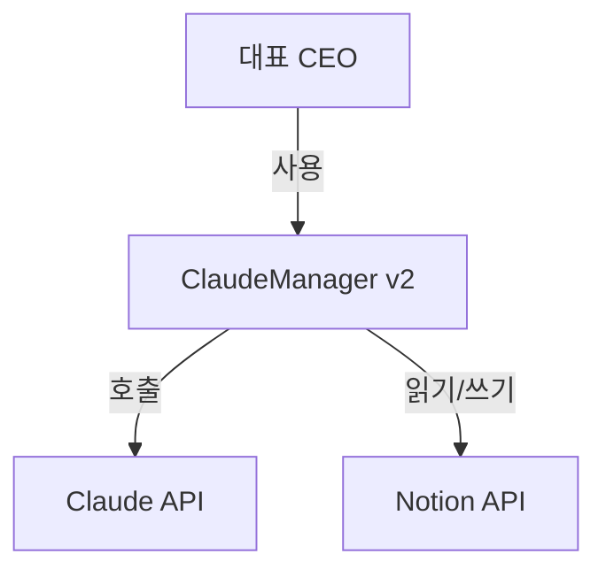
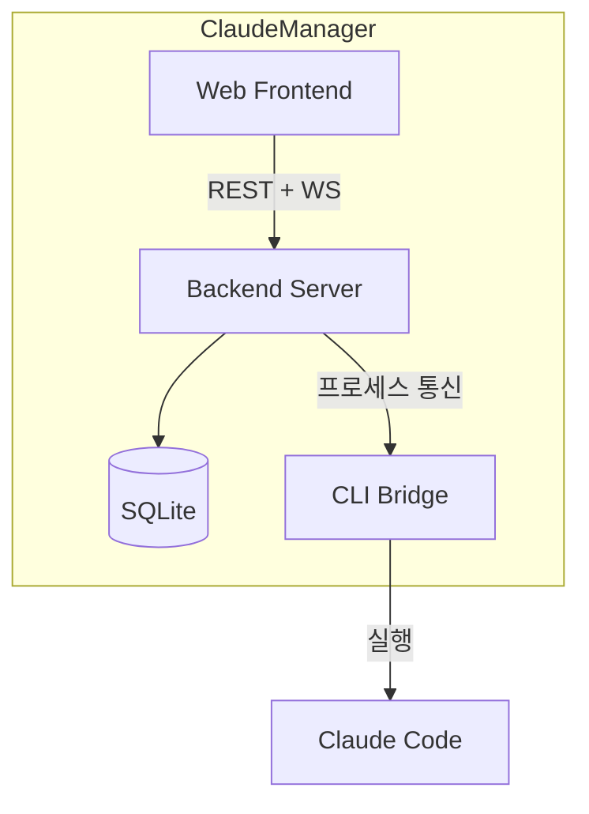
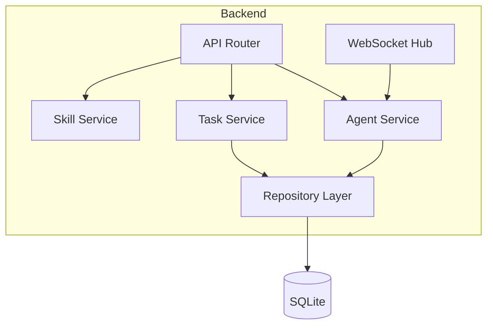
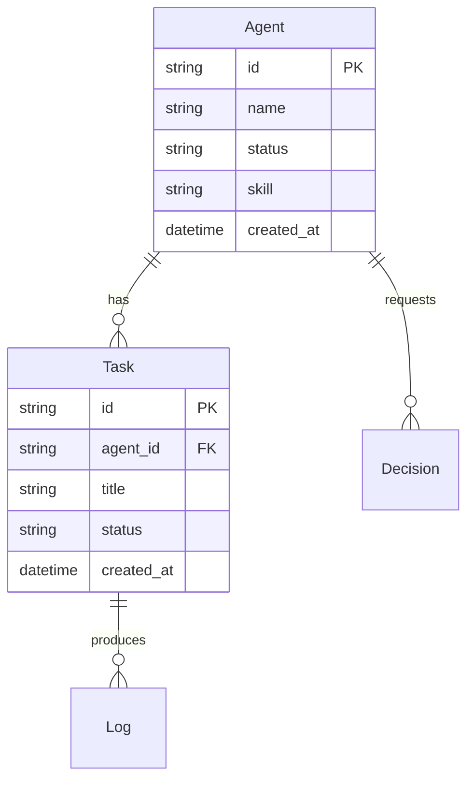
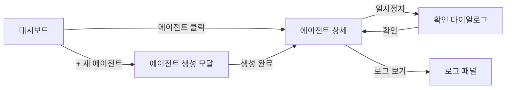
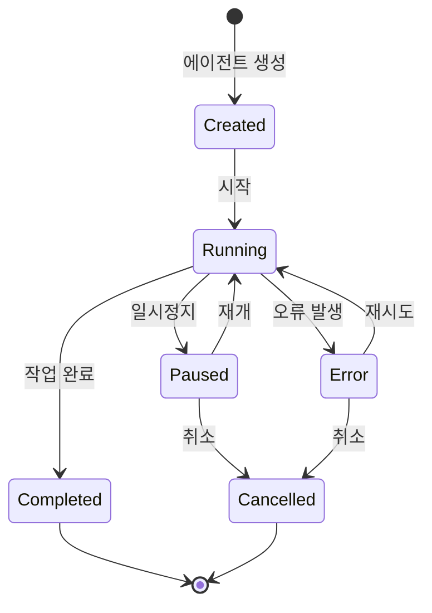

> **이 스킬은 project-agent가 실행합니다.**

## 디스패치

### 사전 점검

1. ANL-001~004 존재 여부: `ls docs/analysis/ 2>/dev/null`
2. 현재 브랜치 확인: `git branch --show-current`

누락 산출물이 있으면 analyze 스킬 회귀를 제안한다.

### 위임

사전 점검 통과 시, project-agent를 생성한다:
- subagent_type: `project-agent`
- 전달: 스킬 `design`, 경로 `.claude/skills/design/SKILL.md`

### 완료 후

project-agent 완료 시:
1. 결과를 대표에게 전달
2. 다음 스킬 전환 정보에 따라:
   - 자동 → 해당 스킬 즉시 실행
   - 승인 필수 → 대표에게 실행 여부 확인

---

## 입력 (이전 스킬에서 받는 바통)

- ANL-001 분석 보고서 (스토리별 실현 가능성 + 복잡도)
- ANL-002 의존관계 맵 (컴포넌트 다이어그램 + 빌드 순서)
- ANL-003 리스크 목록 (리스크 매트릭스)
- ANL-004 기술 스택 결정서 (ADR + 평가 매트릭스)

## 출력 (다음 스킬에 넘기는 바통)

- DES-001 아키텍처 설계서 (C4 Model: Context → Container → Component)
- DES-002 API 명세서 (API Design First: 엔드포인트 → 스키마 → 에러 코드)
- DES-003 데이터 모델 — ERD (정규화 체크: 1NF/2NF/3NF)
- DES-004 와이어프레임 (Atomic Design: Atom → Page)
- DES-005 스토리보드 (사용자 흐름 다이어그램)
- DES-006 화면 명세서 (상태별 동작 + 유효성 검사)
- DES-007 상태 흐름도 (Mermaid stateDiagram)
- DES-008 파일/디렉토리 구조 (C4 Component에서 도출)
- DES-009 코드 정의서 — 시스템 Enum/코드 통합 정의

## 필요 권한

- 도구: Read, Write (docs/ 전용), Grep, Glob, AskUserQuestion, WebSearch
- Sub-Agent: docs-sub (문서 작성)

---

## 절차

### 1단계: 컨텍스트 수집

ANL 산출물과 PLN 산출물을 읽고 설계 범위를 파악한다:

- ANL-001 분석 보고서의 스토리별 복잡도와 불확실성
- ANL-002 의존관계 맵의 컴포넌트 구조와 빌드 순서
- ANL-003 리스크 목록의 높음/치명 리스크 (설계로 완화할 항목)
- ANL-004 기술 스택 결정서의 ADR (선택한 기술과 제약)
- PLN-001 요구사항 정의서의 Story Map과 수용 기준
- `src/CLAUDE.md` — 코딩 규칙

### 2단계: 아키텍처 설계 — C4 Model

3단계 아키텍처를 순서대로 설계한다.

#### 2-1. Context Diagram (시스템 경계)

시스템 전체를 하나의 박스로 놓고 외부 액터/시스템과의 관계를 정의한다.



- 시스템 안에 무엇이 있는지는 아직 열지 않는다
- **확인**: 모든 외부 액터와 시스템 경계가 PLN-001의 Activity에 대응하는가?

#### 2-2. Container Diagram (실행 단위)

시스템 내부를 독립 배포/실행 가능한 단위로 분해한다.



각 Container에 대해:

| Container | 기술 | 역할 | 통신 방식 |
|-----------|------|------|----------|
| Web Frontend | (ANL-004 참조) | UI 제공 | REST + WebSocket |
| Backend Server | (ANL-004 참조) | 비즈니스 로직, API | REST + WebSocket |
| SQLite | SQLite | 상태 저장 | 파일 |
| CLI Bridge | Node/Python | Claude Code 연동 | 프로세스 |

- **확인**: ANL-002의 컴포넌트 다이어그램과 일치하는가?

#### 2-3. Component Diagram (모듈 구조)

각 Container 내부를 모듈/컴포넌트로 분해한다. ANL-002의 빌드 순서와 정합성을 확인한다.



각 Component에 대해:

| Component | 역할 | 의존 | 대응 Story |
|-----------|------|------|-----------|
| Agent Service | 에이전트 CRUD + 상태 관리 | Repository | FR-001, FR-002 |
| Task Service | 태스크 관리 | Repository, Agent | FR-003 |

- **확인**: 모든 Must 스토리가 최소 1개 Component에 매핑되는가?

### 3단계: API 설계 — API Design First

REST API를 설계한다. 코드 작성 전에 인터페이스를 확정하는 계약 우선(Contract First) 방식.

#### 3-1. 엔드포인트 목록

Story Map의 Task를 기준으로 리소스를 식별하고, CRUD를 매핑한다.

```markdown
| 리소스 | 메서드 | 경로 | 설명 | 대응 Story |
|--------|--------|------|------|-----------|
| Agent | GET | /api/agents | 에이전트 목록 | FR-001 |
| Agent | POST | /api/agents | 에이전트 생성 | FR-001 |
| Agent | GET | /api/agents/:id | 에이전트 상세 | FR-002 |
| Agent | PATCH | /api/agents/:id | 상태 변경 | FR-003 |
```

#### 3-2. 요청/응답 스키마

각 엔드포인트에 대해 JSON Schema를 정의한다.

```markdown
### POST /api/agents

**Request Body**:
| 필드 | 타입 | 필수 | 설명 |
|------|------|------|------|
| name | string | ✅ | 에이전트 이름 |
| skill | string | ✅ | 실행 스킬 이름 |
| config | object | | 추가 설정 |

**Response (201)**:
| 필드 | 타입 | 설명 |
|------|------|------|
| id | string | UUID |
| name | string | 에이전트 이름 |
| status | string | 상태 (created) |
| createdAt | string | ISO 8601 |

**에러 응답**:
| 코드 | 의미 | 조건 |
|------|------|------|
| 400 | Bad Request | 필수 필드 누락 |
| 409 | Conflict | 동일 이름 에이전트 존재 |
```

#### 3-3. WebSocket 이벤트 정의

실시간 통신이 필요한 이벤트를 정의한다.

```markdown
| 이벤트 | 방향 | 페이로드 | 설명 |
|--------|------|---------|------|
| agent:status | Server→Client | {id, status, progress} | 에이전트 상태 변경 |
| agent:log | Server→Client | {id, level, message} | 에이전트 로그 스트리밍 |
| agent:control | Client→Server | {id, action: pause/resume/cancel} | 제어 명령 |
```

### 4단계: 데이터 모델 설계 — ERD + 정규화 체크

#### 4-1. 엔티티 식별

API 스키마와 Story Map에서 엔티티를 도출한다.

```markdown
| 엔티티 | 설명 | 대응 Story |
|--------|------|-----------|
| Agent | 프로젝트 에이전트 | FR-001 |
| Task | 작업 단위 | FR-003 |
| Decision | 의사결정 요청/응답 | FR-005 |
```

#### 4-2. ERD (Mermaid)



#### 4-3. 정규화 체크

각 테이블을 1NF → 2NF → 3NF 순서로 점검한다.

| 정규형 | 규칙 | 점검 방법 |
|--------|------|----------|
| **1NF** | 모든 컬럼이 원자값 | 반복 그룹, 배열/JSON 컬럼이 있는가? 있으면 별도 테이블로 분리 |
| **2NF** | 부분 함수 종속 없음 | 복합 PK가 있을 때, PK 일부에만 종속하는 컬럼이 있는가? |
| **3NF** | 이행 함수 종속 없음 | 비PK 컬럼이 다른 비PK 컬럼에 종속하는가? 있으면 분리 |

**의도적 비정규화**: 성능을 위해 비정규화할 경우 근거와 대상을 명시한다.

```markdown
| 테이블 | 비정규화 컬럼 | 사유 | 동기화 전략 |
|--------|-------------|------|-----------|
| Agent | task_count | 매번 COUNT 쿼리 방지 | Task INSERT/DELETE 시 갱신 |
```

### 5단계: UI 설계 — Atomic Design + 와이어프레임

#### 5-1. 컴포넌트 계층 (Atomic Design)

UI 컴포넌트를 5계층으로 분해한다.

| 계층 | 설명 | 예시 |
|------|------|------|
| **Atom** | 더 이상 분해 불가한 최소 단위 | Button, Input, Badge, Icon |
| **Molecule** | Atom 조합, 단일 기능 | SearchBar (Input + Button), StatusBadge (Icon + Badge) |
| **Organism** | Molecule 조합, 독립 영역 | AgentCard, TaskList, ChatPanel |
| **Template** | Organism 배치, 레이아웃 | DashboardLayout, ChatLayout |
| **Page** | Template + 데이터 연결 | DashboardPage, AgentDetailPage |

```markdown
## 컴포넌트 맵

### Atoms
- Button (primary, secondary, danger, ghost)
- Input (text, search)
- Badge (status: running, paused, completed, error)
- Icon (agent, task, skill, alert)
- Spinner

### Molecules
- StatusBadge: Icon + Badge
- SearchBar: Input + Button
- MetricCard: Icon + Label + Value

### Organisms
- AgentCard: StatusBadge + MetricCard + Button (control)
- TaskList: TaskItem[] + SearchBar
- ChatPanel: MessageList + Input + Button

### Templates
- DashboardLayout: Header + Sidebar + MainContent
- DetailLayout: Header + BackButton + ContentArea

### Pages
- DashboardPage: DashboardLayout + AgentCard[] + MetricCard[]
- AgentDetailPage: DetailLayout + TaskList + ChatPanel
```

#### 5-2. 와이어프레임 (DES-004)

각 Page에 대해 ASCII 레이아웃과 영역별 컴포넌트를 정의한다.

```
┌─────────────────────────────────────────┐
│ Header: 로고 + 검색 + 알림              │
├────────┬────────────────────────────────┤
│        │ Main Content                   │
│ Side   │ ┌──────┐ ┌──────┐ ┌──────┐    │
│ bar    │ │Agent │ │Agent │ │Agent │    │
│        │ │Card  │ │Card  │ │Card  │    │
│ - 대시 │ └──────┘ └──────┘ └──────┘    │
│ - 에이 │                                │
│ - 설정 │ ┌─────────────────────────┐    │
│        │ │ Metrics Summary         │    │
│        │ └─────────────────────────┘    │
├────────┴────────────────────────────────┤
│ Footer: 상태바 + 비용                   │
└─────────────────────────────────────────┘
```

### 6단계: 스토리보드 — 사용자 흐름 다이어그램 (DES-005)

PLN-001의 Activity별로 사용자가 화면을 어떤 순서로 이동하는지 흐름을 정의한다.



각 흐름에 대해:

```markdown
| 단계 | 화면 | 사용자 행동 | 시스템 반응 | 대응 Story |
|------|------|-----------|-----------|-----------|
| 1 | 대시보드 | 에이전트 카드 클릭 | 에이전트 상세 화면 이동 | FR-002 |
| 2 | 상세 | 일시정지 버튼 클릭 | 확인 다이얼로그 표시 | FR-003 |
```

### 7단계: 화면 명세서 — 상태별 동작 정의 (DES-006)

각 화면의 모든 상태와 조건별 동작을 정의한다.

```markdown
## 화면: 에이전트 상세

### 상태별 UI

| 상태 | 표시 요소 | 활성 버튼 | 비활성 버튼 |
|------|----------|----------|-----------|
| created | StatusBadge(생성됨) | 시작, 삭제 | 일시정지, 재개 |
| running | StatusBadge(실행 중) + Spinner | 일시정지, 취소 | 시작, 삭제 |
| paused | StatusBadge(대기 중) | 재개, 취소 | 시작, 일시정지 |
| completed | StatusBadge(완료) | 삭제 | 시작, 일시정지, 재개 |
| error | StatusBadge(오류) + 에러 메시지 | 재시도, 삭제 | 일시정지, 재개 |

### 유효성 검사

| 필드 | 규칙 | 에러 메시지 |
|------|------|-----------|
| 에이전트 이름 | 1~50자, 공백 불가 | "이름을 입력해주세요 (1~50자)" |
| 스킬 선택 | 필수 | "실행할 스킬을 선택해주세요" |

### 에러 상태

| 에러 유형 | UI 표시 | 사용자 복구 방법 |
|----------|---------|----------------|
| API 타임아웃 | 토스트 "연결 실패" | 재시도 버튼 |
| 권한 없음 | 인라인 "권한 부족" | 설정 페이지 링크 |
```

### 8단계: 상태 흐름도 — Mermaid stateDiagram (DES-007)

시스템의 핵심 상태 머신을 Mermaid stateDiagram으로 정형화한다.



각 전이에 대해:

| 현재 상태 | 이벤트 | 다음 상태 | 조건/가드 | 액션 |
|----------|--------|----------|----------|------|
| Created | 시작 | Running | 스킬 유효 | Sub-Agent 생성 |
| Running | 일시정지 | Paused | — | 프로세스 중단 |
| Running | 오류 발생 | Error | 재시도 횟수 < 3 | 에러 로그 기록 |
| Error | 재시도 | Running | 재시도 횟수 < 3 | 카운터 증가, 재실행 |
| Error | — | Cancelled | 재시도 횟수 ≥ 3 | 대표에게 에스컬레이션 |

### 9단계: 파일/디렉토리 구조 — C4 Component에서 도출 (DES-008)

2-3의 Component Diagram을 기반으로 파일/디렉토리 구조를 결정한다.

```markdown
src/
├── frontend/
│   ├── components/
│   │   ├── atoms/        ← Atomic Design Atom
│   │   ├── molecules/    ← Atomic Design Molecule
│   │   ├── organisms/    ← Atomic Design Organism
│   │   └── templates/    ← Atomic Design Template
│   ├── pages/            ← Atomic Design Page
│   ├── hooks/            ← 공용 훅
│   ├── stores/           ← 상태 관리
│   └── utils/            ← 유틸리티
├── backend/
│   ├── routes/           ← API Router
│   ├── services/         ← Business Logic (Component 단위)
│   ├── repositories/     ← Repository Layer
│   ├── models/           ← 데이터 모델/타입
│   ├── websocket/        ← WebSocket Hub
│   ├── migrations/       ← DB 마이그레이션
│   └── utils/            ← 유틸리티
```

Component → 디렉토리 매핑표:

| Component (C4) | 디렉토리 | 파일 패턴 |
|----------------|---------|----------|
| API Router | backend/routes/ | {resource}.routes.ts |
| Agent Service | backend/services/ | agent.service.ts |
| Repository Layer | backend/repositories/ | {entity}.repository.ts |
| WebSocket Hub | backend/websocket/ | hub.ts, handlers/ |
| Dashboard Page | frontend/pages/ | Dashboard.tsx |

### 10단계: 코드 정의서 — 시스템 Enum/코드 (DES-009)

시스템 전체에서 사용하는 Enum, 코드, 상수를 통합 정의한다.

```markdown
## 상태 코드

### AgentStatus
| 코드 | 값 | 설명 |
|------|------|------|
| CREATED | "created" | 생성됨, 실행 대기 |
| RUNNING | "running" | 실행 중 |
| PAUSED | "paused" | 일시 정지 |
| COMPLETED | "completed" | 정상 완료 |
| ERROR | "error" | 오류 발생 |
| CANCELLED | "cancelled" | 취소됨 |

### DecisionLevel
| 코드 | 값 | 설명 |
|------|------|------|
| HIGH | "high" | 대표 승인 필수 |
| MEDIUM | "medium" | 알림 후 자동 진행 |
| LOW | "low" | 자율 판단 |

## 에러 코드
| 코드 | HTTP | 설명 |
|------|------|------|
| AGENT_NOT_FOUND | 404 | 에이전트 없음 |
| AGENT_CONFLICT | 409 | 이름 중복 |
| INVALID_TRANSITION | 422 | 불가능한 상태 전이 |
```

### 11단계: 다중 관점 자체 검토

설계 결과를 3가지 관점에서 자체 검토한다.

#### 아키텍처 관점

| 점검 항목 | 확인 |
|----------|------|
| C4 3단계가 일관적인가? (Context→Container→Component 추적 가능) | |
| 모든 Must 스토리가 Component에 매핑되는가? | |
| ANL-003의 높음/치명 리스크에 대한 대응이 설계에 반영되었는가? | |
| 레이어 간 의존 방향이 단방향인가? (순환 의존 없음) | |
| ADR 결정 사항과 설계가 일치하는가? | |

#### UI/UX 관점

| 점검 항목 | 확인 |
|----------|------|
| 스토리보드의 모든 화면 전이에 대응하는 와이어프레임이 있는가? | |
| 화면 명세서에 에러 상태와 빈 상태(empty state)가 정의되었는가? | |
| Atomic Design 계층이 재사용 가능한 단위로 나뉘어 있는가? | |
| 접근성 고려 (키보드 네비게이션, 색상 대비) 항목이 있는가? | |

#### 데이터 관점

| 점검 항목 | 확인 |
|----------|------|
| ERD가 3NF를 만족하는가? (의도적 비정규화는 근거 명시) | |
| 모든 API 엔드포인트의 요청/응답이 ERD 엔티티와 대응하는가? | |
| 상태 흐름도의 전이가 DB에서 무결성을 보장할 수 있는가? | |
| 마이그레이션 전략이 필요한 스키마 변경이 식별되었는가? | |

### 12단계: 설계 문서 작성 및 보고

docs-sub에게 설계 문서 작성을 위임하고, 대표에게 최종 보고한다.

---

## 산출물 상세 형식

### DES-001 아키텍처 설계서

```markdown
# 아키텍처 설계서

## C4 Level 1: Context Diagram
(시스템 경계 + 외부 액터)

## C4 Level 2: Container Diagram
(실행 단위 + 통신 방식)

| Container | 기술 | 역할 | 통신 |
|-----------|------|------|------|

## C4 Level 3: Component Diagram
(Container별 내부 모듈)

| Component | 역할 | 의존 | 대응 Story |
|-----------|------|------|-----------|

## 레이어 규칙
(의존 방향, 금지 사항)

## 리스크 대응 설계
(ANL-003 높음/치명 리스크에 대한 설계적 대응)
```

### DES-003 데이터 모델

```markdown
# 데이터 모델

## ERD
(Mermaid erDiagram)

## 테이블 정의
### {테이블명}
| 컬럼 | 타입 | 제약 | 설명 |
|------|------|------|------|

## 정규화 체크 결과
| 테이블 | 1NF | 2NF | 3NF | 비고 |
|--------|-----|-----|-----|------|

## 의도적 비정규화
| 테이블 | 컬럼 | 사유 | 동기화 |
|--------|------|------|--------|

## 인덱스 전략
| 테이블 | 인덱스 | 컬럼 | 사유 |
|--------|--------|------|------|
```

---

## 의사결정 포인트

- 아키텍처 설계 확정 (C4 구조): 대표 승인 필수 (높음)
- UI/UX 설계 확정 (와이어프레임 + 스토리보드): 대표 승인 필수 (높음)
- 의도적 비정규화: 대표 확인 (보통)

## 체크포인트

- 아키텍처 설계(C4) + API 명세 완료 후 중간 보고
- 와이어프레임 + 스토리보드 완성 후 검토 요청
- 다중 관점 검토 후 최종 보고

## 제약 사항

- 분석 단계에서 식별한 리스크에 대한 대응책 포함
- 설계는 반드시 대표 승인 후 개발 진행 (의사결정 등급: 높음)
- 코딩 규칙(src/CLAUDE.md)을 준수하는 설계
- 변경 없는 산출물은 이전 Phase 것 유지
- API 설계는 코드 작성 전에 인터페이스를 확정한다 (Contract First)
- ERD는 최소 3NF 점검, 비정규화 시 근거 명시
- Mermaid 다이어그램을 사용하여 시각화한다

## 완료 조건

- 대표 승인 (아키텍처 + UI/UX)
- C4 3단계 다이어그램 완성
- 모든 API 엔드포인트에 요청/응답 스키마 정의
- ERD 정규화 체크 완료
- 상태 흐름도에 모든 전이 조건/가드 정의
- 다중 관점 자체 검토 완료

## 실패/에스컬레이션 조건

- 분석 리스크 대응 불가 시 대표에게 에스컬레이션
- 기술 스택 제약으로 설계 불가 시 보고
- C4 Component와 Story 매핑에 누락이 있을 경우 analyze 회귀 제안

## 완료 후 액션

1. 완료 요약 (산출물 목록 + C4 구조 개요 + 주요 설계 결정)
2. docs/00-progress.md 갱신
3. 스킬 전환: design → develop은 **자동**

## 다음 스킬

- develop
