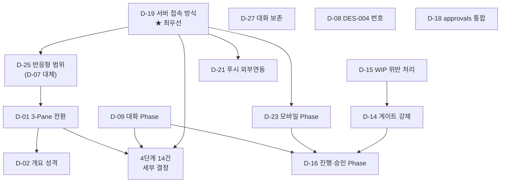

# 승인 요청 통합 목록

> 작성일: 2026-09-01
> 대상: Phase 1 설계(design) 단계에서 발생한 대표 의사결정 요청 전건
> 원본: DES-012 §9 / DES-013 §8 / DES-014 §8 / DES-015 §8

> **이 문서는 DES-014 「승인함(SCR-W-AP)」 화면이 구현될 때까지의 대역이다.**
> 화면이 만들어지면 이 목록은 `approvals` 테이블로 이관되고 본 문서는 폐지한다.

## 🚫 정정 — 2026-09-01

> **D-15 안건 철회.** ANL-001~004가 Notion `02. 분석`에 전부 존재하며, **analyze 단계는 정상 수행되었다.**
> "WIP 위반(analyze 건너뜀)"은 오진단이었다. Git `docs/analysis/`가 비어 있던 것은 동기화 누락이며 프로세스 위반이 아니다.
> **영향**: D-15 철회(조치 불필요), D-14 근거 문구 수정(결정 자체는 유효), DES-014 §1-3 정정, ANL 4건을 Git 동기화 대상에 추가.
> **승인 건수: 27건 → 26건 승인 + 1건 철회.**

## ✅ 승인 완료 — 2026-09-01

> **대표 결정: 전건 권고안 채택.** 26건 승인, 1건 철회(D-15), 반려·조건부 승인 없음.
> 대표 확인 문구: *"내용 확인했다 너가 제안한 권고 사항 기준으로 진행하자."*
>
> 이후 문서 개정은 **§승인 후 후속 작업 11단계**를 따른다.
> **대표 실행 필요 1건**: D-19 터널링은 승인만으로 동작하지 않는다. Tailscale 또는 Cloudflare Tunnel 계정 생성과 초기 설정이 필요하며, **고정 도메인(MagicDNS·고정 호스트명)을 제공하는 방식**을 선택해야 한다 (WebAuthn 전제).

---

## 사용법

각 항목의 **결정** 칸에 아래 중 하나를 적고, **사유**와 **일자**를 채운다.

| 표기 | 의미 |
|------|------|
| ⬜ | 대기 (미결정) |
| ✅ 권고안 | 승인 — 권고안 채택 |
| ✅ (A) | 승인 — 선택지 A 채택 |
| ❌ | 반려 — **사유 필수** |
| 🔀 (A) | 조건부 승인 — 조건을 사유란에 기재 |

DES-014 §5-2의 안전장치를 이 문서에도 적용한다.

- **S-3**: 등급 **높음**은 건별 처리. 일괄 승인 금지
- **S-4**: 등급 **보통·낮음**은 일괄 승인 가능 (4단계 참조)
- **S-2**: 반려·조건부 승인은 사유 필수

---

## 요약

| 등급 | 건수 | 비고 |
|------|:---:|------|
| **높음** | 10 | 건별 처리 필수 |
| 보통 | 13 | 일괄 가능 |
| 낮음 | 4 | 일괄 가능 |
| **합계** | **27** | |

| 결번·중복 | 처리 |
|----------|------|
| **D-24** | 결번 — 「배포 방식(TestFlight/스토어)」. DES-015 v2에서 모바일 웹으로 전환하며 배포 절차 자체가 없어져 삭제 |
| **D-07** | **D-25로 대체됨.** D-07(반응형 범위: 데스크톱 전용 권고)을 D-25(반응형 필수로 변경)가 뒤집는 안건이다. **D-25만 결정하면 D-07은 자동 정리된다** |

---

## 의존 관계

---

## 1단계 — 먼저 결정해야 나머지가 풀린다 (4건)

이 4건이 정해지지 않으면 나머지 23건은 검토해도 의미가 없다.

| ID | 등급 | 출처 | 안건 | 선택지 | 권고 | 결정 | 사유 · 일자 |
|----|------|------|------|--------|------|:---:|-----------|
| **D-19** | **높음** ★ | DES-015 §8 | **서버 접속 방식** — 휴대폰이 `127.0.0.1`에 접근할 수 없다 | (A) LAN 바인딩 (B) 터널링 (Tailscale·Cloudflare) (C) 클라우드 배포 | **(B) 터널링** — (A)는 HTTPS가 없어 Service Worker·Push·WebAuthn이 전부 죽어 **탈락**. (C)는 로컬 MVP·SQLite 전제가 무너짐. **WebAuthn 때문에 고정 도메인을 주는 터널이어야 함** | ✅ 권고안 | |
| **D-25** | **높음** | DES-015 §8 | **반응형 범위 변경** (D-07 대체) | (A) 데스크톱 전용 유지 (B) **반응형 필수**로 변경 | **(B)** — 모바일 웹으로 가기로 한 이상 D-07은 뒤집혀야 한다. 브레이크포인트 3단계(3-Pane / 2-Pane / 1-Pane+하단탭) 적용. **DES-012 개정 필요** | ✅ 권고안 | |
| **D-01** | **높음** | DES-012 §9 | **네비게이션 구조** | (A) 현행 DES-011 페이지 드릴다운 유지 (B) 사이드바 + 3-Pane 전환 | **(B)** — 도달 깊이 6→3단계, 화면 10→5개. 조사한 레퍼런스 7종 전부가 (B) | ✅ 권고안 | |
| ~~**D-15**~~ | ~~높음~~ | DES-014 §8 | ~~현재 WIP 위반 처리~~ | — | **🚫 안건 철회 (2026-09-01)** — 전제가 사실이 아니었다. ANL-001~004가 Notion `02. 분석`에 **전부 존재**하며 analyze 단계는 정상 수행되었다. Git `docs/analysis/`가 비어 있던 것은 **동기화 누락**일 뿐 프로세스 위반이 아니다 | 🚫 철회 | 오진단. 조치 불필요. 2026-09-01 |

---

## 2단계 — 범위·일정 확정 (5건)

1단계 결정 후. 이 5건이 **Phase 범위와 일정을 결정**한다.

| ID | 등급 | 출처 | 안건 | 선택지 | 권고 | 결정 | 사유 · 일자 |
|----|------|------|------|--------|------|:---:|-----------|
| **D-09** | **높음** | DES-013 §8 | 대화 기능의 Phase 배치 | (A) Phase 1에 포함 (CLI `cm chat`) (B) Phase 2(웹)에서 처음 도입 (C) 별도 Phase | **(A)** — 대화 없이는 Phase 1 walking skeleton이 "관리 도구"에 그쳐 제품 가설을 검증하지 못한다. 단 PLN·DES 다수 개정이 선행되어야 하므로 **일정 재산정 필요** | ✅ 권고안 | |
| **D-21** | **높음** | DES-015 §8 | 푸시 인프라 (외부 연동 · APV-EXT) | (A) Web Push (VAPID) (B) 푸시 없이 폴링만 | **(A)** — APNs/FCM 경유는 불가피. 단 v1(네이티브) 대비 Expo 계정·인증서·스토어 등록이 사라져 외부 의존이 줄었다. 푸시 본문에 안건 내용을 넣지 않는 완화책 적용 | ✅ 권고안 | |
| **D-14** | **높음** | DES-014 §8 | 스킬 전환 게이트 강제 수준 | (A) 강제 — 미통과 시 다음 단계 착수 차단 (B) 경고만 (C) 미도입 | **(A) 강제 + 예외 승인 경로** — CLAUDE.md가 `plan→analyze`·`test→deploy` 2곳을 "승인 필수"로 규정했으나 **어느 설계 문서에도 구현 정의가 없다.** 규칙이 문서에만 있고 시스템에 없으면 지켜지는지 확인할 방법이 없다. 단 \[예외 승인\]으로 명시적 우회는 허용 *(2026-09-01 근거 수정: 당초 "analyze 건너뜀" 실증을 들었으나 이는 오진단이었다. 게이트 도입 필요성 자체는 유효)* | ✅ 권고안 | |
| **D-23** | 보통 | DES-015 §8 | 모바일 웹 Phase 배치 | (A) **Phase 2에 통합** (B) Phase 3 신설 | **(A) Phase 2 통합** — 같은 코드베이스이므로 반응형을 처음부터 넣는 편이 나중에 덧붙이는 것보다 싸다 | ✅ 권고안 | |
| **D-16** | 보통 | DES-014 §8 | 진행 보드·승인함의 Phase 배치 | (A) Phase 1 (대화와 함께) (B) Phase 2(웹)부터 | **(A)** — 승인 게이트는 Phase 1 진행 자체에 필요하다. CLI 3화면이면 충분 | ✅ 권고안 | |

---

## 3단계 — 구조·데이터 (4건)

| ID | 등급 | 출처 | 안건 | 선택지 | 권고 | 결정 | 사유 · 일자 |
|----|------|------|------|--------|------|:---:|-----------|
| **D-02** | **높음** | DES-012 §9 | 개요 화면 성격 | (A) 집계 타일 중심 (현행) (B) 〈내 결정이 필요합니다〉 블록 최상단 | **(B)** — CLAUDE.md 의사결정 등급 체계가 화면에 드러나는 자리가 필요 | ✅ 권고안 | |
| **D-27** | **높음** | DES-013 v2 | **Agent 삭제 시 대화 처리** | (A) **보존** — `archived` + `entity_snapshot` (B) CASCADE 삭제 (v1 방식) (C) 90일 후 삭제 | **(A) 보존** — Agent는 사라져도 **대표가 무엇을 지시했고 무엇을 승인했는지**는 남아야 한다. 로컬 SQLite·단일 사용자라 용량 문제 없음 | ✅ 권고안 | |
| **D-08** | **높음** | DES-012 §9 | DES-004 번호 충돌 | (A) 와이어프레임을 DES-012가 흡수 (B) 스킬 목록을 Notion 기준으로 수정 | **(A)+(B) 동시** — DES-012 §6이 사실상 와이어프레임. `design` 스킬의 DES-004 설명도 같이 고쳐야 함 | ✅ 권고안 | |
| **D-18** | 낮음 | DES-014 §8 | `decision_requests` → `approvals` 통합 | (A) 통합 (B) 별도 테이블 유지 | **(A)** — 의사결정 요청과 승인은 같은 것이다. 테이블 2개로 나눌 이유가 없다 | ✅ 권고안 | |

---

## 4단계 — 세부 결정 (14건) · 일괄 승인 가능

전부 등급 **보통·낮음**이다. DES-014 S-4에 따라 **권고안 일괄 수용**이 가능하다.
일괄 승인하려면 아래 한 줄만 채우면 된다.

> **일괄 결정**: ✅ **전건 권고안 채택**
> 일자: 2026-09-01

### UI · 디자인 (6건)

| ID | 등급 | 출처 | 안건 | 선택지 | 권고 | 결정 | 사유 |
|----|------|------|------|--------|------|:---:|------|
| **D-03** | 보통 | DES-012 §9 | UI 컴포넌트 라이브러리 (DES-010 미결) | (A) shadcn/ui (B) Radix UI 직접 (C) MUI 등 완성형 | **(A)** — 코드 소유권 보유, Tailwind 정합, Resizable·Command·DataTable 모두 존재 | ✅ 권고안 | |
| **D-04** | 보통 | DES-012 §9 | 커맨드 팔레트(⌘K) 도입 | (A) Phase 2에 포함 (B) Phase 3으로 이연 | **(A)** — cmdk 기반 구현 부담이 작고 단일 고빈도 사용자에 효과가 큼 | ✅ 권고안 | |
| **D-05** | 보통 | DES-012 §9 | 테마 | (A) 라이트 전용 (B) 라이트+다크 (C) 다크 전용 | **(B)** — CSS 변수 방식이라 추가 비용 작음 | ✅ 권고안 | |
| **D-06** | 낮음 | DES-012 §9 | `in_review` CLI 색상 미정의 | (A) magenta 부여 (B) cyan 공유 | **(A)** — 검토 대기는 고유 상태. DES-010 갱신 필요 | ✅ 권고안 | |
| **D-28** | 보통 | DES-013 v2 | 상태바 메뉴 7개 수용 | (A) 7개 나열 (B) 「이력」·「대화」를 [기록]으로 묶어 6개 (C) 대화를 워크스페이스 안으로 | **(A) 7개** — 상태 이력과 대화는 성격이 다르다. 1280px에서 7개는 충분히 들어간다 | ✅ 권고안 | |
| ~~D-07~~ | ~~보통~~ | DES-012 §9 | ~~반응형 범위~~ | — | **D-25로 대체됨.** 별도 결정 불필요 | — | D-25 참조 |

### 동작 · 정책 (5건)

| ID | 등급 | 출처 | 안건 | 선택지 | 권고 | 결정 | 사유 |
|----|------|------|------|--------|------|:---:|------|
| **D-10** | 보통 | DES-013 §8 | '보통' 등급 자동진행 타임아웃 | (A) 30분 (B) 2시간 (C) 스킬별 설정 | **(A) 30분** 기본값 + 설정에서 변경 가능. 1인 CEO는 응답 지연이 길어 너무 짧으면 오히려 방해 | ✅ 권고안 | |
| **D-11** | 보통 | DES-013 §8 | 대표 응답 대기 상태 표현 | (A) 기존 `waiting` 재사용 + 사유 필드 (B) `blocked_on_ceo` 신규 상태 | **(A)** — 상태 수를 늘리지 않는다. DES-007 상태 머신 변경 최소화 | ✅ 권고안 | |
| **D-12** | 낮음 | DES-013 §8 | 메시지 보존 정책 | (A) 무기한 보존 (B) 90일 후 아카이브 | **(A)** — 로컬 SQLite, 단일 사용자. 용량 문제 없음 | ✅ 권고안 | |
| **D-13** | 보통 | DES-013 §8 | Sub-Agent 보고 노출 수준 | (A) 요약 1행 + 펼치기 (B) 전문 항상 표시 (C) 노출 안 함 | **(A)** — 그래프 규칙 3(직접 접근 불가)을 지키되 추적 가능성은 확보 | ✅ 권고안 | |
| **D-17** | 보통 | DES-014 §8 | 승인 체크리스트 강제 범위 | (A) 등급 '높음'만 강제 (B) 전 등급 강제 (C) 미도입 | **(A)** — '보통'까지 강제하면 마찰이 과하다 | ✅ 권고안 | |

### 모바일 (3건)

| ID | 등급 | 출처 | 안건 | 선택지 | 권고 | 결정 | 사유 |
|----|------|------|------|--------|------|:---:|------|
| **D-20** | 낮음 | DES-015 §8 | 기술 스택 | (A) 웹과 동일 코드베이스 + PWA (B) 별도 모바일 프로젝트 | **(A)** — 새 스택을 도입하지 않으므로 사실상 결정할 것이 없다 | ✅ 권고안 | |
| **D-22** | 보통 | DES-015 §8 | 생체인증(WebAuthn) 재확인 범위 | (A) 등급 '높음' + APV-GATE만 (B) 전 등급 (C) 미적용 (PIN 대체) | **(A)** — D-17과 동일 기준. 단 **D-19에서 고정 도메인이 확보되어야 가능** | ✅ 권고안 | |
| **D-26** | 보통 | DES-015 §8 | iOS 홈 화면 추가 안내 강제 | (A) 강제 표시 + 미설치 시 상시 배너 (B) 1회 안내 후 무시 가능 (C) 안내 없음 | **(A)** — 이 단계를 건너뛰면 iOS에서 **알림이 아예 오지 않는다.** 마찰을 감수한다 | ✅ 권고안 | |

---

## 승인 후 후속 작업

결정이 확정되면 아래 순서로 문서를 개정한다. **개정 대상이 9개 문서**이므로 develop 착수 전에 일정을 잡아야 한다.

| 순서 | 작업 | 트리거 결정 |
|:---:|------|-----------|
| 1 | PLN-002 Phase 범위·일정 재산정 | D-09, D-23, D-16 |
| 2 | PLN-001에 FR 추가 (대화, 승인 게이트, 푸시, 페어링) | D-09, D-14, D-21 |
| 3 | DES-001 아키텍처 — 터널 구성·HTTPS 경계·외부 연동 경로 | **D-19** |
| 4 | DES-003 데이터 모델 — 테이블 11개 추가/변경 | D-27, D-18, D-21 |
| 5 | DES-002 API 명세서 — 엔드포인트 25종 추가 | 3·4번 완료 후 |
| 6 | DES-012 개정 — 반응형 3단계, 화면 7개, 상태바 7메뉴 | D-25, D-01, D-28 |
| 7 | DES-011 개정 — 3-Pane 기준 재작성 + 모바일 뷰 | D-01, D-25 |
| 8 | DES-010 — 웹·모바일 디자인 토큰, `in_review` 색상 | D-05, D-06 |
| 9 | DES-006 — CLI 화면 SCR-CH01~13 추가 | D-09, D-16 |
| 10 | DES-007 — `waiting` 사유 필드 | D-11 |
| 11 | `design` 스킬 DES-004 정의 수정 | D-08 |

---

## 결정 기록

결정한 항목을 여기에 누적한다. (승인함 화면 구현 시 `approvals` 테이블로 이관)

| 일자 | ID | 결정 | 사유 |
|------|-----|------|------|
| | | | |

---

## 변경 이력

| 버전 | 날짜 | 내용 |
|------|------|------|
| v1 | 2026-09-01 | 최초 작성 — DES-012/013/014/015에 흩어진 의사결정 요청 27건 통합, 의존 관계 기반 4단계 처리 순서 정리, D-07(D-25로 대체)·D-24(결번) 정리 |
