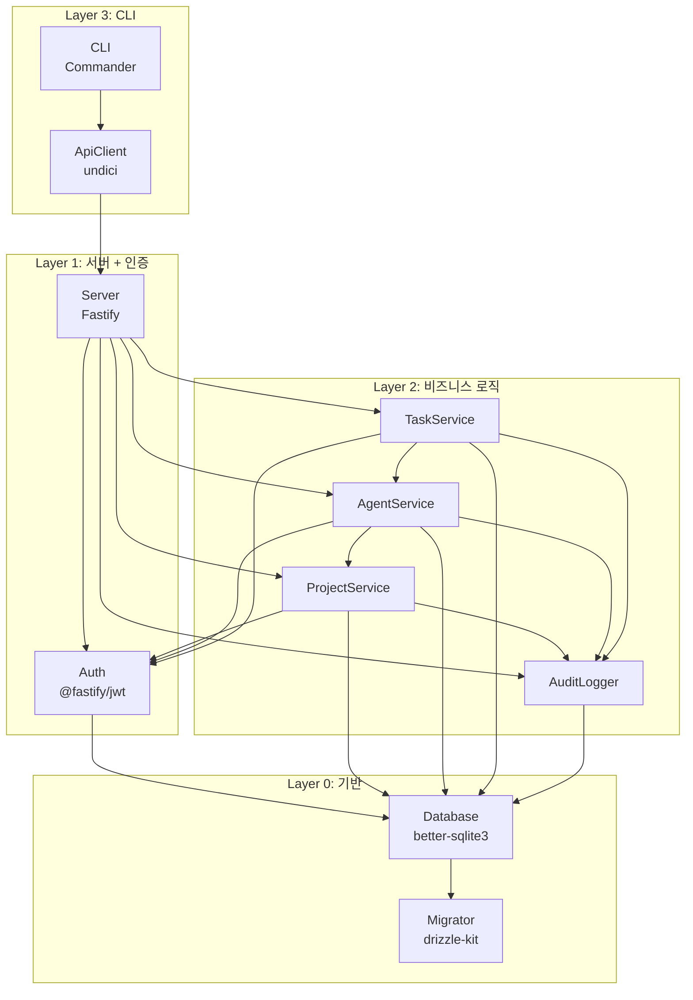
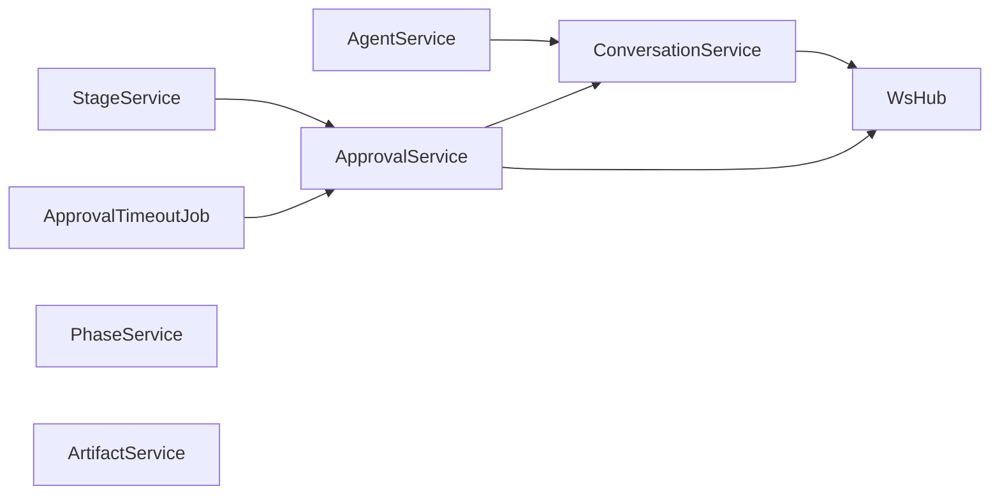

# ANL-002 의존관계 맵

> Phase 1: 기반 구축
> 버전: **v2 (2026-09-01)** — 신규 컴포넌트 의존 확정, 순환 2건 정정
> **원본**: [Notion ANL-002](https://app.notion.com/p/3c5d066504ec817d92d9c75282cb4a55) · Git 동기화 2026-09-01
> 기준 원본 정책: Notion = 대표 승인 원본 / Git = 에이전트 실행 원본. 충돌 시 Notion 우선.

---

## 컴포넌트 식별

Story Map의 Activity를 시스템 컴포넌트로 매핑한다.

| Activity | 컴포넌트 | 역할 | 기술 | 의존 대상 |
|----------|---------|------|------|----------|
| 시스템 기반 | Server | HTTP 서버 시작/종료, 라우팅 | Fastify | — |
| 시스템 기반 | Database | SQLite 연결, 쿼리 실행 | better-sqlite3, Drizzle | Server |
| 시스템 기반 | Migrator | 스키마 마이그레이션 관리 | drizzle-kit | Database |
| 접근 제어 | Auth | 토큰 발급/검증, 인증 미들웨어 | @fastify/jwt | Server, Database |
| 프로젝트 관리 | ProjectService | 프로젝트 CRUD, 상태 전이 | Drizzle | Auth, Database |
| 상태 추적 | AgentService | Agent CRUD, 상태 관리 | Drizzle | ProjectService, Database |
| 상태 추적 | TaskService | Task CRUD, 상태 관리 | Drizzle | AgentService, Database |
| 상태 추적 | AuditLogger | 상태 변경 이력 기록/조회 | Drizzle | Database |
| CLI 연동 | CLI | 명령어 파싱, API 호출 | Commander | Server(HTTP), Auth |
| CLI 연동 | ApiClient | HTTP 클라이언트, 토큰 관리 | undici | Server |

## 의존관계 다이어그램



## 모듈 의존 방향

```
Layer 3 (CLI)
  ↓ HTTP
Layer 1 (Server + Auth)
  ↓ 함수 호출
Layer 2 (비즈니스 로직)
  ↓ ORM 쿼리
Layer 0 (Database + Migrator)
```

- 의존 방향은 항상 상위 → 하위 (단방향)
- Layer 2 내부: AgentService → ProjectService, TaskService → AgentService (단방향)
- 순환 의존 없음

---

## 빌드 순서

의존관계를 기반으로 한 구현 순서. 의존 없는 것부터 위로 쌓아올린다.

### Layer 0: 기반 (의존 없음)

| 순서 | 컴포넌트 | 산출물 | 관련 스토리 |
|:---:|---------|--------|-----------|
| 0-1 | 공통 타입 정의 | `src/shared/types.ts` | 전체 |
| 0-2 | Database | DB 연결 + Drizzle 스키마 | DAT-001 |
| 0-3 | Migrator | drizzle-kit 설정 + 초기 마이그레이션 | DAT-002 |

### Layer 1: 서버 + 인증 (Layer 0 의존)

| 순서 | 컴포넌트 | 산출물 | 관련 스토리 |
|:---:|---------|--------|-----------|
| 1-1 | Server | Fastify 앱 + graceful shutdown | FR-001 |
| 1-2 | Auth | JWT 발급/검증 + 인증 미들웨어 | FR-002, NFR-002 |

### Layer 2: 비즈니스 로직 (Layer 1 의존)

| 순서 | 컴포넌트 | 산출물 | 관련 스토리 |
|:---:|---------|--------|-----------|
| 2-1 | AuditLogger | 상태 변경 기록 서비스 | FR-009 (기반) |
| 2-2 | ProjectService | 프로젝트 CRUD + 상태 전이 | FR-003, FR-004, FR-006 |
| 2-3 | AgentService | Agent CRUD + 상태 관리 | FR-007 |
| 2-4 | TaskService | Task CRUD + 상태 관리 | FR-008, FR-009 |

### Layer 3: CLI (Layer 1 의존, Layer 2 간접)

| 순서 | 컴포넌트 | 산출물 | 관련 스토리 |
|:---:|---------|--------|-----------|
| 3-1 | ApiClient | HTTP 클라이언트 + 토큰 저장 | INT-001 (기반) |
| 3-2 | CLI | Commander 앱 + 서브커맨드 | INT-001 |

## Walking Skeleton 경로

빌드 순서에서 핵심 경로만 추출한 최소 동작 흐름:

```
0-2 DB → 0-3 Migration → 1-1 Server → 1-2 Auth → 2-2 Project → 2-3 Agent → 2-1 AuditLog → 3-1 ApiClient → 3-2 CLI
```

이 경로가 동작하면 Walking Skeleton 완성:
서버 기동 → DB 초기화 → 로그인 → 프로젝트 생성 → Agent 등록 → 상태 로그 → CLI 조회

---

## 2026-09-01 승인 반영 — 신규 컴포넌트 의존 (**v2 확정**)

승인된 결정에 따라 아래 컴포넌트가 추가된다. **기존 Layer 구조는 유지된다.**

### ⚠ 초안의 순환 의존 2건 정정

2026-09-01 초안에 적혀 있던 의존 방향 중 **2건이 순환을 만들어 정정**한다. DES-001 v3 Component Diagram이 기준이다.

| 컴포넌트 | 초안 의존 | **확정 의존** | 문제 |
|---------|----------|-------------|------|
| **ConversationService** | ~~AgentService~~, Database, AuditLogger | **Database, AuditLogger** (AgentService 제거) | `AgentService → ConversationService`가 필요하므로 (Agent 생성 시 채널 개설, 삭제 시 아카이브) 양방향이면 **순환**이다. 채널 제목에 필요한 Agent 정보는 **Repository 조인**으로 얻는다 |
| **WsGateway** | Server, ~~ConversationService~~ | **Server만** (Layer 1 유지) | Layer 1이 Layer 2를 참조하면 **역방향 의존**이다. DES-001 v3 규칙 8: **WS Hub는 출력 전용** — Service가 Hub를 호출하지, Hub가 Service를 호출하지 않는다 |

> 초안대로 구현했다면 `AgentService ↔ ConversationService` 순환과 Layer 1 → Layer 2 역참조가 생긴다. 둘 다 DES-001 §레이어 규칙 위반이다.

### 확정 의존표

| 컴포넌트 | Layer | 의존 대상 | Phase | 근거 |
|---------|:---:|----------|:---:|------|
| **WsHub** | 1 | Server (WebSocket Plugin) | 1 | D-09 · 출력 전용 |
| **ConversationService** | 2 | Database, AuditLogger, **WsHub** | 1 | D-09 |
| **ApprovalService** | 2 | ConversationService, Database, **WsHub** | 1 | D-14 · D-16 · D-18 |
| **PhaseService** | 2 | Database | 1 | D-16 |
| **StageService** | 2 | Database, **ApprovalService** | 1 | D-16 |
| **ArtifactService** | 2 | Database | 1 | D-16 |
| **ApprovalTimeoutJob** | 3 | ApprovalService | 1 | D-10 · ADR-012 |
| PushService | 2 | ApprovalService, Database, 외부(APNs/FCM) | **2** | D-21 |

**AgentService 의존 추가** (기존 컴포넌트 변경): `AgentService → ConversationService` — Agent 생명주기에 따라 채널을 개설·읽기전용·아카이브 전환한다 (D-27).

### 의존 방향 검증



**순환 없음.** 모든 간선이 단방향이고, `WsHub`는 진입만 있고 진출이 없는 싱크(sink)다.

### 빌드 순서 삽입 위치 (**v2 확정**)

```
Layer 1 확장:
  1-1 Server
  1-2 Auth
  1-3 WsHub                 ← 신규. Service보다 먼저 (Service가 주입받는다)

Layer 2 확장:
  2-1 AuditLogger
  2-2 ProjectService
  2-3 ConversationService   ← 신규. AgentService보다 먼저 (D-27 의존)
  2-4 AgentService          ← ConversationService 주입받도록 변경
  2-5 TaskService
  2-6 ApprovalService       ← ConversationService 이후
  2-7 PhaseService
  2-8 StageService          ← ApprovalService 이후 (게이트 검증)
  2-9 ArtifactService

Layer 3 확장:
  3-1 ApiClient
  3-2 CLI
  3-3 ApprovalTimeoutJob    ← 신규. ApprovalService 이후
```

> **`ConversationService`가 `AgentService`보다 먼저다.** 초안 순서(2-5에 배치)를 그대로 따르면 AgentService 구현 시점에 주입할 대상이 없다.

### Walking Skeleton 경로 (**v2 확장**)

```
0-2 DB → 0-3 Migration → 1-1 Server → 1-2 Auth → 1-3 WsHub
  → 2-2 Project → 2-3 Conversation → 2-4 Agent → 2-1 AuditLog
  → 2-6 Approval → 2-8 Stage
  → 3-1 ApiClient → 3-2 CLI → 3-3 TimeoutJob
```

이 경로가 동작하면 **"대표가 지시하고 → 보고받고 → 승인해서 → 다음 단계로 넘어간다"**가 성립한다 (PLN-002 v3 Walking Skeleton).

**중간 점검 지점**: `2-4 Agent`까지가 D-30 (B) 채택 시의 **Layer 4 중간 점검** 대상이다. 여기까지 동작하면 대표에게 시연한다.

---

## 미해결 사항

| 항목 | 내용 | 등급 | 처리 시점 |
|------|------|:---:|----------|
| **Repository 계층 미표기** | 본 문서는 Service 단위로만 의존을 기술한다. Repository 9종은 전부 Database에만 의존하므로 순환 위험이 없어 생략했다 | 낮음 | — |

---

## 변경 이력

| 버전 | 날짜 | 내용 |
|------|------|------|
| v1 | 2026-08-23 | 최초 작성 — 컴포넌트 10개, Layer 0~3 구조, 빌드 순서 |
| — | 2026-09-01 | Git 동기화 + 승인 반영 신규 컴포넌트 6개 의존 정리 (초안) |
| **v2** | 2026-09-01 | **의존 확정 + 초안 순환 2건 정정.** `ConversationService`에서 `AgentService` 의존 제거(양방향 순환), `WsGateway`에서 `ConversationService` 의존 제거(Layer 1 → 2 역참조). DES-001 v3 Component Diagram 기준.<br>`StageService`·`ApprovalTimeoutJob` 추가, **빌드 순서 재배치**(WsHub를 Layer 1로, ConversationService를 AgentService보다 앞으로), Walking Skeleton 경로 확장 + **Layer 4 중간 점검 지점**(D-30) 표기 |
