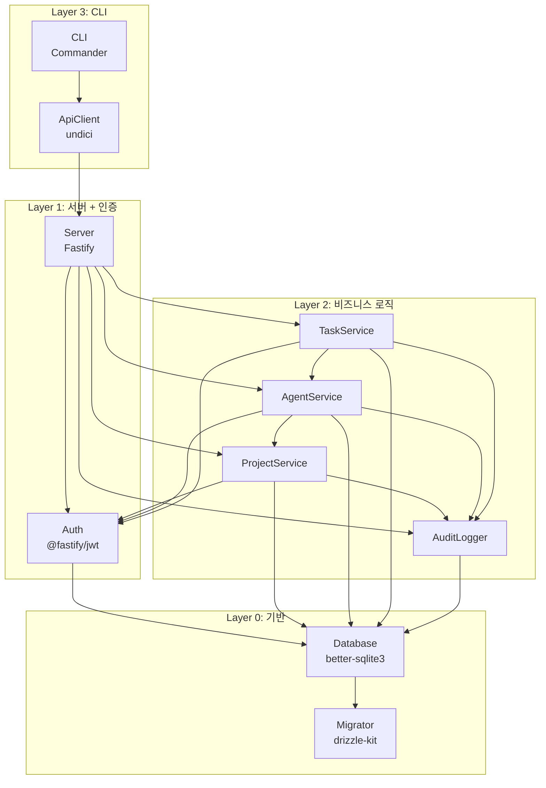

# ANL-002 의존관계 맵

> Phase 1: 기반 구축
> 작성일: 2026-08-23
> **원본**: [Notion ANL-002](https://app.notion.com/p/3c5d066504ec817d92d9c75282cb4a55) · Git 동기화 2026-09-01
> 기준 원본 정책: Notion = 대표 승인 원본 / Git = 에이전트 실행 원본. 충돌 시 Notion 우선.

---

## 컴포넌트 식별

Story Map의 Activity를 시스템 컴포넌트로 매핑한다.

| Activity | 컴포넌트 | 역할 | 기술 | 의존 대상 |
|----------|---------|------|------|----------|
| 시스템 기반 | Server | HTTP 서버 시작/종료, 라우팅 | Fastify | — |
| 시스템 기반 | Database | SQLite 연결, 쿼리 실행 | better-sqlite3, Drizzle | Server |
| 시스템 기반 | Migrator | 스키마 마이그레이션 관리 | drizzle-kit | Database |
| 접근 제어 | Auth | 토큰 발급/검증, 인증 미들웨어 | @fastify/jwt | Server, Database |
| 프로젝트 관리 | ProjectService | 프로젝트 CRUD, 상태 전이 | Drizzle | Auth, Database |
| 상태 추적 | AgentService | Agent CRUD, 상태 관리 | Drizzle | ProjectService, Database |
| 상태 추적 | TaskService | Task CRUD, 상태 관리 | Drizzle | AgentService, Database |
| 상태 추적 | AuditLogger | 상태 변경 이력 기록/조회 | Drizzle | Database |
| CLI 연동 | CLI | 명령어 파싱, API 호출 | Commander | Server(HTTP), Auth |
| CLI 연동 | ApiClient | HTTP 클라이언트, 토큰 관리 | undici | Server |

## 의존관계 다이어그램



## 모듈 의존 방향

```
Layer 3 (CLI)
  ↓ HTTP
Layer 1 (Server + Auth)
  ↓ 함수 호출
Layer 2 (비즈니스 로직)
  ↓ ORM 쿼리
Layer 0 (Database + Migrator)
```

- 의존 방향은 항상 상위 → 하위 (단방향)
- Layer 2 내부: AgentService → ProjectService, TaskService → AgentService (단방향)
- 순환 의존 없음

---

## 빌드 순서

의존관계를 기반으로 한 구현 순서. 의존 없는 것부터 위로 쌓아올린다.

### Layer 0: 기반 (의존 없음)

| 순서 | 컴포넌트 | 산출물 | 관련 스토리 |
|:---:|---------|--------|-----------|
| 0-1 | 공통 타입 정의 | `src/shared/types.ts` | 전체 |
| 0-2 | Database | DB 연결 + Drizzle 스키마 | DAT-001 |
| 0-3 | Migrator | drizzle-kit 설정 + 초기 마이그레이션 | DAT-002 |

### Layer 1: 서버 + 인증 (Layer 0 의존)

| 순서 | 컴포넌트 | 산출물 | 관련 스토리 |
|:---:|---------|--------|-----------|
| 1-1 | Server | Fastify 앱 + graceful shutdown | FR-001 |
| 1-2 | Auth | JWT 발급/검증 + 인증 미들웨어 | FR-002, NFR-002 |

### Layer 2: 비즈니스 로직 (Layer 1 의존)

| 순서 | 컴포넌트 | 산출물 | 관련 스토리 |
|:---:|---------|--------|-----------|
| 2-1 | AuditLogger | 상태 변경 기록 서비스 | FR-009 (기반) |
| 2-2 | ProjectService | 프로젝트 CRUD + 상태 전이 | FR-003, FR-004, FR-006 |
| 2-3 | AgentService | Agent CRUD + 상태 관리 | FR-007 |
| 2-4 | TaskService | Task CRUD + 상태 관리 | FR-008, FR-009 |

### Layer 3: CLI (Layer 1 의존, Layer 2 간접)

| 순서 | 컴포넌트 | 산출물 | 관련 스토리 |
|:---:|---------|--------|-----------|
| 3-1 | ApiClient | HTTP 클라이언트 + 토큰 저장 | INT-001 (기반) |
| 3-2 | CLI | Commander 앱 + 서브커맨드 | INT-001 |

## Walking Skeleton 경로

빌드 순서에서 핵심 경로만 추출한 최소 동작 흐름:

```
0-2 DB → 0-3 Migration → 1-1 Server → 1-2 Auth → 2-2 Project → 2-3 Agent → 2-1 AuditLog → 3-1 ApiClient → 3-2 CLI
```

이 경로가 동작하면 Walking Skeleton 완성:
서버 기동 → DB 초기화 → 로그인 → 프로젝트 생성 → Agent 등록 → 상태 로그 → CLI 조회

---

## ⚠ 2026-09-01 승인 반영 — 신규 컴포넌트 의존

승인된 결정에 따라 아래 컴포넌트가 Layer 2에 추가된다. **기존 Layer 구조는 유지**되며 순환 의존은 발생하지 않는다.

| 컴포넌트 | Layer | 의존 대상 | 근거 |
|---------|:---:|----------|------|
| ConversationService | 2 | AgentService, Database, AuditLogger | D-09 |
| ApprovalService | 2 | ConversationService, AgentService, Database | D-14, D-16, D-18 |
| PhaseService | 2 | ApprovalService, Database | D-16 |
| ArtifactService | 2 | PhaseService, Database | D-16 |
| PushService | 2 | ApprovalService, Database, **외부(APNs/FCM)** | D-21 |
| WsGateway | 1 | Server, ConversationService | D-09 |

### 빌드 순서 삽입 위치

```
Layer 2 확장:
  2-1 AuditLogger
  2-2 ProjectService
  2-3 AgentService
  2-4 TaskService
  2-5 ConversationService   ← 신규 (D-09)
  2-6 ApprovalService       ← 신규 (D-14/16/18)
  2-7 PhaseService          ← 신규 (D-16)
  2-8 ArtifactService       ← 신규 (D-16)
  2-9 PushService           ← 신규 (D-21, Phase 2)
```

> **주의**: `PushService`는 유일하게 **외부 시스템(APNs/FCM)에 의존**한다. Layer 규칙상 예외이므로 어댑터로 격리하여 교체 가능하게 둘 것.

---

## 변경 이력

| 버전 | 날짜 | 내용 |
|------|------|------|
| v1 | 2026-08-23 | 최초 작성 — 컴포넌트 10개, Layer 0~3 구조, 빌드 순서 |
| — | 2026-09-01 | **Git 동기화** + 승인 반영 신규 컴포넌트 6개 의존 정리 |
