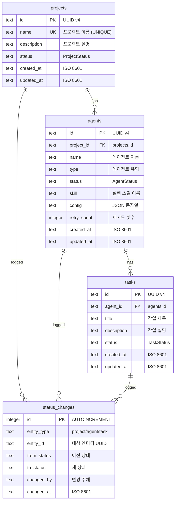

# DES-003 데이터 모델

> Phase 1: 기반 구축
> 작성일: 2026-08-23
> **원본**: [Notion DES-003](https://app.notion.com/p/3c5d066504ec8139b48ec253164692d4) · Git 동기화 2026-09-01
> 기준 원본 정책: Notion = 대표 승인 원본 / Git = 에이전트 실행 원본. 충돌 시 Notion 우선.

> **⚠ 개정 대기 (2026-09-01 승인 반영) — 규모 대**
> 승인된 결정에 따라 **테이블 11개 추가/변경**이 필요하다. §Phase 1 승인 반영 참조.

---

## ERD

---

## 테이블 4개

- **projects**: 프로젝트 정보 (PK: id, UNIQUE: name)
- **agents**: 에이전트 정보 (FK: project_id → projects, UNIQUE: project_id+name)
- **tasks**: 태스크 정보 (FK: agent_id → agents)
- **status_changes**: 상태 변경 이력 (entity_type + entity_id로 조회)

**정규화**: 3NF 만족
**외래 키**: ON DELETE CASCADE

## 인덱스 전략

| 테이블 | 인덱스 | 컬럼 | 유형 |
|--------|--------|------|------|
| projects | projects_name_unique | name | UNIQUE |
| agents | agents_project_id_idx | project_id | INDEX |
| agents | agents_project_name_unique | (project_id, name) | UNIQUE |
| tasks | tasks_agent_id_idx | agent_id | INDEX |
| status_changes | sc_entity_idx | (entity_type, entity_id) | INDEX |
| status_changes | sc_changed_at_idx | changed_at | INDEX |

> **⚠ 참조 누락 (2026-09-01 발견)**: Notion 원본에 *"Drizzle ORM 스키마, 마이그레이션 전략 상세는 Git 원본 `docs/design/data/data-model.md` 참조"*라고 적혀 있으나, **해당 파일은 Git에 존재하지 않는다.** Drizzle 스키마 정의와 마이그레이션 전략이 어디에도 문서화되어 있지 않으므로 develop 착수 전 작성이 필요하다.

---

## Phase 2+ 확장 고려사항 (원본)

> Orca ADE 분석 결과 반영 (2026-08-24). Phase 1 스키마 변경 아님, 향후 마이그레이션으로 추가.

| 기능 | 예상 테이블/컬럼 추가 | 대상 Phase |
|------|---------------------|:---:|
| 워크트리 기반 격리 (FR-013) | `worktrees` 테이블 (id, agent_id FK, branch, path, status, created_at). agents에 `worktree_id` 컬럼 추가 | 2~3 |
| 실시간 Agent Board (FR-014) | `agent_logs` 테이블 (id, agent_id FK, level, message, timestamp). 대량 로그 → TTL 기반 정리 필요 | 2 |
| 모바일 모니터링 PWA (FR-015) | `push_subscriptions` 테이블 (id, endpoint, keys, created_at). Web Push 구독 정보 저장 | 4 |

**현재 스키마와의 호환성**: DAT-002 마이그레이션 체계로 스키마 확장 대응 가능. FK 관계는 agents 테이블 중심으로 연결.

---

## ⚠ 2026-09-01 승인 반영 필요 — 테이블 11개

`docs/00-approvals.md` 전건 승인에 따라 아래 테이블이 **Phase 1~2로 앞당겨** 필요하다.

### 대화 (DES-013 §6-1) — D-09, D-27 승인

| 테이블 | 주요 컬럼 | 비고 |
|--------|----------|------|
| `conversations` | id, channel_type(`main`/`agent`), entity_id(nullable), status(`active`/`readonly`/`archived`), **entity_snapshot(JSON)**, created_at, archived_at | `main`은 entity_id NULL, 전역 1행. **Agent 삭제 시 CASCADE 삭제하지 않고 `archived` 전환** (D-27) |
| `messages` | id, conversation_id FK, msg_type(MSG-01~06), sender_role, body, structured(JSON), created_at | MSG-03의 4단 보고는 `structured`에 저장 |
| `messages_fts` | `messages(body)` 대상 SQLite **FTS5 가상 테이블** | 전문 검색. 트리거로 동기화 |

### 승인·진행 (DES-014 §7-1) — D-14, D-16, D-18 승인

| 테이블 | 주요 컬럼 | 비고 |
|--------|----------|------|
| `approvals` | id, approval_type(APV-*), level, stage, subject, options(JSON), artifacts(JSON), rationale, impact(JSON), requested_by, deadline_at, status, resolution, reason, resolved_at | **DES-013의 `decision_requests`를 대체·통합** (D-18) |
| `phases` | id, number, name, started_at, completed_at, current_stage | Phase 1개당 1행 |
| `stages` | id, phase_id FK, skill(plan~operate), status, started_at, completed_at, gate_approval_id(nullable FK) | Phase당 7행 |
| `artifacts` | id, stage_id FK, code(PLN-001 등), title, status, notion_url, git_path, updated_at | **Notion/Git 동기화 추적** |
| `wip_waivers` | id, phase_id FK, rule, reason, created_at | WIP 위반 무시 기록 |

### 모바일 (DES-015 §7-1) — D-21, D-22, D-23 승인

| 테이블 | 주요 컬럼 | 비고 |
|--------|----------|------|
| `push_subscriptions` | id, endpoint, p256dh, auth, user_agent, subscribed_at, last_seen_at, revoked_at | Web Push 구독 (VAPID) |
| `pairing_tokens` | id, token, expires_at, used_at | QR·링크 1회용 토큰 (5분 유효) |
| `notification_settings` | id, quiet_hours_start, quiet_hours_end, types(JSON), digest_at | **서버가 발송 시점에 판단** |
| `webauthn_credentials` | credential_id, public_key, counter, created_at | D-22 승인 시 추가 |

### 추가 인덱스

| 테이블 | 인덱스 | 용도 |
|--------|--------|------|
| messages | (conversation_id, created_at) | 대화 조회 |
| conversations | (status, archived_at) | 아카이브 목록 |
| approvals | (status, level) | 미응답 승인 조회 |
| artifacts | (stage_id) | 단계별 산출물 |

### FK 정책 변경 (D-27)

`messages.conversation_id`는 CASCADE지만, **Agent 삭제가 `conversations` 행을 삭제하지 않는다.**
Agent 삭제는 `conversations.status = 'archived'` + `entity_snapshot` 기록으로 처리한다.
→ **메시지는 어떤 경우에도 사라지지 않는다.**

---

## 변경 이력

| 버전 | 날짜 | 내용 |
|------|------|------|
| v1 | 2026-08-23 | 최초 작성 (Phase 1 설계, 테이블 4개) |
| v1.1 | 2026-08-24 | Phase 2+ 확장 고려사항 추가 |
| — | 2026-09-01 | **Git 동기화** + 승인 반영 필요 테이블 11개 정리 + `data-model.md` 참조 누락 지적 |
