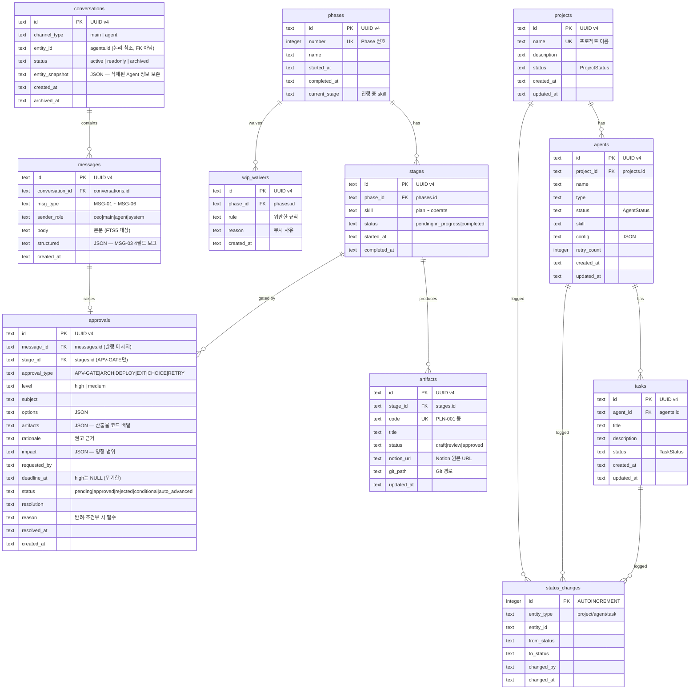

# DES-003 데이터 모델

> Phase 1: 기반 구축
> 버전: **v2 (2026-09-01)** — 승인 반영 개정. 테이블 4 → 15개
> **원본**: [Notion DES-003](https://app.notion.com/p/3c5d066504ec8139b48ec253164692d4) · Git 동기화 2026-09-01
> 기준 원본 정책: Notion = 대표 승인 원본 / Git = 에이전트 실행 원본. 충돌 시 Notion 우선.

---

## 1. 개정 요약

2026-09-01 승인(D-09 대화 · D-16 승인 게이트 · D-18 승인 통합 · D-27 대화 보존)으로 Phase 1 범위에 **대화·승인·진행 추적**이 들어왔다. 이에 따라 데이터 모델을 전면 개정한다.

| 구분 | v1 | **v2** |
|------|:---:|:---:|
| 실제 테이블 | 4 | **15** |
| FTS5 가상 테이블 | 0 | **1** |
| Phase 1 적용 | 4 | **11** (기존 4 + 신규 7) |
| Phase 2 예정 | — | **4** (모바일·원격 접속) |

> **"테이블 11개 추가"의 내역**: Phase 1 신규 7개 + Phase 2 신규 4개 = 11개. `messages_fts`는 가상 테이블이라 개수에 포함하지 않는다. 최종 15개는 PLN-002 v3의 범위 변화표와 일치한다.

---

## 2. ERD — Phase 1 전체



---

## 3. 신규 테이블 상세 — 대화 (D-09 · D-27)

### 3-1. `conversations` — 대화 채널

| 컬럼 | 타입 | 제약 | 설명 |
|------|------|------|------|
| `id` | TEXT | PK | UUID v4 |
| `channel_type` | TEXT | NOT NULL, CHECK IN (`main`,`agent`) | 채널 종류 |
| `entity_id` | TEXT | NULL | `agents.id`. **FK를 걸지 않는다** — 아래 주의 참조 |
| `status` | TEXT | NOT NULL DEFAULT `active`, CHECK IN (`active`,`readonly`,`archived`) | 채널 상태 |
| `entity_snapshot` | TEXT | NULL | JSON `{agent_name, project_name, agent_type}` |
| `created_at` | TEXT | NOT NULL | ISO 8601 |
| `archived_at` | TEXT | NULL | 아카이브 시각 |

**제약**
- `channel_type='main'`인 행은 **전역 1개**. SQLite 부분 유니크 인덱스로 강제
  ```sql
  CREATE UNIQUE INDEX conversations_main_unique
    ON conversations(channel_type) WHERE channel_type = 'main';
  ```
- `channel_type='main'`이면 `entity_id`는 NULL, `agent`면 NOT NULL
  ```sql
  CHECK ((channel_type = 'main' AND entity_id IS NULL)
      OR (channel_type = 'agent' AND entity_id IS NOT NULL))
  ```

> **⚠ `entity_id`에 FK를 걸지 않는 이유 (D-27)**
> FK + CASCADE를 걸면 **Agent 삭제 시 대화가 함께 사라진다.** D-27은 "Agent가 사라져도 대표가 무엇을 지시하고 무엇을 승인했는지는 남아야 한다"고 결정했다.
> FK 없이 논리 참조만 두고, Agent 삭제 시 애플리케이션이 `status='archived'` + `entity_snapshot` 기록으로 전환한다. `entity_snapshot`이 있으므로 Agent 행이 없어도 화면에 이름을 표시할 수 있다.
> **대가**: 참조 무결성을 DB가 보장하지 않는다. 삭제 처리를 애플리케이션이 책임진다 (DES-007 상태 흐름도에 반영 필요).

### 3-2. `messages` — 메시지

| 컬럼 | 타입 | 제약 | 설명 |
|------|------|------|------|
| `id` | TEXT | PK | UUID v4 |
| `conversation_id` | TEXT | NOT NULL, FK → `conversations(id)` ON DELETE CASCADE | 소속 채널 |
| `msg_type` | TEXT | NOT NULL, CHECK IN (`MSG-01`…`MSG-06`) | 메시지 유형 (DES-013 §3-2) |
| `sender_role` | TEXT | NOT NULL, CHECK IN (`ceo`,`main`,`agent`,`system`) | 발신 주체 |
| `body` | TEXT | NOT NULL | 본문. FTS5 색인 대상 |
| `structured` | TEXT | NULL | JSON. **MSG-03 4단 보고를 파싱해 저장** |
| `created_at` | TEXT | NOT NULL | ISO 8601 |

**`structured` JSON 스키마 (MSG-03 전용)** — CLAUDE.md 보고 형식을 그대로 구조화한다.

```json
{
  "summary": "1-3줄 핵심 요약",
  "work_done": "무엇을 했는지",
  "artifacts": ["docs/design/data/des-003-data-model.md"],
  "open_issues": "남은 이슈, 필요한 의사결정"
}
```

> CASCADE는 유지한다. `conversations` 행이 실제로 삭제되는 경로는 없으므로(§3-1 참조) **메시지는 어떤 경우에도 사라지지 않는다.**

### 3-3. `messages_fts` — 전문 검색 (가상 테이블)

```sql
CREATE VIRTUAL TABLE messages_fts USING fts5(
  body,
  content   = 'messages',
  content_rowid = 'rowid',
  tokenize  = 'unicode61'
);

CREATE TRIGGER messages_fts_ai AFTER INSERT ON messages BEGIN
  INSERT INTO messages_fts(rowid, body) VALUES (new.rowid, new.body);
END;
CREATE TRIGGER messages_fts_ad AFTER DELETE ON messages BEGIN
  INSERT INTO messages_fts(messages_fts, rowid, body) VALUES('delete', old.rowid, old.body);
END;
CREATE TRIGGER messages_fts_au AFTER UPDATE ON messages BEGIN
  INSERT INTO messages_fts(messages_fts, rowid, body) VALUES('delete', old.rowid, old.body);
  INSERT INTO messages_fts(rowid, body) VALUES (new.rowid, new.body);
END;
```

외부 콘텐츠(external content) 방식이라 본문을 중복 저장하지 않는다. `messages`는 암묵 `rowid`를 쓰므로 `WITHOUT ROWID`로 선언하지 않는다.

> **⚠ 검토 필요 — 한국어 토크나이저**
> `unicode61`은 공백·구두점 기준으로 자른다. 한국어는 조사가 붙어 **"설계서를"로 저장된 문서가 "설계서" 검색에 걸리지 않는다.**
> 대안은 `tokenize='trigram'`(3글자 단위, 부분 일치 가능하지만 색인 크기 증가)이다. **develop 단계에서 실제 데이터로 두 방식을 비교한 뒤 확정한다** (의사결정 등급: 보통).

---

## 4. 신규 테이블 상세 — 승인·진행 (D-14 · D-16 · D-18)

### 4-1. `approvals` — 승인 요청 (통합 테이블)

**D-18에 따라 DES-013의 `decision_requests`를 대체한다. `decision_requests`는 만들지 않는다.**

| 컬럼 | 타입 | 제약 | 설명 |
|------|------|------|------|
| `id` | TEXT | PK | UUID v4 |
| `message_id` | TEXT | NULL, FK → `messages(id)` | 이 승인을 발행한 메시지 (MSG-04) |
| `stage_id` | TEXT | NULL, FK → `stages(id)` | `APV-GATE`일 때만 채운다 |
| `approval_type` | TEXT | NOT NULL, CHECK IN (`APV-GATE`,`APV-ARCH`,`APV-DEPLOY`,`APV-EXT`,`APV-CHOICE`,`APV-RETRY`) | 승인 유형 (DES-014 §3-1) |
| `level` | TEXT | NOT NULL, CHECK IN (`high`,`medium`) | 등급. **`low`는 적재하지 않는다** |
| `subject` | TEXT | NOT NULL | 안건 제목 |
| `options` | TEXT | NULL | JSON. 선택지 배열 |
| `artifacts` | TEXT | NULL | JSON. 관련 산출물 코드 배열 |
| `rationale` | TEXT | NULL | 권고 근거 |
| `impact` | TEXT | NULL | JSON. 영향 범위 |
| `requested_by` | TEXT | NOT NULL | 요청 주체 (agent id 또는 `main`) |
| `deadline_at` | TEXT | NULL | 타임아웃 기한 |
| `status` | TEXT | NOT NULL DEFAULT `pending`, CHECK IN (`pending`,`approved`,`rejected`,`conditional`,`auto_advanced`) | 승인 상태 |
| `resolution` | TEXT | NULL | 채택한 선택지 코드 |
| `reason` | TEXT | NULL | 사유 |
| `resolved_at` | TEXT | NULL | 처리 시각 |
| `created_at` | TEXT | NOT NULL | ISO 8601 |

**비즈니스 규칙을 DB 제약으로 강제한다.** 애플리케이션 버그가 있어도 데이터가 규칙을 깨지 못하게 한다.

```sql
-- (1) APV-GATE는 타임아웃 자동 진행 불가 (DES-014 §3-2)
CHECK (NOT (approval_type = 'APV-GATE' AND status = 'auto_advanced')),

-- (2) 높음 등급은 타임아웃 없음 — 무기한 대기
CHECK (NOT (level = 'high' AND deadline_at IS NOT NULL)),

-- (3) 반려·조건부 승인은 사유 필수 (00-approvals.md 안전장치 S-2)
CHECK (status NOT IN ('rejected','conditional') OR reason IS NOT NULL),

-- (4) APV-GATE는 등급 높음 고정 — 하향 불가
CHECK (NOT (approval_type = 'APV-GATE' AND level <> 'high')),

-- (5) 처리된 건은 처리 시각 필수
CHECK (status = 'pending' OR resolved_at IS NOT NULL)
```

### 4-2. `phases` — Phase

| 컬럼 | 타입 | 제약 | 설명 |
|------|------|------|------|
| `id` | TEXT | PK | UUID v4 |
| `number` | INTEGER | NOT NULL, UNIQUE | Phase 번호 (1, 2, 3…) |
| `name` | TEXT | NOT NULL | Phase 이름 |
| `started_at` | TEXT | NULL | 착수 시각 |
| `completed_at` | TEXT | NULL | 완료 시각 |
| `current_stage` | TEXT | NULL | 현재 진행 중 skill |

### 4-3. `stages` — SDLC 7단계

| 컬럼 | 타입 | 제약 | 설명 |
|------|------|------|------|
| `id` | TEXT | PK | UUID v4 |
| `phase_id` | TEXT | NOT NULL, FK → `phases(id)` ON DELETE CASCADE | 소속 Phase |
| `skill` | TEXT | NOT NULL, CHECK IN (`plan`,`analyze`,`design`,`develop`,`test`,`deploy`,`operate`) | 단계 |
| `status` | TEXT | NOT NULL DEFAULT `pending`, CHECK IN (`pending`,`in_progress`,`completed`) | 단계 상태 |
| `started_at` | TEXT | NULL | |
| `completed_at` | TEXT | NULL | |

**제약**: `UNIQUE(phase_id, skill)` — Phase당 각 스킬 1행, 총 7행

> **⚠ 순환 FK 제거 (설계 판단, 등급 낮음 — 자율 판단 후 기록)**
> DES-014 §7-1 초안은 `stages.gate_approval_id → approvals`와 `approvals.stage_id → stages`를 **양쪽에 두어 순환 참조**가 생겼다. 순환 FK는 마이그레이션 순서와 삭제 정책을 불필요하게 복잡하게 만든다.
> **`stages.gate_approval_id`를 제거하고 `approvals.stage_id` 한 방향만 남겼다.** 게이트 승인은 아래로 조회한다.
> ```sql
> SELECT * FROM approvals
>  WHERE stage_id = ? AND approval_type = 'APV-GATE'
>  ORDER BY created_at DESC LIMIT 1;
> ```
> 정보 손실은 없고 조회 비용도 인덱스로 흡수된다.

### 4-4. `artifacts` — 산출물 + 동기화 추적

| 컬럼 | 타입 | 제약 | 설명 |
|------|------|------|------|
| `id` | TEXT | PK | UUID v4 |
| `stage_id` | TEXT | NOT NULL, FK → `stages(id)` ON DELETE CASCADE | 생산 단계 |
| `code` | TEXT | NOT NULL, UNIQUE | `PLN-001`, `DES-003` 등 |
| `title` | TEXT | NOT NULL | 문서 제목 |
| `status` | TEXT | NOT NULL DEFAULT `draft`, CHECK IN (`draft`,`review`,`approved`) | 산출물 상태 |
| `notion_url` | TEXT | NULL | Notion 원본 URL |
| `git_path` | TEXT | NULL | Git 경로 |
| `updated_at` | TEXT | NOT NULL | 최종 수정 |

**동기화 상태는 저장하지 않고 파생한다.** 중복 저장하면 실제 상태와 어긋난다(3NF).

| `notion_url` | `git_path` | 파생 상태 |
|:---:|:---:|------|
| 있음 | 있음 | `synced` |
| 있음 | 없음 | `notion_only` — Git 동기화 누락 |
| 없음 | 있음 | `git_only` — Notion 승인 원본 없음 |
| 없음 | 없음 | `missing` |

> 이 표가 **FR-031(산출물 동기화 추적)의 데이터 근거**다. 2026-09-01의 "analyze 건너뜀" 오진단은 `notion_only` 상태를 `missing`으로 오판한 사고였다. 이 컬럼이 있으면 화면에서 즉시 구분된다.

### 4-5. `wip_waivers` — WIP 위반 무시 기록

| 컬럼 | 타입 | 제약 | 설명 |
|------|------|------|------|
| `id` | TEXT | PK | UUID v4 |
| `phase_id` | TEXT | NOT NULL, FK → `phases(id)` ON DELETE CASCADE | 대상 Phase |
| `rule` | TEXT | NOT NULL | 위반한 규칙 |
| `reason` | TEXT | NOT NULL | 무시 사유 |
| `created_at` | TEXT | NOT NULL | ISO 8601 |

---

## 5. 인덱스 전략

### 기존 (v1)

| 테이블 | 인덱스 | 컬럼 | 유형 |
|--------|--------|------|------|
| projects | projects_name_unique | name | UNIQUE |
| agents | agents_project_id_idx | project_id | INDEX |
| agents | agents_project_name_unique | (project_id, name) | UNIQUE |
| tasks | tasks_agent_id_idx | agent_id | INDEX |
| status_changes | sc_entity_idx | (entity_type, entity_id) | INDEX |
| status_changes | sc_changed_at_idx | changed_at | INDEX |

### 신규 (v2)

| 테이블 | 인덱스 | 컬럼 | 유형 | 용도 |
|--------|--------|------|------|------|
| conversations | conversations_main_unique | channel_type WHERE `main` | **부분 UNIQUE** | CH-MAIN 전역 1개 강제 |
| conversations | conversations_status_idx | (status, archived_at) | INDEX | 아카이브 목록 |
| conversations | conversations_entity_idx | entity_id | INDEX | Agent별 채널 조회 |
| messages | messages_conv_idx | (conversation_id, created_at) | INDEX | 대화 조회·무한스크롤 |
| approvals | approvals_status_idx | (status, level) | INDEX | 미응답 승인 조회 |
| approvals | approvals_stage_idx | (stage_id, approval_type) | INDEX | 게이트 승인 조회 (§4-3) |
| approvals | approvals_deadline_idx | deadline_at WHERE `pending` | **부분 INDEX** | 타임아웃 스케줄러 |
| stages | stages_phase_skill_unique | (phase_id, skill) | UNIQUE | Phase당 스킬 1행 |
| artifacts | artifacts_code_unique | code | UNIQUE | 산출물 코드 채번 |
| artifacts | artifacts_stage_idx | stage_id | INDEX | 단계별 산출물 |
| phases | phases_number_unique | number | UNIQUE | Phase 번호 |

> `approvals_deadline_idx`는 부분 인덱스다. 타임아웃 스케줄러는 `pending`만 훑으므로 처리된 건을 색인할 이유가 없다.

---

## 6. 외래 키 정책

| 관계 | 정책 | 근거 |
|------|------|------|
| `agents.project_id` → projects | CASCADE | 기존 유지 |
| `tasks.agent_id` → agents | CASCADE | 기존 유지 |
| `messages.conversation_id` → conversations | CASCADE | 채널이 실제 삭제되는 경로 없음 |
| **`conversations.entity_id` → agents** | **FK 없음** | **D-27 — Agent 삭제 시 대화 보존** |
| `approvals.message_id` → messages | **SET NULL** | 메시지가 사라져도 승인 이력은 남는다 |
| `approvals.stage_id` → stages | **SET NULL** | 단계 재생성 시 승인 이력 보존 |
| `stages.phase_id` → phases | CASCADE | Phase 삭제 시 단계도 삭제 |
| `artifacts.stage_id` → stages | CASCADE | 단계 삭제 시 산출물 행도 삭제 (파일은 별개) |
| `wip_waivers.phase_id` → phases | CASCADE | |

**SQLite 주의**: 외래 키 강제는 기본 꺼져 있다. 연결마다 아래를 실행한다.

```sql
PRAGMA foreign_keys = ON;
```

---

## 7. 정규화 체크

**3NF 만족.** 확인 항목:

| 점검 | 결과 |
|------|------|
| 반복 그룹 없음 (1NF) | ✅ JSON 컬럼(`options`, `impact` 등)은 **조회 조건이 아닌 표시 전용**이라 원자성 위반이 아니다 |
| 부분 함수 종속 없음 (2NF) | ✅ 복합 PK 없음. 전부 단일 대리키(UUID) |
| 이행 함수 종속 없음 (3NF) | ✅ 동기화 상태를 저장하지 않고 파생(§4-4). `stages.gate_approval_id` 제거로 순환 종속도 해소(§4-3) |

**의도적 비정규화**: `conversations.entity_snapshot`은 `agents` 정보의 복제다. **Agent 삭제 후에도 이름을 표시해야 한다는 요구(D-27)** 때문이며, 스냅샷은 삭제 시점에 한 번만 기록되고 갱신되지 않는다.

---

## 8. Phase 2 예정 테이블 (스키마 선언, 마이그레이션 유보)

> D-19·D-21·D-22·D-23 관련. **Phase 1에서는 마이그레이션을 적용하지 않는다.** 터널링이 Phase 2로 연기되어 원격 접속 자체가 Phase 2 사안이기 때문이다.

| 테이블 | 주요 컬럼 | 근거 |
|--------|----------|------|
| `push_subscriptions` | id, endpoint, p256dh, auth, user_agent, subscribed_at, last_seen_at, revoked_at | FR-033 Web Push (VAPID) |
| `pairing_tokens` | id, token, expires_at, used_at | FR-032 QR·링크 1회용 토큰 (5분 유효) |
| `notification_settings` | id, quiet_hours_start, quiet_hours_end, types(JSON), digest_at | D-26 — **서버가 발송 시점에 판단** |
| `webauthn_credentials` | credential_id, public_key, counter, created_at | D-22 생체 인증 |

Phase 2 확장 후보(FR-013 `worktrees`, FR-014 `agent_logs`)는 v1.1 기재를 그대로 유지한다.

---

## 9. 마이그레이션 전략

> v1의 **"`data-model.md` 참조 누락"** 지적을 여기서 해소한다. Drizzle 스키마와 마이그레이션 전략을 별도 파일로 두지 않고 본 문서에 통합한다.

### 9-1. 파일 배치

| 대상 | 경로 | 근거 |
|------|------|------|
| Drizzle 스키마 정의 | `src/backend/db/schema.ts` | DES-008 디렉토리 구조 |
| 마이그레이션 스크립트 | `src/backend/migrations/` | CLAUDE.md 디렉토리 구조 |

### 9-2. 적용 순서 (FK 의존 순)

순환 FK를 제거했으므로(§4-3) 선형 순서로 적용된다.

```
001_initial          projects → agents → tasks → status_changes        (v1 기존)
002_conversations    conversations → messages → messages_fts + 트리거 3종
003_phases           phases → stages
004_approvals        approvals  (messages·stages 이후여야 FK 성립)
005_artifacts        artifacts → wip_waivers
```

> **004는 002·003 이후여야 한다.** `approvals.message_id`가 `messages`를, `approvals.stage_id`가 `stages`를 참조하기 때문이다.

### 9-3. 원칙

- **전진 전용(forward-only).** 롤백 스크립트를 두지 않는다. 로컬 단일 사용자이고 Phase 1은 실데이터가 없다
- 각 마이그레이션은 **멱등**해야 한다 — `CREATE TABLE IF NOT EXISTS`
- 마이그레이션 적용 이력은 `_migrations` 테이블에 기록한다 (Drizzle 기본)
- **CHECK 제약은 마이그레이션에 포함한다.** 애플리케이션 검증에만 의존하지 않는다

---

## 10. 미해결 사항

| 항목 | 내용 | 등급 | 처리 시점 |
|------|------|:---:|----------|
| **FTS5 한국어 토크나이저** | `unicode61`은 조사 때문에 "설계서를" ↛ "설계서" 검색 실패. `trigram` 대안 검토 필요 | 보통 | develop — 실데이터 비교 후 확정 |
| **DES-007 상태 흐름도 반영** | `conversations.entity_id`에 FK가 없어 **Agent 삭제 시 아카이브 전환을 애플리케이션이 책임진다.** 상태 흐름도에 이 전이가 없다 | 보통 | DES-007 개정 시 |
| ~~DES-014 §7-1 정정~~ | ✅ **반영 완료** — `stages.gate_approval_id` 제거 + `approvals.message_id` 추가 표기 | 낮음 | 2026-09-01 |
| ~~DES-013 §6-1 정정~~ | ✅ **반영 완료** — `decision_requests` 폐기 표기 + 인덱스 이관 명시 | 낮음 | 2026-09-01 |
| ~~`approvals.message_id` 보완~~ | ✅ **반영 완료** — DES-014 §7-1 컬럼 목록에 추가 | 낮음 | 2026-09-01 |

---

## 변경 이력

| 버전 | 날짜 | 내용 |
|------|------|------|
| v1 | 2026-08-23 | 최초 작성 (Phase 1 설계, 테이블 4개) |
| v1.1 | 2026-08-24 | Phase 2+ 확장 고려사항 추가 |
| — | 2026-09-01 | Git 동기화 + 승인 반영 필요 테이블 11개 정리 + `data-model.md` 참조 누락 지적 |
| **v2** | 2026-09-01 | **승인 반영 전면 개정.** 테이블 4 → 15개(Phase 1 11개 + Phase 2 예정 4개) + FTS5 가상 테이블 1개.<br>대화 3종(`conversations`·`messages`·`messages_fts`), 승인·진행 5종(`approvals`·`phases`·`stages`·`artifacts`·`wip_waivers`) 컬럼·제약 상세 정의.<br>**비즈니스 규칙 5건을 CHECK 제약으로 강제**(APV-GATE 자동진행 차단 등), **순환 FK 제거**(`stages.gate_approval_id`), **`conversations.entity_id` FK 제거**(D-27 대화 보존), **동기화 상태 파생 규칙**(FR-031), 인덱스 11종 추가, **마이그레이션 전략 신설**(v1 참조 누락 해소). 미해결 5건 등록 |
