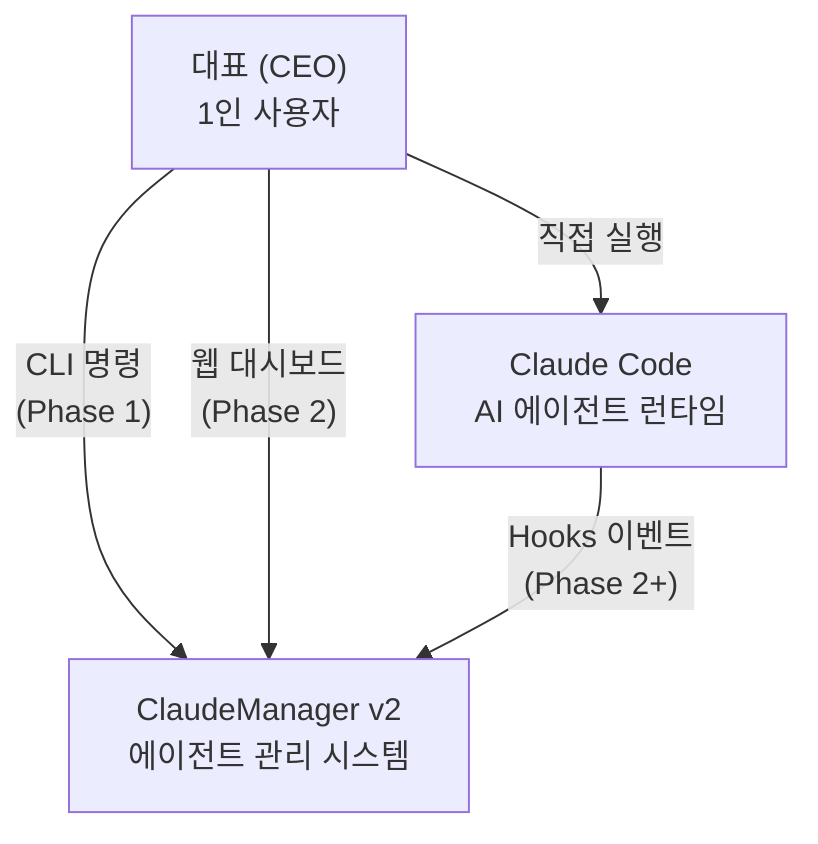
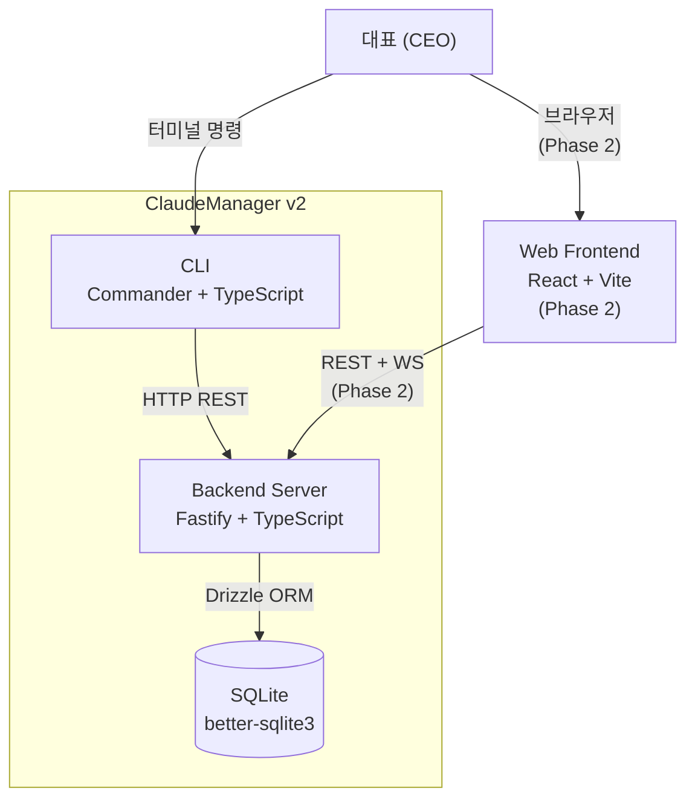
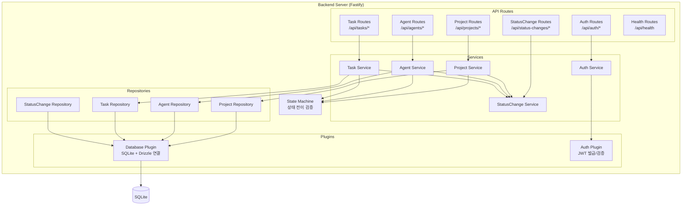
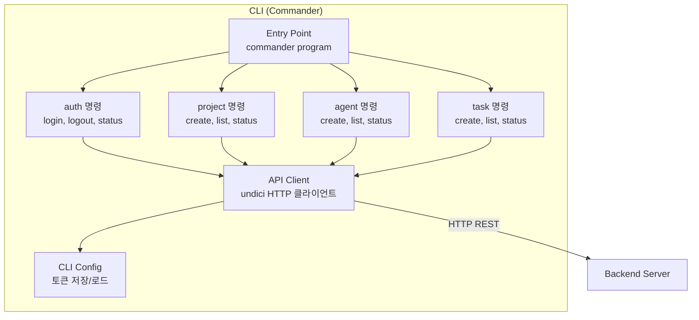

# DES-001 아키텍처 설계서

> Phase 1: 기반 구축
> 버전: v2.0 (2026-08-24)
> **원본**: [Notion DES-001](https://app.notion.com/p/3c5d066504ec81b78014c7ccd8cb0723) · Git 동기화 2026-09-01
> 기준 원본 정책: Notion = 대표 승인 원본 / Git = 에이전트 실행 원본. 충돌 시 Notion 우선.

> **⚠ 개정 대기 (2026-09-01 승인 반영)**
> D-19(터널링) 승인에 따라 **접속 방식·HTTPS 경계·Web Push 외부 연동 경로**를 반영해야 한다. 개정 규모 **대**.
> 상세는 `docs/00-approvals.md` §승인 후 후속 작업 3번, DES-015 §2 참조.

---

## C4 Level 1: Context Diagram

시스템 전체를 하나의 박스로 놓고 외부 액터/시스템과의 관계를 정의한다.



### 외부 액터/시스템

| 액터/시스템 | 유형 | 역할 | Phase |
|-----------|------|------|-------|
| 대표 (CEO) | 사용자 | 유일한 사용자. CLI/웹으로 시스템 사용 | 1+ |
| Claude Code | 외부 시스템 | AI 에이전트 런타임. Hooks로 이벤트 전달 (Phase 2+) | 2+ |

### Phase 1 경계

- 대표 → ClaudeManager: CLI 명령으로 상호작용
- Claude Code 연동: Phase 1에서는 Agent 수동 등록 (FR-007 CRUD)
- 웹 대시보드: Phase 2

---

## C4 Level 2: Container Diagram

시스템 내부를 독립 실행 가능한 단위로 분해한다.



### Container 상세

| Container | 기술 | 역할 | 통신 방식 | Phase |
|-----------|------|------|----------|-------|
| CLI | Commander + TypeScript | 터미널 인터페이스, API 호출 | HTTP (→ Backend) | 1 |
| Backend Server | Fastify 5 + TypeScript | 비즈니스 로직, REST API, 인증 | HTTP (← CLI/FE), File I/O (→ DB) | 1 |
| SQLite | better-sqlite3 + Drizzle ORM | 데이터 영속 저장 | 파일 기반 동기식 | 1 |
| Web Frontend | React + Vite + TypeScript | 웹 대시보드 UI | REST + WebSocket (→ Backend) | 2 |

### ANL-002 정합성

ANL-002 의존관계 맵의 Layer 0~3 구조와 일치:

- Layer 0 (Database) → SQLite Container
- Layer 1 (Server + Auth) → Backend Server Container
- Layer 3 (CLI + ApiClient) → CLI Container

---

## C4 Level 3: Component Diagram

### Backend Server 내부 구조



### Component 상세

| Component | 역할 | 의존 | 대응 Story |
|-----------|------|------|-----------|
| Database Plugin | SQLite 연결 관리, Drizzle ORM 인스턴스 제공 | better-sqlite3, Drizzle | DAT-001 |
| Auth Plugin | JWT 토큰 발급/검증, preHandler 훅 | @fastify/jwt | FR-002, NFR-002 |
| Auth Routes | 로그인/토큰 관리 엔드포인트 | Auth Service | FR-002 |
| Auth Service | 인증 비즈니스 로직 | Auth Plugin | FR-002 |
| Project Routes | 프로젝트 CRUD 엔드포인트 | Project Service | FR-003, FR-004, FR-006 |
| Project Service | 프로젝트 CRUD, 상태 전이 검증 | Project Repo, State Machine, StatusChange Service | FR-003, FR-004, FR-006 |
| Project Repository | 프로젝트 데이터 액세스 | Database Plugin | FR-003, FR-004, FR-006 |
| Agent Routes | Agent CRUD 엔드포인트 | Agent Service | FR-007 |
| Agent Service | Agent CRUD, 상태 전이 검증 | Agent Repo, State Machine, StatusChange Service | FR-007 |
| Agent Repository | Agent 데이터 액세스 | Database Plugin | FR-007 |
| Task Routes | Task CRUD 엔드포인트 | Task Service | FR-008 |
| Task Service | Task CRUD, 상태 전이 검증 | Task Repo, State Machine, StatusChange Service | FR-008 |
| Task Repository | Task 데이터 액세스 | Database Plugin | FR-008 |
| StatusChange Routes | 상태 변경 이력 조회 엔드포인트 | StatusChange Service | FR-009 |
| StatusChange Service | 상태 변경 로그 기록/조회 | StatusChange Repo | FR-009 |
| StatusChange Repository | 상태 변경 이력 데이터 액세스 | Database Plugin | FR-009 |
| State Machine | 엔티티별 상태 전이 규칙 검증 (데이터 기반) | — | FR-006, FR-007, FR-008 |
| Health Routes | 서버 헬스체크 (인증 불필요) | Database Plugin | FR-001 |

### Must Story → Component 매핑 검증

| Story | Component | 확인 |
|-------|-----------|:---:|
| FR-001 백엔드 서버 시작/종료 | Fastify App (server.ts), Health Routes | ✅ |
| DAT-001 SQLite 데이터 영속 저장 | Database Plugin | ✅ |
| DAT-002 DB 마이그레이션 체계 | Database Plugin (Drizzle migrate) | ✅ |
| FR-002 토큰 기반 인증 | Auth Plugin, Auth Routes, Auth Service | ✅ |
| NFR-002 API 인증 미들웨어 | Auth Plugin (preHandler) | ✅ |
| FR-003 프로젝트 생성 | Project Routes/Service/Repository | ✅ |
| FR-004 프로젝트 목록 조회 | Project Routes/Service/Repository | ✅ |
| FR-006 프로젝트 상태 변경 | Project Routes/Service/Repository, State Machine | ✅ |
| FR-007 Agent 상태 CRUD | Agent Routes/Service/Repository, State Machine | ✅ |
| FR-008 Task 상태 CRUD | Task Routes/Service/Repository, State Machine | ✅ |
| FR-009 상태 변경 이력 | StatusChange Routes/Service/Repository | ✅ |
| INT-001 CLI-백엔드 HTTP 통신 | CLI Container (ApiClient) | ✅ |

### CLI 내부 구조



---

## 레이어 규칙

### 의존 방향

```
Routes → Services → Repositories → Database Plugin → SQLite
                  → State Machine (순수 함수, 외부 의존 없음)
                  → StatusChange Service (상태 변경 로그 기록)
```

### 규칙

1. **단방향 의존**: 상위 레이어 → 하위 레이어만 허용. 역방향 금지
2. **순환 의존 금지**: Service 간 순환 참조 없음
3. **Routes는 Service만 호출**: Repository 직접 접근 금지
4. **Repository는 Drizzle 쿼리만**: 비즈니스 로직 포함 금지
5. **State Machine은 순수 함수**: 외부 의존 없이 전이 규칙만 검증
6. **StatusChange Service는 횡단 관심사**: 모든 엔티티 Service에서 사용

### Cross-Cutting Concerns

| 관심사 | 구현 방식 | 적용 범위 |
|--------|----------|----------|
| 인증 | Fastify preHandler 훅 | 보호된 모든 라우트 |
| 에러 처리 | Fastify setErrorHandler | 전역 |
| 요청/응답 로깅 | Fastify onRequest/onResponse 훅 | 전역 |
| 요청/응답 검증 | Fastify JSON Schema | 각 라우트 |

---

## 리스크 대응 설계

ANL-003의 높음/보통 리스크에 대한 설계적 대응:

| 리스크 | 등급 | 설계 대응 |
|--------|------|----------|
| RISK-005 AI 코드 생성 품질 | 높음 | Routes에 JSON Schema 강제 검증, Service에 상태 전이 가드, Repository에 Drizzle 타입 체크 → 3중 방어 |
| RISK-001 Drizzle SQLite 호환성 | 보통 | Database Plugin이 Drizzle을 래핑 → 드라이버 교체 시 Plugin만 수정 |
| RISK-003 TypeScript 빌드 복잡성 | 보통 | src/shared/에 공유 타입 집중, 경로 별칭으로 import 단순화 |
| RISK-004 상태 전이 복잡성 | 보통 | State Machine을 독립 모듈로 분리, 전이 규칙을 데이터로 정의 (DES-007 참조) |
| RISK-007 better-sqlite3 빌드 | 보통 | Database Plugin이 드라이버를 추상화 → 교체 시 Plugin만 수정 |
| RISK-010 인증 보안 | 보통 | Auth Plugin이 JWT 처리를 캡슐화, 시크릿은 환경 변수, localhost only 바인딩 |

> **⚠ RISK-010 재검토 필요 (2026-09-01)**: D-19 터널링 승인으로 **localhost only 바인딩 전제가 깨진다.** 터널을 통한 외부 접근 경로가 생기므로 보안 경계를 재정의해야 한다. DES-015 §2-2 참조.

---

## 인증 설계 결정

### ADR-005: 인증 방식 — JWT

- **상태**: 결정
- **날짜**: 2026-08-23
- **결정자**: Agent 자율 판단 (의사결정 등급: 보통)

#### 맥락

Phase 1의 FR-002는 토큰 기반 인증을 요구한다. 1인 사용자 로컬 환경이므로 간단한 방식이 적합하다.

#### 결정

**JWT (JSON Web Token)**를 사용한다.

- 로그인: 사전 설정된 시크릿으로 인증 → JWT 발급
- 시크릿 관리: `CM_AUTH_SECRET` 환경 변수 또는 `~/.claude-manager/config.json`
- 최초 실행: 시크릿 미설정 시 서버가 랜덤 시크릿 생성 후 콘솔에 출력
- 토큰 만료: 7일 (설정 가능)
- 사용자 테이블: 불필요 (1인 사용자, JWT에 사용자 정보 미포함)
- 토큰 폐기: Phase 1에서는 미구현 (만료에 의존)

#### 근거

- `@fastify/jwt` 플러그인으로 즉시 통합
- Stateless → 서버 재시작에 영향 없음
- 1인 사용자이므로 사용자 테이블/세션 저장소 불필요
- CLI에서 토큰을 로컬 파일에 저장하여 재사용

---

## Graceful Shutdown 설계

FR-001의 "진행 중인 요청을 완료한 후 정상 종료" 요구사항 대응:

1. `SIGTERM`/`SIGINT` 시그널 핸들러 등록
2. `server.close()` 호출 → 새 연결 거부, 기존 연결 완료 대기
3. DB 연결 정리 (better-sqlite3 `db.close()`)
4. 타임아웃 (10초) 후 강제 종료

---

## Phase 2+ 확장 고려사항

> Orca ADE 분석 결과 반영 (2026-08-24). Phase 1 설계 변경 아님, 향후 확장 시 참고.

| 기능 | 요구사항 | 아키텍처 영향 | 대상 Phase |
|------|---------|-------------|:---:|
| 실시간 Agent Board (FR-014) | 에이전트 로그/진행률/명령 실시간 스트리밍 | WebSocket 채널 확장, Backend에 LogStreamer 컴포넌트 추가 | 2 |
| 비용/토큰 추적 (FR-016) | Agent별 토큰 사용량/비용 기록·조회 | Backend에 UsageTracker 서비스 추가, token_usages 테이블, 모델별 단가 설정 | 2 |
| 칸반 보드 (FR-017) | Task를 칸반 컬럼으로 시각화 | Frontend 전용 (기존 Task API 활용), WIP 제한은 프로젝트 설정에 추가 | 2 |
| 승인 게이트 (FR-018) | 승인 요청/처리/타임아웃/감사 로그 | Backend에 ApprovalService 추가, approvals 테이블, WebSocket 알림 채널 | 2 |
| 워크트리 기반 격리 (FR-013) | Sub-Agent별 독립 git worktree | Backend에 WorktreeManager 컴포넌트 추가, Agent 생성 시 worktree 할당/해제 API 필요 | 3 |
| 워크플로우 템플릿 (FR-019) | Agent/Task 구성 저장·재사용 | Backend에 TemplateService 추가, workflow_templates 테이블 | 3 |
| 공유 메모리 (FR-020) | Agent 간 컨텍스트 공유 저장소 | Backend에 MemoryService 추가, shared_memories 테이블 (단기/장기 구분) | 3 |
| 세션 관리 (FR-021) | Agent 세션 제어, Hook 이벤트 기록 | Backend에 SessionService 추가, agent_sessions/session_events 테이블 | 3 |
| 모바일 모니터링 PWA (FR-015) | 모바일 웹에서 상태 확인/승인 처리 | Frontend를 PWA로 구성 (Service Worker, manifest.json), Push API 연동 | 4 |
| 오케스트레이션 DAG (FR-022) | Agent 관계 그래프 시각화 | Frontend 전용 (기존 Agent API의 parent 관계 활용), D3/React Flow 라이브러리 | 4 |
| 알림/웹훅 (FR-023) | 이벤트별 외부 채널 알림 | Backend에 NotificationService 추가, notification_rules/notification_logs 테이블 | 4 |
| 롤백/체크포인트 (FR-024) | git 스냅샷 저장·복원 | Backend에 CheckpointService 추가, git stash/tag 기반 스냅샷 관리 | 5 |
| 성과 분석 (FR-025) | Agent 효율 통계·차트 | Frontend 전용 (기존 상태 변경 이력 + 토큰 사용량 데이터 집계) | 5 |

**현재 아키텍처와의 호환성**: Phase 1의 3-Layer + Plugin 구조는 위 확장에 대응 가능.

- **Phase 2 추가 컴포넌트**: UsageTracker, ApprovalService, LogStreamer → Fastify Plugin으로 추가
- **Phase 3 추가 컴포넌트**: WorktreeManager, TemplateService, MemoryService, SessionService → 기존 서비스 계층에 추가
- **Phase 4~5 추가 컴포넌트**: NotificationService, CheckpointService → 기존 구조 변경 없이 확장
- **Frontend 전용 기능**: 칸반, DAG 시각화, 성과 분석 → 기존 REST API를 그대로 활용, 프론트엔드 컴포넌트만 추가

---

## ⚠ 2026-09-01 승인 반영 필요 항목

`docs/00-approvals.md` 전건 승인에 따라 본 문서는 **개정 대상(규모 대)**이다.

| 항목 | 필요한 변경 | 근거 |
|------|-----------|------|
| **접속 경계** | `127.0.0.1` 전용 → **터널(HTTPS) 경유 외부 접근** 추가. Container Diagram에 Tunnel 요소 추가 | D-19 |
| **보안 경계** | RISK-010의 "localhost only 바인딩" 전제 무효화 → 터널 노출 범위·인증 경계 재정의 | D-19 |
| **외부 연동** | Web Push(VAPID) → APNs/FCM 경유 경로를 Context Diagram에 명시 (APV-EXT) | D-21 |
| **Phase 배치** | FR-018 승인 게이트를 Phase 2 → **Phase 1**로, FR-015 PWA를 Phase 4 → **Phase 2**로 | D-16, D-23 |
| **신규 컴포넌트** | ConversationService, ApprovalService, PhaseService, PushService를 Phase 1~2로 앞당김 | D-09, D-16 |

---

## 변경 이력

| 버전 | 날짜 | 내용 |
|------|------|------|
| v1 | 2026-08-23 | 최초 작성 (Phase 1 설계) |
| v1.1 | 2026-08-24 | Phase 2+ 확장 고려사항 추가 (FR-013~015) |
| v2.0 | 2026-08-24 | Phase 2~5 전체 확장 반영 (FR-016~025 아키텍처 영향 분석) |
| — | 2026-09-01 | **Git 동기화** + 승인 반영 필요 항목 주석 추가 (내용 변경 없음) |
