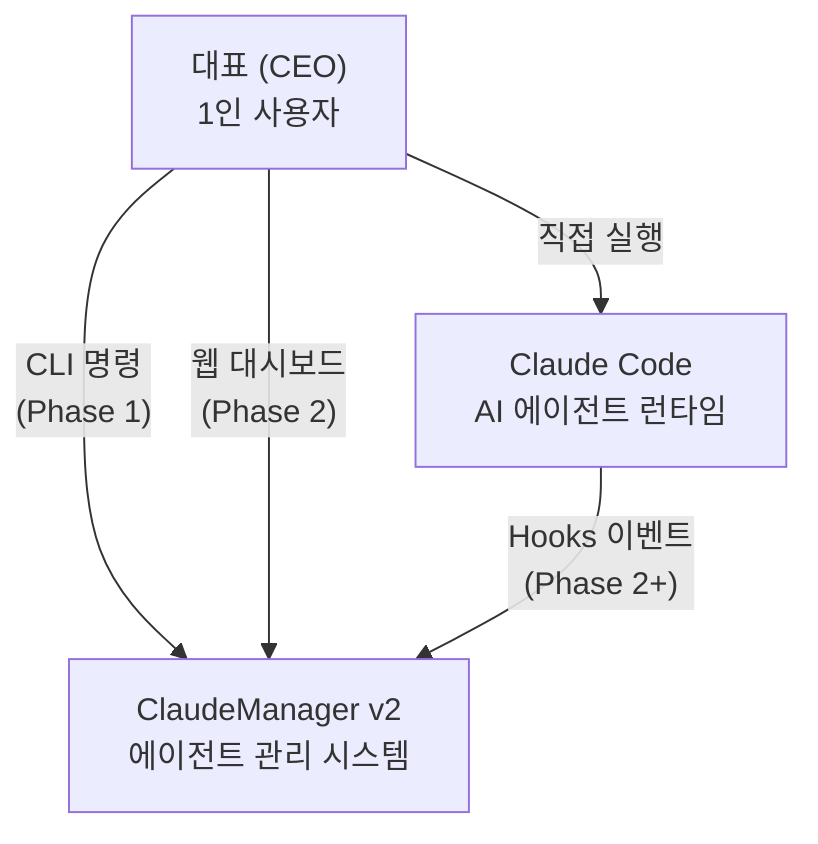
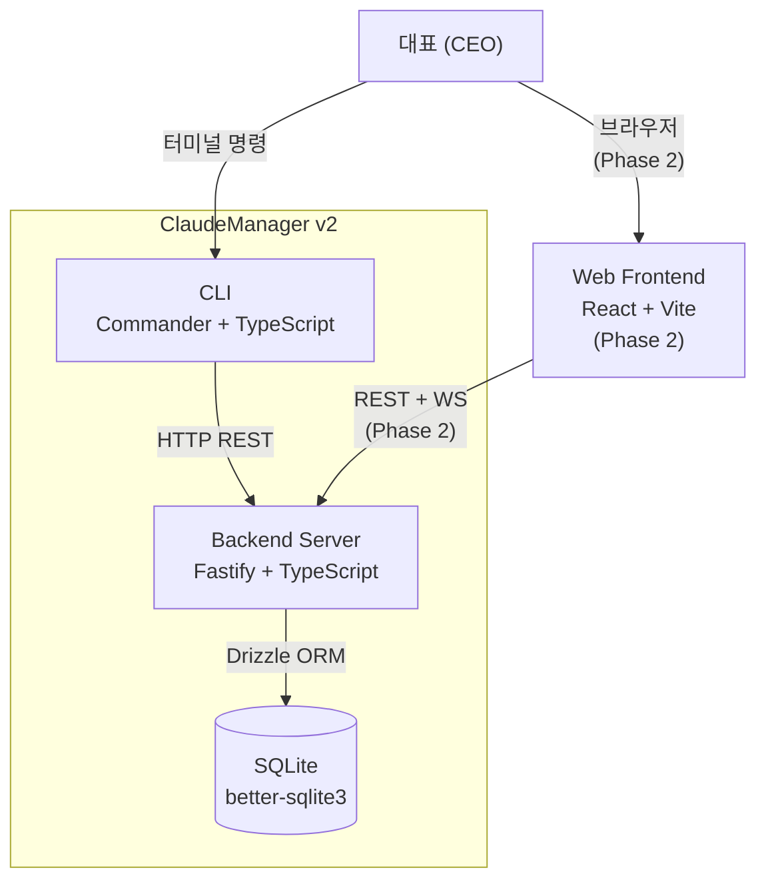
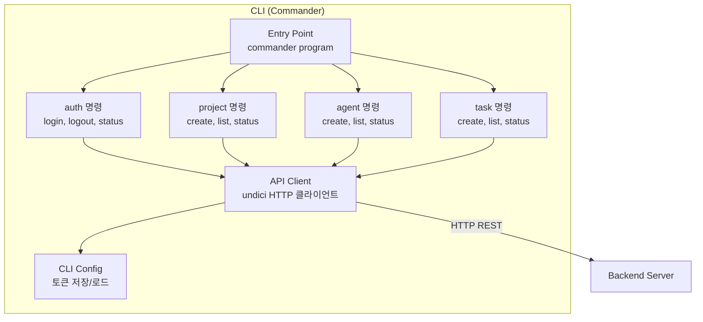

# DES-001 아키텍처 설계서

> Phase 1: 기반 구축
> 버전: **v3.5 (2026-09-03)** — 허용된 Service 간 의존 4건 → **5건**(`AgentService → TaskService` 추가, R2-02). 컴포넌트 수 변경 없음
> **원본**: [Notion DES-001](https://app.notion.com/p/3c5d066504ec81b78014c7ccd8cb0723) · Git 동기화 2026-09-03
> 기준 원본 정책: Notion = 대표 승인 원본 / Git = 에이전트 실행 원본. 충돌 시 Notion 우선.

> **✅ 개정 완료 (2026-09-01)**
> 터널링(D-19)은 비용 제약으로 **Phase 2 연기**가 확정되어 Phase 1은 루프백 전용을 유지한다 (§접속 경계).
> 대화·승인·진행 컴포넌트와 **타임아웃 잡 배치(ADR-012)**를 반영했다. 상세는 §2026-09-01 승인 반영 현황.

---

## C4 Level 1: Context Diagram

시스템 전체를 하나의 박스로 놓고 외부 액터/시스템과의 관계를 정의한다.



### 외부 액터/시스템

| 액터/시스템 | 유형 | 역할 | Phase |
|-----------|------|------|-------|
| 대표 (CEO) | 사용자 | 유일한 사용자. CLI/웹으로 시스템 사용 | 1+ |
| Claude Code | 외부 시스템 | AI 에이전트 런타임. Hooks로 이벤트 전달 (Phase 2+) | 2+ |

### Phase 1 경계

- 대표 → ClaudeManager: CLI 명령으로 상호작용
- Claude Code 연동: Phase 1에서는 Agent 수동 등록 (FR-007 CRUD)
- 웹 대시보드: Phase 2

---

## C4 Level 2: Container Diagram

시스템 내부를 독립 실행 가능한 단위로 분해한다.



### Container 상세

| Container | 기술 | 역할 | 통신 방식 | Phase |
|-----------|------|------|----------|-------|
| CLI | Commander + TypeScript | 터미널 인터페이스, API 호출 | HTTP (→ Backend) | 1 |
| Backend Server | Fastify 5 + TypeScript | 비즈니스 로직, REST API, 인증 | HTTP (← CLI/FE), File I/O (→ DB) | 1 |
| SQLite | better-sqlite3 + Drizzle ORM | 데이터 영속 저장 | 파일 기반 동기식 | 1 |
| Web Frontend | React + Vite + TypeScript | 웹 대시보드 UI | REST + WebSocket (→ Backend) | 2 |

### ANL-002 정합성

ANL-002 의존관계 맵의 Layer 0~3 구조와 일치:

- Layer 0 (Database) → SQLite Container
- Layer 1 (Server + Auth) → Backend Server Container
- Layer 3 (CLI + ApiClient) → CLI Container

---

## C4 Level 3: Component Diagram — **v3 개정**

### Backend Server 내부 구조

```mermaid
graph TD
    subgraph Backend["Backend Server (Fastify)"]
        subgraph Plugins["Plugins"]
            DBPlugin["Database Plugin<br>SQLite + Drizzle 연결"]
            AuthPlugin["Auth Plugin<br>JWT 발급/검증"]
            WsPlugin["WebSocket Plugin<br>@fastify/websocket"]
        end

        subgraph Routes["API Routes"]
            AuthRoutes["Auth Routes<br>/api/auth/*"]
            ProjectRoutes["Project Routes<br>/api/projects/*"]
            AgentRoutes["Agent Routes<br>/api/agents/*"]
            TaskRoutes["Task Routes<br>/api/tasks/*"]
            StatusChangeRoutes["StatusChange Routes<br>/api/status-changes/*"]
            HealthRoutes["Health Routes<br>/api/health"]
            ConvRoutes["Conversation Routes<br>/api/conversations/*"]
            ApprovalRoutes["Approval Routes<br>/api/approvals/*"]
            PhaseRoutes["Phase·Stage Routes<br>/api/phases/* /api/stages/*"]
            ArtifactRoutes["Artifact Routes<br>/api/artifacts/*"]
        end

        subgraph Services["Services"]
            AuthService["Auth Service"]
            ProjectService["Project Service"]
            AgentService["Agent Service"]
            TaskService["Task Service"]
            StatusChangeService["StatusChange Service"]
            ConvService["Conversation Service"]
            ApprovalService["Approval Service"]
            PhaseService["Phase Service"]
            StageService["Stage Service"]
            ArtifactService["Artifact Service"]
        end

        subgraph Repositories["Repositories"]
            ProjectRepo["Project Repository"]
            AgentRepo["Agent Repository"]
            TaskRepo["Task Repository"]
            StatusChangeRepo["StatusChange Repository"]
            ConvRepo["Conversation Repository"]
            MessageRepo["Message Repository<br>+ FTS5 검색"]
            ApprovalRepo["Approval Repository"]
            PhaseRepo["Phase·Stage Repository"]
            ArtifactRepo["Artifact Repository"]
        end

        subgraph Jobs["Background Jobs"]
            TimeoutJob["ApprovalTimeoutJob<br>60초 주기"]
        end

        subgraph Boot["Startup"]
            Bootstrap["BootstrapService<br>CH-MAIN · Phase 1 · 7단계<br>멱등 시드 (ready 훅)"]
        end

        StateMachine["State Machine<br>상태 전이 검증 (6종)"]
        WsHub["WebSocket Hub<br>채널별 브로드캐스트"]
    end

    DB[("SQLite")]

    AuthRoutes --> AuthService
    ProjectRoutes --> ProjectService
    AgentRoutes --> AgentService
    TaskRoutes --> TaskService
    StatusChangeRoutes --> StatusChangeService
    ConvRoutes --> ConvService
    ApprovalRoutes --> ApprovalService
    PhaseRoutes --> PhaseService
    PhaseRoutes --> StageService
    ArtifactRoutes --> ArtifactService

    AuthService --> AuthPlugin
    ProjectService --> ProjectRepo
    ProjectService --> StatusChangeService
    ProjectService --> StateMachine
    AgentService --> AgentRepo
    AgentService --> StatusChangeService
    AgentService --> StateMachine
    AgentService --> ConvService
    TaskService --> TaskRepo
    TaskService --> StatusChangeService
    TaskService --> StateMachine

    ConvService --> ConvRepo
    ConvService --> MessageRepo
    ConvService --> StateMachine
    ConvService --> WsHub
    ApprovalService --> ApprovalRepo
    ApprovalService --> ConvService
    ApprovalService --> AgentService
    ApprovalService --> StateMachine
    ApprovalService --> WsHub
    PhaseService --> PhaseRepo
    StageService --> PhaseRepo
    StageService --> ApprovalService
    StageService --> StateMachine
    ArtifactService --> ArtifactRepo

    TimeoutJob --> ApprovalService
    Bootstrap --> ConvService
    Bootstrap --> PhaseService

    WsHub --> WsPlugin

    ProjectRepo --> DBPlugin
    AgentRepo --> DBPlugin
    TaskRepo --> DBPlugin
    StatusChangeRepo --> DBPlugin
    ConvRepo --> DBPlugin
    MessageRepo --> DBPlugin
    ApprovalRepo --> DBPlugin
    PhaseRepo --> DBPlugin
    ArtifactRepo --> DBPlugin
    DBPlugin --> DB
```



> **`AgentService → ConversationService` 의존이 v3에서 추가되었다.** Agent 생성 시 CH-AGENT 개설, 종료 시 `readonly`, 삭제 시 `archived` 전환이 필요하기 때문이다 (D-27 · DES-007 v2 §5-1). 역방향 의존은 없다.

> **`ApprovalService → AgentService` 의존이 v3.2에서 추가되었다 (R-02).**
> DES-007 v2 §3-2·§6-2가 규정한 **승인 ↔ Agent 상태 연동**(요청 발행 시 `running→waiting`, 승인·조건부·자동진행 시 `waiting→running`)을 실행할 주체가 v3에는 없었다. DES-004 v2 §15·§17이 그 전이를 그렸으나 아키텍처에 경로가 없어 **설계된 전이를 구현할 수 없는 상태**였다.
> 순환은 생기지 않는다 — `ApprovalService → AgentService → ConversationService`로 단방향이고, `AgentService`는 `ApprovalService`를 부르지 않는다. 이벤트 버스 도입안은 1인 로컬 MVP에 과잉이라 기각했다(RISK-006 복잡도 과소평가가 **높음**으로 상향된 상태다).

> **`BootstrapService`가 v3.2에서 추가되었다 (R-01).**
> PLN-001 FR-026 수용 기준("시스템이 최초 기동될 때 CH-MAIN 채널 1개가 자동 생성")과 DES-007 v2 §7("Phase 생성 시 7단계 일괄 생성")을 실행할 주체가 없었다. 이것이 없으면 `cm chat main`·`cm progress`·`cm stage start`가 **빈 DB를 만나 전부 실패한다.**
> Jobs와 같은 규칙을 따른다 — **Service만 호출하고 Repository를 직접 만지지 않는다.** 시드가 비즈니스 규칙(CH-MAIN 전역 1개, Phase당 7단계)을 우회하면 안 되기 때문이다.

### Component 상세

| Component | 역할 | 의존 | 대응 Story |
|-----------|------|------|-----------|
| Database Plugin | SQLite 연결 관리, Drizzle ORM 인스턴스 제공 | better-sqlite3, Drizzle | DAT-001 |
| Auth Plugin | JWT 토큰 발급/검증, preHandler 훅 | @fastify/jwt | FR-002, NFR-002 |
| **WebSocket Plugin** | WS 업그레이드 처리, 연결 수명 관리 | @fastify/websocket | **NFR-003** |
| Auth Routes | 로그인/토큰 관리 엔드포인트 | Auth Service | FR-002 |
| Auth Service | 인증 비즈니스 로직 | Auth Plugin | FR-002 |
| Project Routes | 프로젝트 CRUD 엔드포인트 | Project Service | FR-003, FR-004, FR-006 |
| Project Service | 프로젝트 CRUD, 상태 전이 검증 | Project Repo, State Machine, StatusChange Service | FR-003, FR-004, FR-006 |
| Project Repository | 프로젝트 데이터 액세스 | Database Plugin | FR-003, FR-004, FR-006 |
| Agent Routes | Agent CRUD 엔드포인트 | Agent Service | FR-007 |
| Agent Service | Agent CRUD, 상태 전이 검증, **대화 채널 생명주기 연동** | Agent Repo, State Machine, StatusChange Service, **Conversation Service** | FR-007 |
| Agent Repository | Agent 데이터 액세스 | Database Plugin | FR-007 |
| Task Routes | Task CRUD 엔드포인트 | Task Service | FR-008 |
| Task Service | Task CRUD, 상태 전이 검증 | Task Repo, State Machine, StatusChange Service | FR-008 |
| Task Repository | Task 데이터 액세스 | Database Plugin | FR-008 |
| StatusChange Routes | 상태 변경 이력 조회 엔드포인트 | StatusChange Service | FR-009 |
| StatusChange Service | 상태 변경 로그 기록/조회 | StatusChange Repo | FR-009 |
| StatusChange Repository | 상태 변경 이력 데이터 액세스 | Database Plugin | FR-009 |
| State Machine | 엔티티별 상태 전이 규칙 검증 (**6종** — Project·Agent·Task·Conversation·Approval·Stage) | — | FR-006~008, **FR-026, FR-028, FR-030** |
| Health Routes | 서버 헬스체크 (인증 불필요) | Database Plugin | FR-001 |
| **Conversation Routes** | 채널·메시지·검색·내보내기 엔드포인트 | Conversation Service | **FR-026, FR-027** |
| **Conversation Service** | 채널 생명주기, 메시지 송수신, 커서 조회, FTS 검색 | Conv Repo, Message Repo, State Machine, WS Hub | **FR-026, FR-027** |
| **Conversation Repository** | 채널 데이터 액세스 | Database Plugin | **FR-026** |
| **Message Repository** | 메시지 CRUD + **FTS5 전문 검색** | Database Plugin | **FR-027** |
| **Approval Routes** | 승인 목록·상세·처리 엔드포인트 | Approval Service | **FR-028** |
| **Approval Service** | 의사결정 요청 발행, 승인 처리, 타임아웃 판정, **Agent 상태 연동** | Approval Repo, Conversation Service, **Agent Service**, State Machine, WS Hub | **FR-028, FR-030** |
| **Approval Repository** | 승인 데이터 액세스 | Database Plugin | **FR-028** |
| **Phase·Stage Routes** | Phase 현황, 단계 착수, WIP 면제 엔드포인트 | Phase/Stage Service | **FR-029, FR-030** |
| **Phase Service** | Phase 현황 집계, **WIP 규칙 검사** | Phase Repo | **FR-029** |
| **Stage Service** | 단계 착수 **3단 게이트 검증** | Phase Repo, Approval Service, State Machine | **FR-030** |
| **Phase·Stage Repository** | Phase·단계 데이터 액세스 | Database Plugin | **FR-029** |
| **Artifact Routes** | 산출물 목록·본문 엔드포인트 | Artifact Service | **FR-031** |
| **Artifact Service** | 산출물 조회, **동기화 상태 파생** | Artifact Repo | **FR-031** |
| **Artifact Repository** | 산출물 데이터 액세스 | Database Plugin | **FR-031** |
| **WebSocket Hub** | 채널별 소켓 등록·브로드캐스트. **버퍼링하지 않는다** | WebSocket Plugin | **NFR-003** |
| **ApprovalTimeoutJob** | 60초 주기 만료 승인 자동 진행 (APV-GATE 제외) | Approval Service | **FR-028 (D-10)** |
| **BootstrapService** | 서버 `ready` 훅에서 **CH-MAIN · Phase 1 · 7단계 멱등 시드**. 실패 시 기동 중단 | Conversation Service, Phase Service | **FR-026, FR-029 (R-01)** |

### Must Story → Component 매핑 검증

| Story | Component | 확인 |
|-------|-----------|:---:|
| FR-001 백엔드 서버 시작/종료 | Fastify App (server.ts), Health Routes | ✅ |
| DAT-001 SQLite 데이터 영속 저장 | Database Plugin | ✅ |
| DAT-002 DB 마이그레이션 체계 | Database Plugin (Drizzle migrate) | ✅ |
| FR-002 토큰 기반 인증 | Auth Plugin, Auth Routes, Auth Service | ✅ |
| NFR-002 API 인증 미들웨어 | Auth Plugin (preHandler) | ✅ |
| FR-003 프로젝트 생성 | Project Routes/Service/Repository | ✅ |
| FR-004 프로젝트 목록 조회 | Project Routes/Service/Repository | ✅ |
| FR-005 프로젝트 상세 조회 | Project Routes/Service/Repository, Agent Repository | ✅ |
| FR-006 프로젝트 상태 변경 | Project Routes/Service/Repository, State Machine | ✅ |
| FR-007 Agent 상태 CRUD | Agent Routes/Service/Repository, State Machine | ✅ |
| FR-008 Task 상태 CRUD | Task Routes/Service/Repository, State Machine | ✅ |
| FR-009 상태 변경 이력 | StatusChange Routes/Service/Repository | ✅ |
| INT-001 CLI-백엔드 HTTP 통신 | CLI Container (ApiClient) | ✅ |

### CLI 내부 구조



---

## 백그라운드 잡 배치 결정 — **v3 신규**

### ADR-012: ApprovalTimeoutJob 실행 방식

DES-002 v2와 DES-004 v2가 **"타임아웃 자동 진행을 누가 실행하는지 설계에 없다"**고 두 번 미해결로 걸어둔 항목이다. 여기서 확정한다.

#### 맥락

D-10에 따라 등급 '보통' 승인은 30분 후 자동 진행된다. 이를 감시할 주체가 필요하다. DES-004 v2 §17이 **동작**은 정의했으나 **배치 위치**는 미정이었다.

#### 후보

| 안 | 방식 | 장점 | 단점 |
|---|------|------|------|
| **(A) Fastify 프로세스 내부 타이머** ← **채택** | `setInterval` 기반, 서버 부팅 시 시작 | 프로세스 1개. 배포·감시 대상이 늘지 않는다. SQLite 연결을 공유한다 | 서버가 죽으면 잡도 죽는다 |
| (B) 별도 워커 프로세스 | 독립 프로세스 | 서버 재시작과 무관 | **SQLite 파일을 2개 프로세스가 연다.** 쓰기 잠금 경합 발생. 프로세스 관리 대상 +1 |
| (C) OS 스케줄러 (cron) | 외부 스케줄러 | 서버 부담 없음 | Windows·macOS 설정이 다르다. 1인 로컬 환경에 과잉 |

#### 결정

**(A) Fastify 프로세스 내부 타이머.**

#### 근거

1. **SQLite는 단일 쓰기자 모델이다.** (B)는 두 프로세스가 같은 파일에 쓰므로 `SQLITE_BUSY` 경합을 다뤄야 한다. ANL-004가 "로컬 단일 사용자"를 전제로 SQLite를 선택했는데, 워커를 붙이면 그 전제를 스스로 깨뜨린다
2. **서버가 죽으면 Agent도 멈춘다.** (A)의 단점인 "서버와 운명을 같이한다"는 실제로는 문제가 아니다. 서버가 없으면 자동 진행할 Agent 자체가 동작하지 않는다
3. **재시작 시 밀린 건은 자동 처리된다.** 잡이 조회 조건을 `deadline_at <= now`로 두므로, 서버가 꺼져 있던 동안 만료된 건도 첫 tick에서 함께 처리된다. 별도 복구 로직이 필요 없다
4. 1인 로컬 MVP에 프로세스를 늘릴 이유가 없다 (RISK-006 복잡도 과소평가가 **높음**으로 상향된 상태다)

#### 결과

- `src/backend/jobs/approval-timeout.job.ts`
- 서버 `ready` 훅에서 **`BootstrapService.seed()` 완료 후** `start()`, Graceful Shutdown에서 `stop()`
  - 순서가 중요하다 — 시드가 끝나기 전에 잡이 돌면 조회 대상 테이블이 비어 있다
- **tick 중복 실행 방지**: 이전 tick이 끝나지 않았으면 건너뛴다. `setInterval`은 실행 시간을 기다리지 않는다
- 실패해도 서버를 죽이지 않는다. tick 내부 예외는 로깅 후 삼킨다

#### 기각 사유

(B)는 SQLite 전제와 충돌한다. (C)는 크로스 플랫폼 설정 부담이 1인 환경에 과하다. 둘 다 Phase 2에서 다중 사용자·원격 접속이 들어올 때 재검토한다.

---

## 레이어 규칙 — **v3 개정**

### 의존 방향

```
Routes     →  Services  →  Repositories  →  Database Plugin  →  SQLite
Jobs       →  Services                 (Repository 직접 접근 금지)
Bootstrap  →  Services                 (동일 — 시드가 비즈니스 규칙을 우회하면 안 된다)
           →  State Machine   (순수 함수, 외부 의존 없음)
           →  StatusChange Service  (상태 변경 로그)
           →  WebSocket Hub   (브로드캐스트, 단방향 출력)
```

### 규칙

1. **단방향 의존**: 상위 레이어 → 하위 레이어만 허용. 역방향 금지
2. **순환 의존 금지**: Service 간 순환 참조 없음
3. **Routes는 Service만 호출**: Repository 직접 접근 금지
4. **Repository는 Drizzle 쿼리만**: 비즈니스 로직 포함 금지
5. **State Machine은 순수 함수**: 외부 의존 없이 전이 규칙만 검증
6. **StatusChange Service는 횡단 관심사**: 모든 엔티티 Service에서 사용
7. **Jobs·Bootstrap은 Service만 호출** (v3 · v3.2) — Repository 직접 접근 금지. 잡이나 시드가 비즈니스 규칙을 우회하면 안 된다
8. **WebSocket Hub는 출력 전용** (v3) — Hub가 Service를 호출하지 않는다. 호출하면 순환이 생긴다
9. **교차 애그리거트 트랜잭션은 Route가 조율한다** (v3.2) — 두 Service를 한 트랜잭션에 묶어야 하는데 **그 방향이 순환을 만든다면**, Service끼리 부르지 말고 Route 핸들러가 `db.transaction()` 안에서 순서대로 호출한다. better-sqlite3는 동기식이라 가능하다.
   - 적용 사례: `DELETE /api/agents/:id` → `approvalService.closeByRequester()` + `agentService.delete()` (R-04). `AgentService → ApprovalService`를 추가하면 규칙 앞의 `ApprovalService → AgentService`와 **양방향 순환**이 된다
   - **적용 사례 (v3.4)**: `PATCH /api/projects/:id/status`(취소·일시정지) → `projectService.updateStatusSync()` + `agentService.cascadeFromProjectSync()` (D-1 B안, FIND-01 해소 · DES-004 §6, 구현 정합 확인: 커밋 `3700f2b`). 캐스케이드를 순환 없이 묶는 문제가 아니라 — 이전 구현이 `ProjectService`가 `AgentRepository`에 **직접** 상태 전이를 써서(레이어 규칙 10 위반, REV-M-01) `AgentService`가 소유한 `cascadeToTasks()`를 건너뛴 사례다. `ProjectService → AgentService` Service 간 의존을 새로 허용 목록에 추가하는 대신(위상 정렬을 어지럽힌다), R-04와 같은 패턴으로 Route가 조율한다
10. **Repository 직접 접근 예외** (v3.3) — Service가 "허용된 Service 간 의존 5건"(v3.5) 밖의 애그리거트 데이터에 닿아야 할 때, 그 Service를 거치지 않고 **타 애그리거트의 Repository를 직접 주입**받을 수 있다. 두 조건 중 하나를 만족해야 한다: **(a) 원자성** — 여러 애그리거트 쓰기가 하나의 동기 트랜잭션 안에서 이뤄져야 하는 경우, **(b) 읽기 전용 조회·집계** — 다른 애그리거트의 데이터를 읽기만 하는 경우. **상태 전이·검증이 붙은 쓰기는 예외 대상이 아니다** — 그런 쓰기는 반드시 소유 Service를 경유한다. 상세는 §Repository 직접 접근 예외

> **허용된 Service 간 의존 5건** (순환 아님, 단방향)
> `AgentService → ConversationService` · `ApprovalService → ConversationService` · **`ApprovalService → AgentService`** (v3.2 · R-02) · `StageService → ApprovalService` · **`AgentService → TaskService`** (v3.5 · R2-02)
>
> 위상 정렬이 성립한다: `StageService → ApprovalService → AgentService → {ConversationService, TaskService}`. 역방향 간선은 하나도 없다 — `TaskService`는 `AgentService`를 참조하지 않는다(grep 확인, 커밋 `8e47972`).

---

## Repository 직접 접근 예외 — v3.3 신규

레이어 규칙 10의 상세다. 개발 중 **같은 성격의 예외가 세 번** 반복해서 나왔다 — "허용된 Service 간 의존"만으로는 풀리지 않는 상황에서, 매번 Service 간 의존을 늘리는 대신 **타 애그리거트의 Repository를 직접 주입받는 방식**으로 해결했다. 여기서 규칙으로 명문화한다.

### 언제 허용되는가

| 조건 | 설명 |
|------|------|
| **(a) 원자성** | 여러 애그리거트에 대한 쓰기가 **하나의 SQLite 트랜잭션** 안에서 일어나야 하는데, `async` Service 메서드는 `db.transaction()`의 **동기 콜백** 안에서 반환값을 꺼낼 수 없다 — `async` 키워드가 붙으면 내부에 실제 `await`가 없어도 항상 Promise로 감싸이기 때문이다 |
| **(b) 읽기 전용 조회·집계** | 다른 애그리거트의 데이터를 **읽기만** 하는 경우. 쓰기가 없으므로 그 애그리거트가 지키는 비즈니스 규칙(상태 전이·검증)을 우회할 위험이 없다 |

### 언제 여전히 금지인가

**상태 전이·검증이 붙은 쓰기**는 이 예외의 대상이 아니다. 그런 쓰기는 반드시 소유 Service를 경유해야 한다 — Repository를 직접 호출해 쓰면 그 애그리거트가 지키는 규칙(상태 머신 가드, CHECK 제약 이전 단계의 검증 등)을 조용히 우회하게 된다. 레이어 규칙 3(Routes는 Service만 호출)·4(Repository는 Drizzle 쿼리만, 비즈니스 로직 금지)가 이미 지키려는 것과 같은 경계다.

### 왜 무순환 보장이 유지되는가

Repository는 다른 Service를 호출하지 않는다(레이어 규칙 4). 그래서 어떤 Service가 타 애그리거트의 Repository를 직접 주입받아도 **Service 간 호출 그래프에는 새 간선이 생기지 않는다** — Repository는 그 그래프의 잎(leaf)이지, 다른 Service로 이어지는 경로가 아니다. 기존 위상 정렬 `StageService → ApprovalService → AgentService → ConversationService`는 그대로 유지된다.

### 실제 사례

| 계층 | 사례 | 근거 | 유형 |
|------|------|------|:---:|
| (선례) | `AgentService`가 `ConversationRepository`를 읽기 목적으로 직접 참조 | Agent 상세 조회에 채널 정보가 필요하나 쓰기는 없다. `ConversationService`(생성·상태 전이)와 `ConversationRepository`(읽기)를 함께 주입받는다 | (b) |
| **Layer 2-6** | `ApprovalService`가 `MessageRepository`·`ConversationRepository` 직접 주입 | MSG-04(요청)/MSG-01(응답)/MSG-05(자동 진행) 기록과 `approvals` 갱신이 **한 트랜잭션**이어야 하는데, `ConversationService.appendSystemMessage`는 `async`라 `db.transaction()`의 동기 콜백 안에서 반환값을 꺼낼 수 없다 | (a) |
| **Layer 2-7** | `PhaseRepository`가 `artifacts`·`approvals`를 JOIN으로 직접 집계 (`PhaseService`는 `PhaseRepository`만 주입받는다) | `GET /api/phases/current`가 stage별 `artifactCount`·`pendingApprovalCount`·`gate`를 필요로 하나, `Phase→Approval`·`Phase→Artifact` 의존은 허용 목록에 없다. Repository가 한 쿼리(GROUP BY/윈도 함수)로 집계해 N+1도 만들지 않는다 | (b) |
| **Layer 2-9** | `ApprovalService`가 `ArtifactRepository` 직접 주입 | `ApprovalDetail.artifacts`를 실제 값으로 채우기 위한 읽기 전용 조회. `Approval→Artifact`도 허용 목록에 없다. Layer 2-7의 판단과 같은 원칙이다 | (b) |

> 근거 문구는 각 파일 상단 "── 의존 설계 메모 ──" 주석에서 그대로 가져왔다 — `approval.service.ts`(Layer 2-6·2-9), `phase.repository.ts`(Layer 2-7).
> **이 표가 없으면 다음 작업자(Layer R·Layer 3)가 같은 딜레마를 처음부터 다시 겪는다.** 판단 기준이 여기 있으니, 새 사례는 (a)/(b) 중 무엇에 해당하는지 먼저 확인한다.

### Cross-Cutting Concerns

| 관심사 | 구현 방식 | 적용 범위 |
|--------|----------|----------|
| 인증 (REST) | Fastify preHandler 훅 | 보호된 모든 라우트 |
| **인증 (WebSocket)** | 연결 시 `?token=` 쿼리 검증 → 실패 시 close `4001` | **모든 WS 채널** |
| 에러 처리 | Fastify setErrorHandler | 전역 |
| 요청/응답 로깅 | Fastify onRequest/onResponse 훅 | 전역 |
| 요청/응답 검증 | Fastify JSON Schema (`additionalProperties: false`) | 각 라우트 |
| **전이 이벤트 발행** | 트랜잭션 **커밋 후** WS Hub 브로드캐스트 | 상태 변경 전역 |

> **브라우저 WebSocket API는 헤더를 실을 수 없다.** 그래서 WS 인증만 쿼리 파라미터를 쓴다. 토큰이 URL에 남으므로 **접속 로그에 토큰을 기록하지 않는다.**

---

## 접속 경계 — **v3 확정**

| Phase | 바인딩 | 근거 |
|-------|--------|------|
| **Phase 1** | `127.0.0.1:3000` **전용** | 터널링(D-19·D-29)이 비용 제약으로 Phase 2 연기. 외부 노출 없음 |
| Phase 2 | 터널(HTTPS) 경유 외부 접근 추가 | D-19 (B) · D-29 Tailscale. 착수 시 재검토 |

> **RISK-010(인증 보안)의 "localhost only 바인딩" 전제는 Phase 1에서 유효하다.** v1의 개정 필요 항목은 터널링이 Phase 1에 있다는 가정이었으나, 그 가정이 D-19 연기로 해소되었다.
> Phase 2 착수 시 터널 노출 범위·인증 경계를 재정의한다. Web Push(APNs/FCM 경유)도 그때 Context Diagram에 추가한다.

---

## 기동 순서 — **v3.2 신규 (R-01)**

Graceful Shutdown의 역순이다. 순서가 어긋나면 조용히 반쪽으로 도는 서버가 된다.

1. 설정 로드 → `CM_AUTH_SECRET` 확인 (없으면 랜덤 생성 후 콘솔 출력)
2. Database Plugin 연결 → `PRAGMA foreign_keys = ON`
3. **마이그레이션 적용** (Drizzle migrate) — 001~006
4. Fastify 플러그인·라우트 등록
5. **`BootstrapService.seed()`** — CH-MAIN · Phase 1 · 7단계 멱등 시드 (DES-002 v2.1 §5-1)
6. `ApprovalTimeoutJob.start()` — 60초 주기 시작
7. `listen(127.0.0.1:3000)` — 요청 수신 개시

> **5가 실패하면 6·7로 넘어가지 않고 프로세스를 종료한다.** 시드 없이 뜬 서버는 `cm chat main`·`cm progress`·`cm stage start`가 전부 실패하는 반쪽 상태다. 기동을 막아 즉시 드러나게 한다.
> **5는 3 이후여야 한다.** 시드 대상 테이블(`conversations`·`phases`·`stages`)이 마이그레이션으로 만들어진다.

---

## Graceful Shutdown 설계 — **v3 개정**

FR-001의 "진행 중인 요청을 완료한 후 정상 종료" 요구사항 대응:

1. `SIGTERM`/`SIGINT` 시그널 핸들러 등록
2. **`ApprovalTimeoutJob.stop()`** — 새 tick 진입 차단. 실행 중인 tick은 완료 대기 (v3)
3. **WebSocket 연결 정리** — 모든 소켓에 close `1001`(Going Away) 발송 (v3)
4. `server.close()` 호출 → 새 연결 거부, 기존 연결 완료 대기
5. DB 연결 정리 (better-sqlite3 `db.close()`)
6. 타임아웃 (10초) 후 강제 종료

> **잡을 먼저 멈춘다.** DB를 닫은 뒤 tick이 돌면 연결 오류가 난다. 순서가 중요하다.

---

## 리스크 대응 설계

ANL-003의 높음/보통 리스크에 대한 설계적 대응:

| 리스크 | 등급 | 설계 대응 |
|--------|------|----------|
| RISK-005 AI 코드 생성 품질 | 높음 | Routes에 JSON Schema 강제 검증, Service에 상태 전이 가드, Repository에 Drizzle 타입 체크 → 3중 방어 |
| RISK-001 Drizzle SQLite 호환성 | 보통 | Database Plugin이 Drizzle을 래핑 → 드라이버 교체 시 Plugin만 수정 |
| RISK-003 TypeScript 빌드 복잡성 | 보통 | src/shared/에 공유 타입 집중, 경로 별칭으로 import 단순화 |
| RISK-004 상태 전이 복잡성 | 보통 | State Machine을 독립 모듈로 분리, 전이 규칙을 데이터로 정의 (DES-007 참조) |
| RISK-007 better-sqlite3 빌드 | 보통 | Database Plugin이 드라이버를 추상화 → 교체 시 Plugin만 수정 |
| RISK-010 인증 보안 | 보통 | Auth Plugin이 JWT 처리를 캡슐화, 시크릿은 환경 변수, localhost only 바인딩 |

> **✅ RISK-010 전제 유효 (2026-09-02 정정)**: D-19 터널링이 **Phase 2로 연기**되어 Phase 1에는 외부 접근 경로가 생기지 않는다. "localhost only 바인딩" 전제는 그대로 유효하다 (§접속 경계).
> 보안 경계 재정의는 **Phase 2 착수 시점**의 과제다. DES-015 §2-2 참조.

---

## 인증 설계 결정

### ADR-005: 인증 방식 — JWT

- **상태**: 결정
- **날짜**: 2026-08-23
- **결정자**: Agent 자율 판단 (의사결정 등급: 보통)

#### 맥락

Phase 1의 FR-002는 토큰 기반 인증을 요구한다. 1인 사용자 로컬 환경이므로 간단한 방식이 적합하다.

#### 결정

**JWT (JSON Web Token)**를 사용한다.

- 로그인: 사전 설정된 시크릿으로 인증 → JWT 발급
- 시크릿 관리: `CM_AUTH_SECRET` 환경 변수 또는 `~/.claude-manager/config.json`
- 최초 실행: 시크릿 미설정 시 서버가 랜덤 시크릿 생성 후 콘솔에 출력
- 토큰 만료: 7일 (설정 가능)
- 사용자 테이블: 불필요 (1인 사용자, JWT에 사용자 정보 미포함)
- 토큰 폐기: Phase 1에서는 미구현 (만료에 의존)

#### 근거

- `@fastify/jwt` 플러그인으로 즉시 통합
- Stateless → 서버 재시작에 영향 없음
- 1인 사용자이므로 사용자 테이블/세션 저장소 불필요
- CLI에서 토큰을 로컬 파일에 저장하여 재사용

---

## Phase 2+ 확장 고려사항

> Orca ADE 분석 결과 반영 (2026-08-24). Phase 1 설계 변경 아님, 향후 확장 시 참고.

| 기능 | 요구사항 | 아키텍처 영향 | 대상 Phase |
|------|---------|-------------|:---:|
| 실시간 Agent Board (FR-014) | 에이전트 로그/진행률/명령 실시간 스트리밍 | WebSocket 채널 확장, Backend에 LogStreamer 컴포넌트 추가 | 2 |
| 비용/토큰 추적 (FR-016) | Agent별 토큰 사용량/비용 기록·조회 | Backend에 UsageTracker 서비스 추가, token_usages 테이블, 모델별 단가 설정 | 2 |
| 칸반 보드 (FR-017) | Task를 칸반 컬럼으로 시각화 | Frontend 전용 (기존 Task API 활용), WIP 제한은 프로젝트 설정에 추가 | 2 |
| ~~승인 게이트 (FR-018)~~ | **Phase 1로 편입 완료 (D-16)** — FR-030으로 구체화. ApprovalService·approvals 테이블은 위 Component Diagram 참조 | ~~2~~ → **1** |
| 워크트리 기반 격리 (FR-013) | Sub-Agent별 독립 git worktree | Backend에 WorktreeManager 컴포넌트 추가, Agent 생성 시 worktree 할당/해제 API 필요 | 3 |
| 워크플로우 템플릿 (FR-019) | Agent/Task 구성 저장·재사용 | Backend에 TemplateService 추가, workflow_templates 테이블 | 3 |
| 공유 메모리 (FR-020) | Agent 간 컨텍스트 공유 저장소 | Backend에 MemoryService 추가, shared_memories 테이블 (단기/장기 구분) | 3 |
| 세션 관리 (FR-021) | Agent 세션 제어, Hook 이벤트 기록 | Backend에 SessionService 추가, agent_sessions/session_events 테이블 | 3 |
| 모바일 모니터링 PWA (FR-015) | 모바일 웹에서 상태 확인/승인 처리 | Frontend를 PWA로 구성 (Service Worker, manifest.json), Push API 연동 | ~~4~~ → **2** (D-23) |
| 오케스트레이션 DAG (FR-022) | Agent 관계 그래프 시각화 | Frontend 전용 (기존 Agent API의 parent 관계 활용), D3/React Flow 라이브러리 | 4 |
| 알림/웹훅 (FR-023) | 이벤트별 외부 채널 알림 | Backend에 NotificationService 추가, notification_rules/notification_logs 테이블 | 4 |
| 롤백/체크포인트 (FR-024) | git 스냅샷 저장·복원 | Backend에 CheckpointService 추가, git stash/tag 기반 스냅샷 관리 | 5 |
| 성과 분석 (FR-025) | Agent 효율 통계·차트 | Frontend 전용 (기존 상태 변경 이력 + 토큰 사용량 데이터 집계) | 5 |

**현재 아키텍처와의 호환성**: Phase 1의 3-Layer + Plugin 구조는 위 확장에 대응 가능.

- **Phase 2 추가 컴포넌트**: UsageTracker, LogStreamer, PushService → Fastify Plugin으로 추가 (ApprovalService는 D-16으로 **Phase 1에 편입 완료**)
- **Phase 3 추가 컴포넌트**: WorktreeManager, TemplateService, MemoryService, SessionService → 기존 서비스 계층에 추가
- **Phase 4~5 추가 컴포넌트**: NotificationService, CheckpointService → 기존 구조 변경 없이 확장
- **Frontend 전용 기능**: 칸반, DAG 시각화, 성과 분석 → 기존 REST API를 그대로 활용, 프론트엔드 컴포넌트만 추가

---

## 2026-09-01 승인 반영 현황

| 항목 | 필요했던 변경 | 근거 | 상태 |
|------|-------------|------|:---:|
| **접속 경계** | `127.0.0.1` → 터널(HTTPS) 외부 접근 추가 | D-19 | ⏸️ **Phase 2로 연기** — 터널링이 비용 제약으로 연기되어 Phase 1은 루프백 유지 (§접속 경계) |
| **보안 경계** | RISK-010 "localhost only" 전제 재정의 | D-19 | ✅ **전제 유효 확인** — Phase 1은 외부 노출이 없다 |
| **외부 연동** | Web Push(VAPID) → APNs/FCM 경로 명시 | D-21 | ⏸️ **Phase 2** — 원격 접속이 Phase 2로 밀렸다 |
| **Phase 배치** | FR-018 승인 게이트 Ph.2 → **Ph.1**, FR-015 PWA Ph.4 → **Ph.2** | D-16 · D-23 | ✅ **v3 반영** — 승인 게이트가 Phase 1 컴포넌트로 편입 |
| **신규 컴포넌트** | ConversationService · ApprovalService · PhaseService · PushService 앞당김 | D-09 · D-16 | ✅ **v3 반영** — Phase 1분 **17종 추가**(Routes 4 · Service 5 · Repository 6 · WS Plugin · WS Hub · Job). PushService만 Phase 2 |
| **타임아웃 잡 배치** | 실행 방식 미정 | D-10 | ✅ **v3 확정** — ADR-012, Fastify 프로세스 내부 타이머 |

---

## 미해결 사항

| 항목 | 내용 | 등급 | 처리 시점 |
|------|------|:---:|----------|
| **Frontend Container 미정의** | Container Diagram의 Frontend는 Phase 2 대상이라 내부 구조가 없다. DES-012 UI 레이아웃 개정 시 컴포넌트 계층을 여기에 반영해야 한다 | 낮음 | DES-012 개정 시 |
| **FTS5 인덱스 크기 감시 없음** | `messages_fts`는 메시지가 쌓일수록 커진다. 로컬 SQLite라 용량 문제는 낮지만 감시 지표가 없다 | 낮음 | operate |

---

## 변경 이력

| 버전 | 날짜 | 내용 |
|------|------|------|
| v1 | 2026-08-23 | 최초 작성 (Phase 1 설계) |
| v1.1 | 2026-08-24 | Phase 2+ 확장 고려사항 추가 (FR-013~015) |
| v2.0 | 2026-08-24 | Phase 2~5 전체 확장 반영 (FR-016~025 아키텍처 영향 분석) |
| — | 2026-09-01 | Git 동기화 + 승인 반영 필요 항목 주석 추가 (내용 변경 없음) |
| **v3.0** | 2026-09-01 | **승인 반영 개정.** Component Diagram에 **Routes 4종 · Service 5종 · Repository 6종 · WebSocket Hub · ApprovalTimeoutJob · WebSocket Plugin 추가**(Phase 1 컴포넌트 18 → 35종).<br>**ADR-012 신설 — 타임아웃 잡을 Fastify 프로세스 내부 타이머로 확정**(SQLite 단일 쓰기자 전제와 충돌하는 별도 워커안 기각). DES-002 v2·DES-004 v2가 두 번 걸어둔 미해결 해소.<br>레이어 규칙 2건 추가(Jobs는 Service만 호출 · WS Hub는 출력 전용), 허용된 Service 간 단방향 의존 3건 명시. WebSocket 인증을 Cross-Cutting에 편입. **접속 경계를 Phase 1 루프백 전용으로 확정**(D-19 연기 반영). Graceful Shutdown에 잡 정지·소켓 정리 2단계 추가. 미해결 2건 등록 |
| **v3.1** | 2026-09-02 | **교차 검증 정정 (내용 변경 없음, 표기 정합).** 컴포넌트 수 오기 정정 — Component 상세 표 실제 행 기준 **18 → 35종**(v3.0 본문의 "17 → 30종"은 집계 오류).<br>**RISK-010 경고 정정** — D-19 터널링이 Phase 2로 연기되어 "localhost only 전제가 깨진다"는 §접속 경계의 확정과 모순이었다. **전제 유효**로 정정.<br>Phase 2+ 확장표 **FR-018 Phase 2 → 1**(D-16 편입 완료) · **FR-015 Phase 4 → 2**(D-23). Must Story 매핑에 **FR-005 누락 보완** |
| **v3.2** | 2026-09-02 | **교차 검증 반영 (승인 R-01·R-02).** 컴포넌트 35 → **36종**.<br>**`BootstrapService` 신설** — 서버 `ready` 훅에서 CH-MAIN·Phase 1·7단계를 멱등 시드. PLN-001 FR-026 수용 기준과 DES-007 §7을 실행할 주체가 없어 **빈 DB에서 `cm chat main`·`cm progress`·`cm stage start`가 전부 실패하는 상태**였다. **§기동 순서 신설**(7단계, Graceful Shutdown의 역순).<br>**`ApprovalService → AgentService` 의존 추가** — DES-007 §3-2·§6-2의 승인↔Agent 상태 연동을 실행할 경로가 아키텍처에 없었다. 허용된 Service 간 의존 **3건 → 4건**, 위상 정렬 `Stage → Approval → Agent → Conversation` 성립 명시. 이벤트 버스안은 1인 로컬 MVP에 과잉이라 기각.<br>레이어 규칙 7을 **Jobs·Bootstrap 공통**으로 확장(Repository 직접 접근 금지), **규칙 9 신설** — 교차 애그리거트 트랜잭션은 Route가 조율한다. Agent 삭제 시 승인 마감(R-04)을 `AgentService → ApprovalService`로 구현하면 규칙 9 없이는 순환이 된다 |
| **v3.3** | 2026-09-02 | **Layer 2 개발 중 반복 예외 명문화 (레이어 규칙 10, 결정 변경 아님).** Layer 2-6(`ApprovalService`가 `MessageRepository`·`ConversationRepository` 직접 주입 — 원자성)·2-7(`PhaseRepository`가 `artifacts`·`approvals`를 JOIN 직접 집계 — 읽기 전용)·2-9(`ApprovalService`가 `ArtifactRepository` 직접 주입 — 읽기 전용)에서 같은 성격의 예외가 세 번 나왔다. **§Repository 직접 접근 예외 신설** — 허용 조건 (a) 원자성 / (b) 읽기 전용 조회·집계, 금지 대상(상태 전이·검증이 붙은 쓰기), 무순환 보장 근거(Repository는 Service를 부르지 않아 호출 그래프에 간선을 추가하지 않는다)를 명시. 컴포넌트 수·허용된 Service 간 의존 4건·위상 정렬 변경 없음 |
| **v3.4** | 2026-09-03 | **레이어 규칙 9 적용 사례 추가 (대표 결정 D-1 B안) — REV-M-01 해소.** test 스킬 리뷰에서 `ProjectService.cascadeToAgents()`가 `AgentRepository`에 직접 상태 전이를 써 레이어 규칙 10의 금지 조항("상태 전이·검증이 붙은 쓰기는 예외 대상이 아니다")을 위반하고 있음이 드러났다(REV-M-01) — 그 결과 `AgentService`가 소유한 `cascadeToTasks()`를 거치지 않아 Project 취소·일시정지가 Task까지 전파되지 않았다(FIND-01, DES-004 §6). 새 Service 간 의존을 허용 목록에 추가하는 대신, R-04와 같은 패턴으로 **Route가 트랜잭션을 조율**하도록 정정한다 — `PATCH /api/projects/:id/status`가 `projectService.updateStatusSync()` + `agentService.cascadeFromProjectSync()`를 순서대로 호출한다(구현 정합 확인: 커밋 `3700f2b`). 컴포넌트 수·허용된 Service 간 의존 4건·위상 정렬 변경 없음(레이어 규칙 9 적용 사례만 추가) |
| **v3.5** | 2026-09-03 | **허용된 Service 간 의존 4건 → 5건 (대표 결정 R2-02 (b)안) — 레이어 규칙 10 잔여 해소.** 2차 재리뷰에서 `AgentService.cascadeToTasks()`가 `TaskService`를 거치지 않고 `taskRepo`에 상태 전이를 직접 써 규칙 10의 금지 조항을 위반하고 있음이 드러났다. "`status_changes`를 직접 쓰는 것과 같은 원칙"이라는 정당화는 성립하지 않는다 — `status_changes`는 상태 머신이 없는 감사 로그이고 `tasks`는 상태 머신이 있는 애그리거트다. 게다가 v3.4(D-1)가 정확히 같은 논리로 `ProjectService → agentRepo`를 위반으로 판정했으므로 Task에만 예외를 두면 자기모순이다. **`TaskService.cascadeStatusSync()` 동기 코어를 추출**하고 `AgentService`가 `TaskRepository` 대신 `TaskService`를 주입받도록 교정 — 허용된 Service 간 의존 **4건 → 5건**(`AgentService → TaskService`), 위상 정렬 `Stage → Approval → Agent → {Conversation, Task}` 무순환 유지(`TaskService`가 `AgentService`를 참조하지 않음을 grep 확인). 동작 변경 없는 구조 교정이며, `project-cascade.test.ts`의 기존 캐스케이드 테스트가 수정 없이 그대로 통과함이 근거다(구현 정합 확인: 커밋 `8e47972`) |
