# DES-004 시퀀스 다이어그램 / 데이터 흐름 명세서

> Phase 1: 기반 구축
> 문서코드: DES-004
> 버전: **v2.7 (2026-09-03)** — Task 캐스케이드 진입점을 `TaskService.cascadeStatusSync()`로 교정(R2-02) · 채널 readonly 캐스케이드 반영(FIND-06) · `cm artifacts add` 옵션명 정정 · 캐스케이드 결함 정정(D-1 B안) · 읽음 처리 시퀀스 신설(D-2) · 산출물 등록 시퀀스 신설(D-3)
> **원본**: [Notion DES-004](https://app.notion.com/p/3c5d066504ec81d08e30df63322e4e98) · Git 동기화 2026-09-03
> 기준 원본 정책: Notion = 대표 승인 원본 / Git = 에이전트 실행 원본. 충돌 시 Notion 우선.

> **📌 이 문서가 develop의 실질적 계약서다.**
> **실제 타입 정의와 함수 시그니처는 본 문서에 있다.** DES-002 v2 §6의 JSON Schema 도출 규칙이 이 타입들을 입력으로 삼는다 — 여기 없는 타입은 Fastify 스키마를 만들 수 없다.
> dev-sub는 이 문서의 함수 시그니처와 데이터 변환을 그대로 구현한다.

> **⚠ 번호 충돌 (D-08 승인)**: `design` 스킬은 DES-004를 "와이어프레임"으로 정의하나 실제로는 "시퀀스 다이어그램"이다. D-08 승인에 따라 **와이어프레임은 DES-012가 흡수**하고 **스킬 정의를 수정**한다.

---

## 목적

각 기능(Story)별로 CLI → API Client → Route → Service → Repository → DB 전체 경로를 함수명과 데이터 형태로 정의한다.

## 레이어 요약

```
[CLI Command]  →  [API Client]  →  [Route Handler]  →  [Service]  →  [Repository]  →  [DB]
  사용자 입력       HTTP 요청 구성     JSON Schema 검증     비즈니스 로직     Drizzle 쿼리      SQLite
  결과 포맷팅       응답 파싱          응답 포장             상태 전이 검증    CRUD 실행
```

## 공통 타입 정의

```typescript
// --- 공통 응답 래퍼 ---
interface ApiResponse<T> {
  data: T;
}

interface PaginatedResponse<T> {
  data: T[];
  pagination: {
    page: number;
    pageSize: number;
    total: number;
    totalPages: number;
  };
}

// --- 페이지네이션 옵션 ---
interface PaginationOpts {
  page: number;      // 기본값 1
  pageSize: number;  // 기본값 20, 최대 100
}

// Service가 Route에 돌려주는 계산된 페이지 정보 (v2.1 — 정의 누락 보완)
interface Pagination {
  page: number;
  pageSize: number;
  total: number;
  totalPages: number;   // Math.ceil(total / pageSize)
}

// --- 에러 응답 ---
interface ErrorResponse {
  statusCode: number;
  error: string;
  message: string;
  code: string;
}
```

### 목록 옵션 · 상세 응답 — v2.1 정의 누락 보완

`ProjectDetail`·`ListProjectsOpts`만 정의되어 있고 Agent·Task 대응물이 빠져 있었다. **DES-002 v2 §6-1이 "JSON Schema는 이 문서의 타입에서 기계적으로 도출한다"고 규정하므로, 없는 타입은 Fastify 스키마를 만들 수 없다.**

```typescript
interface ListAgentsOpts {
  page?: number;            // 기본값 1
  pageSize?: number;        // 기본값 20
  projectId?: string;       // ← --project 선택 필터
  status?: AgentStatus;     // ← 선택 필터
}

interface ListTasksOpts {
  page?: number;
  pageSize?: number;
  agentId?: string;         // ← --agent 선택 필터
  status?: TaskStatus;
}

// GET /api/agents/:id 응답. ProjectDetail이 agents를 안는 것과 같은 구조
interface AgentDetail extends Agent {
  tasks: Task[];
  waitingReason: WaitingReason | null;   // status === 'waiting'일 때만 (D-11)
  conversationId: string | null;         // 이 Agent의 CH-AGENT (D-27)
}
```

> `AgentDetail`은 `ApiClient.getAgent()`·`AgentService.getById()`가 v1부터 반환값으로 쓰고 있었으나 **정의가 없었다.** `Agent`에 하위 Task와 v2 신규 필드 2종을 더한 형태로 확정한다.

---

## 공통 타입 정의 — v2 추가 (대화 · 승인 · 진행)

> **DES-002 v2 §6의 JSON Schema 도출 규칙이 이 타입들을 입력으로 삼는다.** 여기 없는 타입은 Fastify 스키마를 만들 수 없다.
> 대응 테이블 정의는 DES-003 v2 §3·§4.

### 커서 페이지네이션 (메시지 전용)

```typescript
interface CursorResponse<T> {
  data: T[];
  cursor: {
    next: string | null;   // Base64(created_at + id)
    hasMore: boolean;
  };
}
```

> 메시지는 `PaginatedResponse`를 쓰지 않는다. 오프셋 방식은 스크롤 도중 새 메시지가 들어오면 오프셋이 밀려 **같은 메시지가 중복 표시된다** (DES-002 v2 §2-3).

### 대화 (FR-026 · FR-027)

```typescript
type ChannelType         = 'main' | 'agent';
type ConversationStatus  = 'active' | 'readonly' | 'archived';
type MsgType             = 'MSG-01' | 'MSG-02' | 'MSG-03' | 'MSG-04' | 'MSG-05' | 'MSG-06';
type SenderRole          = 'ceo' | 'main' | 'agent' | 'system';

// 삭제된 Agent의 정보 보존용 (D-27)
interface EntitySnapshot {
  agentName: string;
  projectName: string;
  agentType: string;
}

interface Conversation {
  id: string;
  channelType: ChannelType;
  entityId: string | null;              // agents.id — FK 아님 (D-27)
  status: ConversationStatus;
  entitySnapshot: EntitySnapshot | null;
  title: string;                        // 파생: entitySnapshot ?? agents 조인
  unreadCount: number;                  // 파생 — last_read_at 이후 메시지 수 (DES-003 v2.2)
  lastMessageAt: string | null;
  createdAt: string;
  archivedAt: string | null;
}

// MSG-03 전용 — CLAUDE.md 보고 형식 4단을 그대로 구조화
interface StructuredReport {
  summary: string;      // ## 요약
  workDone: string;     // ## 수행 내용
  artifacts: string[];  // ## 산출물
  openIssues: string;   // ## 미해결 사항
}

interface Message {
  id: string;
  conversationId: string;
  msgType: MsgType;
  senderRole: SenderRole;
  body: string;
  structured: StructuredReport | null;  // msgType === 'MSG-03'일 때만
  approvalId: string | null;            // msgType === 'MSG-04'일 때만
  createdAt: string;
}

// msgType·senderRole은 서버가 고정한다. 클라이언트가 지정할 수 없다
interface SendMessageInput {
  body: string;                         // 1~10000자
}

interface ListConversationsOpts {
  type?: ChannelType;
  status?: ConversationStatus;          // 기본 'active'
  project?: string;
  from?: string;
  to?: string;
}

interface ListMessagesOpts {
  cursor?: string;
  limit?: number;                       // 1~100, 기본 50
  direction?: 'before' | 'after';       // 기본 'before'
}

interface SearchMessagesOpts {
  q: string;                            // 2자 이상
  type?: ChannelType;
  status?: ConversationStatus;
  from?: string;
  to?: string;
  limit?: number;                       // 1~50, 기본 20
}

interface SearchResult {
  messageId: string;
  conversationId: string;
  conversationTitle: string;
  snippet: string;                      // FTS5 snippet() — <mark> 포함
  createdAt: string;
}
```

### 승인 (FR-028 · FR-030)

```typescript
type ApprovalType   = 'APV-GATE' | 'APV-ARCH' | 'APV-DEPLOY'
                    | 'APV-EXT'  | 'APV-CHOICE' | 'APV-RETRY';
type DecisionLevel  = 'high' | 'medium';        // 'low'는 적재하지 않는다
type ApprovalStatus = 'pending' | 'approved' | 'rejected'
                    | 'conditional' | 'auto_advanced';

interface ApprovalOption {
  code: string;             // 'A', 'B' …
  label: string;
  recommended?: boolean;
}

interface ApprovalImpact {
  documents: string[];      // 영향받는 산출물 코드
  reversible: boolean;      // 되돌릴 수 있는가
}

interface ApprovalSummary {
  id: string;
  approvalType: ApprovalType;
  level: DecisionLevel;
  subject: string;
  requestedBy: string;              // agent id 또는 'main'
  status: ApprovalStatus;
  deadlineAt: string | null;        // high는 항상 null (무기한)
  elapsedSeconds: number;           // 파생 — 승인함 "경과 시간"
  remainingSeconds: number | null;  // 파생 — 승인함 "기한"
  createdAt: string;
}

interface ApprovalDetail extends ApprovalSummary {
  options: ApprovalOption[];
  artifacts: ArtifactRef[];
  rationale: string | null;
  impact: ApprovalImpact | null;
  messageId: string | null;
  stageId: string | null;
  resolution: string | null;
  reason: string | null;
  resolvedAt: string | null;
}

// 'auto_advanced'와 'pending'은 없다 — 타임아웃 자동 진행은 스케줄러 전용
interface ResolveApprovalInput {
  status: 'approved' | 'rejected' | 'conditional';
  resolution?: string | null;
  reason?: string | null;           // rejected·conditional이면 필수 (S-2)
}

interface ListApprovalsOpts {
  status?: ApprovalStatus;
  level?: DecisionLevel;
  type?: ApprovalType;
  sort?: 'deadline' | 'created';    // 기본 'deadline'
}
```

### 진행 (FR-029 · FR-031)

```typescript
type SkillName      = 'plan' | 'analyze' | 'design' | 'develop'
                    | 'test' | 'deploy' | 'operate';
type StageStatus    = 'pending' | 'in_progress' | 'completed';
type ArtifactStatus = 'draft' | 'review' | 'approved';
type SyncStatus     = 'synced' | 'notion_only' | 'git_only' | 'missing';

// 저장하지 않고 notionUrl·gitPath 유무에서 파생한다 (DES-003 v2 §4-4)
interface ArtifactRef {
  code: string;
  title: string;
  notionUrl: string | null;
  gitPath: string | null;
  syncStatus: SyncStatus;
}

interface Artifact extends ArtifactRef {
  id: string;
  stageId: string;
  status: ArtifactStatus;
  updatedAt: string;
}

interface GateInfo {
  required: boolean;          // 파생 — CLAUDE.md 스킬 전환 모드
  approvalId: string | null;
  passed: boolean;
}

interface StageSummary {
  id: string;
  skill: SkillName;
  status: StageStatus;
  startedAt: string | null;
  completedAt: string | null;
  artifactCount: number;          // 집계
  pendingApprovalCount: number;   // 집계
  gate: GateInfo;
}

interface WipViolation {
  rule: string;
  detail: string;
  waived: boolean;
}

interface PhaseCurrent {
  phase: {
    id: string;
    number: number;
    name: string;
    currentStage: SkillName | null;
  };
  stages: StageSummary[];         // 항상 7개
  wipViolations: WipViolation[];  // 저장하지 않고 조회 시점 계산
}

interface CreateWipWaiverInput {
  phaseId: string;
  rule: string;
  reason: string;                 // 필수. 빈 문자열 불가
}
```

### WebSocket 이벤트

```typescript
interface WsEnvelope<T> {
  event: string;
  data: T;
}

// WS /ws/conversations/:id
type ConversationEvent =
  | WsEnvelope<Message>              // 'message:new'
  | WsEnvelope<{ senderRole: SenderRole }>  // 'message:typing'
  | WsEnvelope<ApprovalSummary>;     // 'approval:updated'

// WS /ws
type GlobalEvent =
  | WsEnvelope<StatusChange>         // 'status:changed'
  | WsEnvelope<ApprovalSummary>      // 'approval:created' | 'approval:updated'
  | WsEnvelope<StageSummary>;        // 'stage:changed'
```

---

## 1. 서버 헬스 체크 (FR-001)

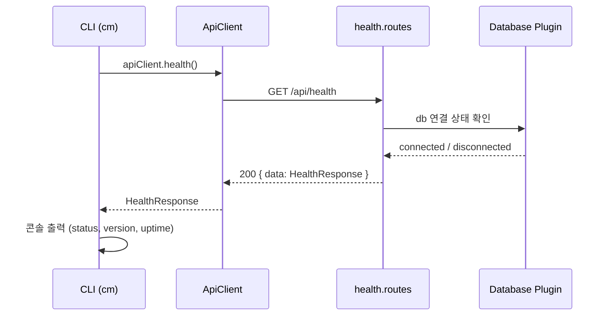

| 레이어 | 함수 | 입력 | 출력 | 데이터 변환 |
|--------|------|------|------|-----------|
| CLI | `healthCommand()` | (없음) | 콘솔 출력 | HealthResponse → 포맷팅 문자열 |
| ApiClient | `apiClient.health()` | (없음) | `HealthResponse` | HTTP 응답 → JSON 파싱 → data 추출 |
| Route | `healthRoutes(fastify)` | `Request` | `200: ApiResponse<HealthResponse>` | DB 상태 + process.uptime() + package.version 조합 |

```typescript
interface HealthResponse {
  status: "ok";
  version: string;      // ← package.json version
  uptime: number;       // ← process.uptime() (초)
  database: "connected" | "disconnected";
}

async function healthHandler(request, reply) {
  const dbStatus = tryDbPing(fastify.db);
  return {
    data: {
      status: "ok",
      version: fastify.config.version,
      uptime: Math.floor(process.uptime()),
      database: dbStatus ? "connected" : "disconnected"
    }
  };
}
```

---

## 2. 인증 로그인 (FR-002)

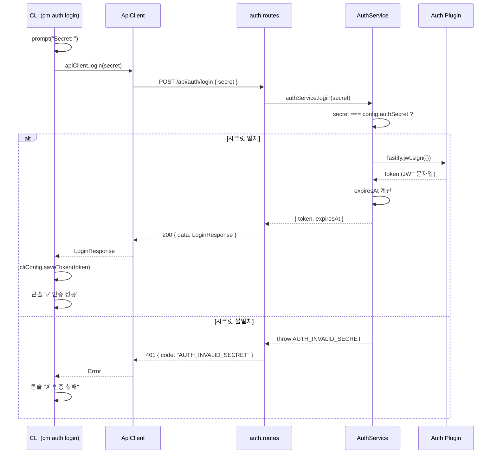

| 레이어 | 함수 | 입력 | 출력 | 데이터 변환 |
|--------|------|------|------|-----------|
| CLI | `authLoginCommand()` | 터미널 입력 (secret) | 콘솔 출력 + 토큰 저장 | LoginResponse → `~/.claude-manager/config.json` |
| ApiClient | `apiClient.login(secret)` | `string` | `LoginResponse` | `{secret}` → POST body → 응답 data 추출 |
| Route | `POST /api/auth/login` | `{body: {secret: string}}` | `200: ApiResponse<LoginResponse>` | JSON Schema 검증 → Service 위임 |
| Service | `authService.login(secret)` | `string` | `LoginResponse` | 시크릿 비교 → JWT 생성 → 만료일 계산 |
| Auth Plugin | `fastify.jwt.sign(payload)` | `{}` | `string` (JWT) | payload + secret → JWT 토큰 |

```typescript
interface LoginRequest {
  secret: string;
}

interface LoginResponse {
  token: string;            // ← fastify.jwt.sign({})
  expiresAt: string;        // ← ISO 8601
}

function login(secret: string): LoginResponse {
  if (secret !== config.authSecret) {
    throw new AppError(401, "AUTH_INVALID_SECRET", "시크릿이 올바르지 않습니다");
  }
  const token = fastify.jwt.sign({}, { expiresIn: config.jwtExpiresIn });
  const decoded = fastify.jwt.decode(token);
  return { token, expiresAt: new Date(decoded.exp * 1000).toISOString() };
}
```

---

## 3. 프로젝트 생성 (FR-003)

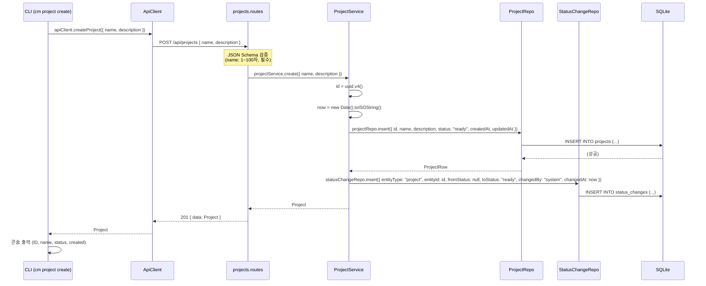

| 레이어 | 함수 | 입력 | 출력 | 데이터 변환 |
|--------|------|------|------|-----------|
| CLI | `projectCreateCommand(opts)` | `--name`, `--description` | 콘솔 출력 | CLI 옵션 → CreateProjectInput → Project 포맷팅 |
| ApiClient | `apiClient.createProject(input)` | `CreateProjectInput` | `Project` | input → POST body, 응답 data 추출 |
| Route | `POST /api/projects` | `{body: CreateProjectInput}` | `201: ApiResponse<Project>` | JSON Schema 검증 → Service 위임 → 응답 래핑 |
| Service | `projectService.create(input)` | `CreateProjectInput` | `Project` | UUID + 타임스탬프 + 기본값 조합 → Repo 저장 + 이력 기록 |
| Repository | `projectRepo.insert(row)` | `ProjectInsert` | `ProjectRow` | Drizzle insert → returning |
| StatusChange Repo | `statusChangeRepo.insert(row)` | `StatusChangeInsert` | `void` | Drizzle insert |

```typescript
interface CreateProjectInput {
  name: string;             // ← --name (필수)
  description?: string;     // ← --description (선택, 기본값 "")
}

interface ProjectInsert {
  id: string;               // ← uuid.v4()
  name: string;
  description: string;      // ← input.description ?? ""
  status: "ready";          // ← 고정값
  createdAt: string;        // ← ISO 8601
  updatedAt: string;
}

interface Project {
  id: string;
  name: string;
  description: string;
  status: ProjectStatus;
  createdAt: string;
  updatedAt: string;
}

// 부수효과: status_changes 기록
interface StatusChangeInsert {
  entityType: EntityType;   // 6종 — DES-003 v2.1 §3-5
  entityId: string;         // ← project.id
  fromStatus: string | null;  // ← null (최초 생성 — 이전 상태가 없다)
  toStatus: "ready";
  changedBy: "system";
  changedAt: string;        // ← project.createdAt 동일
}
```

---

## 4. 프로젝트 목록 조회 (FR-004)

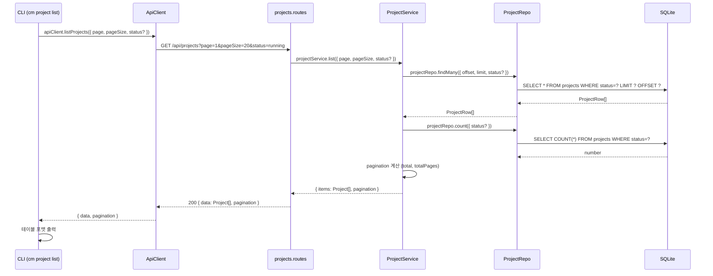

```typescript
interface ListProjectsOpts {
  page?: number;            // ← 기본값 1
  pageSize?: number;        // ← 기본값 20
  status?: ProjectStatus;   // ← 선택 필터
}

// Service 계산
// offset = (page - 1) * pageSize
// totalPages = Math.ceil(total / pageSize)

// Repository 쿼리
// status가 있으면 WHERE status = :status
// ORDER BY created_at DESC
// LIMIT :pageSize OFFSET :offset
```

---

## 5. 프로젝트 상세 조회 (FR-005)

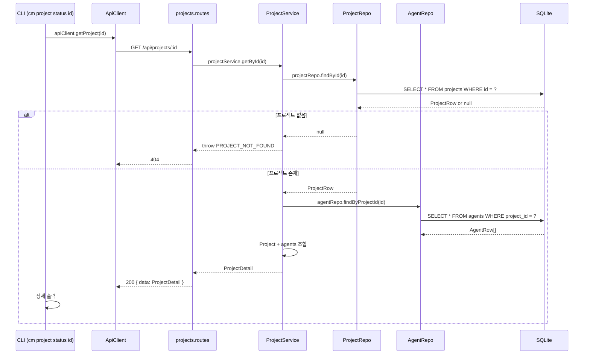

```typescript
interface ProjectDetail extends Project {
  agents: Agent[];
}

interface Agent {
  id: string;
  projectId: string;
  name: string;
  type: string;
  status: AgentStatus;
  skill: string;
  config: object;           // ← JSON.parse(agents.config)
  retryCount: number;
  createdAt: string;
  updatedAt: string;
}
```

---

## 6. 프로젝트 상태 변경 (FR-006) — **v2.5 개정 (D-1 B안 · REV-M-01 해소)**

> **⚠ FIND-01 정정.** v2.4까지는 `S->>PR: agentRepo.updateStatus(...)`를 `ProjectService` 내부 `cascadeToAgents()`가 직접 호출했다 — Agent까지만 전이시키고 **Task로는 전파하지 않았다**(DES-007 §8이 "각 Agent 캐스케이드는 다시 해당 Agent의 Task로 전파"를 규정하는데도). 원인은 `cascadeToAgents()`가 `AgentService`를 거치지 않고 `AgentRepository`에 직접 상태 전이를 써서, Agent 상태 변경 시 함께 실행되어야 할 `cascadeToTasks()`(§8)를 타지 않았기 때문이다 — 이는 **레이어 규칙 10의 금지 조항**("상태 전이·검증이 붙은 쓰기는 예외 대상이 아니다")도 위반한다(REV-M-01).
> **B안으로 해소한다**: 이제 `Route`가 `db.transaction()` 안에서 `ProjectService.updateStatusSync()` → `AgentService.cascadeFromProjectSync()`를 순서대로 호출한다. `cascadeFromProjectSync()`는 `projectId`를 받아 내부에서 `agentRepo.findActiveByProjectId()`로 캐스케이드 대상을 직접 조회하고 루프를 돌며, 각 Agent에 대해 §8의 Task 캐스케이드를 재사용한다 — R2-02(v2.7) 이후 그 진입점은 `taskService.cascadeStatusSync()`다(구현 정합 확인: 커밋 `3700f2b`·`8e47972`). Task 캐스케이드 로직을 새로 만들지 않는다 — Agent 상태 변경이 정식 경로(`AgentService`)를 타는 순간 이미 있던 로직이 자연히 실행된다.
> **⚠ FIND-06 추가 반영(2026-09-03, test 9단계 수정 루프 2차).** v2.5 최초 반영 시점에는 채널 readonly 전이를 "범위 밖"으로 남겼으나(§6 하단 옛 노트 — 이력은 아래 각주로 보존), 이후 별도로 FIND-06이 발견되어 대표 결정으로 이번 개정에 함께 해소했다. `cascadeFromProjectSync()`가 `targetStatus === AgentStatus.CANCELLED`일 때만 `conversationService.markReadonlySync(agent.id)`를 호출한다(`agent.service.ts:391-393`, 구현 정합 확인: 커밋 `9b03a07`) — **`paused`는 호출하지 않는다.** paused는 재개 가능한 종료 아닌 상태이므로 DES-007 §8("완료·취소 시에만 readonly")과 일치한다.

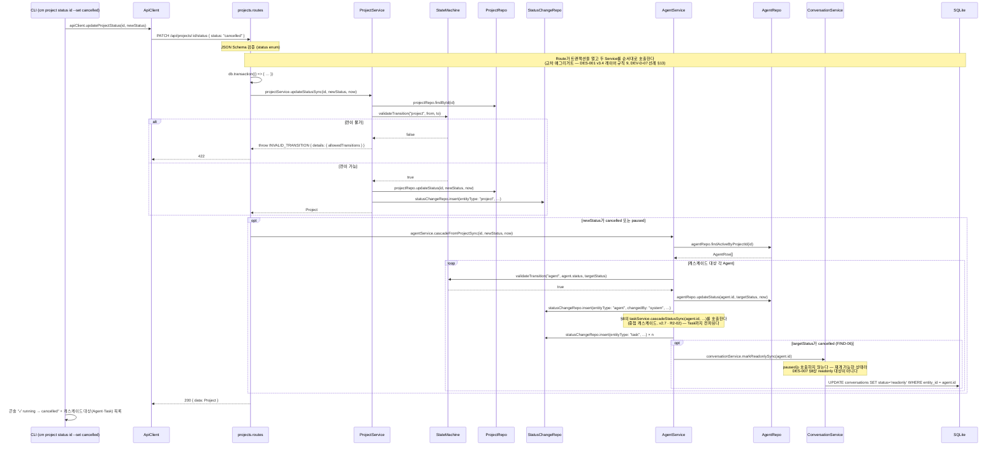

| 레이어 | 함수 | 입력 | 출력 | 데이터 변환 |
|--------|------|------|------|-----------|
| CLI | `projectStatusCommand(id, opts)` | `id`, `--set <status>` | 콘솔 출력 | `--set` 없으면 조회, 있으면 변경 |
| ApiClient | `apiClient.updateProjectStatus(id, status)` | `string, ProjectStatus` | `Project` | PATCH body 구성 → 응답 data 추출 |
| Route | `PATCH /api/projects/:id/status` | `{params:{id}, body:{status}}` | `200: ApiResponse<Project>` | Schema 검증 → **트랜잭션 조율**(v2.5) → 응답 래핑 |
| Service | `projectService.updateStatusSync(id, newStatus, now)` | `string, ProjectStatus, string` | `Project` | 현재 상태 조회 → 전이 검증 → 업데이트 → 이력. **`Project`만 반환한다**(v2.5·구현 정합 확인: 커밋 `3700f2b`) — 캐스케이드 대상 조회·반환은 하지 않는다 |
| Service | `agentService.cascadeFromProjectSync(projectId, projectNewStatus, now)` | `string, 'cancelled' \| 'paused', string` | `void` | `agentRepo.findActiveByProjectId()`로 캐스케이드 대상을 직접 조회해 루프를 돈다. 각 Agent에 대해 전이 가드 → `agentRepo.updateStatus` → `statusChangeRepo.insert(changedBy:'system')` → §8의 `taskService.cascadeStatusSync()` 호출(중첩 캐스케이드, v2.7 · R2-02) → **`targetStatus === 'cancelled'`일 때만** `conversationService.markReadonlySync(agent.id)` 호출(FIND-06 해소, `agent.service.ts:391-393`)(구현 정합 확인: 커밋 `3700f2b`·`9b03a07`) |
| Service | `conversationService.markReadonlySync(agentId)` | `string` | `void` | **동기 코어**(v2.5·FIND-06 신설). `conversationRepo.findByEntityId(agentId)` → 없으면 조용히 반환(방어적) → 있으면 `updateStatus(conv.id, 'readonly')`. `markReadonly()`(기존 async 공개 API)는 이 동기 코어를 감싸는 얇은 래퍼로 축소됐다(`createForAgentSync` 선례와 동일 패턴, `conversation.service.ts:449·462`) |
| StateMachine | `validateTransition(entityType, from, to)` | `EntityType, string, string` | `boolean` | `PROJECT_TRANSITIONS[from].includes(to)` |
| Repository | `projectRepo.updateStatus(id, status, updatedAt)` | `string, string, string` | `ProjectRow` | Drizzle update + returning |

```typescript
// ⚠ allowedTransitions는 에러 응답의 details 필드로 나간다 (v2.3 · 2026-09-02).
// DES-009 v3.2가 4필드 고정에 선택 필드 details를 추가한 근거가 이 전달이다 —
// DES-006 SCR-P04의 "허용 목록 출력"을 한국어 message 파싱 없이 하기 위해서다.

// StateMachine — 순수 함수 (외부 의존 없음)
function validateTransition(
  entityType: EntityType,
  fromStatus: string,
  toStatus: string
): boolean {
  const transitions = TRANSITION_MAP[entityType];  // ← state-transitions.ts
  return transitions[fromStatus]?.includes(toStatus) ?? false;
}

function getAllowedTransitions(entityType: EntityType, fromStatus: string): string[] {
  return TRANSITION_MAP[entityType][fromStatus] ?? [];
}

// projects.routes.ts — PATCH /api/projects/:id/status (v2.5 · D-1 B안 · 구현 정합 확인: 커밋 3700f2b)
// Route가 db.transaction() 콜백 안에서 두 Service의 동기 코어를 순서대로 호출한다. 두 번의 호출뿐,
// Agent 목록을 순회하지 않는다 — 순회는 agentService.cascadeFromProjectSync() 내부에서 일어난다.
// (DES-004 §13 agents.routes.ts DELETE 핸들러와 같은 패턴 · DES-001 레이어 규칙 9)
const project = app.db.transaction((): Project => {
  const updated = service.updateStatusSync(id, newStatus, now);

  if (newStatus === ProjectStatus.CANCELLED || newStatus === ProjectStatus.PAUSED) {
    // cascadeFromProjectSync()가 내부에서 agentRepo.findActiveByProjectId()로
    // 캐스케이드 대상을 직접 조회하고 루프를 돈다. taskService.cascadeStatusSync()가 실행된다 (§8)
    agentService.cascadeFromProjectSync(id, newStatus, now);
  }

  return updated;
})();

// Service — 캐스케이드 규칙 (실행 위치만 이동, FIND-06으로 채널 규칙 1건 추가)
// Project → Cancelled: 소속 활성 Agent 일괄 Cancelled (+ 각 Agent 채널 readonly, FIND-06)
// Project → Paused:    소속 활성 Agent 일괄 Paused (채널은 그대로 — 재개 가능한 상태이므로 readonly 아님)
// 각 Agent 캐스케이드는 다시 해당 Agent의 Task로 전파 (§8 taskService.cascadeStatusSync)

// agent.service.ts — cascadeFromProjectSync() 내부 (FIND-06 · 구현 정합 확인: 커밋 9b03a07)
// db.transaction() 콜백 안이므로 async를 쓸 수 없다 — markReadonlySync()가 동기 코어인 이유다.
for (const agent of candidates) {
  if (!validateTransition('agent', agent.status, targetStatus)) continue;
  agentRepo.updateStatus(agent.id, targetStatus, null, now);
  statusChangeRepo.insert({ entityType: 'agent', entityId: agent.id, /* … */ });
  taskService.cascadeStatusSync(agent.id, targetStatus, now);  // §8 · v2.7 R2-02

  if (targetStatus === AgentStatus.CANCELLED) {           // ← paused는 대상 아님
    conversationService.markReadonlySync(agent.id);        // FIND-06
  }
}
```

> **경위 — v2.5 최초 반영 시점엔 "범위 밖"이었다 (이력 보존).** D-1 B안을 처음 반영한 시점(2026-09-03 오전)에는 다음과 같이 적었다: *"§8의 `updateStatus()`는 `completed`·`cancelled` 전이 시 `conversationService.markReadonly()`를 `await`한다. 캐스케이드 경로의 동기 코어(`updateStatusSync`)는 이 부수효과를 수행하지 않는다 — FIND-01이 지적한 결함은 Task 전파 누락이지 채널 상태가 아니었다."* 이는 **당시 사실관계로는 맞았다** — FIND-01의 지적 범위가 Task 캐스케이드였을 뿐, 채널 상태를 검토 대상으로 삼지 않았다.
> **그런데 이 "범위 밖" 처리 자체가 새 결함이었다.** 같은 `agent.status = cancelled`인데 도달 경로에 따라 채널 상태가 갈리는 상태가 남았다 — `PATCH /api/agents/:id/status` 직접 호출은 채널을 readonly로 전환하지만, Project 취소 캐스케이드 경로는 채널을 쓰기 가능 상태로 방치했다. DES-007 §8이 채널 전이를 **Agent 상태 기준**으로 규정하므로 이는 위반이었다(FIND-06, FIND-01과 같은 성격 — 캐스케이드 경로가 정식 경로의 부수효과를 건너뜀). 대표 결정으로 **같은 test 9단계 수정 루프 2차 안에서** 즉시 해소했다 — `ConversationService.markReadonlySync()` 동기 코어를 추출하고(`createForAgentSync()` 선례와 동일 패턴), `cascadeFromProjectSync()`가 `targetStatus === 'cancelled'`일 때만 이를 직접 호출한다. `paused`는 재개 가능한 상태라 호출 대상이 아니다(DES-007 §8과 일치, 코드로 확인: `agent.service.ts:389-393`). Agent를 **직접** `PATCH /api/agents/:id/status`로 `completed`·`cancelled` 전환하는 기존 경로는 이 변경의 영향을 받지 않고 §8 그대로 동작한다.

---

## 7. Agent 생성 (FR-007)

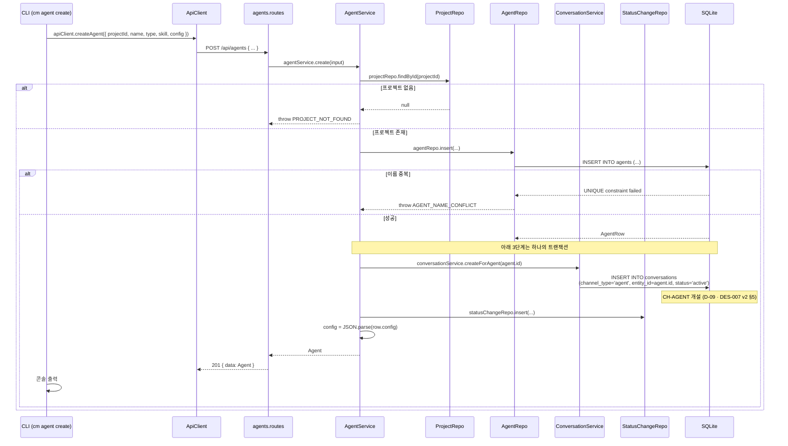

> **Agent 생성은 채널 개설을 동반한다 (v2.1 보완).** DES-001 v3가 `AgentService → ConversationService` 의존을 추가한 근거가 이것인데, v2 시퀀스는 §13(삭제)만 개정하고 생성 경로를 v1 상태로 두어 `createForAgent()`가 **어느 시퀀스에서도 호출되지 않는 상태**였다.
> 트랜잭션으로 묶는다. Agent만 만들어지고 채널이 없으면 `cm chat agent <id>`가 빈 채널을 만나 실패한다.

```typescript
interface CreateAgentInput {
  projectId: string;        // ← --project (필수)
  name: string;             // ← --name (필수)
  type?: string;            // ← --type (선택, 기본값 "")
  skill?: string;           // ← --skill (선택, 기본값 "")
  config?: object;          // ← Phase 1 미사용, 기본값 {}
}

interface AgentInsert {
  id: string;               // ← uuid.v4()
  projectId: string;
  name: string;
  type: string;
  status: "created";        // ← 고정값
  skill: string;
  config: string;           // ← JSON.stringify()  ← DB는 TEXT
  retryCount: 0;
  createdAt: string;
  updatedAt: string;
}
```

> **중요**: `config`는 DB에 TEXT(JSON 문자열)로 저장하고 API 응답에서는 object로 반환한다. Service가 insert 시 `JSON.stringify()`, 조회 시 `JSON.parse()`를 수행한다.

---

## 8. Agent 상태 변경 (FR-007)

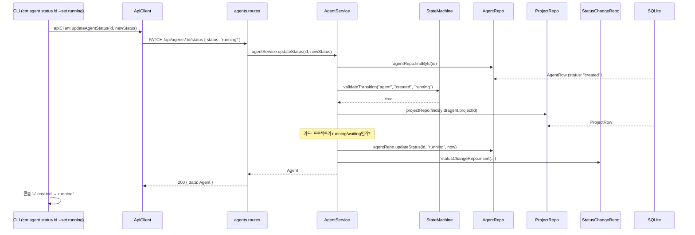

| 레이어 | 함수 | 핵심 로직 |
|--------|------|----------|
| Service | `agentService.updateStatus(id, newStatus)` | ① findById ② validateTransition ③ 가드 체크 ④ updateStatus ⑤ 이력 기록 ⑥ 캐스케이드 ⑦ **채널 전이** (v2.1) |
| StateMachine | `validateTransition("agent", from, to)` | `AGENT_TRANSITIONS[from].includes(to)` |

```typescript
// Agent 시작 시 프로젝트 활성 상태 체크
function checkParentActive(agent: AgentRow, project: ProjectRow): void {
  if (agent.status === "created" /* → running 전이 시 */) {
    const activeStatuses = ["running", "waiting"];
    if (!activeStatuses.includes(project.status)) {
      throw new AppError(422, "PARENT_NOT_ACTIVE",
        `프로젝트가 활성 상태가 아닙니다 (현재: ${project.status})`
      );
    }
  }
}

// 캐스케이드 규칙
// Agent → Cancelled: 소속 활성 Task 일괄 Cancelled
// Agent → Paused:    소속 활성 Task 일괄 Paused

// 채널 전이 (v2.1 보완) — DES-007 v2 §8 엔티티 간 상태 연동
// Agent → Completed / Cancelled: CH-AGENT를 readonly로 전환 (삭제하지 않는다 — 감사 추적)
async function syncConversationOnStatus(agentId: string, newStatus: AgentStatus) {
  if (newStatus === "completed" || newStatus === "cancelled") {
    await conversationService.markReadonly(agentId);
  }
}
// ⑤ 이력 기록과 같은 트랜잭션. 커밋 후 WS 브로드캐스트 (DES-001 §Cross-Cutting)
```

> **`markReadonly()`도 v2까지 호출 지점이 없었다 (v2.1 보완).** DES-007 v2 §8이 "Agent → Completed/Cancelled ⇒ CH-AGENT `readonly`"를 규정했으나, 그 전이를 일으키는 시퀀스가 이 문서에 없어 **`readonly` 상태에 도달할 경로가 존재하지 않았다.**

---

## 9. Task 생성 (FR-008)

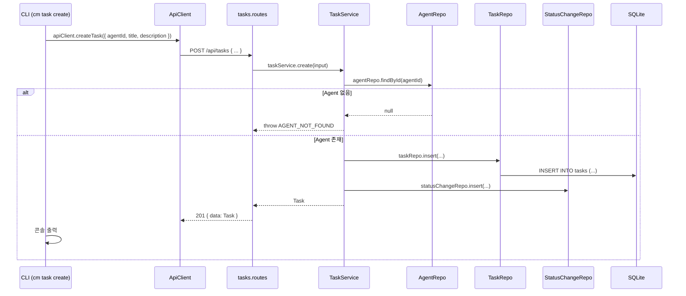

```typescript
interface CreateTaskInput {
  agentId: string;          // ← --agent (필수)
  title: string;            // ← --title (필수, 1~200자)
  description?: string;     // ← --description (선택, 기본값 "")
}

interface TaskInsert {
  id: string;               // ← uuid.v4()
  agentId: string;
  title: string;
  description: string;
  status: "ready";          // ← 고정값
  createdAt: string;
  updatedAt: string;
}

interface Task {
  id: string;
  agentId: string;
  title: string;
  description: string;
  status: TaskStatus;
  createdAt: string;
  updatedAt: string;
}
```

---

## 10. Task 상태 변경 (FR-008)

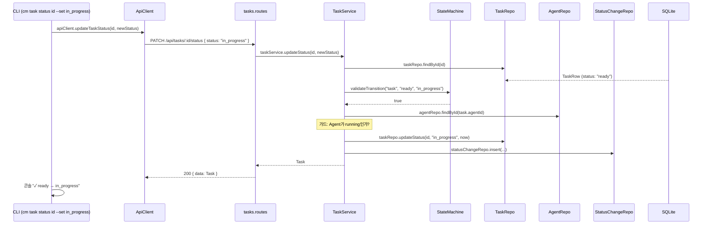

```typescript
// Task 시작 시 Agent 활성 상태 체크
function checkParentActive(task: TaskRow, agent: AgentRow): void {
  if (task.status === "ready" /* → in_progress 전이 시 */) {
    if (agent.status !== "running") {
      throw new AppError(422, "PARENT_NOT_ACTIVE",
        `Agent가 활성 상태가 아닙니다 (현재: ${agent.status})`
      );
    }
  }
}
```

---

## 11. Task 목록 조회 (FR-008)

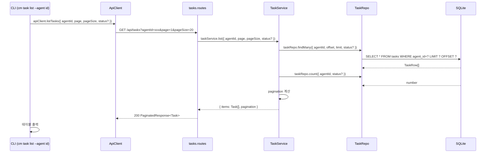

---

## 12. 상태 변경 이력 조회 (FR-009)

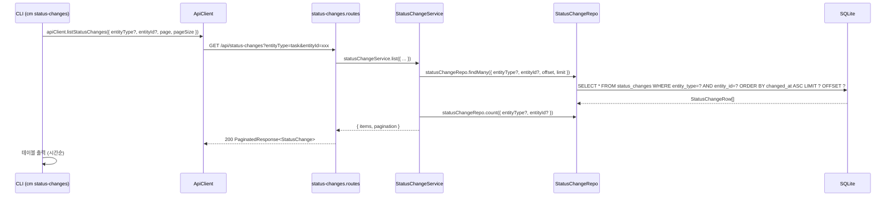

```typescript
interface ListStatusChangesOpts {
  entityType?: EntityType;  // ← --entity-type
  entityId?: string;        // ← --entity-id
  page?: number;            // ← 기본값 1
  pageSize?: number;        // ← 기본값 20
}

interface StatusChange {
  id: number;               // ← AUTOINCREMENT PK
  entityType: EntityType;   // 6종 — project·agent·task·conversation·approval·stage
  entityId: string;         // ← UUID
  fromStatus: string | null;  // ← 최초 생성 시 null (DES-003 v2.1 §3-5)
  toStatus: string;
  changedBy: string;        // ← "user" | "system"
  changedAt: string;        // ← ISO 8601
}

// 정렬: changed_at ASC (시간순)
```

---

## 13. Agent 삭제 (FR-007) — **v2 개정 (D-27)**

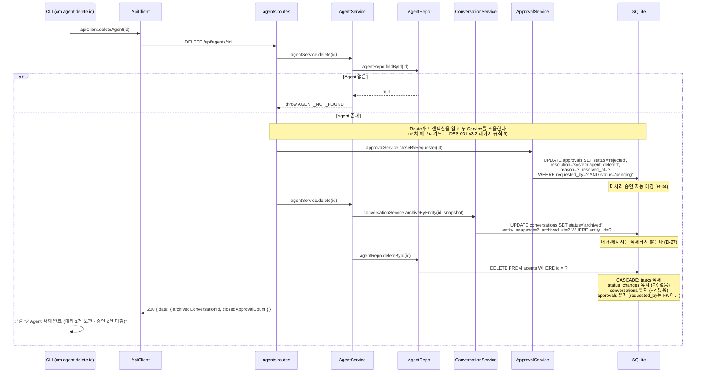

**v1과의 차이**: v1은 대화를 CASCADE 삭제했다. v2는 **삭제 전에 스냅샷을 남기고 아카이브로 전환**한다.

```typescript
// 삭제 직전에 만든다 — Agent 행이 사라지면 이름을 얻을 수 없다
const snapshot: EntitySnapshot = {
  agentName:   agent.name,
  projectName: project.name,
  agentType:   agent.type,
};
```

> **순서가 중요하다.** `agents` 행을 먼저 지우면 스냅샷을 만들 수 없다. 아카이브 → 삭제 순서를 반드시 지킨다.

> **⚠ 승인 마감을 `AgentService`가 호출하지 않는 이유 (v2.1 · R-02/R-04)**
> `ApprovalService → AgentService` 의존이 이미 있다(승인 처리 시 Agent 상태 전이 — DES-001 v3.2). 여기서 `AgentService → ApprovalService`를 추가하면 **양방향 순환**이 되어 R-02가 전제한 무순환이 깨진다.
> **교차 애그리거트 정리는 Route 핸들러가 트랜잭션 하나로 조율한다.** better-sqlite3는 동기식이라 `db.transaction(fn)`으로 두 Service 호출을 한 트랜잭션에 묶을 수 있다. 승인 마감이 먼저다 — `agents` 행이 사라진 뒤에는 `requested_by`로 대상을 특정하는 것이 의미상 애매해진다.

```typescript
// agents.routes.ts — DELETE /api/agents/:id
const result = db.transaction(() => {
  const closedApprovalCount = approvalService.closeByRequester(id);
  const { archivedConversationId } = agentService.delete(id);
  return { archivedConversationId, closedApprovalCount };
})();
```

---

## 14. 대화 송수신 (FR-026 · FR-027) — **v2 신규**

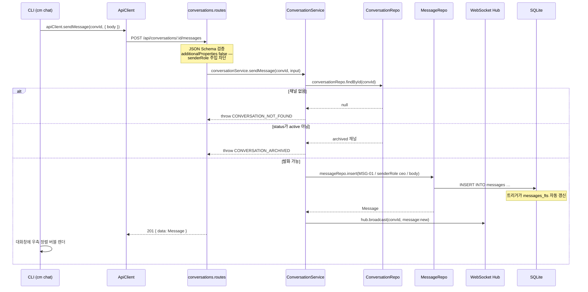

**메시지 조회 (커서 페이지네이션)**

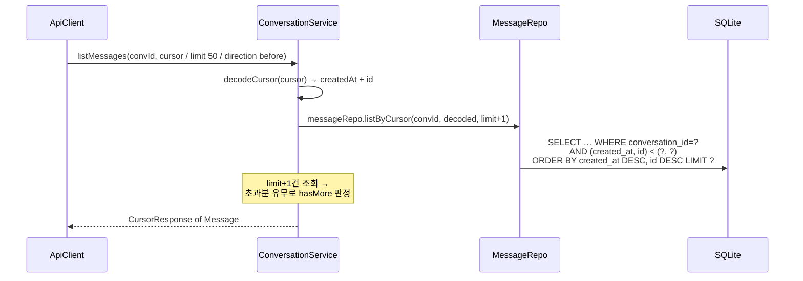

> `limit + 1`건을 조회해 **초과분이 있으면 `hasMore: true`**로 판정한다. 별도 COUNT 쿼리를 돌리지 않는다.

---

## 14-1. 읽음 처리 (FR-027) — **v2.5 신규 (D-2 A안 · FIND-02 해소)**

> **⚠ 정정.** `ConversationService.markRead()`는 v2.4부터 시그니처가 있었으나(§공통 타입 정의 아래 전체 함수 시그니처 요약) **호출하는 시퀀스·라우트가 없었다.** `last_read_at`이 갱신되지 않아 `unreadCount`가 영원히 줄지 않는 상태였다(FIND-02, 2026-09-03 test 스킬 리뷰 · 런타임 재현 확정). DES-002 v2.5 `PATCH /api/conversations/:id/read`가 이 호출 경로다.

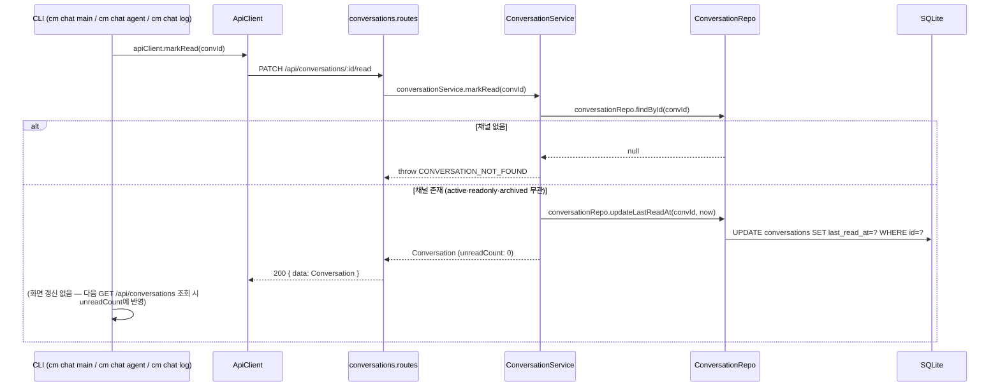

| 레이어 | 함수 | 입력 | 출력 | 데이터 변환 |
|--------|------|------|------|-----------|
| CLI | `chatMainCommand()` / `chatAgentCommand(id)` / `chatLogCommand(id)` | 채널 진입·조회 시 자동 호출 | (부수 호출, 별도 출력 없음) | 메시지 로딩 직후 read 호출 — 실패해도 화면 출력은 계속한다 |
| ApiClient | `apiClient.markRead(convId)` | `string` | `Conversation` | PATCH 요청(본문 없음) → 응답 data 추출 |
| Route | `PATCH /api/conversations/:id/read` | `{params:{id}}` | `200: ApiResponse<Conversation>` | Schema 검증(params만) → Service 위임 |
| Service | `conversationService.markRead(id)` | `string` | `Conversation` | 존재 검증 → `last_read_at` 갱신 → `unreadCount` 파생 재계산(0) |
| Repository | `conversationRepo.updateLastReadAt(id, now)` | `string, string` | `ConversationRow` | Drizzle update + returning |

> **`archived`·`readonly` 채널도 호출 대상이다.** 읽음 처리는 발화가 아니라 열람 기록이므로 `CONVERSATION_ARCHIVED`를 던지지 않는다(DES-007 §5 상태별 허용 표에서 "조회"는 3개 상태 전부 허용).
> **CLI가 실패를 삼킨다.** `markRead()` 호출이 실패해도(네트워크 순간 단절 등) 메시지 조회·출력 자체는 그대로 진행한다 — 읽음 표시는 부가 기능이지 대화 조회의 필수 조건이 아니다.

---

## 15. 의사결정 요청·응답 (FR-028) — **v2 신규**

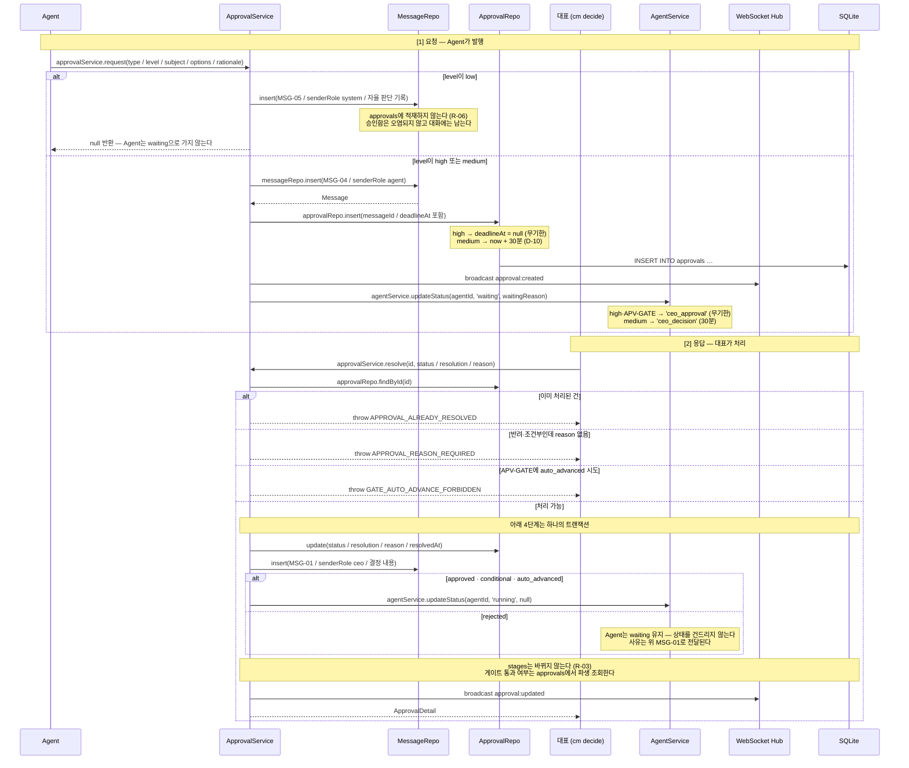

> **대표의 결정은 반드시 `MSG-01`로 대화에 남는다.** 승인함에서 눌렀든 CLI로 처리했든 동일하다. "무엇을 언제 승인했는지"가 대화 기록에서 사라지면 안 된다.

---

## 16. 단계 착수 — 승인 게이트 검증 (FR-030) — **v2 신규**

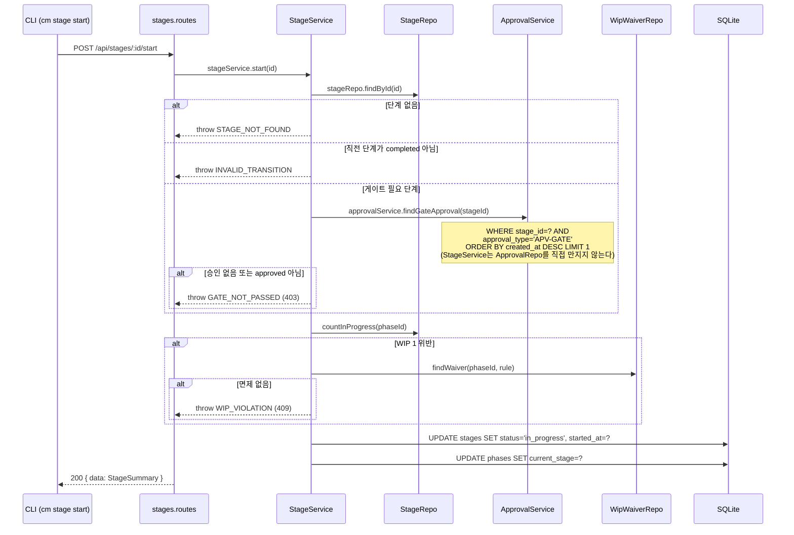

> **이 시퀀스가 CLAUDE.md 스킬 전환 게이트의 유일한 강제 지점이다.**
> 화면에서 버튼을 감추는 것으로는 강제되지 않는다. CLI·API 직접 호출도 같은 경로를 지나므로 여기서 막는다.
> `gate.required`는 저장하지 않고 스킬 전환 모드에서 파생한다 — `plan→analyze`, `test→deploy`만 `true`.

---

## 17. 타임아웃 자동 진행 (D-10) — **v2 신규**

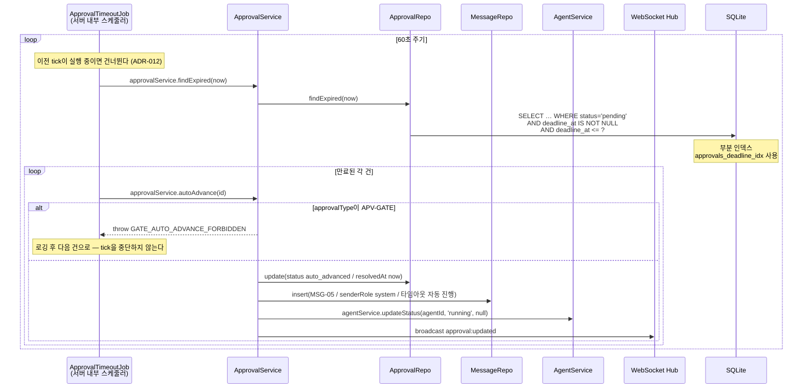

> **Job은 Repository를 직접 만지지 않는다** (DES-001 §레이어 규칙 7). v2는 `T→ApprovalRepo`로 그려 규칙을 어겼다. 전건 `ApprovalService`를 경유해 등급 검사·`MSG-05` 기록·Agent 재개가 한 곳에서 일어나게 한다 (v2.1 정정).

**핵심 규칙**

| 항목 | 값 | 근거 |
|------|-----|------|
| 실행 주기 | 60초 | 30분 타임아웃에 충분한 해상도 |
| 대상 | `status='pending'` AND `deadline_at <= now` | `high`는 `deadline_at`이 NULL이라 자동 제외 |
| **`APV-GATE` 제외** | **이중 방어** — ① `APV-GATE`는 등급 `high` 고정이라 `deadline_at`이 NULL이므로 위 조회 조건에 애초에 잡히지 않는다 ② 그럼에도 잡 내부에서 유형을 한 번 더 검사한다 | DES-014 §3-2 · DES-003 v2 CHECK (2)(4) |
| 기록 | `MSG-05` 시스템 이벤트 | 자동 진행이 대화에 보여야 한다 |

> **✅ 배치 위치 확정 (DES-001 v3 ADR-012)**: **Fastify 프로세스 내부 `setInterval` 타이머**. 서버 `ready` 훅에서 `start()`, Graceful Shutdown에서 가장 먼저 `stop()`. 별도 워커안은 SQLite 단일 쓰기자 전제와 충돌해 기각되었다.
> 이전 tick이 끝나지 않았으면 건너뛰고, tick 내부 예외는 로깅 후 삼켜 서버를 죽이지 않는다.

---

## 18. 서버 기동 부트스트랩 (FR-026 · FR-029) — **v2.1 신규 (R-01)**

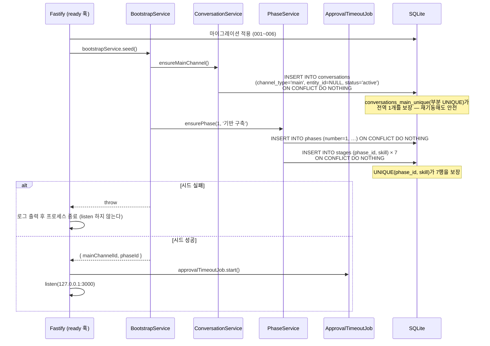

**왜 필요한가**

| 없으면 깨지는 것 | 근거 |
|-----------------|------|
| `cm chat main` (SCR-CH01) | CH-MAIN 채널이 없어 대화 자체가 불가 |
| `cm progress` (SCR-CH06) | `GET /api/phases/current`가 `404 NOT_FOUND` |
| `cm stage start` (SCR-CH09) | 착수할 `stages` 행이 없어 `STAGE_NOT_FOUND` |

**핵심 규칙**

| 항목 | 값 | 근거 |
|------|-----|------|
| 실행 시점 | 마이그레이션 **이후**, 잡 시작·`listen` **이전** | 시드 대상 테이블이 마이그레이션으로 생성된다 |
| 멱등성 | `ON CONFLICT DO NOTHING` × 3 | 유니크 제약 3종이 이미 존재 (DES-003 v2 §5) |
| 실패 시 | **기동 중단** | 반쪽으로 도는 서버보다 즉시 드러나는 편이 낫다 |
| Phase 2 이후 | 시드 대상 아님 — `POST /api/phases` | Phase는 계속 늘어난다 |

> **`BootstrapService`도 Service만 호출한다** (DES-001 §레이어 규칙 7). Repository를 직접 만지면 "CH-MAIN은 전역 1개" · "Phase당 7단계" 같은 비즈니스 규칙을 시드가 우회하게 된다.

---

## 19. 산출물 등록 (FR-031) — **v2.5 신규 (D-3 · REV-M-06 해소)**

> **⚠ 설계 공백 정정 (코드 결함 아님).** `ArtifactService.upsert()`는 Layer 2(Service)에서 이미 구현됐으나(`artifact.service.ts:159`) **호출자가 0건**이었다. `artifacts` 테이블에 행을 만드는 경로가 어느 설계 문서에도 없어(DES-002는 GET 2종만, DES-006은 조회 화면 1개만 정의) FR-031(산출물 동기화 추적) 전체가 도달 불가능했다(REV-M-06). DES-002 v2.6 `POST /api/artifacts`가 이 호출 경로다.

```mermaid
sequenceDiagram
    participant CLI as CLI (cm artifacts add)
    participant AC as ApiClient
    participant R as artifacts.routes
    participant S as ArtifactService
    participant AR as ArtifactRepo
    participant DB as SQLite

    CLI->>AC: apiClient.upsertArtifact({ stageId, code, title, notionUrl?, gitPath? })
    AC->>R: POST /api/artifacts { ... }
    Note over R: JSON Schema 검증 (code·title·stageId 필수)
    R->>S: artifactService.upsert(input)
    S->>AR: artifactRepo.findByStageId(input.stageId)
    alt stageId 없음
        AR-->>S: null
        S-->>R: throw STAGE_NOT_FOUND
    else stageId 존재
        S->>AR: artifactRepo.upsert({ id, stageId, code, title, notionUrl, gitPath, updatedAt })
        AR->>DB: INSERT INTO artifacts (...) VALUES (...)<br>ON CONFLICT(code) DO UPDATE SET<br>stage_id=?, title=?, notion_url=?, git_path=?, updated_at=?
        Note over DB: status는 SET 절에 없다 — 기존 값 유지<br>(신규 삽입 시에만 DEFAULT 'draft' 적용)
        DB-->>AR: ArtifactRow
        S->>S: syncStatus = deriveSyncStatus(notionUrl, gitPath)
        S-->>R: Artifact (syncStatus 포함)
        R-->>AC: 200 { data: Artifact }
        CLI->>CLI: 콘솔 "✓ 등록 완료" 또는 "✓ 갱신 완료" + 동기화 상태
    end
```

| 레이어 | 함수 | 입력 | 출력 | 데이터 변환 |
|--------|------|------|------|-----------|
| CLI | `artifactsAddCommand(opts)` | `--skill`, `--code`, `--title`, `--notion-url?`, `--git-path?` | 콘솔 출력 | CLI 옵션 → `resolveStageBySkill()`로 `--skill`을 stageId로 해석(클라이언트 측) → `UpsertArtifactInput` → 신규/갱신 판정해 출력 문구 분기 |
| ApiClient | `apiClient.upsertArtifact(input)` | `UpsertArtifactInput` | `Artifact` | POST body 구성 → 응답 data 추출 |
| Route | `POST /api/artifacts` | `{body: UpsertArtifactInput}` | `200: ApiResponse<Artifact>` | Schema 검증 → Service 위임 |
| Service | `artifactService.upsert(input)` | `UpsertArtifactInput` | `Artifact` | `stageId` 존재 검증 → Repo upsert 위임 → `syncStatus` 파생 |
| Repository | `artifactRepo.upsert(row)` | `ArtifactUpsertRow` | `ArtifactRow` | Drizzle `ON CONFLICT(code) DO UPDATE` — `status` 제외 |

```typescript
interface UpsertArtifactInput {
  stageId: string;                 // ← --skill (필수. CLI가 skill명을 stageId로 해석해 보낸다 — 서버는 stageId만 받는다)
  code: string;                    // ← --code (필수) — UNIQUE 기준
  title: string;                   // ← --title (필수)
  notionUrl?: string | null;       // ← --notion-url (선택)
  gitPath?: string | null;         // ← --git-path (선택)
}

// artifact.repository.ts:139 주석 그대로 —
// "code UNIQUE 기준 upsert. 신규면 status='draft'로 삽입하고, 기존 행이면
//  stage_id·title·notion_url·git_path·updated_at만 갱신한다 — status는
//  SET 절에 없으므로 기존 값이 그대로 유지된다(승인 흐름이 별도로 관리)"
```

> **`status`는 이 경로가 되돌리지 않는다.** upsert는 신규 삽입 시에만 `status='draft'`이고, 기존 행 갱신 시에는 `status`를 건드리지 않는다 — 재등록 한 번으로 `approved`가 `draft`로 돌아가면 승인 이력이 무의미해진다.
> **`syncStatus`는 여기서도 저장하지 않는다.** `notionUrl`·`gitPath` 유무에서 파생하는 원칙(DES-003 §4-4)은 조회(`GET /api/artifacts`)든 등록(`POST /api/artifacts`)이든 동일하게 적용된다.

---

## 전체 함수 시그니처 요약

### API Client (`src/cli/api-client.ts`)

```typescript
class ApiClient {
  constructor(serverUrl: string, token?: string)

  // Health
  health(): Promise<HealthResponse>

  // Auth
  login(secret: string): Promise<LoginResponse>

  // Project
  createProject(input: CreateProjectInput): Promise<Project>
  listProjects(opts?: ListProjectsOpts): Promise<PaginatedResponse<Project>>
  getProject(id: string): Promise<ProjectDetail>
  updateProjectStatus(id: string, status: ProjectStatus): Promise<Project>

  // Agent
  createAgent(input: CreateAgentInput): Promise<Agent>
  listAgents(opts?: ListAgentsOpts): Promise<PaginatedResponse<Agent>>
  getAgent(id: string): Promise<AgentDetail>
  updateAgentStatus(id: string, status: AgentStatus): Promise<Agent>
  deleteAgent(id: string): Promise<void>

  // Task
  createTask(input: CreateTaskInput): Promise<Task>
  listTasks(opts?: ListTasksOpts): Promise<PaginatedResponse<Task>>
  getTask(id: string): Promise<Task>
  updateTaskStatus(id: string, status: TaskStatus): Promise<Task>

  // Status Changes
  listStatusChanges(opts?: ListStatusChangesOpts): Promise<PaginatedResponse<StatusChange>>
}
```

### Services (`src/backend/services/`)

```typescript
// auth.service.ts
class AuthService {
  login(secret: string): LoginResponse
}

// project.service.ts
class ProjectService {
  create(input: CreateProjectInput): Promise<Project>
  list(opts: PaginationOpts & { status?: ProjectStatus }): Promise<{ items: Project[]; pagination: Pagination }>
  getById(id: string): Promise<ProjectDetail>
  updateStatus(id: string, newStatus: ProjectStatus): Promise<Project>

  // 동기 코어 — 캐스케이드 트랜잭션 조율용 (v2.5 · D-1 B안 · §6, 구현 정합 확인: 커밋 3700f2b).
  // Project 상태만 갱신하고 Project만 반환한다 — 캐스케이드 대상 조회·실행은
  // Route가 이어서 호출하는 agentService.cascadeFromProjectSync()가 전담한다 (레이어 규칙 10)
  updateStatusSync(id: string, newStatus: ProjectStatus, now: string): Project
}

// agent.service.ts
class AgentService {
  create(input: CreateAgentInput): Promise<Agent>
  list(opts: PaginationOpts & { projectId?: string; status?: AgentStatus }): Promise<{ items: Agent[]; pagination: Pagination }>
  getById(id: string): Promise<AgentDetail>
  updateStatus(id: string, newStatus: AgentStatus): Promise<Agent>
  delete(id: string): Promise<void>

  // 캐스케이드 진입점 — 프로젝트 상태 변경 트랜잭션에서 Route가 호출 (v2.5 · D-1 B안 · §6, 구현 정합 확인: 커밋 3700f2b).
  // projectId를 받아 agentRepo.findActiveByProjectId()로 캐스케이드 대상을 직접 조회하고 루프를 돈다.
  // 각 Agent에 대해 전이 가드 → agentRepo.updateStatus → statusChangeRepo.insert(changedBy:'system')
  // → taskService.cascadeStatusSync()로 Task까지 전파한다(중첩 캐스케이드, v2.7 · R2-02).
  // targetStatus가 cancelled일 때만 conversationService.markReadonlySync()도 호출한다
  // (v2.6 · FIND-06 해소 — paused는 재개 가능한 상태라 채널을 readonly로 만들지 않는다)
  cascadeFromProjectSync(
    projectId: string,
    projectNewStatus: typeof ProjectStatus.CANCELLED | typeof ProjectStatus.PAUSED,
    now: string,
  ): void
}

// task.service.ts
class TaskService {
  create(input: CreateTaskInput): Promise<Task>
  list(opts: PaginationOpts & { agentId?: string; status?: TaskStatus }): Promise<{ items: Task[]; pagination: Pagination }>
  getById(id: string): Promise<Task>
  updateStatus(id: string, newStatus: TaskStatus): Promise<Task>
}

// status-change.service.ts
class StatusChangeService {
  record(input: StatusChangeInsert): Promise<void>
  list(opts: PaginationOpts & { entityType?: EntityType; entityId?: string }): Promise<{ items: StatusChange[]; pagination: Pagination }>
}
```

### Services — v2 신규 (`src/backend/services/`)

```typescript
// conversation.service.ts
class ConversationService {
  list(opts: ListConversationsOpts): Promise<Conversation[]>
  getById(id: string): Promise<Conversation>
  listMessages(convId: string, opts: ListMessagesOpts): Promise<CursorResponse<Message>>
  sendMessage(convId: string, input: SendMessageInput): Promise<Message>
  search(opts: SearchMessagesOpts): Promise<SearchResult[]>
  exportMarkdown(convId: string): Promise<string>

  // 시스템 발화 — Agent·Main·스케줄러가 쓴다
  appendSystemMessage(convId: string, msgType: MsgType, body: string,
                      structured?: StructuredReport): Promise<Message>

  // 채널 생명주기
  createForAgent(agentId: string): Promise<Conversation>
  markReadonly(agentId: string): Promise<void>                       // Agent 종료 시
  archiveByEntity(agentId: string, snapshot: EntitySnapshot): Promise<string>  // Agent 삭제 시 (D-27)
  ensureMainChannel(): Promise<Conversation>                         // 부트스트랩 — 멱등 (v2.1 · R-01)

  // 읽음 포인터를 지금으로 옮긴다 (v2.4 · DEV-D-05).
  // cm chat으로 채널을 열거나 대화를 조회할 때 호출한다.
  markRead(id: string): Promise<Conversation>
}

// approval.service.ts
class ApprovalService {
  request(input: {
    approvalType: ApprovalType; level: DecisionLevel; subject: string;
    options: ApprovalOption[]; artifacts?: string[];
    rationale?: string; impact?: ApprovalImpact;
    requestedBy: string; stageId?: string; conversationId: string;
  }): Promise<ApprovalDetail | null>          // level==='low'면 null

  list(opts: ListApprovalsOpts): Promise<ApprovalSummary[]>
  getById(id: string): Promise<ApprovalDetail>
  resolve(id: string, input: ResolveApprovalInput): Promise<ApprovalDetail>

  findGateApproval(stageId: string): Promise<ApprovalDetail | null>
  findExpired(now: string): Promise<ApprovalSummary[]>   // 스케줄러 전용
  autoAdvance(id: string): Promise<ApprovalDetail>       // 스케줄러 전용. APV-GATE 거부

  // Agent 삭제 시 미처리 승인 자동 마감 → 마감 건수 (v2.1 · R-04)
  // Route가 트랜잭션 안에서 agentService.delete()보다 먼저 호출한다
  closeByRequester(requestedBy: string): Promise<number>
}

// phase.service.ts
class PhaseService {
  getCurrent(): Promise<PhaseCurrent>
  checkWip(phaseId: string): Promise<WipViolation[]>     // 저장하지 않고 계산
  createWaiver(input: CreateWipWaiverInput): Promise<void>

  // Phase 행 + 7단계를 한 트랜잭션으로 생성 (v2.1 · R-01)
  create(input: { number: number; name: string }): Promise<PhaseCurrent>
  ensurePhase(number: number, name: string): Promise<string>   // 부트스트랩 — 멱등
}

// stage.service.ts
class StageService {
  start(id: string): Promise<StageSummary>               // 게이트 검증 — §16
  complete(id: string): Promise<StageSummary>
  isGateRequired(skill: SkillName): boolean              // 스킬 전환 모드에서 파생
}

// artifact.service.ts
class ArtifactService {
  list(opts: { stage?: string; syncStatus?: SyncStatus }): Promise<Artifact[]>
  getContent(id: string): Promise<string>
  upsert(input: {
    stageId: string; code: string; title: string;
    notionUrl?: string; gitPath?: string;
  }): Promise<Artifact>

  // syncStatus는 저장하지 않고 파생한다 (DES-003 v2 §4-4)
  private deriveSyncStatus(notionUrl: string | null, gitPath: string | null): SyncStatus
}
```

> **`markGatePassed()`를 제거했다 (v2.1 · R-03).** 쓸 것이 없는 함수였다 — `gate.passed`는 저장하지 않고 `approvals`에서 `stage_id + approval_type='APV-GATE'`로 파생 조회한다(DES-003 v2 §4-3). 승인이 `approved`가 되는 순간 파생값이 자동으로 `true`가 되므로 별도 기록이 필요 없다.

### Jobs · Startup — v2 신규 / v2.1 확장 (`src/backend/jobs/`, `src/backend/bootstrap/`)

```typescript
// approval-timeout.job.ts
class ApprovalTimeoutJob {
  start(): void                    // 60초 주기 시작
  stop(): void
  private tick(): Promise<void>    // §17 시퀀스
}

// bootstrap.service.ts — v2.1 신규 (R-01)
class BootstrapService {
  // 서버 ready 훅에서 1회. 멱등 — 재기동해도 안전하다
  seed(): Promise<{ mainChannelId: string; phaseId: string }>
}
```

> **배치 위치는 확정되었다 (DES-001 v3 ADR-012).** Fastify 프로세스 내부 타이머. `start()`는 서버 `ready` 훅, `stop()`은 Graceful Shutdown 2단계에서 호출한다.

### WebSocket Hub — v2 신규 (`src/backend/ws/`)

```typescript
class WebSocketHub {
  register(channel: string, socket: WebSocket, token: string): void
  broadcast<T>(channel: string, envelope: WsEnvelope<T>): void
  broadcastGlobal<T>(envelope: WsEnvelope<T>): void
  // 재연결 후 누락은 REST 조회로 보충한다. 서버는 버퍼링하지 않는다
}
```

### Repositories (`src/backend/repositories/`)

```typescript
// project.repository.ts
class ProjectRepository {
  insert(row: ProjectInsert): ProjectRow
  findById(id: string): ProjectRow | null
  findMany(opts: { offset: number; limit: number; status?: string }): ProjectRow[]
  count(opts: { status?: string }): number
  updateStatus(id: string, status: string, updatedAt: string): ProjectRow
}

// agent.repository.ts
class AgentRepository {
  insert(row: AgentInsert): AgentRow
  findById(id: string): AgentRow | null
  findByProjectId(projectId: string): AgentRow[]
  findActiveByProjectId(projectId: string): AgentRow[]
  findMany(opts: { offset: number; limit: number; projectId?: string; status?: string }): AgentRow[]
  count(opts: { projectId?: string; status?: string }): number
  updateStatus(id: string, status: string, updatedAt: string): AgentRow
  deleteById(id: string): void
}

// task.repository.ts
class TaskRepository {
  insert(row: TaskInsert): TaskRow
  findById(id: string): TaskRow | null
  findActiveByAgentId(agentId: string): TaskRow[]
  findMany(opts: { offset: number; limit: number; agentId?: string; status?: string }): TaskRow[]
  count(opts: { agentId?: string; status?: string }): number
  updateStatus(id: string, status: string, updatedAt: string): TaskRow
}

// status-change.repository.ts
class StatusChangeRepository {
  insert(row: StatusChangeInsert): void
  findMany(opts: { offset: number; limit: number; entityType?: string; entityId?: string }): StatusChangeRow[]
  count(opts: { entityType?: string; entityId?: string }): number
}
```

### State Machine (`src/backend/utils/state-machine.ts`)

```typescript
function validateTransition(entityType: EntityType, fromStatus: string, toStatus: string): boolean
function getAllowedTransitions(entityType: EntityType, fromStatus: string): string[]
```

---

## 크로스 레퍼런스

| 이 문서 (DES-004) | 참조 문서 |
|------------------|----------|
| 함수 시그니처의 타입 | DES-009 코드 정의서 (Enum, ErrorCode, 상수) |
| 시퀀스의 상태 전이 규칙 | DES-007 상태 흐름도 (전이 맵, 가드 조건) |
| API 엔드포인트 세부 스펙 | DES-002 API 명세서 (36종 · JSON Schema 규칙 · 에러 매핑) |
| DB 테이블/컬럼 | DES-003 v2 데이터 모델 (테이블 15종 · CHECK 제약) |
| 컴포넌트 간 의존 방향 | DES-001 아키텍처 (C4 Component Diagram) |
| CLI 명령 사용 시나리오 | DES-005 스토리보드 |
| CLI 출력 형식·인터랙션 | DES-006 화면 명세서 (CLI) v2 |
| 파일 위치 | DES-008 디렉토리 구조 |

---

## 2026-09-01 승인 반영 현황

| 항목 | 필요한 변경 | 근거 | 상태 |
|------|-----------|------|:---:|
| Agent 삭제 시퀀스 (§13) | 대화 CASCADE 삭제 → `archived` 전환 | D-27 | ✅ **v2 반영** |
| 대화 송수신 시퀀스 | 신규 (§14) | D-09 | ✅ **v2 반영** |
| 의사결정 요청·응답 시퀀스 | 신규 (§15) | D-14 · D-16 | ✅ **v2 반영** |
| 승인 게이트·단계 착수 시퀀스 | 신규 (§16) | D-16 | ✅ **v2 반영** |
| 타임아웃 자동 진행 시퀀스 | 신규 (§17) | D-10 | ✅ **v2 반영** |
| 신규 Service 시그니처 | ConversationService · ApprovalService · PhaseService · StageService · ArtifactService | 전반 | ✅ **v2 반영** |
| 대화·승인·진행 타입 정의 | 공통 타입 27종 추가 | DES-002 v2 §9 | ✅ **v2 반영** |
| 페어링·푸시 시퀀스 | PushService · PairingService | D-19 · D-21 | ⏸️ **Phase 2** — 터널링 연기 |

---

## 미해결 사항 (해소 이력 포함)

| 항목 | 내용 | 등급 | 처리 시점 |
|------|------|:---:|----------|
| ~~타임아웃 잡 배치 위치~~ | ✅ **확정 완료 (2026-09-01)** — DES-001 v3 ADR-012. 서버 `ready` 훅에서 `start()`, Graceful Shutdown에서 `stop()` | 보통 | 완료 |
| ~~DES-007 상태 흐름도 반영~~ | ✅ **반영 완료 (2026-09-01)** — DES-007 v2 §5-1 | 보통 | 완료 |
| **Repository 시그니처 미작성** | v2 Service 5종에 대응하는 Repository 시그니처를 아직 적지 않았다. Service 계약이 확정되었으므로 기계적으로 도출 가능하다 | 낮음 | develop |
| ~~DES-009 Enum 편입~~ | ✅ **반영 완료 (2026-09-01)** — DES-009 v3에 Enum 12종. `ApprovalStatus`·`DecisionLevel`·`WaitingReason` 초안 3건 정정 포함 | 낮음 | 완료 |
| ~~프로젝트→Agent 캐스케이드가 Task로 전파되지 않음 (FIND-01)~~ | ✅ **반영 완료 (2026-09-03)** — §6을 Route 트랜잭션 조율(D-1 B안)로 정정. `AgentService.cascadeFromProjectSync()`가 `taskService.cascadeStatusSync()`(v2.7 · R2-02)로 Task까지 전파한다. 기존 `cascadeToAgents()`의 `AgentRepository` 직접 쓰기는 레이어 규칙 10 위반이었다(REV-M-01)(구현 정합 확인: 커밋 `3700f2b`) | 높음 | 완료 |
| ~~`markRead()` 호출 경로 부재 (FIND-02)~~ | ✅ **반영 완료 (2026-09-03)** — §14-1 신설. `PATCH /api/conversations/:id/read`(DES-002 v2.5) → `ConversationService.markRead()` 호출 경로 명시 | 보통 | 완료 |
| ~~`ArtifactService.upsert()` 호출 경로 부재 (REV-M-06)~~ | ✅ **반영 완료 (2026-09-03)** — §19 신설. `POST /api/artifacts`(DES-002 v2.6) → `ArtifactService.upsert()` 호출 경로 명시. 코드 결함이 아니라 설계 공백이었다 | 높음 | 완료 |

---

## 변경 이력

| 버전 | 날짜 | 내용 |
|------|------|------|
| v1 | 2026-08-24 | 최초 작성 — 13개 기능 시퀀스 + 전체 함수 시그니처 |
| — | 2026-09-01 | Git 동기화 + 승인 반영 필요 항목 주석 추가 (내용 변경 없음) |
| **v2** | 2026-09-01 | **승인 반영 개정.** 대화·승인·진행 **타입 27종 추가**(DES-002 v2 §6 JSON Schema 도출의 입력), **시퀀스 4종 신규**(§14 대화 송수신 · §15 의사결정 요청·응답 · §16 승인 게이트 검증 · §17 타임아웃 자동 진행), **§13 Agent 삭제를 D-27 기준으로 개정**(CASCADE → 아카이브, 스냅샷 선기록 순서 명시).<br>Service 5종 · Job 1종 · WebSocketHub 시그니처 추가. 커서 페이지네이션 `limit+1` 판정 규칙 명시. 미해결 4건 등록 |
| **v2.1** | 2026-09-02 | **교차 검증 정정 — "계약서에 없는 계약" 해소.**<br>**미정의 타입 4종 보완** — `Pagination`·`ListAgentsOpts`·`ListTasksOpts`·`AgentDetail`. 넷 다 v1부터 함수 시그니처에서 **사용만 되고 정의가 없었다.** DES-002 v2 §6-1이 "JSON Schema는 이 문서 타입에서 도출"이라 규정하므로 스키마 생성이 불가능한 상태였다.<br>**채널 생명주기 시퀀스 2건 보완** — §7 Agent 생성 시 `createForAgent()`, §8 Agent 종료 시 `markReadonly()`. v2는 §13(삭제)만 개정해 **두 함수가 어느 시퀀스에서도 호출되지 않았고**, `readonly` 상태에 도달할 경로가 없었다.<br>`fromStatus`를 `null`로 통일(§3 시퀀스와 타입 블록이 `null`/`""`로 갈렸다), `entityType`을 6종으로 확장(DES-003 v2.1 §3-5). **§17·Jobs의 "배치 위치 미정" 주석 정정**(ADR-012로 이미 확정), `APV-GATE` 제외를 **이중 방어**로 정확히 기술 |
| **v2.2** | 2026-09-02 | **교차 검증 반영 (승인 R-01~R-04·R-06).**<br>**§18 부트스트랩 시퀀스 신설** — 서버 `ready` 훅에서 CH-MAIN·Phase 1·7단계 멱등 시드. 없으면 `cm chat main`·`cm progress`·`cm stage start`가 전부 실패한다(R-01). `BootstrapService`·`ensureMainChannel()`·`PhaseService.create/ensurePhase()` 시그니처 추가.<br>**§15에 `AgentService` 참여자 명시**(R-02) — 승인 발행 시 `waiting`(사유 포함), 승인·조건부·자동진행 시 `running`. 반려는 상태를 건드리지 않는다.<br>**§13 Agent 삭제에 승인 자동 마감 추가**(R-04). `AgentService → ApprovalService`는 **순환**이 되므로 **Route가 `db.transaction()`으로 조율**한다(DES-001 v3.2 레이어 규칙 9). `closeByRequester()` 추가.<br>**§15 low 분기를 `MSG-05` 기록으로 확정**(R-06) — `status_changes`는 엔티티 전이 로그라 low 결정을 담을 `entity_id`가 없다.<br>**§15·§16에서 `stages` 전이 제거**(R-03), 쓸 것이 없던 **`markGatePassed()` 삭제**(`gate.passed`는 파생값이다).<br>**§16·§17 레이어 규칙 위반 정정** — `StageService → ApprovalRepo`, `Job → ApprovalRepo` 직접 호출을 Service 경유로 교정 |
| — | 2026-09-02 | (문서 내 언급 대비 변경 이력 행 누락 · **2026-09-03 기록 보완**) **`INVALID_TRANSITION` 에러의 `details` 필드 전달 명시** — §6 코드 블록의 "`allowedTransitions`는 에러 응답의 `details` 필드로 나간다" 주석이 이미 **v2.3**으로 표기되어 있었으나 변경 이력에는 행이 없었다. ⚠ DES-002 변경 이력은 같은 변경을 **v2.2**로 표기한다 — 두 문서의 버전 라벨이 어긋나 있다(내용은 동일, 표기만 불일치). 낮은 등급 문서 위생 이슈로 기록만 남기고 재라벨링은 하지 않는다 |
| — | 2026-09-02 | (문서 내 언급 대비 변경 이력 행 누락 · **2026-09-03 기록 보완**) **`unreadCount` 파생 필드**(`Conversation` 타입, DES-003 v2.2 근거) 및 **`ConversationService.markRead()` 시그니처**(DEV-D-05, "읽음 포인터를 지금으로 옮긴다") 추가. 헤더가 이 변경을 **v2.4**로 이미 표방하고 있었으나 변경 이력 표는 v2.2에서 끊겨 있었다. **`markRead()`를 호출하는 시퀀스·라우트가 이 시점까지 어디에도 없었다** — 그 공백이 이후 FIND-02(2026-09-03)로 드러난다 |
| **v2.5** | 2026-09-03 | **캐스케이드 결함 정정(D-1 B안, REV-M-01 해소) · 읽음 처리 시퀀스 신설(D-2, FIND-02 해소) · 산출물 등록 시퀀스 신설(D-3, REV-M-06 해소).**<br>**§6 프로젝트 상태 변경** — Route가 `db.transaction()` 안에서 `ProjectService → AgentService`를 조율하도록 정정(DES-001 v3.4 레이어 규칙 9, DEV-D-07 선례 §13). 기존에는 `ProjectService.cascadeToAgents()`가 `AgentRepository`에 직접 상태 전이를 써서(레이어 규칙 10 위반 · REV-M-01) `AgentService.cascadeToTasks()`를 거치지 않았고, 그 결과 Task로 전파되지 않았다(FIND-01). 이제 Route가 `projectService.updateStatusSync()` 다음에 `agentService.cascadeFromProjectSync(projectId, newStatus, now)`를 호출하면, 그 내부에서 `agentRepo.findActiveByProjectId()`로 캐스케이드 대상을 직접 조회해 루프를 돌며 §8의 기존 `cascadeToTasks()`를 그대로 재사용한다(중첩 캐스케이드) — Task 캐스케이드 로직을 새로 만들지 않는다. `ProjectService.updateStatusSync()`·`AgentService.cascadeFromProjectSync()` 시그니처 추가(2026-09-03 구현 정합 재확인: 커밋 `3700f2b` — 문서-코드 불일치 정정, 메서드명·반환 타입·호출 구조를 실제 구현에 맞춤).<br>**§14-1 신설** — `PATCH /api/conversations/:id/read` → `ConversationService.markRead()` 호출 경로 명시.<br>**§19 신설** — `POST /api/artifacts` → `ArtifactService.upsert()` 호출 경로 명시.<br>크로스 레퍼런스의 "DES-002(34종)" 표기를 **36종**으로 갱신. 미해결 3건 신규 해소 |
| **v2.6** | 2026-09-03 | **채널 readonly 캐스케이드 반영(FIND-06 해소) · `cm artifacts add` 옵션명 정정.** test 9단계 수정 루프 2차, v2.5 반영 직후 별도 발견.<br>**§6 재정정** — v2.5가 "범위 밖"으로 남겼던 채널 readonly 전이를 이번에 해소했다. 같은 `agent.status = cancelled`인데 도달 경로(직접 `PATCH /api/agents/:id/status` vs Project 취소 캐스케이드)에 따라 채널 상태가 갈리던 결함(FIND-01과 같은 성격)을 `ConversationService.markReadonlySync()` 동기 코어 추출(`createForAgentSync()` 선례와 동일 패턴)로 해소 — `cascadeFromProjectSync()`가 `targetStatus === 'cancelled'`일 때만 이를 호출한다(`paused`는 제외, DES-007 §8과 일치). 시퀀스 다이어그램에 `CS`(ConversationService) 참여자·`markReadonlySync` 호출 추가, 시그니처 표에 행 추가, 이력 경위 각주로 "범위 밖" 옛 판단을 보존(구현 정합 확인: 커밋 `9b03a07`).<br>**§19 표 정정** — `artifactsAddCommand` 입력 열의 `--stage`를 `--skill`로 정정(실제 CLI 옵션명, `src/cli/commands/progress.ts:901`과 대조). `UpsertArtifactInput.stageId` 주석도 "CLI가 skill명을 stageId로 해석해 보낸다"로 정정 — 서버는 stageId만 받고 skill 해석은 CLI(`resolveStageBySkill()`)가 한다(DES-006 문서 결함, 코드 변경 없음) |
| **v2.7** | 2026-09-03 | **Task 캐스케이드 진입점 교정 (대표 결정 R2-02 (b)안) — 레이어 규칙 10 잔여 해소.** `AgentService` private `cascadeToTasks()`가 `taskRepo`에 상태 전이를 직접 쓰던 것을 **`TaskService.cascadeStatusSync()`(동기 코어)** 로 옮기고, `AgentService`가 `TaskRepository` 대신 `TaskService`를 주입받도록 교정했다(DES-001 v3.5 — 허용된 Service 간 의존 4→5건). §6 시퀀스·시그니처 표·코드 예시 3곳을 실제 구현에 맞춰 갱신. **동작 변경 없음** — 기존 캐스케이드 테스트가 수정 없이 통과한다.<br>**함께 정정** — §전체 함수 시그니처 요약의 `cascadeFromProjectSync` 주석이 FIND-06 이후에도 "`markReadonly()` 등 비동기 부수효과는 포함하지 않는다"는 v2.5 시점 서술로 남아 있었다. 실제로는 `targetStatus`가 `cancelled`일 때 `markReadonlySync()`를 호출한다(`paused`는 제외) — 코드와 맞췄다(구현 정합 확인: 커밋 `8e47972`·`9b03a07`) |
