# DES-004 시퀀스 다이어그램 / 데이터 흐름 명세서

> Phase 1: 기반 구축
> 문서코드: DES-004
> 작성일: 2026-08-24
> **원본**: [Notion DES-004](https://app.notion.com/p/3c5d066504ec81d08e30df63322e4e98) · Git 동기화 2026-09-01
> 기준 원본 정책: Notion = 대표 승인 원본 / Git = 에이전트 실행 원본. 충돌 시 Notion 우선.

> **📌 이 문서가 develop의 실질적 계약서다.**
> DES-002(API 명세서)에는 엔드포인트 목록만 있고 요청/응답 스키마가 없다. **실제 타입 정의와 함수 시그니처는 본 문서에 있다.**
> dev-sub는 이 문서의 함수 시그니처와 데이터 변환을 그대로 구현한다.

> **⚠ 번호 충돌 (D-08 승인)**: `design` 스킬은 DES-004를 "와이어프레임"으로 정의하나 실제로는 "시퀀스 다이어그램"이다. D-08 승인에 따라 **와이어프레임은 DES-012가 흡수**하고 **스킬 정의를 수정**한다.

---

## 목적

각 기능(Story)별로 CLI → API Client → Route → Service → Repository → DB 전체 경로를 함수명과 데이터 형태로 정의한다.

## 레이어 요약

```
[CLI Command]  →  [API Client]  →  [Route Handler]  →  [Service]  →  [Repository]  →  [DB]
  사용자 입력       HTTP 요청 구성     JSON Schema 검증     비즈니스 로직     Drizzle 쿼리      SQLite
  결과 포맷팅       응답 파싱          응답 포장             상태 전이 검증    CRUD 실행
```

## 공통 타입 정의

```typescript
// --- 공통 응답 래퍼 ---
interface ApiResponse<T> {
  data: T;
}

interface PaginatedResponse<T> {
  data: T[];
  pagination: {
    page: number;
    pageSize: number;
    total: number;
    totalPages: number;
  };
}

// --- 페이지네이션 옵션 ---
interface PaginationOpts {
  page: number;      // 기본값 1
  pageSize: number;  // 기본값 20, 최대 100
}

// --- 에러 응답 ---
interface ErrorResponse {
  statusCode: number;
  error: string;
  message: string;
  code: string;
}
```

---

## 1. 서버 헬스 체크 (FR-001)

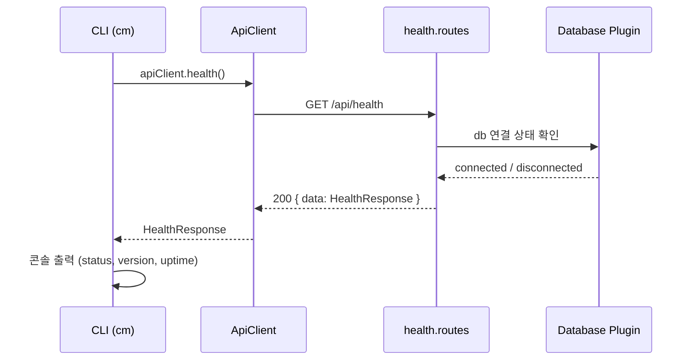

| 레이어 | 함수 | 입력 | 출력 | 데이터 변환 |
|--------|------|------|------|-----------|
| CLI | `healthCommand()` | (없음) | 콘솔 출력 | HealthResponse → 포맷팅 문자열 |
| ApiClient | `apiClient.health()` | (없음) | `HealthResponse` | HTTP 응답 → JSON 파싱 → data 추출 |
| Route | `healthRoutes(fastify)` | `Request` | `200: ApiResponse<HealthResponse>` | DB 상태 + process.uptime() + package.version 조합 |

```typescript
interface HealthResponse {
  status: "ok";
  version: string;      // ← package.json version
  uptime: number;       // ← process.uptime() (초)
  database: "connected" | "disconnected";
}

async function healthHandler(request, reply) {
  const dbStatus = tryDbPing(fastify.db);
  return {
    data: {
      status: "ok",
      version: fastify.config.version,
      uptime: Math.floor(process.uptime()),
      database: dbStatus ? "connected" : "disconnected"
    }
  };
}
```

---

## 2. 인증 로그인 (FR-002)

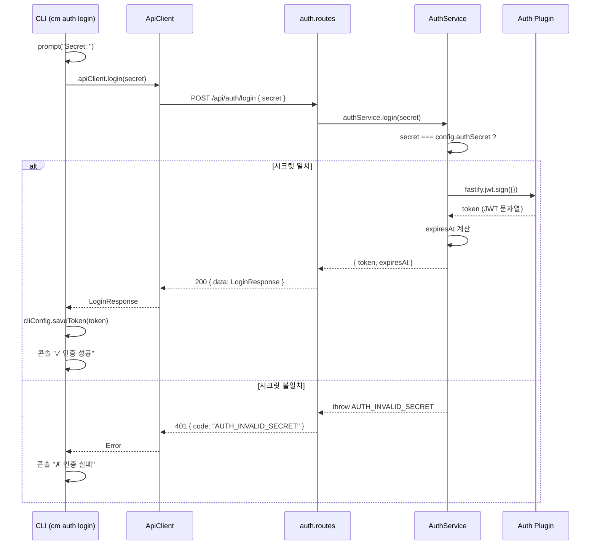

| 레이어 | 함수 | 입력 | 출력 | 데이터 변환 |
|--------|------|------|------|-----------|
| CLI | `authLoginCommand()` | 터미널 입력 (secret) | 콘솔 출력 + 토큰 저장 | LoginResponse → `~/.claude-manager/config.json` |
| ApiClient | `apiClient.login(secret)` | `string` | `LoginResponse` | `{secret}` → POST body → 응답 data 추출 |
| Route | `POST /api/auth/login` | `{body: {secret: string}}` | `200: ApiResponse<LoginResponse>` | JSON Schema 검증 → Service 위임 |
| Service | `authService.login(secret)` | `string` | `LoginResponse` | 시크릿 비교 → JWT 생성 → 만료일 계산 |
| Auth Plugin | `fastify.jwt.sign(payload)` | `{}` | `string` (JWT) | payload + secret → JWT 토큰 |

```typescript
interface LoginRequest {
  secret: string;
}

interface LoginResponse {
  token: string;            // ← fastify.jwt.sign({})
  expiresAt: string;        // ← ISO 8601
}

function login(secret: string): LoginResponse {
  if (secret !== config.authSecret) {
    throw new AppError(401, "AUTH_INVALID_SECRET", "시크릿이 올바르지 않습니다");
  }
  const token = fastify.jwt.sign({}, { expiresIn: config.jwtExpiresIn });
  const decoded = fastify.jwt.decode(token);
  return { token, expiresAt: new Date(decoded.exp * 1000).toISOString() };
}
```

---

## 3. 프로젝트 생성 (FR-003)

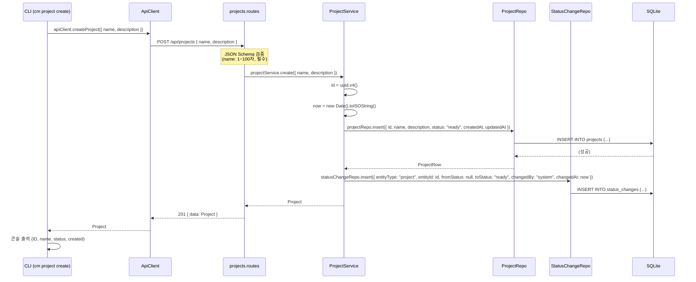

| 레이어 | 함수 | 입력 | 출력 | 데이터 변환 |
|--------|------|------|------|-----------|
| CLI | `projectCreateCommand(opts)` | `--name`, `--description` | 콘솔 출력 | CLI 옵션 → CreateProjectInput → Project 포맷팅 |
| ApiClient | `apiClient.createProject(input)` | `CreateProjectInput` | `Project` | input → POST body, 응답 data 추출 |
| Route | `POST /api/projects` | `{body: CreateProjectInput}` | `201: ApiResponse<Project>` | JSON Schema 검증 → Service 위임 → 응답 래핑 |
| Service | `projectService.create(input)` | `CreateProjectInput` | `Project` | UUID + 타임스탬프 + 기본값 조합 → Repo 저장 + 이력 기록 |
| Repository | `projectRepo.insert(row)` | `ProjectInsert` | `ProjectRow` | Drizzle insert → returning |
| StatusChange Repo | `statusChangeRepo.insert(row)` | `StatusChangeInsert` | `void` | Drizzle insert |

```typescript
interface CreateProjectInput {
  name: string;             // ← --name (필수)
  description?: string;     // ← --description (선택, 기본값 "")
}

interface ProjectInsert {
  id: string;               // ← uuid.v4()
  name: string;
  description: string;      // ← input.description ?? ""
  status: "ready";          // ← 고정값
  createdAt: string;        // ← ISO 8601
  updatedAt: string;
}

interface Project {
  id: string;
  name: string;
  description: string;
  status: ProjectStatus;
  createdAt: string;
  updatedAt: string;
}

// 부수효과: status_changes 기록
interface StatusChangeInsert {
  entityType: "project";
  entityId: string;         // ← project.id
  fromStatus: string;       // ← "" (최초 생성)
  toStatus: "ready";
  changedBy: "system";
  changedAt: string;        // ← project.createdAt 동일
}
```

---

## 4. 프로젝트 목록 조회 (FR-004)

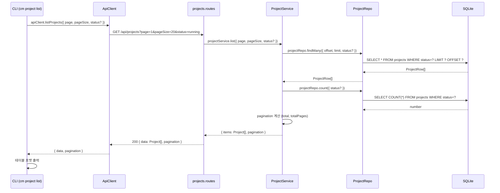

```typescript
interface ListProjectsOpts {
  page?: number;            // ← 기본값 1
  pageSize?: number;        // ← 기본값 20
  status?: ProjectStatus;   // ← 선택 필터
}

// Service 계산
// offset = (page - 1) * pageSize
// totalPages = Math.ceil(total / pageSize)

// Repository 쿼리
// status가 있으면 WHERE status = :status
// ORDER BY created_at DESC
// LIMIT :pageSize OFFSET :offset
```

---

## 5. 프로젝트 상세 조회 (FR-005)

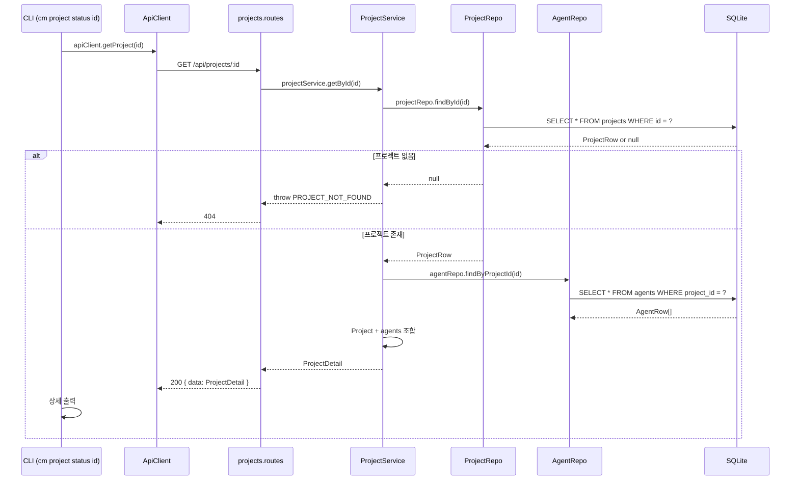

```typescript
interface ProjectDetail extends Project {
  agents: Agent[];
}

interface Agent {
  id: string;
  projectId: string;
  name: string;
  type: string;
  status: AgentStatus;
  skill: string;
  config: object;           // ← JSON.parse(agents.config)
  retryCount: number;
  createdAt: string;
  updatedAt: string;
}
```

---

## 6. 프로젝트 상태 변경 (FR-006)

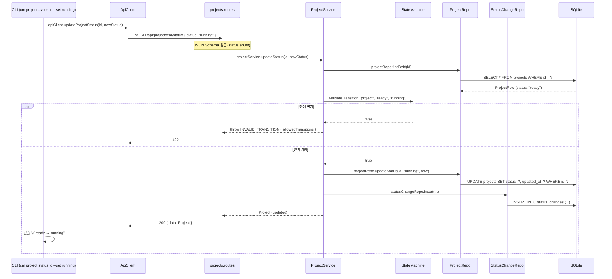

| 레이어 | 함수 | 입력 | 출력 | 데이터 변환 |
|--------|------|------|------|-----------|
| CLI | `projectStatusCommand(id, opts)` | `id`, `--set <status>` | 콘솔 출력 | `--set` 없으면 조회, 있으면 변경 |
| ApiClient | `apiClient.updateProjectStatus(id, status)` | `string, ProjectStatus` | `Project` | PATCH body 구성 → 응답 data 추출 |
| Route | `PATCH /api/projects/:id/status` | `{params:{id}, body:{status}}` | `200: ApiResponse<Project>` | Schema 검증 → Service 위임 |
| Service | `projectService.updateStatus(id, newStatus)` | `string, ProjectStatus` | `Project` | 현재 상태 조회 → 전이 검증 → 업데이트 → 이력 → 캐스케이드 |
| StateMachine | `validateTransition(entityType, from, to)` | `EntityType, string, string` | `boolean` | `PROJECT_TRANSITIONS[from].includes(to)` |
| Repository | `projectRepo.updateStatus(id, status, updatedAt)` | `string, string, string` | `ProjectRow` | Drizzle update + returning |

```typescript
// StateMachine — 순수 함수 (외부 의존 없음)
function validateTransition(
  entityType: EntityType,
  fromStatus: string,
  toStatus: string
): boolean {
  const transitions = TRANSITION_MAP[entityType];  // ← state-transitions.ts
  return transitions[fromStatus]?.includes(toStatus) ?? false;
}

function getAllowedTransitions(entityType: EntityType, fromStatus: string): string[] {
  return TRANSITION_MAP[entityType][fromStatus] ?? [];
}

// Service — 캐스케이드 규칙
// Project → Cancelled: 소속 활성 Agent 일괄 Cancelled
// Project → Paused:    소속 활성 Agent 일괄 Paused
// 각 Agent 캐스케이드는 다시 해당 Agent의 Task로 전파
```

---

## 7. Agent 생성 (FR-007)

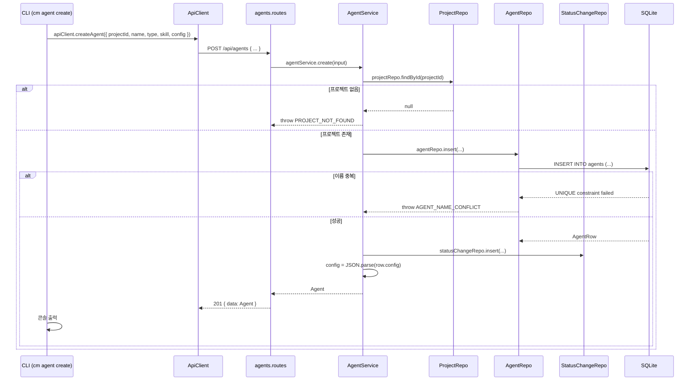

```typescript
interface CreateAgentInput {
  projectId: string;        // ← --project (필수)
  name: string;             // ← --name (필수)
  type?: string;            // ← --type (선택, 기본값 "")
  skill?: string;           // ← --skill (선택, 기본값 "")
  config?: object;          // ← Phase 1 미사용, 기본값 {}
}

interface AgentInsert {
  id: string;               // ← uuid.v4()
  projectId: string;
  name: string;
  type: string;
  status: "created";        // ← 고정값
  skill: string;
  config: string;           // ← JSON.stringify()  ← DB는 TEXT
  retryCount: 0;
  createdAt: string;
  updatedAt: string;
}
```

> **중요**: `config`는 DB에 TEXT(JSON 문자열)로 저장하고 API 응답에서는 object로 반환한다. Service가 insert 시 `JSON.stringify()`, 조회 시 `JSON.parse()`를 수행한다.

---

## 8. Agent 상태 변경 (FR-007)

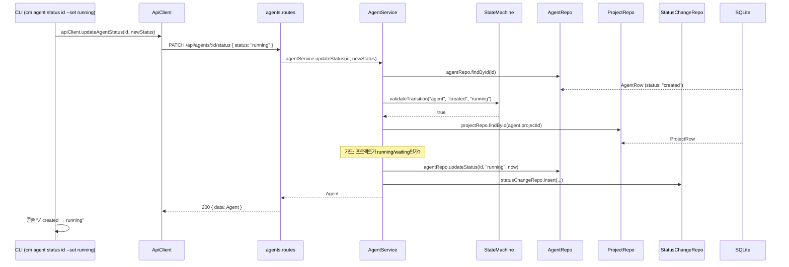

| 레이어 | 함수 | 핵심 로직 |
|--------|------|----------|
| Service | `agentService.updateStatus(id, newStatus)` | ① findById ② validateTransition ③ 가드 체크 ④ updateStatus ⑤ 이력 기록 ⑥ 캐스케이드 |
| StateMachine | `validateTransition("agent", from, to)` | `AGENT_TRANSITIONS[from].includes(to)` |

```typescript
// Agent 시작 시 프로젝트 활성 상태 체크
function checkParentActive(agent: AgentRow, project: ProjectRow): void {
  if (agent.status === "created" /* → running 전이 시 */) {
    const activeStatuses = ["running", "waiting"];
    if (!activeStatuses.includes(project.status)) {
      throw new AppError(422, "PARENT_NOT_ACTIVE",
        `프로젝트가 활성 상태가 아닙니다 (현재: ${project.status})`
      );
    }
  }
}

// 캐스케이드 규칙
// Agent → Cancelled: 소속 활성 Task 일괄 Cancelled
// Agent → Paused:    소속 활성 Task 일괄 Paused
```

---

## 9. Task 생성 (FR-008)

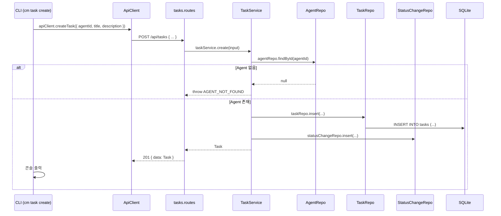

```typescript
interface CreateTaskInput {
  agentId: string;          // ← --agent (필수)
  title: string;            // ← --title (필수, 1~200자)
  description?: string;     // ← --description (선택, 기본값 "")
}

interface TaskInsert {
  id: string;               // ← uuid.v4()
  agentId: string;
  title: string;
  description: string;
  status: "ready";          // ← 고정값
  createdAt: string;
  updatedAt: string;
}

interface Task {
  id: string;
  agentId: string;
  title: string;
  description: string;
  status: TaskStatus;
  createdAt: string;
  updatedAt: string;
}
```

---

## 10. Task 상태 변경 (FR-008)

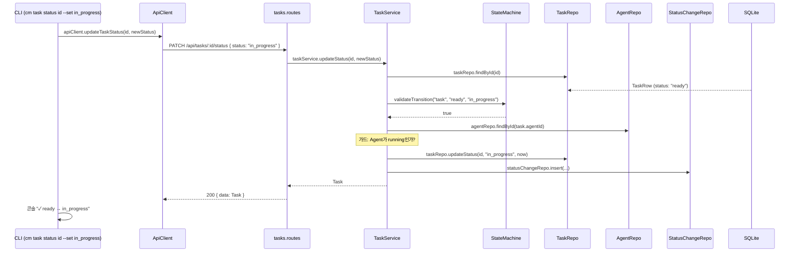

```typescript
// Task 시작 시 Agent 활성 상태 체크
function checkParentActive(task: TaskRow, agent: AgentRow): void {
  if (task.status === "ready" /* → in_progress 전이 시 */) {
    if (agent.status !== "running") {
      throw new AppError(422, "PARENT_NOT_ACTIVE",
        `Agent가 활성 상태가 아닙니다 (현재: ${agent.status})`
      );
    }
  }
}
```

---

## 11. Task 목록 조회 (FR-008)

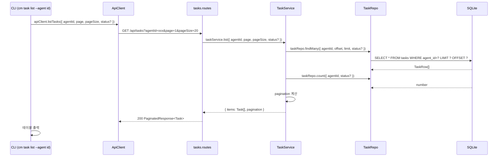

---

## 12. 상태 변경 이력 조회 (FR-009)

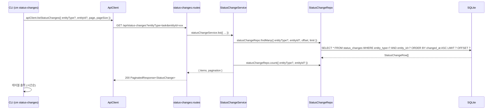

```typescript
interface ListStatusChangesOpts {
  entityType?: EntityType;  // ← --entity-type
  entityId?: string;        // ← --entity-id
  page?: number;            // ← 기본값 1
  pageSize?: number;        // ← 기본값 20
}

interface StatusChange {
  id: number;               // ← AUTOINCREMENT PK
  entityType: EntityType;
  entityId: string;         // ← UUID
  fromStatus: string;       // ← 최초 생성 시 ""
  toStatus: string;
  changedBy: string;        // ← "user" | "system"
  changedAt: string;        // ← ISO 8601
}

// 정렬: changed_at ASC (시간순)
```

---

## 13. Agent 삭제 (FR-007)

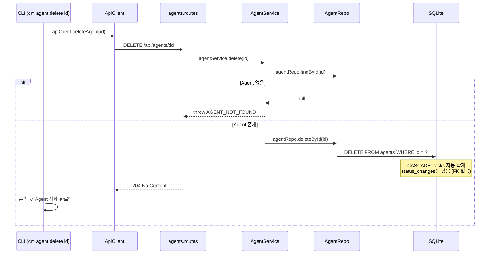

> **⚠ D-27 승인에 따른 변경 필요**: Agent 삭제 시 대화(`conversations`)는 **CASCADE 삭제하지 않고** `archived`로 전환해야 한다. DES-013 §2 참조.

---

## 전체 함수 시그니처 요약

### API Client (`src/cli/api-client.ts`)

```typescript
class ApiClient {
  constructor(serverUrl: string, token?: string)

  // Health
  health(): Promise<HealthResponse>

  // Auth
  login(secret: string): Promise<LoginResponse>

  // Project
  createProject(input: CreateProjectInput): Promise<Project>
  listProjects(opts?: ListProjectsOpts): Promise<PaginatedResponse<Project>>
  getProject(id: string): Promise<ProjectDetail>
  updateProjectStatus(id: string, status: ProjectStatus): Promise<Project>

  // Agent
  createAgent(input: CreateAgentInput): Promise<Agent>
  listAgents(opts?: ListAgentsOpts): Promise<PaginatedResponse<Agent>>
  getAgent(id: string): Promise<AgentDetail>
  updateAgentStatus(id: string, status: AgentStatus): Promise<Agent>
  deleteAgent(id: string): Promise<void>

  // Task
  createTask(input: CreateTaskInput): Promise<Task>
  listTasks(opts?: ListTasksOpts): Promise<PaginatedResponse<Task>>
  getTask(id: string): Promise<Task>
  updateTaskStatus(id: string, status: TaskStatus): Promise<Task>

  // Status Changes
  listStatusChanges(opts?: ListStatusChangesOpts): Promise<PaginatedResponse<StatusChange>>
}
```

### Services (`src/backend/services/`)

```typescript
// auth.service.ts
class AuthService {
  login(secret: string): LoginResponse
}

// project.service.ts
class ProjectService {
  create(input: CreateProjectInput): Promise<Project>
  list(opts: PaginationOpts & { status?: ProjectStatus }): Promise<{ items: Project[]; pagination: Pagination }>
  getById(id: string): Promise<ProjectDetail>
  updateStatus(id: string, newStatus: ProjectStatus): Promise<Project>
}

// agent.service.ts
class AgentService {
  create(input: CreateAgentInput): Promise<Agent>
  list(opts: PaginationOpts & { projectId?: string; status?: AgentStatus }): Promise<{ items: Agent[]; pagination: Pagination }>
  getById(id: string): Promise<AgentDetail>
  updateStatus(id: string, newStatus: AgentStatus): Promise<Agent>
  delete(id: string): Promise<void>
}

// task.service.ts
class TaskService {
  create(input: CreateTaskInput): Promise<Task>
  list(opts: PaginationOpts & { agentId?: string; status?: TaskStatus }): Promise<{ items: Task[]; pagination: Pagination }>
  getById(id: string): Promise<Task>
  updateStatus(id: string, newStatus: TaskStatus): Promise<Task>
}

// status-change.service.ts
class StatusChangeService {
  record(input: StatusChangeInsert): Promise<void>
  list(opts: PaginationOpts & { entityType?: EntityType; entityId?: string }): Promise<{ items: StatusChange[]; pagination: Pagination }>
}
```

### Repositories (`src/backend/repositories/`)

```typescript
// project.repository.ts
class ProjectRepository {
  insert(row: ProjectInsert): ProjectRow
  findById(id: string): ProjectRow | null
  findMany(opts: { offset: number; limit: number; status?: string }): ProjectRow[]
  count(opts: { status?: string }): number
  updateStatus(id: string, status: string, updatedAt: string): ProjectRow
}

// agent.repository.ts
class AgentRepository {
  insert(row: AgentInsert): AgentRow
  findById(id: string): AgentRow | null
  findByProjectId(projectId: string): AgentRow[]
  findActiveByProjectId(projectId: string): AgentRow[]
  findMany(opts: { offset: number; limit: number; projectId?: string; status?: string }): AgentRow[]
  count(opts: { projectId?: string; status?: string }): number
  updateStatus(id: string, status: string, updatedAt: string): AgentRow
  deleteById(id: string): void
}

// task.repository.ts
class TaskRepository {
  insert(row: TaskInsert): TaskRow
  findById(id: string): TaskRow | null
  findActiveByAgentId(agentId: string): TaskRow[]
  findMany(opts: { offset: number; limit: number; agentId?: string; status?: string }): TaskRow[]
  count(opts: { agentId?: string; status?: string }): number
  updateStatus(id: string, status: string, updatedAt: string): TaskRow
}

// status-change.repository.ts
class StatusChangeRepository {
  insert(row: StatusChangeInsert): void
  findMany(opts: { offset: number; limit: number; entityType?: string; entityId?: string }): StatusChangeRow[]
  count(opts: { entityType?: string; entityId?: string }): number
}
```

### State Machine (`src/backend/utils/state-machine.ts`)

```typescript
function validateTransition(entityType: EntityType, fromStatus: string, toStatus: string): boolean
function getAllowedTransitions(entityType: EntityType, fromStatus: string): string[]
```

---

## 크로스 레퍼런스

| 이 문서 (DES-004) | 참조 문서 |
|------------------|----------|
| 함수 시그니처의 타입 | DES-009 코드 정의서 (Enum, ErrorCode, 상수) |
| 시퀀스의 상태 전이 규칙 | DES-007 상태 흐름도 (전이 맵, 가드 조건) |
| API 엔드포인트 세부 스펙 | DES-002 API 명세서 (엔드포인트 목록) |
| DB 테이블/컬럼 | DES-003 데이터 모델 (ERD) |
| 컴포넌트 간 의존 방향 | DES-001 아키텍처 (C4 Component Diagram) |
| CLI 명령 사용 시나리오 | DES-005 스토리보드 |
| CLI 출력 형식·인터랙션 | DES-006 화면 명세서 (CLI) v2 |
| 파일 위치 | DES-008 디렉토리 구조 |

---

## ⚠ 2026-09-01 승인 반영 필요

| 항목 | 필요한 변경 | 근거 |
|------|-----------|------|
| Agent 삭제 시퀀스 (§13) | 대화 CASCADE 삭제 → `archived` 전환으로 수정 | D-27 |
| 신규 시퀀스 | 대화 송수신, 의사결정 요청·응답, 승인 게이트 통과, 단계 착수, 페어링, 푸시 발송 | D-09, D-14, D-16, D-19, D-21 |
| 신규 Service 시그니처 | ConversationService, ApprovalService, PhaseService, ArtifactService, PushService | 전반 |

---

## 변경 이력

| 버전 | 날짜 | 내용 |
|------|------|------|
| v1 | 2026-08-24 | 최초 작성 — 13개 기능 시퀀스 + 전체 함수 시그니처 |
| — | 2026-09-01 | **Git 동기화** + 승인 반영 필요 항목 주석 추가 (내용 변경 없음) |
