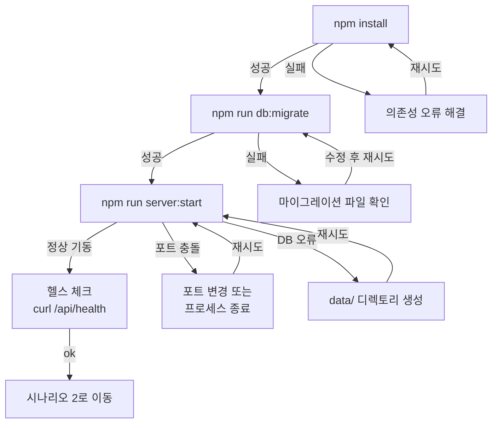

# DES-005 스토리보드

> Phase 1: 기반 구축
> 버전: v2.1 (2026-08-24)
> **원본**: [Notion DES-005](https://app.notion.com/p/3c5d066504ec81578aa5ff31e91f318a) · Git 동기화 2026-09-01
> 기준 원본 정책: Notion = 대표 승인 원본 / Git = 에이전트 실행 원본. 충돌 시 Notion 우선.

## Phase 1 적용 범위

Phase 1은 CLI + API 전용이다. 웹 UI 스토리보드는 Phase 2에서 작성한다.
본 문서는 CLI 사용 시나리오를 3계층(내러티브 + 핵심 순간 + 분기점)으로 정의한다.

---

## 시나리오 1: 최초 설치와 시스템 기동

### 내러티브 (Layer 1)

- **맥락**: 대표가 ClaudeManager를 처음 설치하고 시스템을 기동하는 상황. 아직 프로젝트도 없고, 인증 설정도 안 된 상태
- **목표**: 시스템 설치 → 서버 기동 → DB 초기화까지 완료
- **기대**: 3분 이내에 서버가 정상 기동되고, 첫 접속 준비가 완료된다
- **감정 흐름**: 기대감 → (설치 성공) 안도 → (서버 기동) 확신
- **대응 Story**: FR-001, DAT-001, DAT-002

### 핵심 순간 (Layer 2)

**Moment 1: 패키지 설치**

```
$ npm install
added 142 packages in 8s
```

**Moment 2: DB 마이그레이션**

```
$ npm run db:migrate
[migrate] Running migration 0000_initial.sql
[migrate] ✓ Created table: projects
[migrate] ✓ Created table: agents
[migrate] ✓ Created table: tasks
[migrate] ✓ Created table: status_changes
[migrate] Migration complete (4 tables, 6 indexes)
```

**Moment 3: 서버 기동**

```
$ npm run server:start

  ┌─────────────────────────────────────────┐
  │  ClaudeManager v1.0.0                   │
  │  Server: http://127.0.0.1:3000          │
  │  Database: ./data/cm.db                 │
  │                                         │
  │  ⚠ Initial Secret (save this!):         │
  │  cm_sk_a1b2c3d4e5f6...                  │
  └─────────────────────────────────────────┘

[server] Fastify plugins loaded (database, auth)
[server] Routes registered (health, auth, projects, agents, tasks, status-changes)
[server] Listening on http://127.0.0.1:3000
```

> **중요**: 시크릿은 최초 기동 시에만 표시된다. 분실 시 재생성 필요

**Moment 4: 헬스 체크**

```
$ curl http://127.0.0.1:3000/api/health
{"status":"ok","version":"1.0.0","uptime":12}
```

### 분기점 (Layer 3)

| 분기 | 조건 | CLI 출력 | 복구 행동 |
|------|------|---------|----------|
| 정상 | - | 서버 기동 성공 | Moment 4 → 시나리오 2로 이동 |
| 포트 충돌 | 3000번 사용 중 | `Error: listen EADDRINUSE: address already in use :::3000` | `CM_PORT=3001 npm run server:start` 또는 점유 프로세스 종료 |
| DB 경로 오류 | 디렉토리 없음 | `Error: SQLITE_CANTOPEN: unable to open database file` | `mkdir -p ./data` 후 재시작 |
| 마이그레이션 실패 | SQL 구문 오류 | `[migrate] ✗ Error in 0000_initial.sql: ...` | 마이그레이션 파일 확인 후 수정 |
| Node.js 미설치 | node 없음 | `command not found: node` | Node.js 18+ 설치 |



---

## 시나리오 2: 인증과 첫 프로젝트 생성

### 내러티브 (Layer 1)

- **맥락**: 서버가 기동된 상태. 대표가 CLI로 로그인하고 첫 프로젝트를 생성하려는 상황
- **목표**: 인증 → 프로젝트 생성 → 목록 확인 → 상태 변경
- **기대**: 로그인 후 1분 이내에 프로젝트를 생성하고 목록에서 확인할 수 있다
- **감정 흐름**: (로그인) 간편함 → (프로젝트 생성) 성취감 → (목록 확인) 신뢰감
- **대응 Story**: FR-002, NFR-002, FR-003, FR-004, FR-006, INT-001

### 핵심 순간 (Layer 2)

**Moment 1: CLI 로그인**

```
$ cm auth login
Secret: ********
✓ 인증 성공
  Token saved to ~/.claude-manager/config.json
  Expires: 2026-08-31 (7 days)

$ cm auth status
✓ 인증됨
  Server: http://127.0.0.1:3000
  Token expires: 2026-09-23T00:15:00Z
```

**Moment 2: 프로젝트 생성**

```
$ cm project create --name "my-web-app" --description "웹 애플리케이션 개발"
✓ 프로젝트 생성 완료

  ID:          a1b2c3d4-...
  Name:        my-web-app
  Status:      ready
  Description: 웹 애플리케이션 개발
  Created:     2026-08-24 10:30:15
```

**Moment 3: 프로젝트 목록 확인**

```
$ cm project list

  ID         Name          Status   Created
  ─────────  ────────────  ───────  ───────────────────
  a1b2c3d4   my-web-app    ready    2026-08-24 10:30:15

  Total: 1 project(s)
```

**Moment 4: 프로젝트 시작 (상태 변경)**

```
$ cm project status a1b2c3d4 --set running
✓ 프로젝트 상태 변경

  Project:  my-web-app
  Status:   ready → running
  Changed:  2026-08-24 10:31:02
```

### 분기점 (Layer 3)

| 분기 | 조건 | CLI 출력 | 복구 행동 |
|------|------|---------|----------|
| 정상 | - | 각 단계 성공 메시지 | 시나리오 3으로 이동 |
| 서버 미연결 | 백엔드 미기동 | ✗ 서버에 연결할 수 없습니다 | 서버 시작 후 재시도 |
| 인증 실패 | 잘못된 시크릿 | ✗ 인증 실패: 시크릿이 올바르지 않습니다 | 시크릿 재확인 |
| 토큰 만료 | JWT 만료 | ✗ 토큰이 만료되었습니다 | `cm auth login` 재실행 |
| 이름 중복 | 동일 이름 존재 | ✗ 이미 존재하는 프로젝트 이름입니다 | 다른 이름으로 재시도 |
| 인증 없이 접근 | 미로그인 | ✗ 인증이 필요합니다 | 로그인 후 재시도 |

---

## 시나리오 3: Agent 등록과 Task 관리

### 내러티브 (Layer 1)

- **맥락**: 프로젝트가 'running' 상태. 대표가 Agent를 등록하고 Task를 할당하여 작업 추적을 시작하는 상황
- **목표**: Agent 등록 → Task 생성 → 상태 변경 → 이력 확인
- **기대**: Agent와 Task의 상태를 CLI에서 추적하고, 변경 이력으로 감사 추적이 가능하다
- **감정 흐름**: (Agent 등록) 체계 잡히는 느낌 → (Task 관리) 통제감 → (이력 확인) 안심
- **대응 Story**: FR-007, FR-008, FR-009

### 핵심 순간 (Layer 2)

**Moment 1: Agent 등록**

```
$ cm agent create --project a1b2c3d4 --name "dev-sub-01" --type "dev-sub" --skill "develop"
✓ Agent 생성 완료

  ID:       e5f6g7h8-...
  Name:     dev-sub-01
  Type:     dev-sub
  Project:  my-web-app (a1b2c3d4)
  Skill:    develop
  Status:   created
  Created:  2026-08-24 10:35:00
```

**Moment 2: Agent 상태 변경 (실행 시작)**

```
$ cm agent status e5f6g7h8 --set running
✓ Agent 상태 변경

  Agent:    dev-sub-01
  Status:   created → running
  Changed:  2026-08-24 10:36:00
```

**Moment 3: Task 생성 및 할당**

```
$ cm task create --agent e5f6g7h8 --title "DB 스키마 구현" --description "Drizzle ORM 스키마 정의 및 마이그레이션"
✓ Task 생성 완료

  ID:          i9j0k1l2-...
  Title:       DB 스키마 구현
  Agent:       dev-sub-01 (e5f6g7h8)
  Status:      ready
  Created:     2026-08-24 10:37:00
```

**Moment 4: Task 진행 상태 변경**

```
$ cm task status i9j0k1l2 --set in_progress
✓ ready → in_progress

$ cm task status i9j0k1l2 --set in_review
✓ in_progress → in_review

$ cm task status i9j0k1l2 --set completed
✓ in_review → completed
```

> `in_review` 경유는 필수다. `in_progress → completed` 직접 전이는 허용되지 않는다.

**Moment 5: 상태 변경 이력 조회**

```
$ cm status-changes --entity-type task --entity-id i9j0k1l2

  Time                 Entity   From          To            Changed By
  ───────────────────  ───────  ────────────  ────────────  ──────────
  2026-08-24 10:37:00  task     -             ready         system
  2026-08-24 10:40:00  task     ready         in_progress   user
  2026-08-24 11:10:00  task     in_progress   in_review     user
  2026-08-24 11:15:00  task     in_review     completed     user
```

### 분기점 (Layer 3)

| 분기 | 조건 | CLI 출력 | 복구 행동 |
|------|------|---------|----------|
| 정상 | - | 각 단계 성공 메시지 | 다음 Task 또는 시나리오 4로 이동 |
| 프로젝트 미존재 | 잘못된 project ID | ✗ 프로젝트를 찾을 수 없습니다 | ID 재확인 |
| Agent 미존재 | 잘못된 agent ID | ✗ Agent를 찾을 수 없습니다 | ID 재확인 |
| 상태 전이 불가 | 허용되지 않은 전이 | ✗ 'created' → 'completed' 전이는 허용되지 않습니다 | 올바른 상태 순서 준수 |
| 비활성 프로젝트 | 프로젝트가 running 아님 | ✗ 프로젝트가 활성 상태가 아닙니다 | 프로젝트 상태 변경 후 재시도 |
| Task 할당 불가 | Agent가 cancelled/failed | ✗ Agent가 비활성 상태입니다 | 새 Agent 생성 또는 기존 Agent 확인 |

---

## 시나리오 4: Walking Skeleton 전체 흐름 (E2E)

### 내러티브 (Layer 1)

- **맥락**: 시나리오 1~3의 전체 흐름을 하나의 세션에서 수행하는 End-to-End 시나리오
- **목표**: 서버 기동 → 인증 → 프로젝트 생성 → Agent 등록 → Task 관리 → 상태 이력 확인 → CLI 조회
- **기대**: Walking Skeleton의 전체 경로가 10분 이내에 동작한다
- **감정 흐름**: (시작) 설렘 → (각 단계 성공) 점진적 확신 → (전체 완료) 만족감, "이걸로 관리할 수 있겠다"
- **대응 Story**: FR-001~009, NFR-002, DAT-001, DAT-002, INT-001

### 요약 흐름

```
[터미널 1: 서버]                    [터미널 2: CLI]

npm run server:start
  Server listening :3000            cm auth login
  Initial Secret: cm_sk_...          → Secret: ********
                                     → ✓ 인증 성공

                                   cm project create --name "cm-v2"
                                     → ✓ 프로젝트 생성 (ID: abc123)

                                   cm project status abc123 --set running
                                     → ✓ ready → running

                                   cm agent create --project abc123 --name "dev-01"
                                     → ✓ Agent 생성 (ID: def456)

                                   cm agent status def456 --set running
                                     → ✓ created → running

                                   cm task create --agent def456 --title "API 구현"
                                     → ✓ Task 생성 (ID: ghi789)

                                   cm task status ghi789 --set in_progress
                                   cm task status ghi789 --set in_review
                                   cm task status ghi789 --set completed

                                   cm status-changes --entity-type task --entity-id ghi789
                                     → 3건 이력 표시

                                   cm project list
                                     → 1 project, status: running
```

### 완료 판정 기준

| 단계 | 확인 항목 | 예상 결과 |
|------|----------|----------|
| 서버 기동 | GET /api/health 응답 | `{"status":"ok"}` |
| 인증 | `cm auth status` | "인증됨" + 토큰 만료일 |
| 프로젝트 | `cm project list` | 1개 프로젝트, running |
| Agent | `cm agent list --project <id>` | 1개 Agent, running |
| Task | `cm task list --agent <id>` | 1개 Task, completed |
| 상태 이력 | `cm status-changes --entity-id <task-id>` | 4건 (ready→in_progress→in_review→completed) |

### 분기점 (Layer 3)

| 실패 지점 | 증상 | 영향 | 복구 |
|----------|------|------|------|
| 서버 기동 | 포트 충돌 / DB 오류 | 전체 중단 | 시나리오 1 분기점 참조 |
| 인증 | 시크릿 불일치 | CLI 사용 불가 | 시나리오 2 분기점 참조 |
| 프로젝트 CRUD | API 500 에러 | Agent 등록 불가 | 서버 로그 확인, DB 파일 권한 확인 |
| 상태 전이 | 허용되지 않은 전이 | 작업 흐름 중단 | DES-007 상태 흐름도 참조 |
| CLI 통신 | 네트워크 타임아웃 | 명령 실행 불가 | 서버 기동 상태 및 포트 확인 |

---

## 시나리오 5: 서버 종료와 재시작 복구

### 내러티브 (Layer 1)

- **맥락**: 작업 중 서버를 종료해야 하거나, 예기치 않게 서버가 중단된 상황
- **목표**: 서버를 안전하게 종료하고, 재시작 후 데이터가 보존되었음을 확인
- **기대**: 재시작 후 모든 프로젝트/Agent/Task 데이터가 그대로 유지된다
- **감정 흐름**: (종료) 걱정 → (재시작) 긴장 → (데이터 확인) 안도
- **대응 Story**: FR-001, DAT-001

### 핵심 순간 (Layer 2)

**Moment 1: 서버 정상 종료**

```
^C
[server] Received SIGINT, shutting down gracefully...
[server] Waiting for active requests to complete (timeout: 10s)
[server] Active requests: 0
[server] Database connection closed
[server] Server stopped
```

**Moment 2: 서버 재시작**

```
$ npm run server:start

  ClaudeManager v1.0.0
  Server: http://127.0.0.1:3000
  Database: ./data/cm.db (existing)

[server] Listening on http://127.0.0.1:3000
```

> 재시작 시 시크릿은 재표시되지 않는다.

**Moment 3: 데이터 보존 확인**

```
$ cm project list

  ID         Name    Status    Created
  ─────────  ──────  ────────  ───────────────────
  abc123     cm-v2   running   2026-08-24 10:30:15

  Total: 1 project(s)
```

### 분기점 (Layer 3)

| 분기 | 조건 | CLI 출력 | 복구 행동 |
|------|------|---------|----------|
| 정상 | - | 이전 데이터 유지 | 작업 계속 |
| 강제 종료 (kill -9) | 프로세스 강제 종료 | (로그 없음) | SQLite WAL 모드가 자동 복구. 재시작 시 정상 |
| DB 파일 손상 | 디스크 오류 등 | `Error: SQLITE_CORRUPT` | 백업에서 복원 (향후 Phase 5 체크포인트) |

---

## CLI 명령어 전체 맵

```
cm
├── auth
│   ├── login         # 시크릿 입력 → JWT 토큰 저장
│   ├── logout        # 토큰 삭제
│   └── status        # 현재 인증 상태 확인
├── project
│   ├── create        # --name, --description
│   ├── list          # 전체 프로젝트 목록
│   └── status <id>   # 조회 또는 --set <status>로 변경
├── agent
│   ├── create        # --project, --name, --type, --skill
│   ├── list          # --project 필수
│   └── status <id>   # 조회 또는 --set <status>로 변경
├── task
│   ├── create        # --agent, --title, --description
│   ├── list          # --agent 필수
│   └── status <id>   # 조회 또는 --set <status>로 변경
└── status-changes    # --entity-type, --entity-id
```

---

## ⚠ 2026-09-01 승인 반영 필요

승인된 결정에 따라 **CLI 명령군이 크게 늘어난다.** 신규 시나리오 작성이 필요하다.

| 신규 명령군 | 명령 | 근거 |
|------------|------|------|
| 대화 | `cm chat main`, `cm chat agent <id>`, `cm chat send`, `cm chat list`, `cm chat log`, `cm chat search` | D-09, D-27 |
| 승인 | `cm inbox`, `cm decide <id> --approve\|--reject`, `cm approvals`, `cm review <id>` | D-14, D-16 |
| 진행 | `cm progress` | D-16 |
| 페어링 | `cm pair`, `cm devices` | D-19 |

### 신규 시나리오 (작성 예정)

| # | 시나리오 | 내용 |
|---|---------|------|
| 6 | Main에게 지시하고 위임받기 | 요구사항 입력 → 스킬 제안 → Agent 생성·위임 |
| 7 | 승인 게이트 통과 | `plan→analyze` 게이트 도달 → `cm review` → `cm decide --approve` → 다음 단계 착수 |
| 8 | 모바일 페어링과 원격 승인 | `cm pair` → 폰에서 링크 접속 → 알림 켜기 → 외부에서 승인 |

---

## 변경 이력

| 버전 | 날짜 | 내용 |
|------|------|------|
| v1 | 2026-08-23 | 최초 작성 (Phase 1 — CLI 시나리오 2개) |
| v2 | 2026-08-24 | 5개 시나리오로 확장, CLI 명령/출력 예시 상세화, E2E 흐름 추가 |
| v2.1 | 2026-08-24 | 설계 검토 반영: Task 상태 전이 `in_review` 경유 추가, 토큰 경로 통일, JWT 만료 7d로 수정 |
| — | 2026-09-01 | **Git 동기화** + 승인 반영 신규 명령군·시나리오 6~8 예정 표기 |
