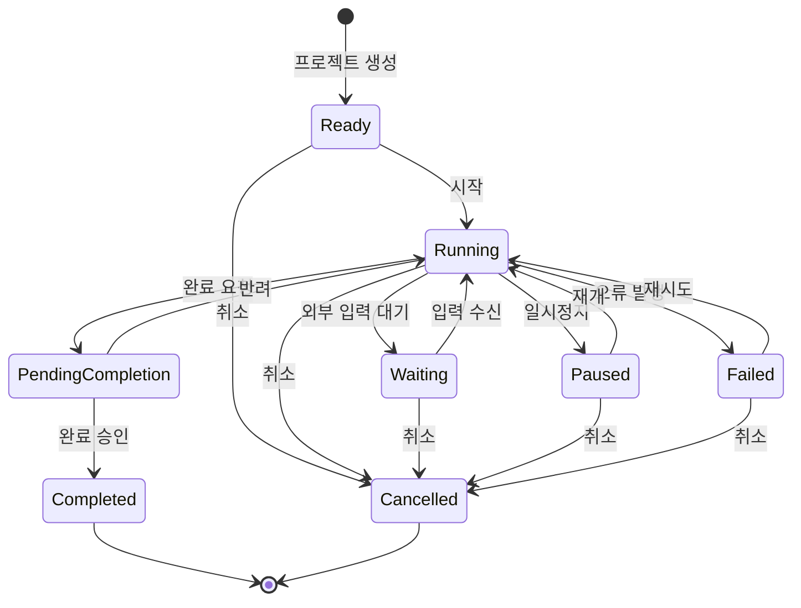
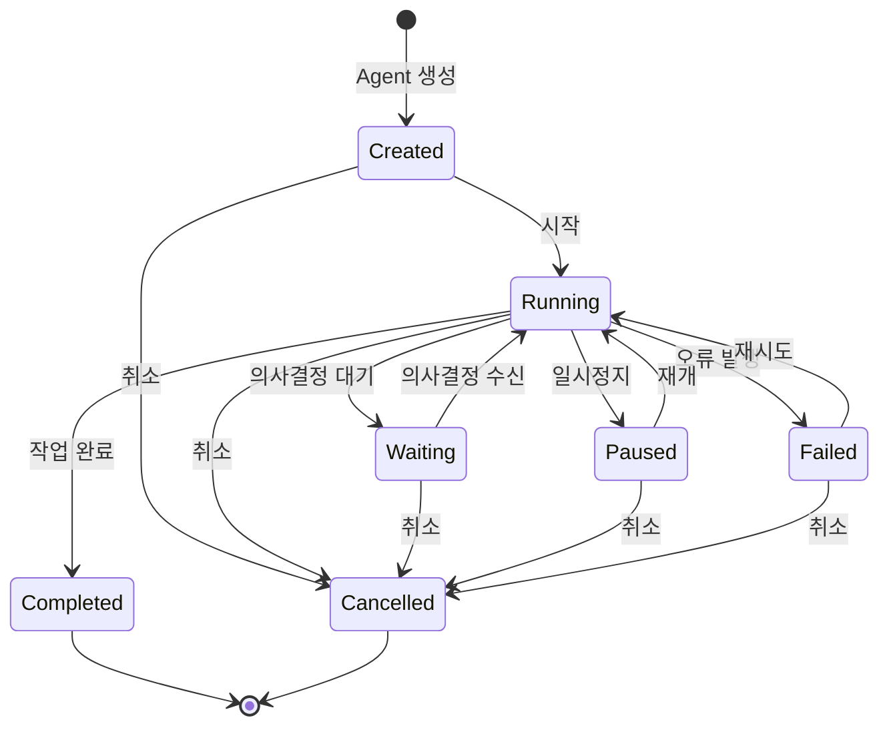
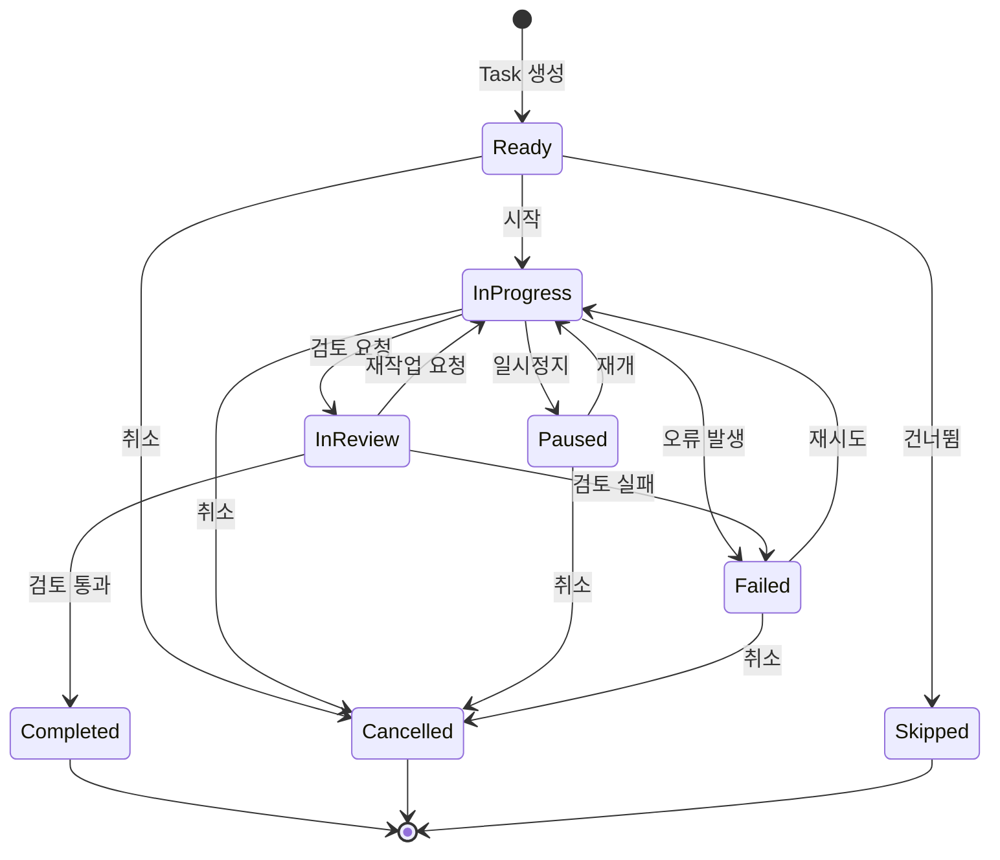
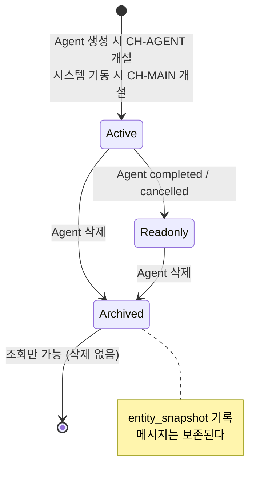
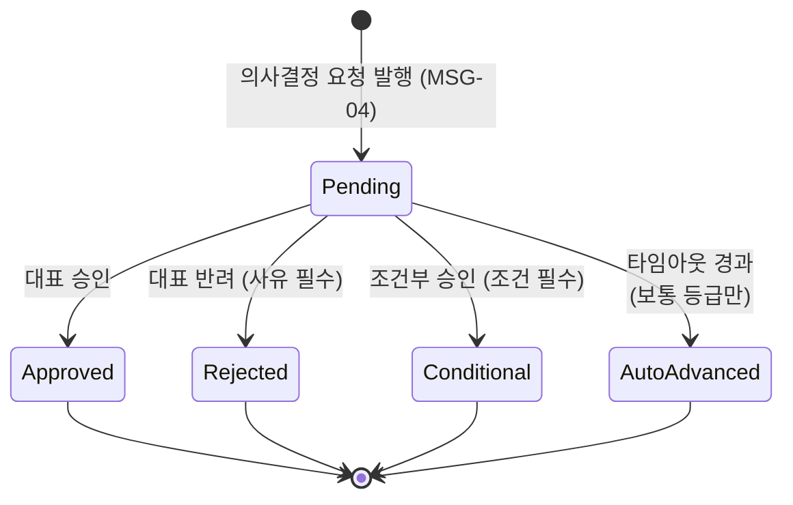
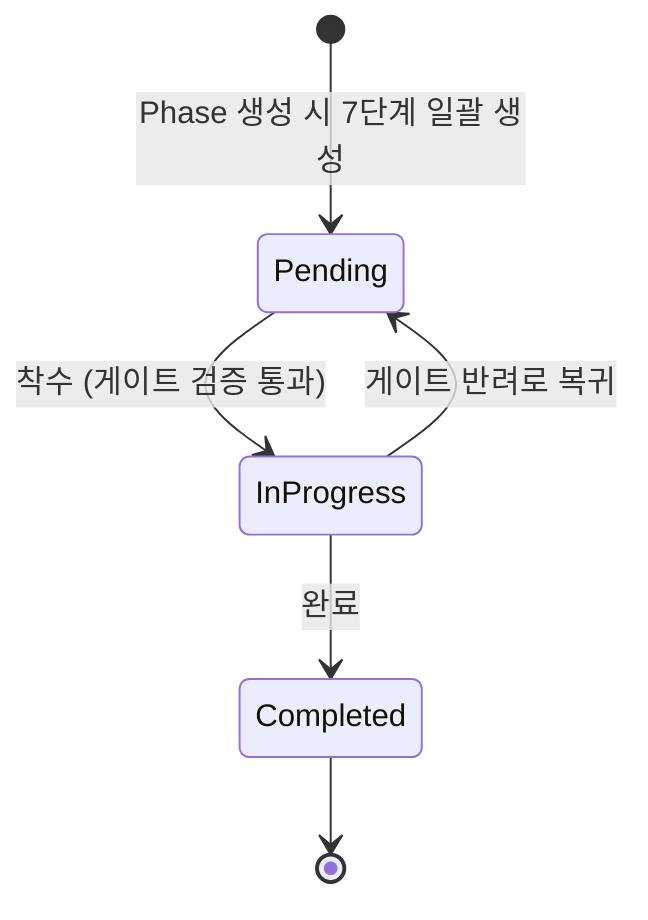

# DES-007 상태 흐름도

> Phase 1: 기반 구축
> 버전: **v2 (2026-09-01)** — 승인 반영. 상태 머신 3개 → 6개
> **원본**: [Notion DES-007](https://app.notion.com/p/3c5d066504ec8174881ad45d1cc9918b) · Git 동기화 2026-09-01
> 기준 원본 정책: Notion = 대표 승인 원본 / Git = 에이전트 실행 원본. 충돌 시 Notion 우선.

---

## 1. 개정 요약

| 구분 | v1 | **v2** |
|------|:---:|:---:|
| 상태 머신 | 3개 (Project · Agent · Task) | **6개** (+ Conversation · Approval · Stage) |
| Agent `waiting` | 단일 상태 | **`waiting_reason` 세분화** (D-11) |
| 애플리케이션 책임 전이 | 없음 | **1건** — Agent 삭제 → 대화 아카이브 (D-27) |

> **상태 머신을 한 문서에 모은다.** v1은 Project·Agent·Task만 다뤘고, 승인 상태 머신은 DES-014 §3-3에, 대화 채널 생명주기는 DES-013 §2에 흩어져 있었다. 상태 전이 검증은 한곳에서 구현되므로 정의도 한곳에 있어야 한다.

---

## 2. 프로젝트 상태 머신 (8개 상태)



```typescript
const PROJECT_TRANSITIONS = {
  ready:              ["running", "cancelled"],
  running:            ["waiting", "paused", "pending_completion", "failed", "cancelled"],
  waiting:            ["running", "cancelled"],
  paused:             ["running", "cancelled"],
  pending_completion: ["completed", "running"],
  failed:             ["running", "cancelled"],
  completed:          [],
  cancelled:          [],
};
```

---

## 3. Agent 상태 머신 (7개 상태) — **v2 개정**



```typescript
const AGENT_TRANSITIONS = {
  created:   ["running", "cancelled"],
  running:   ["waiting", "paused", "completed", "failed", "cancelled"],
  waiting:   ["running", "cancelled"],
  paused:    ["running", "cancelled"],
  failed:    ["running", "cancelled"],
  completed: [],
  cancelled: [],
};
```

### 3-1. `waiting` 사유 세분화 (D-11)

**신규 상태를 만들지 않는다.** D-11은 `blocked_on_ceo` 신설(B)을 기각하고 **기존 `waiting` 재사용 + 사유 필드**(A)를 채택했다. 상태 수를 늘리면 위 전이 맵과 모든 가드 조건이 함께 늘어난다.

```typescript
type WaitingReason =
  | 'ceo_approval'     // 대표 승인 대기 — 등급 높음 또는 APV-GATE
  | 'ceo_decision'     // 대표 응답 대기 — 등급 보통 (타임아웃 있음)
  | 'external_input';  // 그 외 외부 입력 대기
```

| 상태 | `waiting_reason` | 의미 |
|------|-----------------|------|
| `waiting` | `ceo_approval` | **무기한 대기.** 대표가 처리해야만 풀린다 |
| `waiting` | `ceo_decision` | 30분 후 자동 진행 (D-10) |
| `waiting` | `external_input` | 그 외 |

> **`status`가 `waiting`이 아니면 `waiting_reason`은 NULL이어야 한다.** DES-003의 `agents` 테이블에 CHECK 제약으로 강제한다.

### 3-2. `waiting` 진입·이탈 규칙

| 계기 | 전이 | `waiting_reason` |
|------|------|-----------------|
| 등급 **높음** 의사결정 요청 발행 | `running` → `waiting` | `ceo_approval` |
| **APV-GATE** 승인 요청 발행 | `running` → `waiting` | `ceo_approval` |
| 등급 **보통** 의사결정 요청 발행 | `running` → `waiting` | `ceo_decision` |
| 등급 **낮음** | **전이 없음** | — (자율 판단, 대화 미노출) |
| 대표 **승인**(`approved`) | `waiting` → `running` | NULL |
| 대표 **반려**(`rejected`) | **`waiting` 유지** | `ceo_approval` 유지 |
| 대표 **조건부 승인**(`conditional`) | `waiting` → `running` | NULL |
| **타임아웃 자동 진행**(`auto_advanced`) | `waiting` → `running` | NULL |

> **반려는 `running`으로 복귀하지 않는다.** 반려는 "다시 하라"는 뜻이므로 Agent는 대기 상태를 유지하고, 사유가 `MSG-01`로 대화에 기록된다. Agent가 사유를 읽고 새 안을 올리면 그때 다시 승인 사이클이 돈다 (DES-014 §3-3).

---

## 4. Task 상태 머신 (8개 상태)



---

## 5. 대화 채널 상태 머신 — **v2 신규** (D-27)



```typescript
const CONVERSATION_TRANSITIONS = {
  active:   ["readonly", "archived"],
  readonly: ["archived"],
  archived: [],          // 종료 상태 — 되돌리지 않는다
};
```

| 상태 | 발화 | 조회 | 검색 |
|------|:---:|:---:|:---:|
| `active` | ✅ | ✅ | ✅ |
| `readonly` | ❌ `CONVERSATION_ARCHIVED` | ✅ | ✅ |
| `archived` | ❌ `CONVERSATION_ARCHIVED` | ✅ | ✅ |

> **`archived`에서 되돌아가는 전이는 없다.** Agent 행이 이미 삭제되었으므로 되살릴 대상이 없다.
> **CH-MAIN은 어떤 전이도 하지 않는다.** 전역 단일 채널이고 삭제할 수 없다 (DES-013 §2).

### 5-1. ⚠ 애플리케이션이 책임지는 유일한 전이

`conversations.entity_id`에는 **FK가 없다** (D-27 — FK+CASCADE면 대화가 함께 삭제된다). 따라서 이 전이는 **DB가 보장하지 않고 애플리케이션이 책임진다.**

```
Agent 삭제 요청
  ├─ 1. 스냅샷 생성   { agentName, projectName, agentType }   ← agents 행이 살아 있을 때
  ├─ 2. conversations UPDATE  status='archived', entity_snapshot, archived_at
  └─ 3. agents DELETE
      (1~3은 하나의 트랜잭션)
```

> **순서가 뒤집히면 데이터가 깨진다.** `agents`를 먼저 지우면 스냅샷을 만들 수 없어 **이름 없는 고아 대화**가 남는다. DES-004 v2 §13 참조.
> 이 전이는 DB 제약으로 막을 수 없으므로 **단위 테스트로 강제한다** — "Agent 삭제 후 대화가 조회되고 이름이 남아 있다".

---

## 6. 승인 상태 머신 — **v2 신규** (D-16 · D-18)

> DES-014 §3-3에 있던 정의를 여기로 통합한다.



```typescript
const APPROVAL_TRANSITIONS = {
  pending:       ["approved", "rejected", "conditional", "auto_advanced"],
  approved:      [],
  rejected:      [],
  conditional:   [],
  auto_advanced: [],
};
```

### 6-1. 가드 조건

| 가드 | 위반 시 |
|------|--------|
| `pending`이 아닌 건에 처리 시도 | `409 APPROVAL_ALREADY_RESOLVED` |
| `rejected`·`conditional`인데 사유 없음 | `400 APPROVAL_REASON_REQUIRED` |
| **`APV-GATE` → `auto_advanced`** | `422 GATE_AUTO_ADVANCE_FORBIDDEN` |
| `level='high'`인데 `deadline_at` 존재 | 요청 시점에 차단 (DB CHECK) |

> **`APV-GATE`는 `auto_advanced`로 전이할 수 없다.** 등급 검사로 차단한다. 게이트가 시간 경과로 통과되면 승인 게이트의 의미가 없다 (DES-014 §3-2).

### 6-2. 후속 동작

| 상태 | Agent | 단계 |
|------|-------|------|
| `approved` | `waiting` → `running` | `APV-GATE`면 다음 단계 `in_progress` |
| `rejected` | **`waiting` 유지** + 사유를 `MSG-01` 기록 | `APV-GATE`면 직전 단계로 복귀 |
| `conditional` | `waiting` → `running` | 조건을 `MSG-01` 기록 |
| `auto_advanced` | `waiting` → `running` | `MSG-05`로 자동 진행 기록 |

---

## 7. 단계(Stage) 상태 머신 — **v2 신규** (FR-030)



```typescript
const STAGE_TRANSITIONS = {
  pending:     ["in_progress"],
  in_progress: ["completed", "pending"],
  completed:   [],
};
```

### 7-1. 착수 가드 — 3단 검증

`POST /api/stages/:id/start`에서만 전이가 일어난다. **여기가 CLAUDE.md 스킬 전환 게이트의 유일한 강제 지점이다.**

| 순서 | 가드 | 위반 시 |
|:---:|------|--------|
| 1 | 직전 단계가 `completed`인가 | `422 INVALID_TRANSITION` |
| 2 | 게이트 필요 단계면 `APV-GATE`가 `approved`인가 | `403 GATE_NOT_PASSED` |
| 3 | WIP=1 위반인데 면제(`wip_waivers`)가 없는가 | `409 WIP_VIOLATION` |

### 7-2. 게이트 필요 단계

CLAUDE.md 스킬 전환 모드에서 파생한다. **저장하지 않는다.**

| 전환 | 게이트 | 등급 |
|------|:---:|------|
| `plan` → `analyze` | ✅ 필수 | 높음 고정 |
| `analyze` → `design` | — | 자동 |
| `design` → `develop` | — | 자동 |
| `develop` → `test` | — | 자동 |
| `test` → `deploy` | ✅ 필수 | 높음 고정 |
| `deploy` → `operate` | — | 자동 |

> 자동 전환 단계에서도 **스킬 내부의 의사결정 등급 '높음' 항목은 별도 승인**이 필요하다. 이는 `APV-GATE`가 아니라 `APV-ARCH`·`APV-DEPLOY` 등으로 발행된다.

---

## 8. 엔티티 간 상태 연동 규칙

| 상위 변경 | 하위 영향 | 규칙 |
|----------|----------|------|
| Project → Cancelled | 소속 Agent → Cancelled | 실행 중/대기 중 Agent 일괄 취소 |
| Project → Paused | 소속 Agent → Paused | 실행 중 Agent 일괄 일시정지 |
| Agent → Cancelled | 소속 Task → Cancelled | 실행 중/대기 중 Task 일괄 취소 |
| Agent → Paused | 소속 Task → Paused | 실행 중 Task 일괄 일시정지 |
| **Agent → Completed / Cancelled** | **CH-AGENT → `readonly`** | **v2 신규.** 감사 추적을 위해 삭제하지 않는다 |
| **Agent 삭제** | **CH-AGENT → `archived`** | **v2 신규.** §5-1 순서 필수 (D-27) |
| **승인 `approved` (APV-GATE)** | **다음 Stage → `in_progress`** | **v2 신규** |
| **승인 `rejected` (APV-GATE)** | **직전 Stage → `pending`** | **v2 신규** |

### 8-1. 가드 조건

- Agent 시작: 프로젝트가 `running` 또는 `waiting`일 때만 가능
- Task 시작: Agent가 `running`일 때만 가능
- **대화 발화: 채널이 `active`일 때만 가능** (v2)
- **단계 착수: §7-1 3단 검증 통과 시에만 가능** (v2)
- 종료 상태 불변: `completed` · `cancelled` · `skipped` · `archived`에서는 전이 불가

---

## 9. 전이 이벤트 브로드캐스트 — **v2 신규**

모든 상태 전이는 `status_changes` 기록과 **함께** WebSocket으로 발행한다 (NFR-003).

| 전이 | 채널 | 이벤트 |
|------|------|--------|
| Project · Agent · Task 상태 변경 | `WS /ws` | `status:changed` |
| 승인 생성 | `WS /ws` + `WS /ws/conversations/:id` | `approval:created` |
| 승인 처리 | 동일 | `approval:updated` |
| 단계 상태 변경 | `WS /ws` | `stage:changed` |
| 새 메시지 | `WS /ws/conversations/:id` | `message:new` |

> **기록이 먼저, 발행이 나중이다.** 트랜잭션 커밋 후 브로드캐스트한다. 순서가 뒤바뀌면 롤백된 전이가 화면에 표시된다.
> Web Push 발송 대상 판정(NTF-05 등)은 **Phase 2**다. 터널링 연기로 원격 알림 자체가 Phase 2로 밀렸다.

---

## 10. Phase 2+ 확장 고려사항

| 기능 | 상태 흐름 영향 | 대상 Phase |
|------|--------------|:---:|
| 워크트리 기반 격리 (FR-013) | Agent 상태에 worktree_creating·worktree_cleaning 중간 상태 추가 검토. 또는 별도 상태 머신 분리 | 2~3 |
| 실시간 Agent Board (FR-014) | §9 브로드캐스트에 `agent:log` 추가 | 2 |
| 모바일 모니터링 PWA (FR-015) | 상태 흐름 변경 없음. 전이 이벤트를 Push로 전달만 추가 | 2 |

**참고**: Notion 요구사항 8장에서 Agent 상태는 8개(완료 대기 포함)이나 Phase 1 설계에서는 7개로 결정했다. Agent는 작업 완료 시 자동으로 `completed` 전이하고, Project만 대표 승인 후 완료(`pending_completion`)한다.

---

## 11. 미해결 사항

| 항목 | 내용 | 등급 | 처리 시점 |
|------|------|:---:|----------|
| ~~`agents.waiting_reason` 컬럼 부재~~ | ✅ **반영 완료 (2026-09-01)** — DES-003 v2 §3-4에 컬럼 + CHECK 제약 추가 | 보통 | 완료 |
| **`stages` 복귀 전이 미검증** | §7의 `in_progress → pending`(게이트 반려 복귀)은 산출물이 이미 생성된 상태에서 일어난다. 산출물을 어떻게 다룰지 정의가 없다 | 낮음 | develop |

---

## 변경 이력

| 버전 | 날짜 | 내용 |
|------|------|------|
| v1 | 2026-08-23 | 최초 작성 (Phase 1 설계) |
| v1.1 | 2026-08-24 | Phase 2+ 확장 고려사항 추가 |
| — | 2026-09-01 | Git 동기화 + 승인 반영 필요 항목 주석 추가 (내용 변경 없음) |
| **v2** | 2026-09-01 | **승인 반영 개정.** 상태 머신 3개 → **6개** — 대화 채널(§5) · 승인(§6) · 단계(§7) 신설.<br>**Agent `waiting`에 `waiting_reason` 3종 도입**(D-11, 신규 상태 미생성), 진입·이탈 규칙 8건 정의. **반려는 `running`으로 복귀하지 않는다**를 명시.<br>**애플리케이션 책임 전이 1건 명시**(§5-1 Agent 삭제 → 대화 아카이브, FK 없음 · 순서 필수 · 단위 테스트로 강제).<br>엔티티 연동 4건 추가, 전이 이벤트 브로드캐스트 규약 신설(§9). 미해결 2건 등록 |
