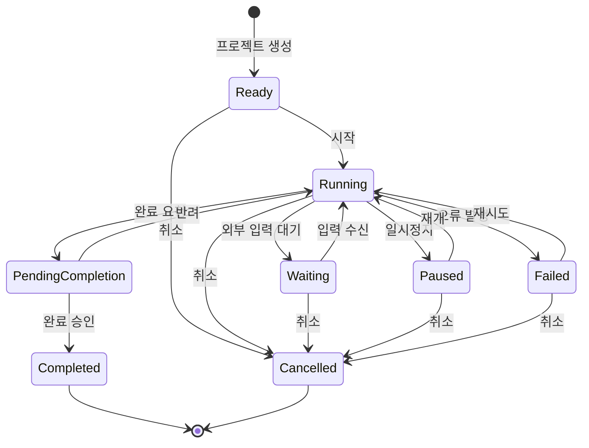
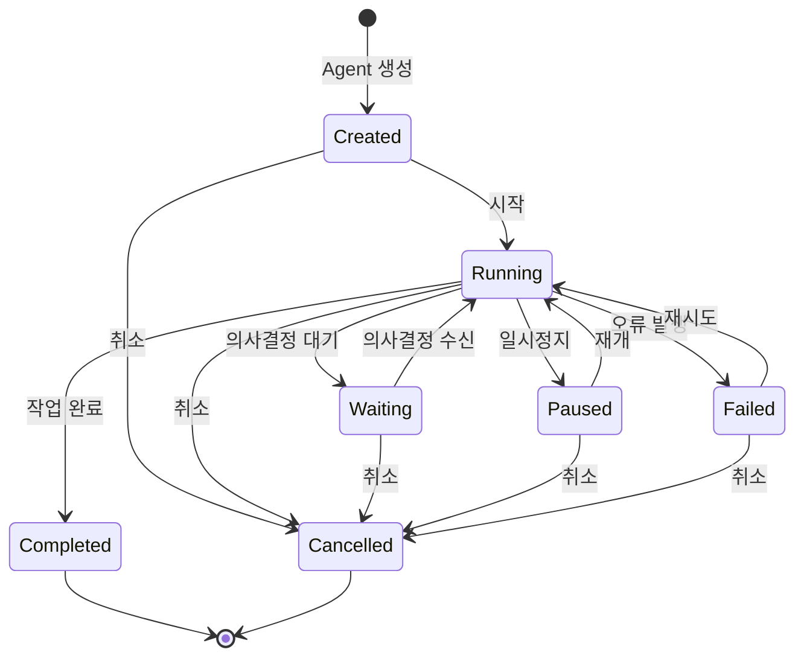
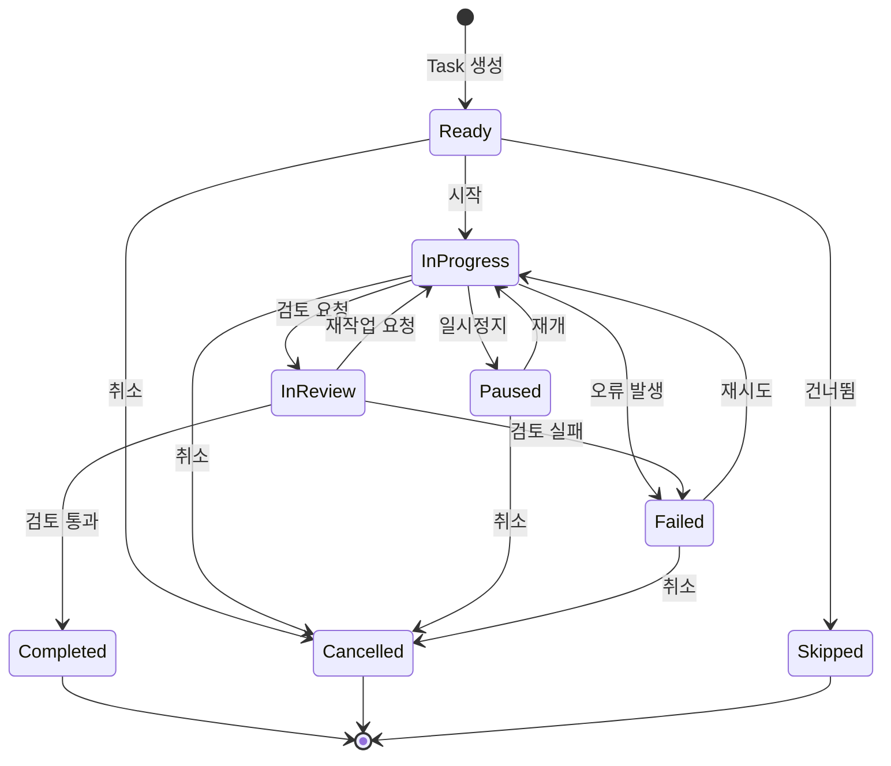
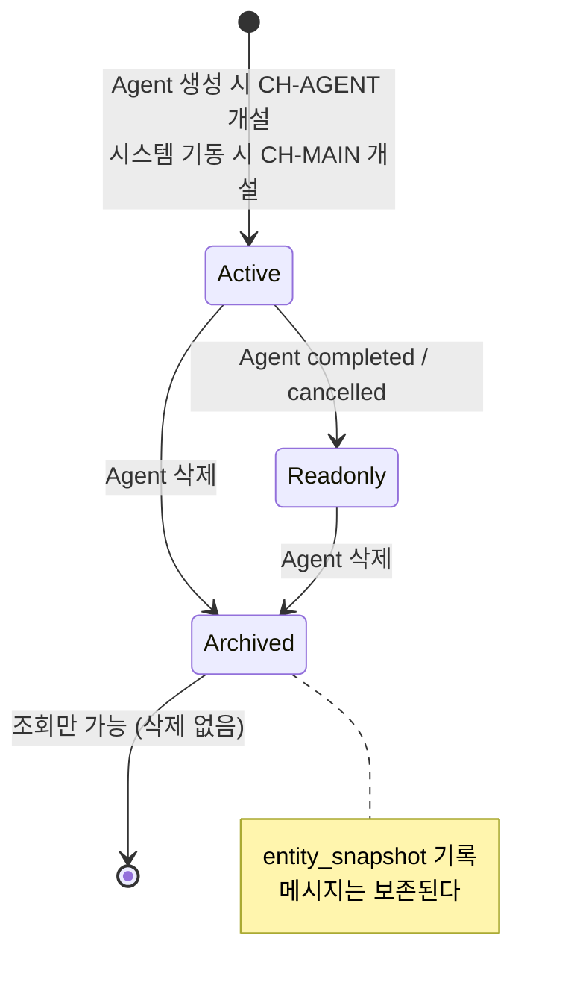
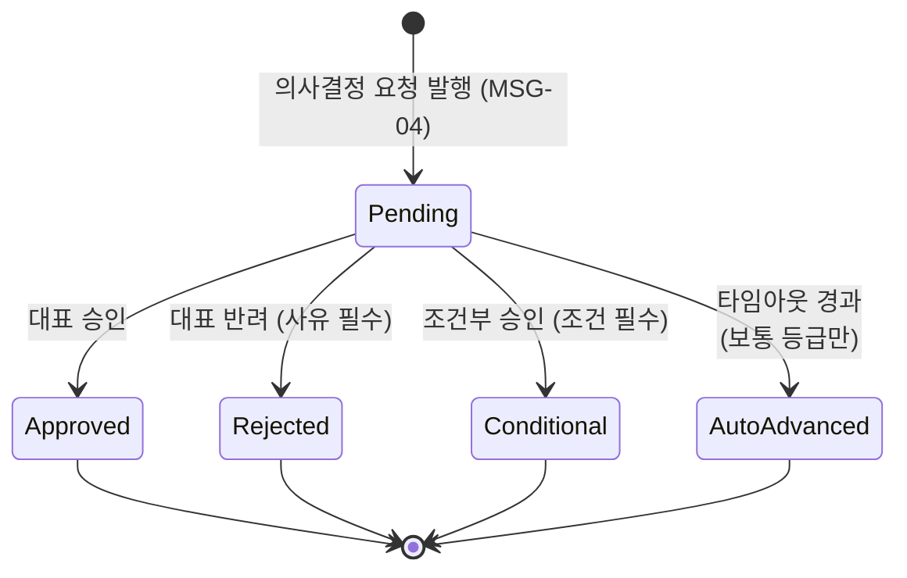
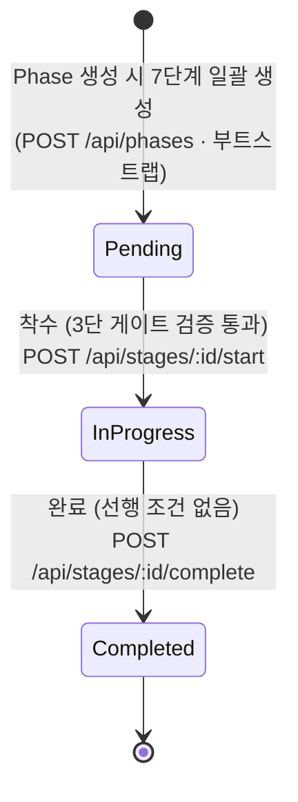

# DES-007 상태 흐름도

> Phase 1: 기반 구축
> 버전: **v2.2 (2026-09-02)** — §7 단계 완료 전이(`InProgress → Completed`)에 트리거·가드 명시 — 플로우 단절 보완 (대표 결정 A안)
> **원본**: [Notion DES-007](https://app.notion.com/p/3c5d066504ec8174881ad45d1cc9918b) · Git 동기화 2026-09-02
> 기준 원본 정책: Notion = 대표 승인 원본 / Git = 에이전트 실행 원본. 충돌 시 Notion 우선.

---

## 1. 개정 요약

| 구분 | v1 | **v2** |
|------|:---:|:---:|
| 상태 머신 | 3개 (Project · Agent · Task) | **6개** (+ Conversation · Approval · Stage) |
| Agent `waiting` | 단일 상태 | **`waiting_reason` 세분화** (D-11) |
| 애플리케이션 책임 전이 | 없음 | **1건** — Agent 삭제 → 대화 아카이브 (D-27) |

> **상태 머신을 한 문서에 모은다.** v1은 Project·Agent·Task만 다뤘고, 승인 상태 머신은 DES-014 §3-3에, 대화 채널 생명주기는 DES-013 §2에 흩어져 있었다. 상태 전이 검증은 한곳에서 구현되므로 정의도 한곳에 있어야 한다.

---

## 2. 프로젝트 상태 머신 (8개 상태)



```typescript
const PROJECT_TRANSITIONS = {
  ready:              ["running", "cancelled"],
  running:            ["waiting", "paused", "pending_completion", "failed", "cancelled"],
  waiting:            ["running", "cancelled"],
  paused:             ["running", "cancelled"],
  pending_completion: ["completed", "running"],
  failed:             ["running", "cancelled"],
  completed:          [],
  cancelled:          [],
};
```

---

## 3. Agent 상태 머신 (7개 상태) — **v2 개정**



```typescript
const AGENT_TRANSITIONS = {
  created:   ["running", "cancelled"],
  running:   ["waiting", "paused", "completed", "failed", "cancelled"],
  waiting:   ["running", "cancelled"],
  paused:    ["running", "cancelled"],
  failed:    ["running", "cancelled"],
  completed: [],
  cancelled: [],
};
```

### 3-1. `waiting` 사유 세분화 (D-11)

**신규 상태를 만들지 않는다.** D-11은 `blocked_on_ceo` 신설(B)을 기각하고 **기존 `waiting` 재사용 + 사유 필드**(A)를 채택했다. 상태 수를 늘리면 위 전이 맵과 모든 가드 조건이 함께 늘어난다.

```typescript
type WaitingReason =
  | 'ceo_approval'     // 대표 승인 대기 — 등급 높음 또는 APV-GATE
  | 'ceo_decision'     // 대표 응답 대기 — 등급 보통 (타임아웃 있음)
  | 'external_input';  // 그 외 외부 입력 대기
```

| 상태 | `waiting_reason` | 의미 |
|------|-----------------|------|
| `waiting` | `ceo_approval` | **무기한 대기.** 대표가 처리해야만 풀린다 |
| `waiting` | `ceo_decision` | 30분 후 자동 진행 (D-10) |
| `waiting` | `external_input` | 그 외 |

> **`status`가 `waiting`이 아니면 `waiting_reason`은 NULL이어야 한다.** DES-003의 `agents` 테이블에 CHECK 제약으로 강제한다.

### 3-2. `waiting` 진입·이탈 규칙

| 계기 | 전이 | `waiting_reason` |
|------|------|-----------------|
| 등급 **높음** 의사결정 요청 발행 | `running` → `waiting` | `ceo_approval` |
| **APV-GATE** 승인 요청 발행 | `running` → `waiting` | `ceo_approval` |
| 등급 **보통** 의사결정 요청 발행 | `running` → `waiting` | `ceo_decision` |
| 등급 **낮음** | **전이 없음** | — (자율 판단, 대화 미노출) |
| 대표 **승인**(`approved`) | `waiting` → `running` | NULL |
| 대표 **반려**(`rejected`) | **`waiting` 유지** | `ceo_approval` 유지 |
| 대표 **조건부 승인**(`conditional`) | `waiting` → `running` | NULL |
| **타임아웃 자동 진행**(`auto_advanced`) | `waiting` → `running` | NULL |

> **반려는 `running`으로 복귀하지 않는다.** 반려는 "다시 하라"는 뜻이므로 Agent는 대기 상태를 유지하고, 사유가 `MSG-01`로 대화에 기록된다. Agent가 사유를 읽고 새 안을 올리면 그때 다시 승인 사이클이 돈다 (DES-014 §3-3).

---

## 4. Task 상태 머신 (8개 상태)



---

## 5. 대화 채널 상태 머신 — **v2 신규** (D-27)



```typescript
const CONVERSATION_TRANSITIONS = {
  active:   ["readonly", "archived"],
  readonly: ["archived"],
  archived: [],          // 종료 상태 — 되돌리지 않는다
};
```

| 상태 | 발화 | 조회 | 검색 |
|------|:---:|:---:|:---:|
| `active` | ✅ | ✅ | ✅ |
| `readonly` | ❌ `CONVERSATION_ARCHIVED` | ✅ | ✅ |
| `archived` | ❌ `CONVERSATION_ARCHIVED` | ✅ | ✅ |

> **`archived`에서 되돌아가는 전이는 없다.** Agent 행이 이미 삭제되었으므로 되살릴 대상이 없다.
> **CH-MAIN은 어떤 전이도 하지 않는다.** 전역 단일 채널이고 삭제할 수 없다 (DES-013 §2).
> **CH-MAIN 생성 지점은 서버 `ready` 훅의 부트스트랩이다** (DES-002 v2.1 §5-1 · R-01). 부분 유니크 인덱스로 멱등이 보장되므로 매 기동마다 실행해도 안전하다.

### 5-1. ⚠ 애플리케이션이 책임지는 유일한 전이

`conversations.entity_id`에는 **FK가 없다** (D-27 — FK+CASCADE면 대화가 함께 삭제된다). 따라서 이 전이는 **DB가 보장하지 않고 애플리케이션이 책임진다.**

```
Agent 삭제 요청
  ├─ 1. 스냅샷 생성   { agentName, projectName, agentType }   ← agents 행이 살아 있을 때
  ├─ 2. conversations UPDATE  status='archived', entity_snapshot, archived_at
  ├─ 3. approvals UPDATE      status='rejected',                    ← v2.1 (R-04)
  │        resolution='system:agent_deleted',
  │        reason='요청 Agent 삭제로 자동 마감', resolved_at=now
  │        WHERE requested_by = <agentId> AND status = 'pending'
  └─ 4. agents DELETE
      (1~4는 하나의 트랜잭션)
```

> **3단계가 없으면 승인함이 오염된다 (v2.1 · R-04).** 삭제된 Agent가 올린 `pending` 승인은 아무도 처리할 수 없다 — 승인해도 재개할 Agent가 없다. `approvals`는 `requested_by`가 자유 텍스트라 FK로도 정리되지 않는다.
> 새 상태(`expired`)를 만들지 않고 기존 5종으로 처리한다. D-11이 "상태를 늘리면 전이 맵과 모든 가드가 함께 늘어난다"며 신규 상태를 기각한 것과 같은 원칙이다. 대표 반려와는 `resolution` 값으로 구분한다.

> **순서가 뒤집히면 데이터가 깨진다.** `agents`를 먼저 지우면 스냅샷을 만들 수 없어 **이름 없는 고아 대화**가 남는다. DES-004 v2 §13 참조.
> 이 전이는 DB 제약으로 막을 수 없으므로 **단위 테스트로 강제한다** — "Agent 삭제 후 대화가 조회되고 이름이 남아 있다".

---

## 6. 승인 상태 머신 — **v2 신규** (D-16 · D-18)

> DES-014 §3-3에 있던 정의를 여기로 통합한다.



```typescript
const APPROVAL_TRANSITIONS = {
  pending:       ["approved", "rejected", "conditional", "auto_advanced"],
  approved:      [],
  rejected:      [],
  conditional:   [],
  auto_advanced: [],
};
```

### 6-1. 가드 조건

| 가드 | 위반 시 |
|------|--------|
| `pending`이 아닌 건에 처리 시도 | `409 APPROVAL_ALREADY_RESOLVED` |
| `rejected`·`conditional`인데 사유 없음 | `400 APPROVAL_REASON_REQUIRED` |
| **`APV-GATE` → `auto_advanced`** | `422 GATE_AUTO_ADVANCE_FORBIDDEN` |
| `level='high'`인데 `deadline_at` 존재 | 요청 시점에 차단 (DB CHECK) |

> **`APV-GATE`는 `auto_advanced`로 전이할 수 없다.** 등급 검사로 차단한다. 게이트가 시간 경과로 통과되면 승인 게이트의 의미가 없다 (DES-014 §3-2).

### 6-2. 후속 동작

| 상태 | Agent | 단계(`stages`) |
|------|-------|------|
| `approved` | `waiting` → `running` | **바뀌지 않는다.** `APV-GATE`면 게이트만 열린다 (`gate.passed=true`) |
| `rejected` | **`waiting` 유지** + 사유를 `MSG-01` 기록 | **바뀌지 않는다.** 다음 단계 착수 차단이 유지된다 |
| `conditional` | `waiting` → `running` | 바뀌지 않는다. 조건을 `MSG-01` 기록 |
| `auto_advanced` | `waiting` → `running` | 바뀌지 않는다. `MSG-05`로 자동 진행 기록 |

> **승인은 `stages`를 전이시키지 않는다 (v2.1 정정 · R-03).**
> §7-1이 **"`POST /api/stages/:id/start`에서만 전이가 일어난다"**고 규정한다. 승인 처리에서도 단계를 바꾸면 3단 게이트 검증(직전 단계 완료 · 게이트 통과 · WIP)을 우회하는 두 번째 경로가 생긴다. 승인은 **게이트를 열어둘 뿐**이고 착수는 대표가 `cm stage start`로 한다.
>
> **반려는 직전 단계로 복귀시키지 않는다.** 게이트의 효력은 "다음 단계 착수 차단"이며, 반려는 그 차단이 **유지**되는 것으로 충분하다. 완료된 직전 단계를 되돌리면 그 단계의 `artifacts` 상태를 어떻게 다룰지가 새로 열린다(v2 §11 미해결과 같은 문제). 보완이 끝나면 **새 `APV-GATE`를 발행**해 다시 승인 사이클을 돈다.

---

## 7. 단계(Stage) 상태 머신 — **v2 신규** (FR-030)



```typescript
// v2.1 — 선형 3상태. 되돌아가는 전이는 없다 (R-03)
const STAGE_TRANSITIONS = {
  pending:     ["in_progress"],
  in_progress: ["completed"],
  completed:   [],
};
```

> **`in_progress → pending`(게이트 반려로 복귀)을 제거했다 (v2.1 · R-03).**
> 도달할 수 없는 전이였다 — 게이트를 통과하지 못하면 애초에 `in_progress`가 되지 못하므로, "게이트 반려로 `in_progress`에서 `pending`으로 돌아간다"는 상황 자체가 성립하지 않는다.
> 게이트 반려의 효력은 **대상 단계가 `pending`에 머무는 것**이고, 그것은 전이가 아니라 **전이가 일어나지 않는 것**이다. §6-2 참조.

### 7-1. 착수 가드 — 3단 검증

`Pending → InProgress` 전이는 `POST /api/stages/:id/start`**에서만** 일어난다. **게이트 검증(3단 가드)도 이 엔드포인트 한 곳에서만 수행된다 — 이것이 CLAUDE.md 스킬 전환 게이트의 유일한 강제 지점이다.**

| 순서 | 가드 | 위반 시 |
|:---:|------|--------|
| 1 | 직전 단계가 `completed`인가 | `422 INVALID_TRANSITION` |
| 2 | 게이트 필요 단계면 `APV-GATE`가 `approved`인가 | `403 GATE_NOT_PASSED` |
| 3 | WIP=1 위반인데 면제(`wip_waivers`)가 없는가 | `409 WIP_VIOLATION` |

### 7-1a. 완료 가드 — 선행 조건 없음 (**v2.2 신규 · 대표 결정 A안**)

`InProgress → Completed` 전이는 `POST /api/stages/:id/complete`가 담당한다. 가드는 상태 검사 하나뿐이다.

| 가드 | 위반 시 |
|------|--------|
| 대상 단계가 존재하는가 | `404 STAGE_NOT_FOUND` |
| 대상 단계가 `in_progress`인가 (`pending`·`completed`는 거부) | `422 INVALID_TRANSITION` |

> **게이트 검증(승인·WIP)을 여기에 걸지 않는다.** 산출물이 충분한지는 대표가 판단할 일이지 서버가 강제할 규칙이 아니다. 여기에 검사를 추가하면 §7-1의 "게이트 강제 지점은 `start` 한 곳뿐이다"가 두 곳으로 갈라진다 — R-03이 정리한 원칙과 정면으로 충돌한다.
> `phases.current_stage`도 이 엔드포인트가 바꾸지 않는다. 다음 단계 착수는 여전히 `POST /api/stages/:id/start`가 전담하며, 그 가드 1("직전 단계가 `completed`인가")이 이 엔드포인트로 완료 처리된 상태를 읽는다.

### 7-2. 게이트 필요 단계

CLAUDE.md 스킬 전환 모드에서 파생한다. **저장하지 않는다.**

| 전환 | 게이트 | 등급 |
|------|:---:|------|
| `plan` → `analyze` | ✅ 필수 | 높음 고정 |
| `analyze` → `design` | — | 자동 |
| `design` → `develop` | — | 자동 |
| `develop` → `test` | — | 자동 |
| `test` → `deploy` | ✅ 필수 | 높음 고정 |
| `deploy` → `operate` | — | 자동 |

> 자동 전환 단계에서도 **스킬 내부의 의사결정 등급 '높음' 항목은 별도 승인**이 필요하다. 이는 `APV-GATE`가 아니라 `APV-ARCH`·`APV-DEPLOY` 등으로 발행된다.

---

## 8. 엔티티 간 상태 연동 규칙

| 상위 변경 | 하위 영향 | 규칙 |
|----------|----------|------|
| Project → Cancelled | 소속 Agent → Cancelled | 실행 중/대기 중 Agent 일괄 취소 |
| Project → Paused | 소속 Agent → Paused | 실행 중 Agent 일괄 일시정지 |
| Agent → Cancelled | 소속 Task → Cancelled | 실행 중/대기 중 Task 일괄 취소 |
| Agent → Paused | 소속 Task → Paused | 실행 중 Task 일괄 일시정지 |
| **Agent → Completed / Cancelled** | **CH-AGENT → `readonly`** | **v2 신규.** 감사 추적을 위해 삭제하지 않는다 |
| **Agent 삭제** | **CH-AGENT → `archived`** | **v2 신규.** §5-1 순서 필수 (D-27) |
| **승인 `approved` (APV-GATE)** | **Stage 전이 없음** — 게이트만 열린다 | **v2.1 정정** — 착수는 `stages/:id/start` 전용 (§7-1) |
| **승인 `rejected` (APV-GATE)** | **Stage 전이 없음** — 대상 단계가 `pending`에 머문다 | **v2.1 정정** — 차단 유지가 반려의 효력 |
| **Agent 삭제** | **그 Agent의 `pending` 승인 → `rejected`** | **v2.1 신규 (R-04)** — `resolution='system:agent_deleted'` |

### 8-1. 가드 조건

- Agent 시작: 프로젝트가 `running` 또는 `waiting`일 때만 가능
- Task 시작: Agent가 `running`일 때만 가능
- **대화 발화: 채널이 `active`일 때만 가능** (v2)
- **단계 착수: §7-1 3단 검증 통과 시에만 가능** (v2)
- 종료 상태 불변: `completed` · `cancelled` · `skipped` · `archived`에서는 전이 불가

---

## 9. 전이 이벤트 브로드캐스트 — **v2 신규**

모든 상태 전이는 `status_changes` 기록과 **함께** WebSocket으로 발행한다 (NFR-003).

| 전이 | 채널 | 이벤트 |
|------|------|--------|
| Project · Agent · Task 상태 변경 | `WS /ws` | `status:changed` |
| 승인 생성 | `WS /ws` | `approval:created` |
| 승인 생성 (채널) | `WS /ws/conversations/:id` | `message:new` (MSG-04, `approvalId` 포함) |
| 승인 처리 | `WS /ws` + `WS /ws/conversations/:id` | `approval:updated` |
| 단계 상태 변경 | `WS /ws` | `stage:changed` |
| 새 메시지 | `WS /ws/conversations/:id` | `message:new` |

> **기록이 먼저, 발행이 나중이다.** 트랜잭션 커밋 후 브로드캐스트한다. 순서가 뒤바뀌면 롤백된 전이가 화면에 표시된다.
>
> **채널 WS에는 `approval:created`를 보내지 않는다 (v2.1 정정).** 승인 요청은 `MSG-04` 메시지로 발행되고(DES-004 v2 §15), 그 메시지가 `message:new`로 이미 채널에 전달된다. 프런트는 `approvalId`가 채워진 `MSG-04`를 액션 버튼 카드로 렌더링한다(DES-002 v2 §4). 같은 사건을 두 이벤트로 보내면 카드가 중복 렌더링된다.
> v2는 이 표에 양쪽 발행으로 적고 DES-002 §4·DES-004 `ConversationEvent`는 `approval:updated`만 두어 세 문서가 갈려 있었다. **DES-002·DES-004 쪽으로 통일한다.**
> Web Push 발송 대상 판정(NTF-05 등)은 **Phase 2**다. 터널링 연기로 원격 알림 자체가 Phase 2로 밀렸다.

---

## 10. Phase 2+ 확장 고려사항

| 기능 | 상태 흐름 영향 | 대상 Phase |
|------|--------------|:---:|
| 워크트리 기반 격리 (FR-013) | Agent 상태에 worktree_creating·worktree_cleaning 중간 상태 추가 검토. 또는 별도 상태 머신 분리 | 2~3 |
| 실시간 Agent Board (FR-014) | §9 브로드캐스트에 `agent:log` 추가 | 2 |
| 모바일 모니터링 PWA (FR-015) | 상태 흐름 변경 없음. 전이 이벤트를 Push로 전달만 추가 | 2 |

**참고**: Notion 요구사항 8장에서 Agent 상태는 8개(완료 대기 포함)이나 Phase 1 설계에서는 7개로 결정했다. Agent는 작업 완료 시 자동으로 `completed` 전이하고, Project만 대표 승인 후 완료(`pending_completion`)한다.

---

## 11. 미해결 사항 (해소 이력 포함)

| 항목 | 내용 | 등급 | 처리 시점 |
|------|------|:---:|----------|
| ~~`agents.waiting_reason` 컬럼 부재~~ | ✅ **반영 완료 (2026-09-01)** — DES-003 v2 §3-4에 컬럼 + CHECK 제약 추가 | 보통 | 완료 |
| ~~`stages` 복귀 전이 미검증~~ | ✅ **해소 (2026-09-02 · R-03)** — 복귀 전이 자체를 제거했다. 게이트 반려는 대상 단계를 `pending`에 머물게 할 뿐이므로 "이미 생성된 산출물을 어떻게 다룰지"라는 문제가 발생하지 않는다 | 낮음 | 완료 |
| **부트스트랩 실패 시 기동 정책** | DES-002 v2.1 §5-1은 시드 실패 시 **서버를 기동시키지 않는다**고 규정한다. 재시도·복구 절차는 develop에서 정한다 | 낮음 | develop |

---

## 변경 이력

| 버전 | 날짜 | 내용 |
|------|------|------|
| v1 | 2026-08-23 | 최초 작성 (Phase 1 설계) |
| v1.1 | 2026-08-24 | Phase 2+ 확장 고려사항 추가 |
| — | 2026-09-01 | Git 동기화 + 승인 반영 필요 항목 주석 추가 (내용 변경 없음) |
| **v2** | 2026-09-01 | **승인 반영 개정.** 상태 머신 3개 → **6개** — 대화 채널(§5) · 승인(§6) · 단계(§7) 신설.<br>**Agent `waiting`에 `waiting_reason` 3종 도입**(D-11, 신규 상태 미생성), 진입·이탈 규칙 8건 정의. **반려는 `running`으로 복귀하지 않는다**를 명시.<br>**애플리케이션 책임 전이 1건 명시**(§5-1 Agent 삭제 → 대화 아카이브, FK 없음 · 순서 필수 · 단위 테스트로 강제).<br>엔티티 연동 4건 추가, 전이 이벤트 브로드캐스트 규약 신설(§9). 미해결 2건 등록 |
| **v2.1** | 2026-09-02 | **교차 검증 정정 (승인 R-03·R-04).**<br>**§7 단계 상태 머신을 선형 3상태로 단순화** — `in_progress → pending`(게이트 반려 복귀)은 **도달 불가능한 전이**였다. 게이트를 통과 못하면 `in_progress`가 되지 못하므로 그 상황이 성립하지 않는다.<br>**§6-2 후속 동작 정정** — 승인 처리는 `stages`를 전이시키지 않는다. v2는 `approved`에 "다음 단계 `in_progress`", `rejected`에 "직전 단계로 복귀"라 적었으나, §7-1의 **"`stages/:id/start`에서만 전이"**와 충돌해 3단 게이트 검증 우회 경로가 되었다. 승인은 게이트를 열 뿐이고 착수는 별도 명령이다.<br>**§5-1에 pending 승인 자동 마감 추가**(R-04) — Agent 삭제 트랜잭션 3단계. `resolution='system:agent_deleted'`. 없으면 승인함에 영구 잔류했다. §8 연동 규칙 3건 갱신.<br>**§9 채널 WS의 `approval:created` 제거** — `MSG-04`의 `message:new`와 중복 발행이라 카드가 두 번 렌더링된다. DES-002 §4 · DES-004 `ConversationEvent`와 통일.<br>§11 미해결 "`stages` 복귀 전이 미검증" **해소**, 부트스트랩 실패 정책 1건 신규 등록 |
| **v2.2** | 2026-09-02 | **`InProgress → Completed` 전이에 트리거·가드 명시 (대표 결정 A안) — 플로우 단절 보완.** v2.1은 이 전이를 다이어그램에 화살표만 그려두고(`완료`) 어떤 API가 호출하는지, 어떤 가드를 거치는지 적지 않았다. `Pending → InProgress`에는 "착수 (3단 게이트 검증 통과)"가 붙어 있던 것과 비대칭이었다.<br>**mermaid 다이어그램에 `POST /api/stages/:id/complete` 명시**. **§7-1a 신설** — 완료 가드는 상태 검사(대상 존재·`in_progress` 여부) 하나뿐이며, 게이트·WIP 검증은 걸지 않는다(선행 조건 없음). 산출물 충분성은 대표 판단 영역이라는 근거를 명시.<br>**§7-1 문구 정정** — "`POST /api/stages/:id/start`에서만 전이가 일어난다"를 "`Pending → InProgress` 전이는 `start`에서만 일어난다"로 좁혀, `complete`가 담당하는 `InProgress → Completed` 전이와 모순되지 않게 했다. **"게이트 검증은 `start` 한 곳에서만"이라는 R-03의 취지는 그대로 유지**된다 — `complete`에는 게이트 검증 자체가 없기 때문이다.<br>DES-002 v2.4 `POST /api/stages/:id/complete` 신규 반영 |
