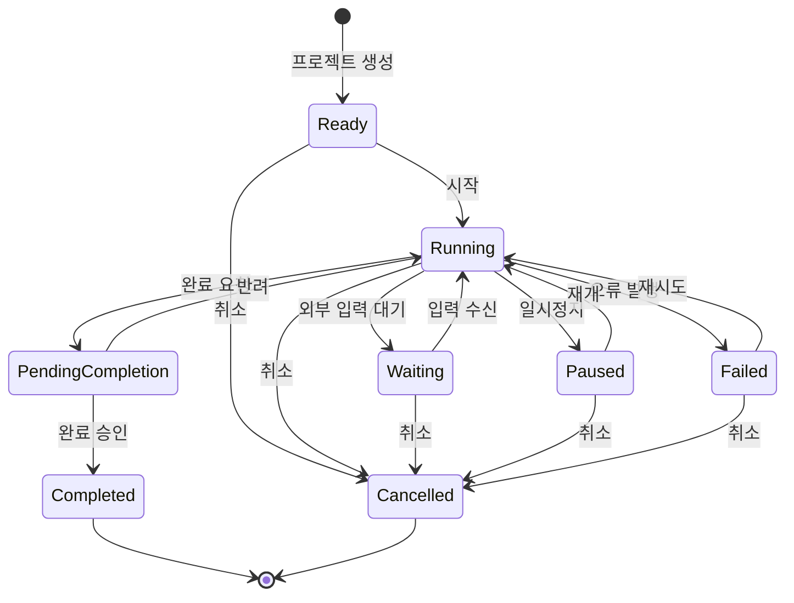
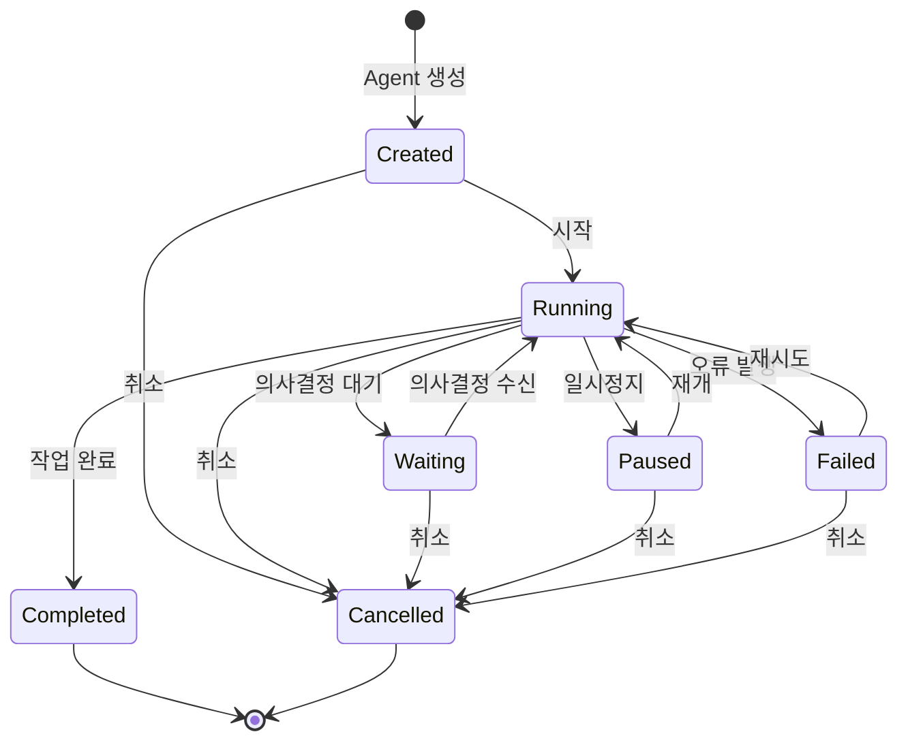
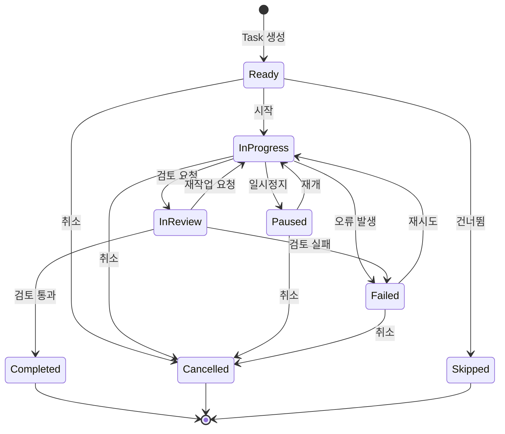

# DES-007 상태 흐름도

> Phase 1: 기반 구축
> 작성일: 2026-08-23
> **원본**: [Notion DES-007](https://app.notion.com/p/3c5d066504ec8174881ad45d1cc9918b) · Git 동기화 2026-09-01
> 기준 원본 정책: Notion = 대표 승인 원본 / Git = 에이전트 실행 원본. 충돌 시 Notion 우선.

> **⚠ 개정 대기 (2026-09-01 승인 반영)**
> D-11 승인에 따라 Agent `waiting` 상태에 **「대표 응답 대기」 사유 필드**를 추가해야 한다. 개정 규모 소.

---

## 프로젝트 상태 머신 (8개 상태)



### 허용 전이 맵 (코드용)

```typescript
const PROJECT_TRANSITIONS = {
  ready:              ["running", "cancelled"],
  running:            ["waiting", "paused", "pending_completion", "failed", "cancelled"],
  waiting:            ["running", "cancelled"],
  paused:             ["running", "cancelled"],
  pending_completion: ["completed", "running"],
  failed:             ["running", "cancelled"],
  completed:          [],
  cancelled:          [],
};
```

---

## Agent 상태 머신 (7개 상태)



---

## Task 상태 머신 (8개 상태)



---

## 엔티티 간 상태 연동 규칙

| 상위 변경 | 하위 영향 | 규칙 |
|----------|----------|------|
| Project → Cancelled | 소속 Agent → Cancelled | 실행 중/대기 중 Agent 일괄 취소 |
| Project → Paused | 소속 Agent → Paused | 실행 중 Agent 일괄 일시정지 |
| Agent → Cancelled | 소속 Task → Cancelled | 실행 중/대기 중 Task 일괄 취소 |
| Agent → Paused | 소속 Task → Paused | 실행 중 Task 일괄 일시정지 |

### 가드 조건

- Agent 시작: 프로젝트가 Running 또는 Waiting일 때만 가능
- Task 시작: Agent가 Running일 때만 가능
- 종료 상태 불변: Completed, Cancelled, Skipped에서는 전이 불가

---

## Phase 2+ 확장 고려사항

> Orca ADE 분석 결과 반영 (2026-08-24).

| 기능 | 상태 흐름 영향 | 대상 Phase |
|------|--------------|:---:|
| 워크트리 기반 격리 (FR-013) | Agent 상태에 worktree_creating, worktree_cleaning 중간 상태 추가 검토. 또는 워크트리 상태를 별도 상태 머신으로 분리 | 2~3 |
| 실시간 Agent Board (FR-014) | 상태 전이 이벤트를 WebSocket으로 브로드캐스트. 기존 status_changes 테이블 기록과 병행 | 2 |
| 모바일 모니터링 PWA (FR-015) | 상태 흐름 변경 없음. 기존 상태 전이 이벤트를 Push 알림으로 전달만 추가 | 4 |

**참고**: Notion 요구사항 8장에서 Agent 상태는 8개(완료 대기 포함)이나, Phase 1 설계에서는 7개(완료 대기 제거)로 결정. 근거: Agent는 작업 완료 시 자동으로 Completed 전이, Project만 CEO 승인 후 완료(PendingCompletion).

---

## ⚠ 2026-09-01 승인 반영 필요 항목

| 항목 | 필요한 변경 | 근거 |
|------|-----------|------|
| Agent `waiting` | **사유 필드 추가** — `waiting_reason: 'ceo_approval' \| 'external_input'`. 신규 상태(`blocked_on_ceo`)를 만들지 않고 기존 상태를 재사용 | D-11 |
| Agent `waiting` 진입 | 의사결정 요청(MSG-04) 등급 **높음** 또는 **APV-GATE** 발행 시 자동 진입 | DES-013 §3-4 |
| Agent `waiting` 이탈 | 대표 승인·반려 시 `running` 복귀. 반려면 사유가 MSG-01로 대화에 기록 | DES-014 §3-3 |
| 전이 이벤트 | 상태 전이 시 Web Push 발송 대상 판정 (NTF-05 Agent failed 등) | D-21, DES-015 §5-1 |

---

## 변경 이력

| 버전 | 날짜 | 내용 |
|------|------|------|
| v1 | 2026-08-23 | 최초 작성 (Phase 1 설계) |
| v1.1 | 2026-08-24 | Phase 2+ 확장 고려사항 추가 |
| — | 2026-09-01 | **Git 동기화** + 승인 반영 필요 항목 주석 추가 (내용 변경 없음) |
