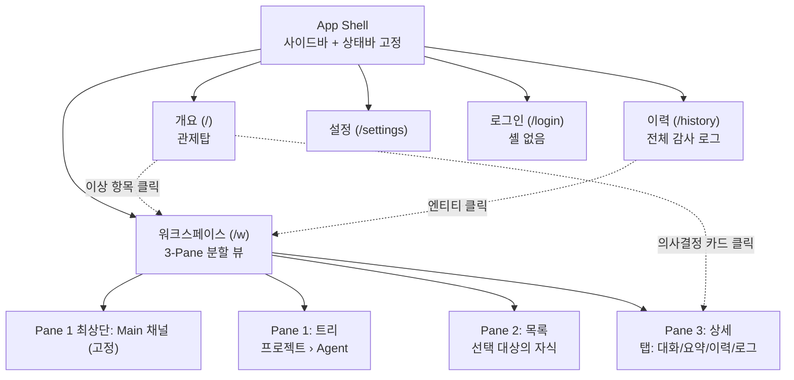

# DES-012 UI 레이아웃 · 정보구조 설계서

> Phase 2: 웹 대시보드
> 문서코드: DES-012
> 버전: v2 (2026-09-01) — 대화(Main/Agent) 인터페이스 레이아웃 반영
> 범위: UX 분석 · 정보구조(IA) · 레이아웃 시스템 · 와이어프레임 · 컴포넌트 체계

> **대표 승인 필요 — 의사결정 등급 "높음"**
> 본 문서는 현행 DES-011이 전제한 네비게이션 구조의 변경을 제안한다. §9 의사결정 요청을 먼저 검토할 것.
> 승인 시 DES-011의 화면 경로·전이 매트릭스를 개정한다. 미승인 시 현행 DES-011 구조를 유지한다.

> Phase 1은 CLI 전용이다. CLI의 "레이아웃"(출력 포맷·컬럼 폭·박스)은 DES-006 v2에 확정되어 있으며 본 문서는 건드리지 않는다.

---

## 1. 문제 정의 — 현행 설계의 구조적 문제

현행 DES-011은 **GNB + Breadcrumb + 엔티티별 독립 페이지 드릴다운** 구조다. 평범한 관리자 페이지 패턴이지만, 이 제품의 사용 맥락과 맞지 않는다.

| # | 문제 | 근거 | 영향 |
|---|------|------|------|
| P-1 | 탐색 깊이 6단계 | 대시보드 → 프로젝트 목록 → 상세 → Agent 목록 → 상세 → Task 목록 → 상세 | "지금 어디가 막혔나"를 3초 안에 판단할 수 없다 |
| P-2 | 맥락 상실 | Task 상세 진입 시 형제 Task·상위 Agent 상태가 화면에서 사라짐 | 비교·순회 불가, Breadcrumb 왕복 |
| P-3 | 단일 사용자에 과잉한 라우팅 | 사용자가 대표 1명. 공유·협업·권한분리 없음 | URL 공유를 위한 페이지 분리의 효익이 거의 없다 |
| P-4 | 실시간성과 페이지 전환의 충돌 | WebSocket으로 상태가 계속 변하는데 페이지를 떠나면 변화를 놓침 | 모니터링 도구의 핵심 가치 훼손 |
| P-5 | 드로어 남용 | 상태 이력·로그를 모두 드로어(DRW-01/02)로 처리 | 본문을 가려 "본문과 이력 동시 보기" 불가 |
| P-6 | 대화 채널 부재 | 대표가 Main·Agent와 대화할 자리가 설계에 없음 | 제품 핵심 상호작용이 화면에 존재하지 않음 (→ DES-013) |

### 핵심 질문

> 대표가 이 대시보드를 여는 이유는 무엇인가?
> → **"지금 무엇이 돌고 있고, 무엇이 멈춰 있으며, 내가 결정해줘야 할 것은 무엇인가"**를 확인하고, 그에 답하려고.
> 이건 CRUD 관리 화면이 아니라 **관제탑 + 지휘 채널**이다. 레이아웃은 그에 맞게 설계되어야 한다.

---

## 2. 레퍼런스 분석

동일한 문제(계층적 실행 단위 · 실시간 상태 · 이력 추적)를 푸는 제품들을 조사했다.

| 제품 | 도메인 | 채택한 레이아웃 패턴 | 우리에게 주는 시사점 |
|------|--------|---------------------|---------------------|
| Linear | 이슈 트래킹 | 좌측 사이드바 + 목록/상세 분할(split) · 36px 고밀도 행 · Cmd+K 커맨드 팔레트 · 키보드 우선 | **계층 탐색을 페이지 전환이 아닌 패널 분할로 해결.** 단일·고빈도 사용자에 최적 |
| Langfuse | AI 에이전트 관측 | Trace 목록 + 우측 상세 패널 · 그래프 뷰(Aggregated/Expanded 2모드) | 에이전트 실행은 목록과 구조도를 모두 요구한다. 뷰 전환으로 해결 |
| LangSmith | AI 에이전트 관측 | 실행 그래프 + 노드별 state diff · 툴 호출을 별도 자료구조로 강조 | **상태 변화를 전/후 대조로** 보여주는 것이 핵심. status_changes에 그대로 적용 가능 |
| Temporal Web UI | 워크플로 오케스트레이션 | Workflow 목록 → 상세 내 탭(Summary/History/Workers) · 상태 배지 중심 | **이력을 드로어가 아닌 본문 탭으로.** 이력은 부수가 아니라 1급 콘텐츠 |
| Airflow | 데이터 파이프라인 | Grid 뷰(시간×태스크 매트릭스) + Graph 뷰 · 색상 블록으로 상태 표현 | **색상 블록 매트릭스**로 수십 건을 한 화면에. 실패 지점을 즉시 발견 |
| Prefect / Dagster | 워크플로 | 현대적 사이드바 셸 · 실시간 상태 갱신 | 사이드바 셸은 이 도메인의 사실상 표준 |
| shadcn/ui blocks | 구현 레퍼런스 | 접기식 사이드바 + 톱바 + 콘텐츠 · TanStack 데이터테이블 · Recharts | DES-010의 Tailwind 결정과 정합. 직접 구현 기반으로 사용 가능 |

### 공통 결론

1. 이 도메인에서 **엔티티별 독립 페이지 드릴다운을 쓰는 제품은 없다.** 전부 사이드바 + 목록/상세 분할이다.
2. **상태는 색상 배지로, 이력은 1급 콘텐츠로** 다룬다.
3. **키보드 네비게이션과 커맨드 팔레트**는 단일 고빈도 사용자 제품의 기본값이다.
4. 개요 화면은 **집계 숫자보다 "이상 항목 우선 나열"**이 더 유용하다.

---

## 3. UX 설계 원칙

| # | 원칙 | 의미 | 구체적 규칙 |
|---|------|------|------------|
| U-1 | 3클릭 안에 모든 것 | 어느 Task든 3번 이내 도달 | 사이드바에서 선택 → 목록에서 행 선택 → 상세 패널. 페이지 전환 없음 |
| U-2 | 맥락을 잃지 않는다 | 상세를 봐도 목록이 사라지지 않는다 | 분할 뷰 고정. 전체화면은 명시적 토글로만 |
| U-3 | 이상이 먼저 보인다 | 정상은 조용하게, 이상은 크게 | failed·승인대기를 개요 최상단에 고정. 정상은 집계 수치로만 |
| U-4 | 파괴적 작업은 느리게 | 되돌릴 수 없는 것은 마찰을 둔다 | 영향 범위 수치 표시 + 확인 체크박스 (DES-011 §4-3 유지) |
| U-5 | 키보드가 1급 입력 | 마우스 없이 전체 조작 가능 | Cmd+K 팔레트, j/k 행 이동, Enter 선택, Esc 닫기 |
| U-6 | 상태 변화는 자명하게 | 무슨 일이 일어났는지 별도 조회 없이 보인다 | 상태 배지는 `이전 → 현재` 형태로 전이 직후 3초간 표시 |
| U-7 | 대화가 조작과 같은 화면에 | 지시와 결과 확인이 분리되지 않는다 | 대화는 별도 페이지가 아니라 상세 패널의 1급 탭 (DES-013) |

---

## 4. 정보구조 (IA)

### 4-1. 사이트맵



### 4-2. 화면 재정의 (현행 DES-011 대비)

| 현행 DES-011 | DES-012 제안 | 변경 사유 |
|--------------|-------------|----------|
| SCR-W-L01 로그인 (`/login`) | 유지 | 셸 없는 단독 화면 |
| SCR-W-D01 대시보드 (`/`) | **SCR-W-OV 개요**로 재정의 | 집계 타일 중심 → **이상 항목·의사결정 우선 나열**로 성격 변경 (U-3) |
| P01/P02/A01/A02/T01/T02 (6개 페이지) | **SCR-W-WS 워크스페이스 1개**로 통합 | 드릴다운 6단계 → 3-Pane 동시 표시 (P-1, P-2 해소) |
| SCR-W-H01 상태 이력 (`/history`) | 유지 | 전체 감사용. 엔티티별 이력은 상세 패널 탭으로 이관 (P-5 해소) |
| SCR-W-S01 설정 (`/settings`) | 유지 | 저빈도 화면 |
| DRW-01 상태 이력 드로어 | **폐지** → 상세 패널 [이력] 탭 | 드로어가 본문을 가림. Temporal 패턴 채용 |
| DRW-02 실시간 로그 드로어 | **폐지** → 상세 패널 [로그] 탭 | 동일 |
| MOD-01~07 모달 7종 | **전수 유지** | DES-011 §4 명세가 유효. 파괴적 작업 가드는 그대로 필요 |
| — | **CMD-01 커맨드 팔레트** (신규) | Cmd+K. 전역 검색·이동·상태변경 (U-5) |
| — | **CH-MAIN / CH-AGENT 대화 채널** (신규) | 대표 ↔ Main/Agent 지휘 채널 (P-6, DES-013) |

> **화면 수 10개 → 5개, 오버레이 9개 → 8개.** 구현 범위가 줄면서 도달 깊이도 6단계 → 3단계로 줄어든다.

---

## 5. 레이아웃 시스템

### 5-1. App Shell (전 인증 화면 공통)

```
┌───────────────────────────────────────────────────────────────────────────┐
│ ● cm   개요   워크스페이스   이력   설정          ⌘K 검색    ●연결  ◑  ⚙ │ 48px 상태바
├────────────┬──────────────────────────────────────────────────────────────┤
│            │                                                              │
│ 사이드바    │                    콘텐츠 영역                                │
│  240px     │                    (화면별 구성)                              │
│  접기 가능  │                                                              │
│  →  56px   │                                                              │
│            │                                                              │
├────────────┴──────────────────────────────────────────────────────────────┤
│ 토스트 스택 (우하단, 3초 자동 소멸, 최대 3개 적층)                            │
└───────────────────────────────────────────────────────────────────────────┘
```

| 영역 | 크기 | 내용 | 비고 |
|------|------|------|------|
| 상태바 | 높이 48px 고정 | 로고, 주메뉴 4개, 검색 트리거(⌘K), WS 연결 배지, 테마 토글, 설정 | 스크롤 시 고정(sticky) |
| 사이드바 | 폭 240px / 접으면 56px | 화면별로 내용이 바뀜 — 워크스페이스에서는 Main 채널 + 프로젝트›Agent 트리 | 폭 드래그 조절, localStorage 기억 |
| 콘텐츠 | 나머지 전부 | 화면별 구성 | 최소 폭 720px 보장 |
| 토스트 | 우하단 고정 | 성공/실패 1행 + 선택적 [실행 취소] | 우상단(DES-011)에서 **우하단으로 변경** — 상태바와 충돌 회피 |

### 5-2. 그리드 · 간격 · 밀도

| 항목 | 값 | 근거 |
|------|-----|------|
| 기본 단위 | 4px (Tailwind 기본 spacing scale) | DES-010 Tailwind 결정과 정합 |
| 표 행 높이 | **36px** (compact) / 44px (comfortable) 전환 | Linear 기준. 한 화면에 20행 이상 확보 |
| 카드 내부 여백 | 16px | — |
| 섹션 간 간격 | 24px | — |
| 본문 타이포 | 14px / 행간 20px | 고밀도 목록에 적합 |
| 보조 타이포 | 12px (타임스탬프·ID) | dim 처리 |
| 등폭 글꼴 | ID·상태코드·타임스탬프에 적용 | 8자 ID 정렬을 위해 필수 |
| 최소 클릭 영역 | 32×32px | 접근성 최소치 |

---

## 6. 화면별 와이어프레임

### 6-1. SCR-W-OV 개요 (관제탑)

```
┌──────────────────────────────────────────────────────────────────────────┐
│ ● cm  [개요] 워크스페이스 이력 설정        ⌘K      ● 연결됨   ◑   ⚙       │
├──────────────────────────────────────────────────────────────────────────┤
│                                                                          │
│  ⚠ 내 결정이 필요합니다 (2)                            ← U-3: 최상단 고정  │
│  ┌────────────────────────────────────────────────────────────────────┐  │
│  │ 🔴 dev-sub-01 · 실패 (재시도 2/3)                                   │  │
│  │    my-web-app › 인증 API 구현 · 12분 전                              │  │
│  │                                    [ 재시도 ]  [ 대화 ]  [ 취소 ]    │  │
│  ├────────────────────────────────────────────────────────────────────┤  │
│  │ 🟡 배포 승인 대기 · deploy 스킬 · 등급 높음                           │  │
│  │    api-server › 프로덕션 배포 · 3분 전                                │  │
│  │                                    [ 승인 ]  [ 대화 ]  [ 반려 ]      │  │
│  └────────────────────────────────────────────────────────────────────┘  │
│                                                                          │
│  진행 상황                                                                │
│  ┌──────────┬──────────┬──────────┬──────────┐                          │
│  │ 프로젝트  │  Agent   │   Task   │  실패     │   ← 클릭 시 워크스페이스로 │
│  │  3 실행중 │  5 실행중 │ 12 진행중 │  1 실패   │      필터 적용된 채 이동  │
│  └──────────┴──────────┴──────────┴──────────┘                          │
│                                                                          │
│  프로젝트                                                    [+ 새 프로젝트]│
│  ┌────────────────────────────────────────────────────────────────────┐  │
│  │ ● my-web-app          running    Agent 2  ████████░░ 8/10  2분 전   │  │
│  │ ● api-server          running    Agent 3  ██████░░░░ 6/10  5분 전   │  │
│  │ ○ docs-site           completed  Agent 1  ██████████ 4/4   1일 전   │  │
│  └────────────────────────────────────────────────────────────────────┘  │
│                                                                          │
│  최근 활동                                                    [전체 이력 →]│
│  11:20  task    DB 스키마 구현      in_review  → completed    user       │
│  11:15  agent   dev-sub-01          running    → failed       system     │
│  11:10  task    인증 API 구현        ready      → in_progress  user       │
└──────────────────────────────────────────────────────────────────────────┘
```

> **핵심 변경**: 현행 DES-011은 집계 타일 4개를 최상단에 놓았다. 그러나 대표가 이 화면에서 실제로 해야 할 일은 **"승인과 재시도 판단"**이다. 따라서 〈내 결정이 필요합니다〉 블록을 최상단에 두고, 집계는 그 아래로 내린다. 이 블록은 CLAUDE.md의 **의사결정 등급 "높음/보통"** 항목과 DES-013의 의사결정 요청(MSG-04)이 직접 흘러들어오는 자리다.

### 6-2. SCR-W-WS 워크스페이스 (3-Pane) — 핵심 화면

```
┌────────────────────────────────────────────────────────────────────────────────────┐
│ ● cm  개요 [워크스페이스] 이력 설정      ⌘K       ● 연결됨   ◑   ⚙                  │
├──────────────┬─────────────────────────────────┬───────────────────────────────────┤
│ Pane 1 트리   │ Pane 2 목록                     │ Pane 3 상세                        │
│ 240px        │ 유동 (최소 320px)                │ 420px (드래그 조절)                 │
├──────────────┼─────────────────────────────────┼───────────────────────────────────┤
│ ▣ Main   ●2  │ Task  ⌕검색   상태▾  [+ Task]   │ 인증 API 구현              [⋯][×] │
│ ──────────   │ ───────────────────────────────  │ ───────────────────────────────── │
│              │ ● y5z6a7b8 인증 API 구현        │ ● in_progress    ready → in_prog. │
│ ▾ ● my-web-  │   in_progress      11:10        │                                   │
│     app      │ ─────────────────────────────── │ [ 검토 요청 ] [ 일시정지 ] [ 실패 ]│
│   ▾ ● dev-   │ ○ u1v2w3x4 DB 스키마 구현       │                                   │
│      sub-01  │   completed        11:15        │ ┌ 대화 ┬ 요약 ┬ 이력 ┬ 로그 ┐     │
│      2/3 ⟳   │ ─────────────────────────────── │ │                              │  │
│   ▸ ○ test-  │ ○ c9d0e1f2 프로젝트 API         │ │ ID       y5z6a7b8-...        │  │
│      sub-01  │   ready            11:20        │ │ Agent    dev-sub-01 →        │  │
│              │                                 │ │ 설명     JWT 기반 로그인      │  │
│ ▸ ● api-     │                                 │ │ 생성     08-24 10:37:30      │  │
│     server   │                                 │ │ 수정     08-24 11:10:00      │  │
│              │                                 │ │                              │  │
│ ▸ ○ docs-    │                                 │ │ 허용 전이                     │  │
│     site     │                                 │ │ in_review · paused · failed  │  │
│ ─────────    │                                 │ └──────────────────────────────┘  │
│ [+ 프로젝트]  │  3 tasks · 1 in_progress        │                                   │
└──────────────┴─────────────────────────────────┴───────────────────────────────────┘
     ↑                    ↑                              ↑
  선택 → Pane 2 갱신   선택 → Pane 3 갱신          탭 전환은 Pane 3 안에서만
```

#### Pane 연동 규칙

| Pane 1 선택 | Pane 2 내용 | Pane 3 기본값 | URL |
|-------------|------------|--------------|-----|
| **Main** (고정 항목) | 대화 이력 요약 · 진행 중 위임 목록 | Main 대화 (전체폭 2-Pane 모드) | `/w/main` |
| 프로젝트 | 해당 프로젝트의 **Agent 목록** | 프로젝트 상세 | `/w/p/:projectId` |
| Agent | 해당 Agent의 **Task 목록** | Agent 상세 (기본 탭 = 대화) | `/w/a/:agentId` |
| (Pane 2에서 행 선택) | 유지 | 해당 행의 상세로 교체 | `/w/a/:agentId?sel=:taskId` |

> URL은 유지하되 **페이지 전환이 아니라 상태 복원용**으로만 쓴다. 새로고침·북마크는 동작하고, 화면 전환 애니메이션은 없다.

### 6-3. Pane 3 상세 패널 — 탭 구성

| 탭 | 대상 | 내용 | 데이터 출처 |
|----|------|------|-----------|
| **대화** | Main · Agent | 지휘 채널. 보고·의사결정 요청·응답 (DES-013) | WS /ws/conversations/:id |
| 요약 | 전 엔티티 | DES-011에 정의된 필드 전체 + 허용 전이 목록 | GET /api/{type}/:id |
| 이력 | 전 엔티티 | 시각·From·To·변경자. 전이를 `이전 → 현재` 쌍으로 대조 표시 | GET /api/status-changes?entityId= |
| 로그 | Agent만 | 실시간 스트림. 레벨 필터, 자동스크롤 토글 | WS /ws/agents/:id/logs |
| 연결 | 프로젝트·Agent | 하위 엔티티 상태 요약(건수 · 상태별 분포 막대) | 집계 |

기본 탭: **Agent = 대화**, 프로젝트·Task = 요약.

### 6-4. CMD-01 커맨드 팔레트 (신규)

```
                  ┌────────────────────────────────────────────┐
                  │ ⌕  인증                                     │
                  ├────────────────────────────────────────────┤
                  │ TASK                                        │
                  │  ● 인증 API 구현        dev-sub-01  진행중  │
                  │  ○ 인증 미들웨어 리뷰    test-sub-01 준비   │
                  │ ─────────────────────────────────────────── │
                  │ 명령                                        │
                  │  →  Main에게 지시                     ⌘⇧M  │
                  │  →  Agent 시작                        ⌘⇧S  │
                  │  →  Task 생성                         ⌘N   │
                  │  →  이력 보기                         ⌘H   │
                  │ ─────────────────────────────────────────── │
                  │ ↑↓ 이동   ↵ 실행   esc 닫기                  │
                  └────────────────────────────────────────────┘
```

| 항목 | 내용 |
|------|------|
| 호출 | `⌘K` / `Ctrl+K`, 상태바 검색 클릭 |
| 검색 대상 | 프로젝트명, Agent명, Task 제목, ID 앞 8자리 |
| 실행 명령 | Main에게 지시, 상태 변경, 생성, 화면 이동, 테마 전환 |
| 파괴적 명령 | 팔레트에서 **직접 실행하지 않고** 해당 모달(MOD-05/06)을 연다 (U-4) |
| 닫기 | `Esc`, 바깥 클릭, 명령 실행 후 자동 |

### 6-5. 키보드 명세

| 키 | 동작 | 범위 |
|----|------|------|
| `⌘K` | 커맨드 팔레트 | 전역 |
| `j` / `k` | 목록 다음/이전 행 | Pane 2 포커스 시 |
| `↑` / `↓` | 동일 | 동일 |
| `↵` | 선택 → Pane 3으로 포커스 이동 | Pane 2 |
| `←` / `→` | Pane 간 포커스 이동 | 워크스페이스 |
| `1` `2` `3` `4` | Pane 3 탭 전환 | Pane 3 포커스 시 |
| `Esc` | 모달·팔레트 닫기 → 상위 Pane으로 | 전역 |
| `/` | 현재 Pane 검색창 포커스 | 워크스페이스 |
| `?` | 단축키 도움말 모달 | 전역 |

---

## 7. 컴포넌트 체계 (Atomic Design)

| 계층 | 컴포넌트 | 설명 | shadcn/ui 대응 |
|------|---------|------|---------------|
| Atom | StatusDot | 상태 색 점 (● 실행 / ○ 종료 / ◐ 대기) | 자체 구현 |
| Atom | StatusBadge | 색상 배지 + 라벨. DES-010 색상 맵 상속 | Badge |
| Atom | MonoId | 8자 등폭 ID + 클릭 시 전체 복사 | 자체 구현 |
| Atom | RelTime | "2분 전" + hover 시 절대시각 | Tooltip |
| Molecule | TransitionChip | `ready → in_progress` 쌍 표시 | 자체 구현 |
| Molecule | ProgressBar | 완료/전체 Task 비율 | Progress |
| Molecule | ActionBar | 상태별 활성/비활성 버튼 그룹 + 사유 툴팁 | Button + Tooltip |
| Molecule | DecisionCard | 개요의 〈내 결정이 필요합니다〉 항목 1건 | Card + Button |
| Molecule | MessageBubble | 대화 메시지 1건 (역할별 스타일) — DES-013 | 자체 구현 |
| Organism | EntityTree | Pane 1. Main 고정 + 프로젝트›Agent 2단계 트리 | Sidebar + Collapsible |
| Organism | EntityTable | Pane 2. 정렬·필터·무한스크롤 | TanStack DataTable |
| Organism | DetailPanel | Pane 3. 헤더 + 액션바 + 탭 | Tabs + Card |
| Organism | ConversationView | 대화 탭 본문 + 입력창 — DES-013 | 자체 구현 |
| Organism | CommandPalette | CMD-01 | Command (cmdk) |
| Organism | LogStream | 가상 스크롤 로그 뷰어 | 자체 구현 |
| Template | AppShell | §5-1 셸 | Sidebar block |
| Template | ThreePaneLayout | §6-2 분할 레이아웃 | Resizable |

---

## 8. 상태 표현 체계 (DES-010 확장)

DES-010은 CLI ANSI 색상만 정의했다. 웹 UI용 대응표를 추가한다. **CLI와 의미가 일치해야 한다.**

| 상태 | CLI (DES-010) | 웹 토큰 | StatusDot | 애니메이션 |
|------|--------------|---------|-----------|-----------|
| ready / created | cyan | `--status-ready` 청록 500 | ○ 테두리만 | 없음 |
| running / in_progress | green | `--status-running` 녹색 500 | ● 채움 | **은은한 맥박**(2s) |
| waiting | yellow | `--status-waiting` 황색 500 | ◐ 반채움 | 없음 |
| paused | yellow | `--status-paused` 황색 400 | ◐ 반채움 | 없음 |
| in_review | (CLI 미정의) | `--status-review` 보라 500 | ● 채움 | 없음 |
| completed | green dim | `--status-done` 회색 500 | ○ 회색 | 없음 |
| failed | red | `--status-failed` 적색 500 | ● 적색 | 없음 (대신 개요 상단 고정) |
| cancelled / skipped | dim | `--status-muted` 회색 400 | ○ 흐림 | 없음 |

> **미결**: `in_review`가 DES-010 CLI 색상 맵에 없다. CLI에도 색을 부여해야 정합성이 맞는다 — `magenta` 제안. §9 D-06 참조.

### 색상 외 이중 부호

색각 이상 사용자를 위해 상태를 **색상만으로 구분하지 않는다.**

1. StatusDot의 **채움 패턴**(채움/반채움/테두리)이 색과 독립적으로 상태군을 구분한다.
2. StatusBadge에 **상태명 텍스트**를 항상 함께 표기한다.
3. 색상 대비는 WCAG AA(4.5:1) 이상을 라이트·다크 두 모드 모두에서 만족한다.

---

## 9. 의사결정 요청 — 대표 검토 항목

| ID | 안건 | 등급 | 선택지 | 권고 |
|----|------|------|--------|------|
| **D-01** | 네비게이션 구조 | **높음** | (A) 현행 DES-011 페이지 드릴다운 유지 / (B) 사이드바 + 3-Pane으로 전환 | **(B)** — 도달 깊이 6→3단계, 화면 10→5개. 레퍼런스 전반이 (B) |
| **D-02** | 개요 화면 성격 | **높음** | (A) 집계 타일 중심 (현행) / (B) 〈내 결정이 필요합니다〉 블록 최상단 | **(B)** — CLAUDE.md 의사결정 등급 체계가 화면에 드러나는 자리가 필요 |
| **D-03** | UI 컴포넌트 라이브러리 (DES-010 미결) | 보통 | (A) shadcn/ui / (B) Radix UI 직접 / (C) MUI 등 완성형 | **(A)** — 코드 소유권 보유, Tailwind 정합, Resizable·Command·DataTable 모두 존재 |
| **D-04** | 커맨드 팔레트 도입 | 보통 | (A) Phase 2에 포함 / (B) Phase 3으로 이연 | **(A)** — cmdk 기반 구현 부담이 작고 단일 고빈도 사용자에 효과가 큼 |
| **D-05** | 테마 | 보통 | (A) 라이트 전용 / (B) 라이트+다크 / (C) 다크 전용 | **(B)** — CSS 변수 방식(DES-010 확정)이라 추가 비용 작음 |
| **D-06** | `in_review` CLI 색상 미정의 | 낮음 | (A) magenta 부여 / (B) cyan 공유 | **(A)** — 검토 대기는 고유 상태. DES-010 갱신 필요 |
| **D-07** | 반응형 범위 | 보통 | (A) 데스크톱 전용(≥1280px) / (B) 태블릿까지 / (C) 모바일까지 | **(A)** — 3-Pane은 구조상 좁은 화면에 부적합. 모바일은 푸시 알림으로 해결 권장 |
| **D-08** | DES-004 번호 충돌 (DES-011 §7 이월) | **높음** | (A) 와이어프레임을 DES-012가 흡수 / (B) 스킬 목록을 Notion 기준으로 수정 | **(A)+(B) 동시** — 본 문서 §6이 사실상 와이어프레임. `design` 스킬의 DES-004 설명도 같이 고쳐야 함 |

> **승인 시 후속 작업**
> 1. DES-011 §1 화면 인벤토리·§5 전이 매트릭스를 3-Pane 기준으로 개정 (v2)
> 2. DES-010에 웹 디자인 토큰(색상·타이포·간격) 추가 + `in_review` 색상 보완 (v2)
> 3. `design` 스킬의 DES-004 정의 수정 (D-08)
> 4. Phase 2 PLN-001 확정 후 이벤트-요구사항 매핑 채움

---

## 10. 접근성 기준

| 항목 | 기준 |
|------|------|
| 색상 대비 | 본문 4.5:1, 대형 텍스트·UI 요소 3:1 (WCAG AA) — 라이트·다크 모두 |
| 포커스 표시 | 모든 대화 요소에 2px 외곽선, 배경과 3:1 이상 |
| 포커스 트랩 | 모달 열림 → 내부에 가둠, 닫힘 → 호출 요소로 복귀 |
| 파괴적 모달 | 초기 포커스는 [취소]에 (DES-011 §4-3 유지) |
| 상태 전달 | 색상 단독 사용 금지 — 점 패턴 + 텍스트 병기 (§8) |
| 스크린리더 | 상태 변경·토스트·새 메시지는 `aria-live="polite"`로 알림 |
| 모션 축소 | `prefers-reduced-motion` 준수 — running 맥박 애니메이션 비활성화 |

---

## 11. 완성도 체크

| 점검 항목 | 확인 |
|----------|------|
| 모든 화면에 대해 영역·크기·배치가 정의되었는가 | ✅ |
| 네비게이션 변경이 기존 문서(DES-011)에 미치는 영향이 명시되었는가 | ✅ §4-2 |
| 레이아웃 결정에 레퍼런스 근거가 있는가 | ✅ §2 |
| 컴포넌트가 구현 라이브러리에 매핑되었는가 | ✅ §7 |
| 상태 색상이 CLI(DES-010)와 의미가 일치하는가 | ⚠ `in_review` 1건 미결 (D-06) |
| 키보드만으로 전체 조작이 가능한가 | ✅ §6-5 |
| 접근성 기준이 측정 가능한 수치로 적혔는가 | ✅ §10 |
| 대표 승인이 필요한 항목이 분리되어 있는가 | ✅ §9 |
| 대화 채널이 레이아웃에 자리를 갖는가 | ✅ §6-2, §6-3 (상세는 DES-013) |

---

## 12. 크로스 레퍼런스

| 이 문서 (DES-012) | 참조 문서 |
|------------------|----------|
| 화면별 이벤트·모달 명세 | DES-011 화면 명세서 (웹 UI) |
| 대화 채널 기능 명세 | DES-013 대화 인터페이스 설계서 |
| CLI 출력 레이아웃 | DES-006 화면 명세서 (CLI) v2 |
| 색상·타이포 토큰 | DES-010 디자인 토큰 (본 문서 §8이 확장안) |
| 상태 전이 규칙 | DES-007 상태 흐름도 |
| API 엔드포인트 | DES-002 API 명세서 |
| 사용자 여정 | DES-005 스토리보드 |
| 시스템 구조 | DES-001 아키텍처 설계서 |

---

## 13. 참고 레퍼런스 (외부)

| 주제 | 출처 |
|------|------|
| Linear UI 재설계 — 분할 뷰·밀도·키보드 우선 | https://linear.app/now/how-we-redesigned-the-linear-ui |
| Linear 디자인 분석 — 36px 행, 커맨드 팔레트 | https://www.925studios.co/blog/linear-design-breakdown-saas-ui-2026 |
| 대시보드 레이아웃 패턴 4종 | https://artofstyleframe.com/blog/dashboard-design-patterns-web-apps/ |
| AI 에이전트 관측 — 그래프 뷰 2모드 | https://langfuse.com/blog/2024-07-ai-agent-observability-with-langfuse |
| 관측 플랫폼 비교 (LangSmith·Langfuse·Arize) | https://www.digitalapplied.com/blog/agent-observability-platforms-langsmith-langfuse-arize-2026 |
| 오케스트레이션 UI 비교 (Temporal·Airflow·Prefect·Dagster) | https://futurepicker.com/en/temporal-airflow-prefect-dagster-workflow-2026-en/ |
| shadcn/ui 대시보드 블록 · 사이드바 셸 | https://www.freecodecamp.org/news/build-an-admin-dashboard-sidebar-with-shadcn-ui-and-base-ui/ |
| SaaS UI 트렌드 2026 | https://www.saasui.design/blog/7-saas-ui-design-trends-2026 |

---

## 변경 이력

| 버전 | 날짜 | 내용 |
|------|------|------|
| v1 | 2026-09-01 | 최초 작성 — 현행 구조 문제 분석, 레퍼런스 7종 조사, 3-Pane 레이아웃 제안, 와이어프레임·컴포넌트 체계·상태 표현·접근성 기준, 의사결정 요청 8건 |
| v2 | 2026-09-01 | 대화(Main/Agent) 인터페이스 레이아웃 반영 — 문제 P-6, 원칙 U-7, Pane 1 Main 고정 항목, Pane 3 [대화] 탭, 컴포넌트 2종 추가. 기능 명세는 DES-013으로 분리 |
