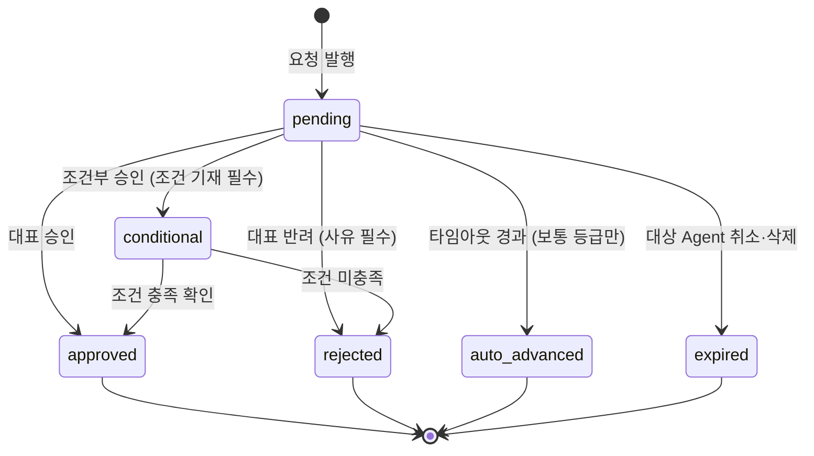

# DES-014 진행 현황 · 승인 화면 설계서

> 문서코드: DES-014
> 버전: v1 (2026-09-01)
> 범위: Phase 진행 보드 · 승인함 · 승인 게이트 체계 · 검토 패널 · 승인 상태 머신
> 레이아웃: DES-012 App Shell 기준 / 의사결정 요청은 DES-013 §3-3~3-5 참조

> **대표 승인 필요 — 의사결정 등급 "높음"**
> 본 문서는 화면 2개를 신규 추가하고, **CLAUDE.md의 스킬 전환 승인 게이트**를 처음으로 설계에 반영한다. §8 의사결정 요청 참조.

---

## 1. 문제 정의 — 현재 설계에 없는 것

### 1-1. "승인 버튼은 있으나 검토할 자리가 없다"

| 현재 설계 | 있는 것 | 없는 것 |
|----------|--------|--------|
| DES-012 §6-1 개요 〈내 결정이 필요합니다〉 | 승인/반려 원클릭 버튼 | **무엇을 승인하는지 검토하는 자리** |
| DES-013 §3-3 MSG-04 의사결정 요청 | 안건·근거·영향 범위 텍스트 | 산출물 실물(문서·PR·테스트 결과) 확인 |
| DES-013 §5 CLI `cm inbox` / `cm decide` | 목록과 응답 명령 | 동일 |

배포를 승인하려면 테스트 결과를 봐야 하고, 설계 변경을 승인하려면 설계서를 읽어야 한다. **버튼만 있고 근거를 보는 화면이 없으면 대표는 "모르는 채 누르는" 상태가 된다.**

### 1-2. "스킬 전환 승인 게이트가 설계에 없다"

CLAUDE.md는 스킬 전환 모드를 이렇게 규정한다.

```
mode: auto
- plan → analyze:     승인 필수  ★
- analyze → design:   자동
- design → develop:   자동
- develop → test:     자동
- test → deploy:      승인 필수  ★
- deploy → operate:   자동
```

**★ 표시된 2개 지점이 어느 설계 문서에도 없다.** DES-013은 의사결정 등급('높음/보통/낮음')만 다루고, 스킬 전환 게이트는 별개의 승인 체계인데 누락되어 있다.

### 1-3. "Phase 진행 상황이 화면에 없다"

CLAUDE.md 개발 방법론은 **반복적 점진개발 + 칸반, 주요 단계 WIP = 1**이다. 그런데 어느 화면에서도 "지금 Phase 1의 어느 단계에 있고, 앞 단계가 끝났는지"를 볼 수 없다.

> **정정 (2026-09-01)**: v1 초안은 "analyze 단계를 건너뛴 채 design이 진행됐다"를 실증으로 들었으나 **이는 오진단이었다.**
> ANL-001~004(분석 보고서·의존관계 맵·리스크 목록·기술 스택 결정서)가 Notion `02. 분석`에 **전부 존재**하며 analyze 단계는 정상 수행되었다.
> Git `docs/analysis/`가 비어 있던 것은 **동기화 누락**이었다.
>
> **다만 이 화면의 필요성은 그대로다.** 오진단이 발생한 원인이 바로 **"어느 단계가 어디까지 왔는지 한눈에 보는 화면이 없었기 때문"**이다.
> 진행 보드의 산출물 표(§4-1)에 Notion/Git 동기화 열이 있었다면, 이것이 프로세스 위반이 아니라 동기화 누락임을 즉시 구분할 수 있었다.

---

## 2. 신규 화면 2종

| 화면 ID | 이름 | 경로 | 목적 |
|---------|------|------|------|
| **SCR-W-PH** | 진행 보드 | `/progress` | Phase × SDLC 7단계 칸반. WIP 규칙·승인 게이트 위치 시각화 |
| **SCR-W-AP** | 승인함 | `/approvals` | 대기 중 승인 건의 **검토와 처리**. 목록 + 검토 패널 분할 |

### 개요 화면과의 역할 분리

| 화면 | 역할 | 비유 |
|------|------|------|
| 개요 〈내 결정이 필요합니다〉 | **알림** — 있다는 사실을 알린다. 자명한 건만 원클릭 처리 | 알림 배지 |
| **승인함 (SCR-W-AP)** | **작업 공간** — 근거를 읽고 판단한다 | 결재함 |
| 대화 (DES-013) | **맥락** — 왜 이 요청이 나왔는지 대화 흐름으로 이해 | 대화 기록 |

> 개요 DecisionCard의 버튼을 `[승인] [대화] [반려]` → **`[승인] [검토] [반려]`**로 변경한다. [검토]는 승인함의 해당 건으로 이동한다. (DES-012 §6-1 개정)

---

## 3. 승인 게이트 체계

### 3-1. 승인 대상 유형

| 코드 | 유형 | 발생 조건 | 등급 | 출처 |
|------|------|----------|------|------|
| **APV-GATE** | 스킬 전환 게이트 | `plan → analyze`, `test → deploy` | **높음 (고정)** | CLAUDE.md 스킬 전환 모드 |
| **APV-ARCH** | 아키텍처·설계 결정 | 구조 변경, 기술 스택 확정 | 높음 | CLAUDE.md 의사결정 등급 |
| **APV-DEPLOY** | 배포 실행 | deploy 스킬 실행 시점 | 높음 | 동일 |
| **APV-EXT** | 외부 API 연동 | 외부 서비스 도입 | 높음 | 동일 |
| **APV-CHOICE** | 라이브러리·전략 선택 | 스킬 선택, 테스트 전략 | 보통 | 동일 |
| **APV-RETRY** | 재시도·취소 판단 | Agent `failed` 발생 | 보통 | 운영 판단 |

> **낮음** 등급(변수명·파일 구조·코드 스타일)은 승인함에 올라오지 않는다. status_changes 이력에만 남는다. (DES-013 §3-4와 동일 원칙)

### 3-2. APV-GATE 특수 규칙

스킬 전환 게이트는 다른 승인과 성격이 다르다.

| 항목 | APV-GATE | 나머지(APV-ARCH 등) |
|------|----------|-------------------|
| 등급 | **높음 고정** — 하향 불가 | 사안별 판단 |
| 타임아웃 | **없음** — 무기한 대기 | 보통 등급은 타임아웃 있음 |
| 블로킹 대상 | **Phase 전체** — 다음 단계 시작 불가 | 해당 Agent만 |
| 검토 대상 | **직전 단계 산출물 전체** (예: PLN-001~005) | 개별 안건의 근거 |
| 반려 시 | 직전 단계로 되돌아가 보완 | 요청 Agent가 대안 제시 |

### 3-3. 승인 상태 머신



| 상태 | 후속 동작 |
|------|----------|
| `approved` | 요청 Agent 재개. APV-GATE면 다음 스킬 단계 시작 |
| `rejected` | 요청 Agent는 `waiting` 유지 + 사유를 MSG-01로 대화에 기록. APV-GATE면 직전 단계로 복귀 |
| `conditional` | 조건을 Task로 자동 생성 후 Agent 재개 |
| `auto_advanced` | Agent 계속 진행. MSG-05로 "타임아웃 자동 진행" 기록 |
| `expired` | 승인함에서 제거, 이력에는 보존 |

> **APV-GATE는 `auto_advanced`로 전이할 수 없다.** 상태 머신 구현 시 등급 검사로 차단한다.

---

## 4. SCR-W-PH 진행 보드

```
┌──────────────────────────────────────────────────────────────────────────────────┐
│ ● cm  개요 워크스페이스 [진행] 승인함 이력 설정   ⌘K    ● 연결됨   ◑   ⚙          │
├──────────────────────────────────────────────────────────────────────────────────┤
│  Phase 1: 기반 구축              시작 08-11 · 32일차          [Phase 2 계획 →]    │
│  ────────────────────────────────────────────────────────────────────────────    │
│                                                                                  │
│   기획        분석        설계        개발       테스트      배포       운영       │
│   plan      analyze     design     develop     test      deploy    operate      │
│  ┌────────┐╱┌────────┐ ┌────────┐ ┌────────┐ ┌────────┐╱┌────────┐ ┌────────┐   │
│  │ ✅완료  │▓│ ⬜대기  │ │ 🔵진행  │ │ ⬜대기  │ │ ⬜대기  │▓│ ⬜대기  │ │ ⬜대기  │   │
│  │        │▓│        │ │        │ │        │ │        │▓│        │ │        │   │
│  │ PLN 5건│▓│  0건   │ │ DES 13 │ │  0건   │ │  0건   │▓│  0건   │ │  0건   │   │
│  │        │▓│        │ │ 승인 4 │ │        │ │        │▓│        │ │        │   │
│  │ 08-11~ │▓│        │ │ 08-22~ │ │        │ │        │▓│        │ │        │   │
│  │ 08-24  │▓│        │ │        │ │        │ │        │▓│        │ │        │   │
│  └────────┘╱└────────┘ └────────┘ └────────┘ └────────┘╱└────────┘ └────────┘   │
│             ▲ 승인 게이트                                ▲ 승인 게이트             │
│                                                                                  │
│  ⚠ WIP 위반 (1)                                                                  │
│  ┌────────────────────────────────────────────────────────────────────────────┐ │
│  │ 🔴 analyze 단계를 건너뛰고 design이 진행 중입니다                             │ │
│  │    · plan → analyze 승인 게이트가 통과된 기록이 없습니다                       │ │
│  │    · analyze 산출물 0건 (ANL-001~004 미작성)                                 │ │
│  │    · design 산출물 13건 (DES-001~013)                                        │ │
│  │                          [ analyze 착수 ]  [ 예외 승인 ]  [ 무시 ]           │ │
│  └────────────────────────────────────────────────────────────────────────────┘ │
│                                                                                  │
│  현재 단계 산출물 — design                                        [워크스페이스 →]│
│  ┌────────────────────────────────────────────────────────────────────────────┐ │
│  │ 코드      제목                          상태        Notion  Git   최종수정  │ │
│  │ DES-001  아키텍처 설계서                 작성완료      ✅      ❌    08-24   │ │
│  │ DES-006  화면 명세서 (CLI) v2            작성완료      ✅      ✅    09-01   │ │
│  │ DES-012  UI 레이아웃·정보구조 v2         🟡 승인대기    ✅      ✅    09-01   │ │
│  │ DES-013  대화 인터페이스                 🟡 승인대기    ✅      ✅    09-01   │ │
│  │ DES-014  진행 현황·승인 화면             🟡 승인대기    ✅      ✅    09-01   │ │
│  │ …                                                                          │ │
│  └────────────────────────────────────────────────────────────────────────────┘ │
└──────────────────────────────────────────────────────────────────────────────────┘
```

### 4-1. 구성 요소

| 영역 | 컴포넌트 | 표시 데이터 | 출처 |
|------|---------|-----------|------|
| Phase 헤더 | PhaseHeader | Phase 번호·이름, 시작일, 경과일수, 다음 Phase 링크 | `phases` (신규) |
| 단계 보드 | StageBoard ×7 | 단계명, 스킬명, 상태(대기/진행/완료), 산출물 건수, 승인대기 건수, 기간 | 집계 |
| 게이트 표시 | GateMarker | plan→analyze, test→deploy 위치에 게이트 아이콘 + 통과 여부 | `approvals` |
| WIP 경보 | WipAlert | 위반 내용 + 근거 수치 + 조치 버튼 3종 | 규칙 검사 |
| 산출물 표 | ArtifactTable | 코드, 제목, 상태, **Notion/Git 동기화 여부**, 최종수정 | `artifacts` (신규) |

> **산출물 표의 Notion/Git 열**은 CLAUDE.md 기준 원본 정책("Notion=승인 원본, Git=실행 원본")이 실제로 지켜지는지 보여준다. 한쪽만 ✅이면 동기화 누락이다.

### 4-2. 인터랙션 명세

| 이벤트 ID | 트리거 | 사전 조건 | 결과 유형 | 대상 | 표시 데이터 | API |
|-----------|--------|----------|----------|------|-----------|-----|
| EVT-PH-1 | 단계 카드 클릭 | — | 인라인갱신 | 하단 산출물 표 | 해당 단계 산출물 전체 | GET /api/artifacts?stage= |
| EVT-PH-2 | 「승인 N」 배지 클릭 | 승인대기 ≥1 | 화면이동 | SCR-W-AP (해당 단계 필터) | 대기 목록 | — |
| EVT-PH-3 | GateMarker 클릭 | — | 모달 | MOD-08 게이트 상세 | 게이트 조건, 통과 이력, 검토 대상 산출물 | GET /api/approvals?type=gate |
| EVT-PH-4 | WIP 경보 [analyze 착수] | 위반 존재 | 모달 | MOD-09 단계 착수 확인 | 착수할 단계, 생성될 Agent, 산출물 목록 | POST /api/stages/:id/start |
| EVT-PH-5 | WIP 경보 [예외 승인] | 위반 존재 | 화면이동 | SCR-W-AP | **APV-GATE 예외 승인 건 생성** 후 검토 패널 | POST /api/approvals |
| EVT-PH-6 | WIP 경보 [무시] | 위반 존재 | 프롬프트 | MOD-10 무시 확인 | "이 위반은 이번 Phase 동안 다시 표시되지 않습니다" | POST /api/wip-waivers |
| EVT-PH-7 | 산출물 행 클릭 | — | 화면이동(새 탭) | 문서 뷰어 또는 Notion | 문서 본문 | — |
| EVT-PH-8 | Notion/Git ❌ 클릭 | 미동기화 | 토스트 + 모달 | MOD-11 동기화 안내 | 누락된 쪽, 동기화 방법 | — |
| EVT-PH-9 | [Phase 2 계획 →] | 현 Phase `operate` 완료 | 화면이동 | SCR-W-AP (Phase 전환 승인) | 다음 Phase 계획 초안 | — |

### 4-3. 빈 상태 · 에러

| 조건 | 표시 | 복구 경로 |
|------|------|----------|
| Phase 미시작 | "Phase가 아직 시작되지 않았습니다" + plan 스킬 안내 | [Phase 1 시작] |
| WIP 위반 0건 | 경보 블록 자체를 숨김 (정상은 조용하게 — DES-012 U-3) | — |
| 산출물 0건 | "이 단계의 산출물이 아직 없습니다" | [단계 착수] |

---

## 5. SCR-W-AP 승인함

```
┌──────────────────────────────────────────────────────────────────────────────────┐
│ ● cm  개요 워크스페이스 진행 [승인함 ●4] 이력 설정  ⌘K   ● 연결됨   ◑   ⚙        │
├──────────────────────────────────────────────────────────────────────────────────┤
│  [ 대기 4 ]  [ 처리됨 ]           유형: 전체 ▾   등급: 전체 ▾   단계: 전체 ▾      │
├────────────────────────────────┬─────────────────────────────────────────────────┤
│ 대기 목록 (360px)                │ 검토 패널                                       │
├────────────────────────────────┼─────────────────────────────────────────────────┤
│ 🔴 APV-GATE · 높음              │ 네비게이션 구조 전환 (DES-012 D-01)             │
│    plan → analyze 게이트        │ 🔴 APV-ARCH · 높음 · design 단계 · 1시간 경과   │
│    PLN 5건 검토 필요             │ 요청: main (디스패처)                            │
│    32일 대기 ⚠                  │ ───────────────────────────────────────────────│
│ ───────────────────────────    │ ┌ 안건 ┬ 산출물 ┬ 근거 ┬ 영향 범위 ┐            │
│ 🔴 APV-ARCH · 높음    ◀ 선택   │ │                                        │      │
│    네비게이션 구조 전환          │ │ 산출물 3건                              │      │
│    DES-012 D-01                │ │  📄 des-012-ui-layout-ia.md      보기 ▸ │      │
│    1시간 대기                   │ │  📄 des-013-conversation-...md   보기 ▸ │      │
│ ───────────────────────────    │ │  🔗 Notion · DES-012 UI 레이아웃  열기 ▸ │      │
│ 🔴 APV-ARCH · 높음              │ │                                        │      │
│    대화 기능 Phase 배치          │ │ 선택지                                  │      │
│    DES-013 D-09                │ │  ○ (A) 현행 페이지 드릴다운 유지          │      │
│    1시간 대기                   │ │  ● (B) 사이드바 + 3-Pane 전환  ← 권고    │      │
│ ───────────────────────────    │ │                                        │      │
│ 🟡 APV-CHOICE · 보통            │ │ 검토 체크리스트                          │      │
│    UI 컴포넌트 라이브러리         │ │  ☑ 산출물을 확인했다                     │      │
│    DES-012 D-03                │ │  ☐ 영향 범위를 이해했다                   │      │
│    22분 남음 ⏳                 │ │  ☐ 되돌릴 수 없는 항목을 확인했다          │      │
│                                │ └────────────────────────────────────────┘      │
│                                │                                                 │
│                                │ 사유 (반려·조건부 승인 시 필수)                   │
│                                │ ┌────────────────────────────────────────┐      │
│                                │ │                                        │      │
│                                │ └────────────────────────────────────────┘      │
│                                │   [ 승인 ]   [ 조건부 승인 ]   [ 반려 ]         │
│                                │   ↑ 체크리스트 전항목 완료 전까지 비활성          │
└────────────────────────────────┴─────────────────────────────────────────────────┘
```

### 5-1. 검토 패널 탭 구성

| 탭 | 내용 | 비고 |
|----|------|------|
| **안건** | 제목, 요청자, 요청 시각, 선택지, 권고안 | MSG-04와 동일 데이터 |
| **산출물** | 문서·PR·테스트 결과 링크 목록. 인라인 미리보기 지원 | **승인 판단의 핵심 근거** |
| **근거** | 요청 Agent가 제시한 판단 근거 (테스트 통과 건수 등) | — |
| **영향 범위** | 되돌림 가능 여부, 영향받는 엔티티 목록, 롤백 소요 | 파괴적 작업일 때 필수 |

APV-GATE의 경우 **산출물 탭에 직전 단계 산출물 전체**가 자동으로 채워진다 (예: plan→analyze 게이트 = PLN-001~005 5건).

### 5-2. 안전장치

| # | 규칙 | 근거 |
|---|------|------|
| S-1 | **체크리스트 전항목 완료 전까지 [승인] 비활성** | "모르는 채 누르기" 방지 |
| S-2 | 반려·조건부 승인은 **사유 입력 필수** | 요청 Agent가 다음 행동을 결정할 근거 |
| S-3 | 등급 '높음'은 **일괄 승인 불가** — 건별 처리만 | 파괴적 작업 보호 |
| S-4 | 등급 '보통'은 일괄 승인 허용 (체크박스 다중 선택) | 반복 작업 효율 |
| S-5 | APV-GATE는 **타임아웃 자동 진행 대상에서 제외** | §3-3 |
| S-6 | 초기 포커스는 **[반려]가 아닌 어느 버튼에도 두지 않음** | 오조작 방지 (DES-012 §10) |

### 5-3. 인터랙션 명세

| 이벤트 ID | 트리거 | 사전 조건 | 결과 유형 | 대상 | 표시 데이터 | API |
|-----------|--------|----------|----------|------|-----------|-----|
| EVT-AP-1 | 목록 행 클릭 | — | 인라인갱신 | 검토 패널 | 안건 4탭 전체 | GET /api/approvals/:id |
| EVT-AP-2 | 산출물 [보기] 클릭 | 문서 존재 | 인라인갱신 | 검토 패널 하단 미리보기 | 마크다운 렌더링 본문 | GET /api/artifacts/:id/content |
| EVT-AP-3 | 산출물 [열기] 클릭 | Notion URL 존재 | 화면이동(새 탭) | Notion 페이지 | — | — |
| EVT-AP-4 | 체크리스트 전항목 완료 | — | 인라인갱신 | 액션 버튼 | [승인] 활성화 | — |
| EVT-AP-5 | [승인] 클릭 | 체크리스트 완료 | 모달 | MOD-12 승인 확인 | 안건 요약, 후속 동작 안내 | — |
| EVT-AP-6 | MOD-12 [확정] | — | 화면이동 + 토스트 | 목록 (해당 건 제거) | "승인됨 · {Agent} 재개" | POST /api/approvals/:id/resolve |
| EVT-AP-7 | [반려] 클릭 | 사유 1자 이상 | 모달 | MOD-13 반려 확인 | 사유 에코, 되돌아갈 단계 | — |
| EVT-AP-8 | [조건부 승인] 클릭 | 사유 1자 이상 | 모달 | MOD-14 조건 확인 | 조건 → 생성될 Task 미리보기 | POST /api/approvals/:id/resolve |
| EVT-AP-9 | 등급 '보통' 다중 선택 | 선택 ≥2, 전부 보통 | 인라인갱신 | 상단 일괄 액션 바 | 선택 건수, [일괄 승인] | — |
| EVT-AP-10 | 등급 '높음' 다중 선택 시도 | — | 토스트 | — | "등급 높음은 건별로 처리해야 합니다" (S-3) | — |
| EVT-AP-11 | [처리됨] 탭 | — | 인라인갱신 | 목록 | 처리 이력(결과·사유·처리시각·소요시간) | GET /api/approvals?status=resolved |
| EVT-AP-12 | 타임아웃 임박 (5분 전) | 보통 등급 | 토스트 | — | "{안건} 5분 후 자동 진행됩니다" | WS |

### 5-4. 빈 상태

| 조건 | 표시 |
|------|------|
| 대기 0건 | "승인 대기 중인 항목이 없습니다" + 최근 처리 3건 요약 |
| 처리됨 0건 | "아직 처리한 승인이 없습니다" |
| 필터 결과 0건 | "조건에 맞는 항목이 없습니다" + [필터 초기화] |

---

## 6. CLI 대응 (Phase 1)

DES-013 §5의 `cm inbox` / `cm decide`를 확장한다. DES-006에 **SCR-CH06~08 3개 화면 추가**.

| 화면 ID | 명령어 | 기능 |
|---------|--------|------|
| SCR-CH06 | `cm progress` | Phase 진행 보드 (텍스트) + WIP 위반 경고 |
| SCR-CH07 | `cm approvals [--pending\|--resolved]` | 승인함 목록 |
| SCR-CH08 | `cm review <id>` | 승인 건 상세 — 안건·산출물·근거·영향 범위 출력 |

기존 `cm decide <id> --approve|--reject --reason`는 그대로 사용한다.

### CLI 출력 예시 — `cm progress`

```
$ cm progress

  Phase 1: 기반 구축                        시작 08-11 · 32일차

  기획      분석      설계      개발      테스트    배포      운영
  plan   ▓ analyze   design   develop   test   ▓ deploy   operate
  ─────────────────────────────────────────────────────────────────
  ✓ 완료  ⊘ 대기     ● 진행    ⊘ 대기    ⊘ 대기    ⊘ 대기     ⊘ 대기
  5건     0건        13건      0건       0건       0건        0건
                     승인 4

  ▓ = 승인 게이트

  ⚠ WIP 위반 (1)
    analyze 단계를 건너뛰고 design이 진행 중입니다
    · plan → analyze 승인 게이트 통과 기록 없음
    · analyze 산출물 0건 / design 산출물 13건

    조치: cm skill start analyze
          cm approvals --create-waiver
```

### CLI 출력 예시 — `cm review`

```
$ cm review ap4b2c1d

  ┌ 승인 요청 ──────────────────────────────────────────┐
  │ 안건:     네비게이션 구조 전환 (DES-012 D-01)        │
  │ 유형:     APV-ARCH                                  │
  │ 등급:     높음                                       │
  │ 단계:     design                                     │
  │ 요청자:   main                                       │
  │ 요청시각: 2026-09-01 10:32:00 (1시간 경과)           │
  └─────────────────────────────────────────────────────┘

  산출물 (3)
    docs/design/ui/des-012-ui-layout-ia.md
    docs/design/ui/des-013-conversation-interface.md
    https://app.notion.com/p/3ced066504ec8120b67be02c48ebd417

  선택지
    (A) 현행 DES-011 페이지 드릴다운 유지
    (B) 사이드바 + 3-Pane 전환               ← 권고

  영향 범위
    되돌림:   가능 (설계 단계, 코드 미착수)
    영향:     DES-011 개정, 화면 10 → 5개
    후속:     DES-010 웹 토큰 추가, design 스킬 DES-004 정의 수정

  응답: cm decide ap4b2c1d --approve
        cm decide ap4b2c1d --reject --reason "<사유>"
```

---

## 7. 데이터 모델 · API 보강

> DES-013 §6의 `decision_requests`를 **`approvals`로 일반화**하고, Phase/단계/산출물 추적 테이블을 추가한다. 확정이 아니라 제안이다.

### 7-1. 신규·변경 테이블

| 테이블 | 상태 | 주요 컬럼 | 비고 |
|--------|------|----------|------|
| `approvals` | **변경** (DES-013 `decision_requests` 대체) | id, **message_id(FK)**, stage_id(FK), approval_type(APV-*), level, subject, options(JSON), artifacts(JSON), rationale, impact(JSON), requested_by, deadline_at, status, resolution, reason, resolved_at | DES-013 §6-1 대비 `approval_type`·`stage_id`·`artifacts`·`impact` 추가.<br>**`message_id` 보완 (DES-003 v2)** — 승인 카드를 대화에 렌더링하려면 발행 메시지 참조가 필요하다. 컬럼·제약 상세는 **DES-003 v2 §4-1** |
| `phases` | 신규 | id, number, name, started_at, completed_at, current_stage | Phase 1개당 1행 |
| `stages` | 신규 | id, phase_id(FK), skill(plan\~operate), status, started_at, completed_at | Phase당 7행. **`gate_approval_id` 제거 (DES-003 v2 §4-3)** — `approvals.stage_id`와 순환 FK를 만든다. 게이트 승인은 `approvals`에서 `stage_id + approval_type=APV-GATE`로 조회한다 |
| `artifacts` | 신규 | id, stage_id(FK), code(PLN-001 등), title, status, notion_url, git_path, updated_at | Notion/Git 동기화 추적 |
| `wip_waivers` | 신규 | id, phase_id(FK), rule, reason, created_at | WIP 위반 무시 기록 |

### 7-2. 신규 엔드포인트

| 메서드 | 경로 | 기능 |
|--------|------|------|
| GET | `/api/phases/current` | 현재 Phase + 7단계 상태 + WIP 검사 결과 |
| POST | `/api/stages/:id/start` | 단계 착수 (게이트 통과 여부 검증) |
| GET | `/api/artifacts?stage=` | 단계별 산출물 + 동기화 상태 |
| GET | `/api/artifacts/:id/content` | 산출물 본문 (검토 패널 미리보기) |
| GET | `/api/approvals?status=&level=&type=` | 승인 목록 |
| GET | `/api/approvals/:id` | 승인 상세 (안건·산출물·근거·영향) |
| POST | `/api/approvals/:id/resolve` | 승인·반려·조건부 승인 |
| POST | `/api/wip-waivers` | WIP 위반 무시 등록 |

---

## 8. 의사결정 요청 — 대표 검토 항목

| ID | 안건 | 등급 | 선택지 | 권고 |
|----|------|------|--------|------|
| **D-14** | 스킬 전환 게이트 강제 수준 | **높음** | (A) 강제 — 게이트 미통과 시 다음 단계 착수 차단<br>(B) 경고만 — 진행 보드에 표시하되 차단하지 않음<br>(C) 미도입 | **(A) 강제 + 예외 승인 경로** — CLAUDE.md가 게이트 2곳을 "승인 필수"로 규정했으나 **어느 설계 문서에도 구현 정의가 없다.** 규칙이 문서에만 있으면 지켜지는지 확인할 방법이 없다. 단 [예외 승인]으로 명시적 우회는 허용 |
| ~~**D-15**~~ | ~~현재 WIP 위반(analyze 건너뜀) 처리~~ | ~~높음~~ | — | **🚫 안건 철회 (2026-09-01)** — 전제가 사실이 아니었다. ANL-001~004가 Notion에 전부 존재하며 analyze는 정상 수행되었다. §1-3 정정 참조 |
| **D-16** | 진행 보드·승인함의 Phase 배치 | 보통 | (A) DES-013 대화와 함께 Phase 1<br>(B) Phase 2(웹)부터 | **(A)** — 승인 게이트는 Phase 1 진행 자체에 필요하다. CLI 3화면(§6)이면 충분 |
| **D-17** | 체크리스트 강제 (S-1) | 보통 | (A) 등급 '높음'만 강제<br>(B) 전 등급 강제<br>(C) 미도입 | **(A)** — '보통'까지 강제하면 마찰이 과하다 |
| **D-18** | `decision_requests` → `approvals` 통합 | 낮음 | (A) 통합 (§7-1)<br>(B) 별도 테이블 유지 | **(A)** — 의사결정 요청과 승인은 같은 것이다. 테이블 2개로 나눌 이유가 없다. DES-013 §6-1 개정 필요 |

---

## 9. 파급 영향

| 문서 | 필요한 변경 | 규모 |
|------|-----------|------|
| **DES-012 UI 레이아웃** | 화면 5개 → **7개**(진행·승인함 추가), 상태바 메뉴 4개 → 6개, 개요 DecisionCard 버튼 [대화] → [검토] | 중 |
| **DES-013 대화 인터페이스** | `decision_requests` → `approvals` 통합 (D-18), MSG-04에 `approval_id` 연결 | 소 |
| **DES-011 화면 명세서 (웹)** | EVT-PH-1~9, EVT-AP-1~12 추가, MOD-08~14 모달 7종 추가 | 대 |
| **DES-006 화면 명세서 (CLI)** | SCR-CH06~08 3화면 추가 (D-16이 (A)일 때) | 중 |
| **DES-003 데이터 모델** | 테이블 4개 신규 + `approvals` 변경 (§7-1) | 대 |
| **DES-002 API 명세서** | 엔드포인트 8종 추가 (§7-2) | 중 |
| **PLN-001 요구사항** | FR 신규 2~3건 (진행 추적, 승인 게이트, 산출물 동기화 추적) | 중 |
| **PLN-002 Phase 1 계획서** | 범위·일정 재산정 (DES-013 D-09와 함께) | 중 |

---

## 10. 완성도 체크

| 점검 항목 | 확인 |
|----------|------|
| CLAUDE.md 스킬 전환 승인 게이트 2곳이 설계에 반영되었는가 | ✅ §3-2, §4 |
| CLAUDE.md 의사결정 등급 3단계와 정합하는가 | ✅ §3-1 |
| WIP = 1 규칙이 화면으로 검증 가능한가 | ✅ §4 WipAlert |
| 승인 전 근거(산출물)를 볼 수 있는가 | ✅ §5-1 산출물 탭 |
| "모르는 채 누르기"를 막는 장치가 있는가 | ✅ §5-2 S-1 |
| 반려 시 요청자가 다음 행동을 알 수 있는가 | ✅ S-2 사유 필수 + §3-3 |
| 기준 원본 정책(Notion/Git) 준수가 화면에 보이는가 | ✅ §4-1 산출물 표 |
| CLI와 웹 양쪽 대응이 정의되었는가 | ✅ §5, §6 |
| 파급 영향이 빠짐없이 나열되었는가 | ✅ §9 |
| 대표 승인이 필요한 항목이 분리되어 있는가 | ✅ §8 |

---

## 11. 크로스 레퍼런스

| 이 문서 (DES-014) | 참조 문서 |
|------------------|----------|
| App Shell · 레이아웃 규격 | DES-012 §5 |
| 개요 DecisionCard (역할 분리) | DES-012 §6-1 |
| 의사결정 요청 발행·등급·타임아웃 | DES-013 §3-3 ~ §3-5 |
| 대화 채널 연동 (반려 사유 기록) | DES-013 §2 |
| CLI 출력 공통 규칙 | DES-006 §8 |
| 스킬 전환 모드 · 의사결정 등급 · WIP 규칙 | CLAUDE.md |
| 상태 전이 규칙 | DES-007 상태 흐름도 |
| 데이터 모델 (개정 대상) | DES-003 데이터 모델 |
| API 엔드포인트 (개정 대상) | DES-002 API 명세서 |

---

## 변경 이력

| 버전 | 날짜 | 내용 |
|------|------|------|
| v1 | 2026-09-01 | 최초 작성 — 진행 보드·승인함 2화면, 승인 게이트 체계 6종, 승인 상태 머신, 검토 패널·안전장치 6종, CLI 3화면, 데이터 모델 5테이블·API 8종 제안, 의사결정 요청 5건, 파급 영향 8건 |
