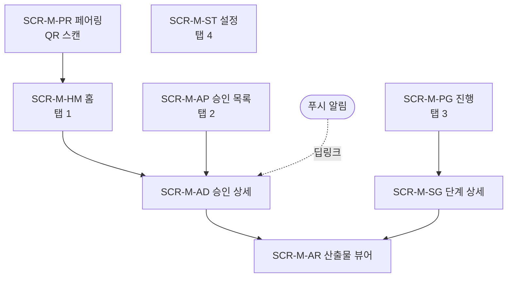

# DES-015 모바일 앱 설계서

> 문서코드: DES-015
> 버전: v1 (2026-09-01)
> 대상: iOS / Android 네이티브 앱
> 기능 범위: **알림 + 승인 + 진행 확인** (대표 확정, 2026-09-01)
> 연계: DES-014 진행 보드·승인함의 모바일판 / DES-013 의사결정 요청

> **대표 승인 필요 — 의사결정 등급 "높음" 3건**
> 모바일 앱은 **현행 로컬 MVP 아키텍처(127.0.0.1)와 근본적으로 충돌**한다. §2를 먼저 읽을 것.
> §8 의사결정 요청(D-19 ~ D-24) 중 **D-19(접속 방식)**가 결정되지 않으면 이 앱은 구현 자체가 불가능하다.

---

## 1. 목적과 범위

### 1-1. 왜 모바일 앱인가

DES-012 D-07에서 반응형 범위를 "데스크톱 전용(≥1280px)"으로 권고하며 **"모바일 모니터링은 별도 푸시 알림으로 해결 권장"**이라고 적었다. 이 앱이 그 공백을 메운다.

| 상황 | 현재 | 앱 도입 후 |
|------|------|-----------|
| 대표가 자리에 있음 | 웹 대시보드 (3-Pane) | 동일 |
| 대표가 자리를 비움 | **승인 대기가 무기한 방치** — APV-GATE는 타임아웃도 없다 | 푸시 → 확인 → 승인 |
| Agent 실패 발생 | 돌아올 때까지 모름 | 즉시 푸시 |

> 이 제품의 병목은 **대표의 응답 지연**이다. 등급 '높음'과 APV-GATE는 타임아웃이 없어(DES-013 §3-4, DES-014 §3-2) 대표가 없으면 Phase 전체가 멈춘다. 앱은 기능 추가가 아니라 **병목 해소**다.

### 1-2. 범위 — 하는 것 / 안 하는 것

| 구분 | 항목 |
|------|------|
| **한다** | 푸시 알림 / 승인 요청 검토·승인·반려 / Phase 진행 확인 / 산출물 읽기 |
| **안 한다** | 프로젝트·Agent·Task 생성·수정 / Main·Agent 대화 / 3-Pane 워크스페이스 / 로그 스트리밍 |

> 생성·수정은 웹/CLI에서 한다. 앱은 **읽고 결정하는** 도구다. 범위를 좁게 유지하는 것이 이 설계의 핵심 결정이다.

---

## 2. 선결 문제 — 아키텍처 충돌

<!-- 이 절이 이 문서에서 가장 중요하다 -->

### 2-1. 문제

DES-001 아키텍처와 DES-006 SCR-S01은 서버를 이렇게 정의한다.

```
CM_HOST = 127.0.0.1     ← 루프백. 같은 PC에서만 접근 가능
CM_PORT = 3000
Database = ./data/claude-manager.db   ← 로컬 SQLite
```

**휴대폰은 `127.0.0.1:3000`에 접근할 수 없다.** 앱이 서버와 통신할 방법이 현재 아키텍처에는 없다.

### 2-2. 선택지

| 방식 | 동작 | 장점 | 단점 | 밖에서 승인 |
|------|------|------|------|-----------|
| **(A) LAN 바인딩** | `CM_HOST=0.0.0.0`, 같은 Wi-Fi에서 사설 IP로 접속 | 구현 거의 없음, 외부 서비스 0 | **같은 네트워크 안에서만.** 집/사무실 밖에서는 불가 | ❌ |
| **(B) 터널링** | Tailscale / Cloudflare Tunnel로 개인 네트워크 구성 | 어디서든 접속, 서버는 로컬 유지, 포트 개방 불필요 | 외부 서비스 1개 의존, 초기 설정 필요 | ✅ |
| **(C) 클라우드 배포** | 서버를 VPS/클라우드로 이전 | 항상 접속 가능, PC 꺼져도 동작 | **로컬 MVP 전제가 무너짐.** SQLite→Postgres, 비용, 보안 범위 확대 | ✅ |

<!-- 권고 근거를 명시적으로 -->
> **권고: (B) 터널링.** PC가 켜져 있어야 한다는 제약은 남지만, 어차피 Agent가 PC에서 돌아야 하므로 실질 제약이 아니다. 로컬 MVP·SQLite·단일 사용자 전제를 그대로 유지하면서 "밖에서 승인"을 얻는 유일한 선택지다. §8 D-19 참조.

### 2-3. 푸시 알림의 외부 의존

푸시 알림은 **반드시 Apple(APNs) / Google(FCM)을 경유**한다. 우회 방법이 없다.

```
ClaudeManager 서버 → Expo Push Service → APNs / FCM → 단말
                     └─ 외부 서비스 2~3개 경유
```

CLAUDE.md 의사결정 등급표상 **"외부 API 연동 = 등급 높음"**이므로 대표 승인 대상이다 (APV-EXT). §8 D-21.

| 전송 내용 | 외부로 나가는가 |
|----------|---------------|
| 알림 제목·본문 | ✅ 나감 — **안건 제목이 Apple/Google 서버를 거친다** |
| 산출물 본문·근거 | ❌ 안 나감 — 앱이 서버에서 직접 조회 |
| 승인 결과 | ❌ 안 나감 |

> **완화**: 푸시 본문에는 식별자와 최소 문구만 담고("승인 요청 1건 · 등급 높음"), 실제 안건 내용은 앱이 서버에서 가져온다. 민감 정보가 외부를 거치지 않는다. §5-2.

---

## 3. 기술 스택 제안

| 항목 | 제안 | 근거 |
|------|------|------|
| 프레임워크 | **React Native (Expo)** | 웹이 React 기반(DES-010/012 D-03)이라 **타입 정의·API 클라이언트·상태 모델을 공유**할 수 있다. Expo는 푸시·생체인증·QR 스캔이 모두 내장 |
| 푸시 | **Expo Push Notification Service** | APNs/FCM 인증서 관리를 대신해 준다. 1인 프로젝트에 직접 구성은 과하다 |
| 인증 | JWT (웹과 동일) + **QR 페어링** | 폰에서 시크릿 타이핑은 실용적이지 않다 |
| 보안 저장 | `expo-secure-store` (iOS Keychain / Android Keystore) | 토큰 평문 저장 금지 |
| 생체인증 | `expo-local-authentication` | 승인은 파괴적 작업 — Face ID/지문 재확인 (§6-3) |
| 배포 | **TestFlight / Android 내부 테스트** | 사용자가 대표 1명. 앱스토어 공개 등록 불필요 |
| 상태 관리 | 웹과 동일 라이브러리 | 코드 공유 |

> 대안 검토: **Capacitor로 웹 래핑**은 코드 재사용률이 높아 보이지만, 모바일은 3-Pane을 쓸 수 없어 화면을 어차피 새로 짜야 한다. 재사용 이득이 크지 않고 네이티브 기능(생체인증·푸시) 접근이 번거롭다.

---

## 4. 정보구조 · 화면 인벤토리

### 4-1. 네비게이션

모바일에서는 3-Pane을 쓸 수 없다. **하단 탭 + 계층 드릴다운**으로 되돌아간다. (DES-012 §1 P-1에서 지적한 드릴다운 문제는 화면이 좁은 모바일에서는 오히려 올바른 선택이다.)



### 4-2. 화면 목록

| 화면 ID | 이름 | 진입 | 웹 대응 |
|---------|------|------|--------|
| SCR-M-PR | 페어링 | 최초 실행 | SCR-W-L01 로그인 |
| SCR-M-HM | 홈 (탭 1) | 로그인 후 | SCR-W-OV 개요 |
| SCR-M-AP | 승인 목록 (탭 2) | 탭바 | SCR-W-AP 승인함 목록 |
| SCR-M-AD | 승인 상세 | 목록 행, **푸시 딥링크** | SCR-W-AP 검토 패널 |
| SCR-M-AR | 산출물 뷰어 | 승인 상세 → 산출물 | 검토 패널 미리보기 |
| SCR-M-PG | 진행 (탭 3) | 탭바 | SCR-W-PH 진행 보드 |
| SCR-M-SG | 단계 상세 | 진행 → 단계 카드 | 진행 보드 산출물 표 |
| SCR-M-ST | 설정 (탭 4) | 탭바 | SCR-W-S01 설정 |

**8화면.** 웹 7화면 중 워크스페이스·이력을 빼고 페어링·산출물 뷰어·단계 상세를 더한 구성이다.

---

## 5. 알림 설계

### 5-1. 알림 유형

| 코드 | 트리거 | 우선순위 | 잠금화면 | 소리 | 방해금지 무시 |
|------|--------|---------|---------|------|-------------|
| **NTF-01** | APV-GATE 승인 요청 | 최고 | ✅ 전문 | ✅ | ✅ (Phase 전체가 멈춤) |
| **NTF-02** | 등급 '높음' 승인 요청 | 높음 | ✅ 전문 | ✅ | ✅ |
| **NTF-03** | 등급 '보통' 승인 요청 | 보통 | ✅ 제목만 | ✅ | ❌ |
| **NTF-04** | 타임아웃 5분 전 (보통) | 보통 | ✅ | ✅ | ❌ |
| **NTF-05** | Agent `failed` | 높음 | ✅ | ✅ | ❌ |
| **NTF-06** | 단계 완료 / Phase 완료 | 낮음 | ❌ | ❌ (무음) | ❌ |
| **NTF-07** | WIP 위반 발생 | 보통 | ✅ 제목만 | ❌ | ❌ |

> 등급 '낮음' 의사결정은 알림을 보내지 않는다. DES-013 §3-4의 원칙 — **대표의 주의를 소모하지 않는 것이 등급 체계의 목적** — 을 알림에도 그대로 적용한다.

### 5-2. 푸시 본문 규칙 (프라이버시)

```
❌ 나쁜 예 — 안건 내용이 Apple/Google 서버를 거침
   "프로덕션 배포 승인: api-server를 프로덕션에 배포합니다.
    통합 테스트 24건 전건 통과"

✅ 좋은 예 — 식별자와 최소 문구만
   제목: ClaudeManager · 승인 요청
   본문: 등급 높음 · deploy 단계 · 1건
   데이터: { approvalId: "ap4b2c1d", type: "APV-DEPLOY", level: "high" }
```

앱은 `approvalId`로 서버에서 실제 내용을 조회한다. 안건 제목·근거·산출물은 외부를 거치지 않는다.

### 5-3. 알림 설정 (SCR-M-ST)

| 항목 | 기본값 | 설명 |
|------|--------|------|
| 방해 금지 시간 | 23:00 ~ 07:00 | NTF-01/02는 이 설정을 무시한다 |
| 유형별 on/off | NTF-06만 off | 사용자가 개별 조정 |
| 요약 알림 | 매일 09:00 | 대기 중 승인 건수 1건으로 묶어 발송 |

---

## 6. 화면별 와이어프레임

### 6-1. SCR-M-HM 홈

```
┌─────────────────────────┐
│ ClaudeManager      ● 연결│
├─────────────────────────┤
│                         │
│  ⚠ 내 결정 대기 (3)      │
│ ┌─────────────────────┐ │
│ │🔴 APV-GATE  높음     │ │
│ │  plan → analyze     │ │
│ │  PLN 5건 검토 필요   │ │
│ │  32일 대기 ⚠         │ │
│ │              검토 › │ │
│ ├─────────────────────┤ │
│ │🔴 APV-ARCH  높음     │ │
│ │  네비게이션 구조 전환 │ │
│ │  1시간 대기          │ │
│ │              검토 › │ │
│ ├─────────────────────┤ │
│ │🟡 APV-CHOICE 보통    │ │
│ │  UI 라이브러리 선택   │ │
│ │  ⏳ 22분 남음        │ │
│ │              검토 › │ │
│ └─────────────────────┘ │
│                         │
│  Phase 1 · 기반 구축     │
│ ┌─────────────────────┐ │
│ │ 설계 단계 진행 중     │ │
│ │ ●●●○○○○  3/7        │ │
│ │ 32일차 · 산출물 14건 │ │
│ │ ⚠ WIP 위반 1건      │ │
│ └─────────────────────┘ │
│                         │
│  최근 활동               │
│  11:20 task 완료         │
│  11:15 agent 실패 🔴     │
│  11:10 task 진행         │
│                         │
├─────────────────────────┤
│  홈  승인③  진행  설정   │
└─────────────────────────┘
```

### 6-2. SCR-M-AD 승인 상세 (핵심 화면)

```
┌─────────────────────────┐
│ ‹ 승인          APV-ARCH│
├─────────────────────────┤
│ 네비게이션 구조 전환      │
│ 🔴 높음 · design         │
│ 요청 main · 1시간 경과   │
│─────────────────────────│
│ ┌안건┬산출물┬근거┬영향┐  │
│                         │
│  산출물 3건              │
│  📄 des-012-ui-layout   │
│     .md            보기›│
│  📄 des-013-conversa    │
│     tion.md        보기›│
│  🔗 Notion DES-012  열기›│
│                         │
│  선택지                  │
│  ○ (A) 현행 유지         │
│  ● (B) 3-Pane 전환      │
│        ← 권고            │
│                         │
│  검토 확인               │
│  ☑ 산출물을 확인했다      │
│  ☐ 영향 범위를 이해했다   │
│  ☐ 되돌릴 수 없는 항목을 │
│    확인했다              │
│                         │
│  사유 (반려 시 필수)      │
│  ┌─────────────────────┐│
│  │                     ││
│  └─────────────────────┘│
├─────────────────────────┤
│ [   반려   ] [  승인  ] │
│   ↑ 체크 완료 전 비활성  │
└─────────────────────────┘
```

### 6-3. 승인 확정 흐름 (생체인증)

```
[승인] 탭
   ↓
┌─────────────────────────┐
│      승인하시겠습니까?    │
│                         │
│  네비게이션 구조 전환      │
│  등급 높음               │
│                         │
│  후속 동작                │
│  · DES-011 개정          │
│  · 화면 10 → 5개         │
│  · main Agent 재개       │
│                         │
│  [ 취소 ]   [ 확인 ]     │
└─────────────────────────┘
   ↓ 확인
┌─────────────────────────┐
│         Face ID          │
│   승인을 확인해 주세요     │
└─────────────────────────┘
   ↓ 인증 성공
POST /api/approvals/:id/resolve
   ↓
토스트 "승인됨 · main 재개"
목록에서 제거, 홈 배지 감소
```

| 단계 | 근거 |
|------|------|
| 체크리스트 | DES-014 §5-2 S-1 — "모르는 채 누르기" 방지 |
| 확인 다이얼로그 | 후속 동작을 명시. DES-011 §4-3 파괴적 작업 가드 |
| **생체인증** | 모바일 고유. 폰을 잃어버려도 타인이 승인할 수 없다 |
| 반려 시 사유 | DES-014 §5-2 S-2 — 사유 없이 반려 불가 |

> 생체인증은 **등급 '높음' + APV-GATE에만** 적용한다. '보통'까지 요구하면 마찰이 과하다 (DES-014 D-17과 같은 판단). §8 D-22.

### 6-4. SCR-M-PG 진행

```
┌─────────────────────────┐
│ 진행                     │
├─────────────────────────┤
│ Phase 1 · 기반 구축      │
│ 시작 08-11 · 32일차      │
│─────────────────────────│
│                         │
│ ✅ 기획      plan        │
│ │  PLN 5건 · 08-11~24   │
│ ▓  ← 승인 게이트 미통과  │
│ ⬜ 분석      analyze     │
│ │  0건                  │
│ │  🔴 건너뜀             │
│ │                       │
│ 🔵 설계      design      │
│ │  DES 14건 · 승인 4    │
│ │  08-22~               │
│ ⬜ 개발      develop     │
│ │  0건                  │
│ ⬜ 테스트    test        │
│ ▓  ← 승인 게이트         │
│ ⬜ 배포      deploy      │
│ ⬜ 운영      operate     │
│                         │
│ ┌─────────────────────┐ │
│ │⚠ WIP 위반            │ │
│ │ analyze를 건너뛰고    │ │
│ │ design 진행 중        │ │
│ │              상세 › │ │
│ └─────────────────────┘ │
├─────────────────────────┤
│  홈  승인③  진행  설정   │
└─────────────────────────┘
```

세로 스텝 형태다. 웹의 가로 칸반(DES-014 §4)을 모바일 폭에 맞게 회전시킨 것으로, **표시 데이터는 동일**하다.

### 6-5. SCR-M-PR 페어링

```
┌─────────────────────────┐
│   ClaudeManager          │
│                         │
│  서버와 연결합니다        │
│                         │
│  PC에서 아래 명령을 실행: │
│  ┌─────────────────────┐│
│  │ cm pair             ││
│  └─────────────────────┘│
│                         │
│  화면에 표시된 QR을       │
│  스캔하세요.             │
│                         │
│  ┌─────────────────────┐│
│  │                     ││
│  │   [카메라 뷰]        ││
│  │                     ││
│  └─────────────────────┘│
│                         │
│  또는 수동 입력 ›         │
└─────────────────────────┘
```

QR에 담기는 것: 서버 URL(터널 주소), 1회용 페어링 토큰, 유효기간 5분.
페어링 완료 시 앱은 JWT + 푸시 토큰을 서버에 등록하고, JWT는 Keychain/Keystore에 저장한다.

### 6-6. 오프라인 동작

| 기능 | 오프라인 | 근거 |
|------|---------|------|
| 승인 목록·상세 **조회** | ✅ 마지막 동기화 캐시 | 읽기는 안전 |
| 산출물 본문 조회 | ✅ 열어본 것만 캐시 | 동일 |
| 진행 보드 조회 | ✅ 캐시 | 동일 |
| **승인·반려 실행** | ❌ **온라인 필수** | 파괴적 작업. 큐잉했다가 나중에 전송하면 이미 타임아웃·취소된 건에 응답할 위험 |

오프라인 시 상단에 "오프라인 · 마지막 동기화 11:32" 배너를 고정하고, 액션 버튼은 비활성 + 사유 툴팁을 표시한다.

---

## 7. 데이터 모델 · API 보강

### 7-1. 신규 테이블

| 테이블 | 주요 컬럼 | 비고 |
|--------|----------|------|
| `devices` | id, platform(`ios`/`android`), push_token, device_name, paired_at, last_seen_at, revoked_at | 단말 등록 |
| `pairing_tokens` | id, token, expires_at, used_at | QR 1회용 토큰 (5분 유효) |
| `notification_settings` | id, quiet_hours_start, quiet_hours_end, types(JSON), digest_at | 알림 설정 |

### 7-2. 신규 엔드포인트

| 메서드 | 경로 | 기능 |
|--------|------|------|
| POST | `/api/auth/pair` | QR 토큰 → JWT 교환 |
| POST | `/api/devices` | 단말·푸시 토큰 등록 |
| DELETE | `/api/devices/:id` | 단말 해제 (분실 시) |
| GET | `/api/notification-settings` | 알림 설정 조회 |
| PATCH | `/api/notification-settings` | 알림 설정 변경 |

기존 엔드포인트 재사용: `GET /api/approvals`, `GET /api/approvals/:id`, `POST /api/approvals/:id/resolve`, `GET /api/phases/current`, `GET /api/artifacts/:id/content` (전부 DES-014 §7-2)

> **앱 전용 API는 5개뿐이다.** 나머지는 웹과 동일한 API를 쓴다. 이것이 범위를 좁게 잡은 효과다.

### 7-3. CLI 추가

| 화면 ID | 명령어 | 기능 |
|---------|--------|------|
| SCR-CH09 | `cm pair` | 페어링 QR 표시 (터미널에 ASCII QR) |
| SCR-CH10 | `cm devices [--revoke <id>]` | 등록 단말 목록·해제 |

---

## 8. 의사결정 요청 — 대표 검토 항목

| ID | 안건 | 등급 | 선택지 | 권고 |
|----|------|------|--------|------|
| **D-19** | **앱 ↔ 서버 접속 방식** | **높음** ★ | (A) LAN 바인딩<br>(B) 터널링 (Tailscale 등)<br>(C) 클라우드 배포 | **(B) 터널링** — (A)는 "밖에서 승인"이라는 목적 자체를 달성 못 한다. (C)는 로컬 MVP·SQLite 전제가 무너지고 보안 범위가 커진다. **이 결정 없이는 앱 구현 불가** |
| **D-20** | 기술 스택 | 보통 | (A) React Native (Expo)<br>(B) Flutter<br>(C) Capacitor 웹 래핑<br>(D) 네이티브 2벌 | **(A)** — 웹이 React라 타입·API 클라이언트 공유. Expo가 푸시·생체인증·QR을 전부 제공 |
| **D-21** | 푸시 인프라 (외부 연동) | **높음** | (A) Expo Push Service<br>(B) FCM + APNs 직접<br>(C) 푸시 없이 폴링만 | **(A)** — 인증서 관리를 대신해 준다. **단 APNs/FCM 경유는 불가피**하므로 APV-EXT 승인 대상. 푸시 본문에서 안건 내용을 빼는 완화책은 §5-2에 적용됨 |
| **D-22** | 생체인증 승인 재확인 | 보통 | (A) 등급 '높음' + APV-GATE만<br>(B) 전 등급<br>(C) 미적용 | **(A)** — DES-014 D-17과 동일한 판단 기준 |
| **D-23** | Phase 배치 | **높음** | (A) **Phase 3 신설** (Phase 1 CLI → 2 웹 → 3 앱)<br>(B) Phase 2에 웹과 함께<br>(C) 더 뒤로 | **(A) Phase 3** — 앱은 웹 API가 확정된 뒤라야 만들 수 있다. 다만 **D-19 터널링은 Phase 1~2에서 미리 준비**해 두는 것이 좋다 |
| **D-24** | 배포 방식 | 낮음 | (A) TestFlight / Android 내부 테스트<br>(B) 앱스토어 공개 등록 | **(A)** — 사용자가 대표 1명. 공개 등록은 심사 비용만 발생 |

---

## 9. 파급 영향

| 문서 | 필요한 변경 | 규모 |
|------|-----------|------|
| **DES-001 아키텍처 설계서** | **접속 방식(D-19) 반영 — 가장 큰 변경.** 터널 구성, 단말 인증 경계, 푸시 외부 연동 경로 | **대** |
| **PLN-002 Phase 계획서** | **Phase 3 신설** (D-23), Phase 1~2에 터널 준비 작업 추가 | 대 |
| **PLN-001 요구사항** | FR 신규 3~4건 (푸시 알림, 단말 페어링, 모바일 승인, 오프라인 조회) | 중 |
| **DES-003 데이터 모델** | 테이블 3개 추가 (§7-1) | 중 |
| **DES-002 API 명세서** | 엔드포인트 5종 추가 (§7-2) | 소 |
| **DES-006 화면 명세서 (CLI)** | SCR-CH09~10 추가 (`cm pair`, `cm devices`) | 소 |
| **DES-010 디자인 토큰** | 모바일 타이포·간격·터치 타깃(44pt) 규격 추가 | 중 |
| **DES-012 UI 레이아웃** | D-07(반응형 범위) 결정 근거 갱신 — "모바일은 앱이 담당"으로 명시 | 소 |
| **보안 검토 (TST-SE)** | 터널 노출 범위, 단말 분실 시 해제 절차, 푸시 본문 최소화 검증 | 중 |

---

## 10. 완성도 체크

| 점검 항목 | 확인 |
|----------|------|
| 앱이 서버에 접속할 수 있는가 (아키텍처 검증) | ⚠ **D-19 미결 — 최우선** |
| 기능 범위가 명확히 한정되었는가 | ✅ §1-2 |
| 8개 화면이 모두 웹 대응 화면에 매핑되었는가 | ✅ §4-2 |
| 알림 유형이 의사결정 등급 체계와 정합하는가 | ✅ §5-1 |
| 민감 정보가 외부 푸시 서비스를 거치지 않는가 | ✅ §5-2 |
| 승인의 파괴성에 맞는 안전장치가 있는가 | ✅ §6-3 (체크리스트 + 확인 + 생체인증) |
| 오프라인 동작 경계가 정의되었는가 | ✅ §6-6 |
| 단말 분실 대응이 있는가 | ✅ §7-2 `DELETE /api/devices/:id` |
| 앱 전용 API가 최소화되었는가 | ✅ 5개 (§7-2) |
| 파급 영향이 빠짐없이 나열되었는가 | ✅ §9 |

---

## 11. 크로스 레퍼런스

| 이 문서 (DES-015) | 참조 문서 |
|------------------|----------|
| 승인 게이트·검토 패널·안전장치 | DES-014 §3, §5 |
| 의사결정 등급·타임아웃 | DES-013 §3-4 |
| 개요 화면 (홈의 웹 대응) | DES-012 §6-1 |
| 반응형 범위 결정 (D-07) | DES-012 §9 |
| CLI 출력 공통 규칙 | DES-006 §8 |
| 서버 기동·환경변수·인증 | DES-001, DES-006 SCR-S01/A01 |
| 데이터 모델 (개정 대상) | DES-003 |
| API 엔드포인트 (개정 대상) | DES-002 |

---

## 변경 이력

| 버전 | 날짜 | 내용 |
|------|------|------|
| v1 | 2026-09-01 | 최초 작성 — 아키텍처 충돌 분석(로컬 MVP vs 모바일 접속), 기술 스택 제안, 8화면 인벤토리·와이어프레임, 알림 7종·프라이버시 규칙, 생체인증 승인 흐름, 오프라인 경계, 데이터 모델 3테이블·API 5종, 의사결정 요청 6건, 파급 영향 9건 |
